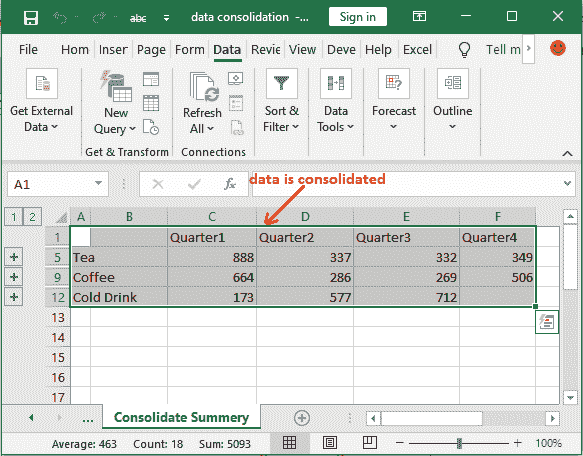

# 在 Excel 中合并数据

> 原文：<https://www.javatpoint.com/consolidate-data-in-excel>

数据合并是 Excel 非常有趣和有用的功能。它帮助用户从不同的工作表中收集数据，并将其收集到主工作簿中。这样，它允许用户一起获取数据。单个表中的数据很容易更新。

合并是一个 Excel 函数，它允许用户从不同的位置收集数据，并将其汇总到一个 Excel 表中。数据整合方法的主要问题是处理数据整合有点棘手。本章将逐步指导您使用数据整合。

## 整合数据的方法

在 MS Excel 中，可以通过两种方式合并数据，或者按类别合并，或者按职位合并。

### 按类别合并

如果所有源工作表/工作簿中的数据没有排列，则表示没有按顺序排列，但使用了相同的标签(行标题和列标题)，请按位置合并数据。此方法可用于合并多个工作表中的数据，这些工作表具有不同的布局，但数据标签相同。

### 按职位合并

当源工作表中的数据具有相同的顺序并且使用相同的标签时，按类别合并数据。使用它来合并多个工作表中的数据。

**例如，**使用相同模板创建的部门预算工作表。

**重要点**

按类别合并数据与创建透视表相同。当创建数据透视表时，用户可以很容易地识别类别。如果希望按类别进行更灵活的合并，可以选择创建数据透视表。

## 我们如何整合数据？

一个 Excel 用户可以通过使用数据合并来完成以下操作-

1.  [合并多个工作表中的数据，并将其收集到同一个工作簿中](#worksheets)
2.  [合并多个工作簿中的数据，放入新的工作簿中](#workbooks)

因此，我们将向您展示这两种情况的示例。继续下面这一章。

在继续之前，您必须知道以下过程将适用于更新版本的 Excel(Excel 2007 以上的版本)。如果您使用的是 Excel 2007 的较低版本，它将不起作用。

### 整合选项在哪里？

要合并数据，可以在数据工具部分找到**合并**选项。该数据工具部分位于 Excel 功能区的**数据**选项卡中。例如，

**数据**选项卡>T2【数据工具】T3>部分**巩固**功能

## 合并同一工作簿中多个工作表的数据

我们在 Excel 工作簿中有三张表，包含三年在茶、咖啡和冷饮上的支出(每季度一次)。这三张纸分别被命名为第一年、第二年和第三年。这意味着-每个工作表包含一年的数据，并将其分解为季度。

为了合并同一工作簿中的数据，我们可以在同一工作簿中插入一个新的工作表，并将其命名为**合并汇总。**该综合汇总表将按年度和季度显示支出。

请参阅我们第 1 年、第 2 年和第 3 年的三张工作表，数据如下-

所有三个工作表数据都以相同的顺序排列(相同的列和行排列)并不重要。Excel 会在合并时自动为用户排列。

在这张截图中，你可以看到所有三年(1 年、2 年和 3 年)都有不同的行和列的排列。

*   冷饮行在第 1 年的第 4 季度没有价值。
*   第 2 年工作表没有冷饮行，这些季度也以不同的顺序排列。
*   第三年没有第四季度。所以，这三张纸上的行数和列数是不同的。

不过，您可以将数据合并到同一工作簿中的单独工作表中。

### 整合数据的步骤

要合并数据，必须先插入一个空工作表，使其成为主工作表，以便在合并后保留数据。

**步骤 1:** 在同一工作簿中插入新工作表。更名为**巩固夏季**使其易于识别。

**第 2 步:**在合并汇总工作表中，选择第一个单元格或合并数据将出现的任何其他单元格。

**第三步:**进入 Excel 功能区的**数据**选项卡，点击数据工具部分的**合并**按钮。

**第 4 步:**将打开一个合并对话框，如下所示，提供值并选择您需要的选项。

1.选择要合并数据的函数。例如 **SUM。**可以在函数下拉列表中选择 SUM 进行数据合并。

2.在“参考”区域中，逐个选择要合并的工作表的第一个数据区域。

a.将光标保持在参考区域上，并转到目标工作表，即 Year1，而不关闭合并面板。

b.现在，在这里选择要添加合并的数据范围(包括两个标题)。

您将看到所选范围被自动添加到参考字段中。

c.现在，点击**添加**按钮，将第一组数据添加到合并对话框中的**所有参考**区域。

d.现在，导航到 **Year2** 工作表，按照上述步骤选择范围。之后，点击**添加**按钮将其移入所有参考字段。

e.请注意，此处添加了另一个引用。

对其他工作表继续相同的过程，在合并对话框中添加它们。

f.请注意，这三个工作表的数据范围都添加到“引用”字段中。现在，点击这里的**确定**按钮。

#### 提示:在开始合并过程之前，您还可以为每个数据的目标数据范围提供名称，以便您可以轻松识别它们。

3.为了指示标签位于源范围的什么位置，合并有两个复选框:**顶行**和**顶列。**相应标记。

4.我们的数据有一个行标题(季 1、季 2、季 3、季 4)和一个列标题(茶、牛奶、咖啡)，所以选中这两个复选框。

5.如果您想在源数据更改时自动更新合并表，请选中**创建到源**的链接复选框。

**第五步:**所有设置完成后，现在可以点击**确定**按钮。

**第 6 步:**您的数据将被粘贴到同一工作簿的合并汇总表(新添加的表)中。

**读出巩固总结**

合并数据后，您必须了解这些数据是如何合并的。所以，我们会帮你解决这个问题。你记得你选择了 SUM 函数。因此，每年的结果数据被汇总在一起，并粘贴到合并工作表中。

**第七步:**在 Excel 屏幕左侧，你会发现分组工具 **(+)，**可以用来展开和隐藏数据。

**第 8 步:**点击第一个分组工具(+)展开，查看**茶**行的合并结果是如何计算的。

为了茶排-

**1 区:** 281+296+311 = 888

**四分之二:** 105+112+120 = 337

**四分之三:** 106+109+117 = 332

**四分之四:** 349 = 349

与此类似，合并数据是为其他行数据计算的。当您展开相应行的分组工具时，您会发现它。

## 将多个工作簿中的数据合并到一个新工作簿中

这一次，我们将数据放在不同的工作簿中，而不是从一个工作簿中收集数据并合并到一个新的工作簿中。它包含了三年在茶、咖啡和冷饮上的支出，这些支出在单独的工作簿中按季度细分。

为了合并新工作簿中的数据，Excel 用户必须创建一个新的 Excel 相同的工作簿，并将其命名为**合并汇总。**该汇总工作簿将按年度和季度显示支出。

请参阅第 1 年、第 2 年和第 3 年的三份工作簿中的工作簿数据，如下所示-

当用户在不同的工作簿中而不是一个工作簿中有数据时，需要进行这种类型的合并。在这种情况下，Excel 用户可以使用**将不同工作簿中的数据合并到一个新工作簿中。**

其中三个工作簿包含不同顺序的数据，第 2 年工作簿中的冷饮行和第 3 年工作簿中的 quater4 列也缺失。不用担心；Excel 会在合并数据时自动为您排列它们。这三个工作簿中的行数和列数可能不同。不过，您可以将数据合并到单独的工作簿中。

### 合并不同工作簿中的数据的步骤

要合并来自不同工作簿的新工作簿中的数据，必须首先创建一个新的 Excel 工作簿来保存合并后的数据。

**步骤 1:** 创建一个新的 Excel 工作簿，并将其保存为名称**巩固总结。**

**步骤 2:** 在新创建的工作簿中，选择一个将显示合并数据的单元格，并转到 Excel 功能区中的**数据**选项卡。

**第三步:**点击数据工具部分的**合并**按钮。

**步骤 4:** 将打开一个合并对话框，如下所示，提供值并选择所需选项。

1.  首先，选择要合并数据的函数。例如， **SUM，MAX，MIN。**
    我们在功能下拉列表中选择 **MAX** 进行数据合并。
    
2.  在“参考”区域中，逐个选择要合并的工作表的第一个数据区域。
    1.  将光标保持在引用区域，并转到目标 Excel 工作簿，即 Year1，而不关闭合并面板。
        
    2.  现在，选择此工作簿的数据范围以及两个标题，将其添加到合并中。
        
        您所选择的工作簿 1 的数据范围被添加到上述选择的参考栏中。
    3.  现在，点击**添加**按钮，将第一组数据添加到合并对话框中的**所有参考**区域。
        
    4.  在第二个工作簿(第二年)中，按照上述步骤选择范围。之后，点击**添加**按钮，将其移动到所有参考字段。
        T3】
    5.  请注意，此处添加了另一个引用。
        
        对其他工作表继续相同的过程，在合并对话框中添加它们。
    6.  请注意，这三个工作表的数据范围都添加到“引用”字段中。现在，点击这里的**确定**按钮。
        T3】
3.  为了指示标签在源范围中的位置，合并有两个复选框:**顶行**和**顶列。**相应标记。
4.  我们的数据有一个行标题(季 1、季 2、季 3、季 4)和一个列标题(茶、牛奶、咖啡)，所以选中这两个复选框。
    
5.  如果您想在源数据更改时自动更新合并表，请选中**创建到源**的链接复选框。
    T3】

**第五步:**所有设置完成后，现在可以点击**确定**按钮。

**步骤 6:** 您的数据将作为合并摘要粘贴到合并工作簿(新创建的工作簿)中。

您的数据基于 MAX 函数进行整合。所以，现在每个行单元格包含每个季度所有三年工作簿之间的最大值。

**分析合并数据**

在合并数据之后，您应该了解这些数据是如何合并的。所以，我们会帮你解决这个问题。你记得你选择了最大功能。因此，通过比较三个工作簿数据，最终的合并汇总表显示了每个单元格的最大值。

**第七步:**在 Excel 屏幕左侧，你会发现分组工具 **(+)，**可以用来展开和隐藏数据。

**步骤 8:** 单击第一个分组工具(+)展开，查看如何为**咖啡**行计算合并结果。

在上面的截图中，我们已经圈出了 **Coffee** 行(所有三个工作簿合并数据)每一列的最大值。

您可以在下表的帮助下理解这些合并数据。

**结果:经过计算汇总**

|  | **1/4** | **四分之二** | **第三节** | **第四节** |
| **茶** | 第一年
第二年
第三年
第三年成绩 | Two hundred and eighty-one | One hundred and five | One hundred and six | Three hundred and forty-nine |
| Two hundred and ninety-six | One hundred and twelve | One hundred and nine |  |
| Three hundred and eleven | One hundred and twenty | One hundred and seventeen |  |
| **311** | **120** | **117** | **349** |
| **咖啡** | 第一年
第二年
第三年
第三年成绩 | One hundred and forty-six | One hundred and thirty-two | Ninety-four | Two hundred and forty-four |
| Two hundred and twenty-five | Fifty-one | Eighty-seven | Two hundred and sixty-two |
| Two hundred and ninety-three | One hundred and three | Eighty-eight |  |
| **293** | **132** | **94** | **262** |
| **冷饮** | 第一年
第三年
T2【结果】第三年 | Eighty-one | Two hundred and thirty-six | Three hundred and fifteen |  |
| Ninety-two | Three hundred and forty-one | Three hundred and ninety-seven |  |
| **92** | **341** | **397** |  |

首先，在标签的帮助下，将所有年份的值按相同的顺序排列，然后找到每个产品的最大值。

* * *