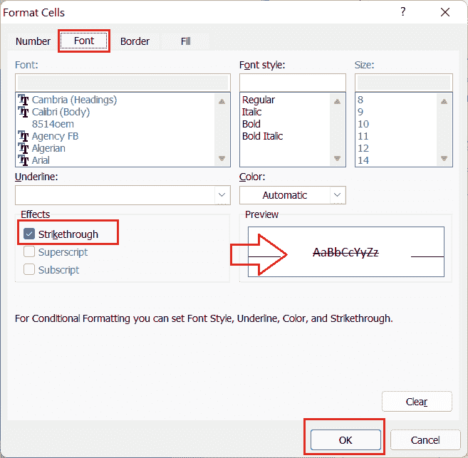

# Excel 删除线快捷方式

> 原文：<https://www.javatpoint.com/excel-strikethrough-shortcut>

微软 Excel 或微软 Excel 是微软开发的功能强大的电子表格软件，它有一系列独特的内置特性和功能。Excel 中最好的事情是使用快速快捷方式使用大多数内置功能。说到在 Excel 中使用删除线，Excel 有多个快捷方式可以帮助我们在 Excel 单元格内快速应用。

本文讨论了各种 Excel 删除线快捷方式，这些快捷方式有助于在 Excel 中快速实现或使用删除线功能。在讨论使用删除线的快捷方式之前，让我们简单介绍一下删除线功能及其在文本编辑和突出显示中的使用。

## 什么是 Excel 中的删除线？

删除线是一种用于选定单元格中的文本或值的字符格式，它在单元格或选定文本中绘制一条水平直线。因为它是一种格式，所以可以像 Excel 中的其他格式或样式一样应用或删除。通常，删除线功能在功能区的“单元格格式”选项卡中使用。但是，更多时候是通过快捷方式，因为它们可以更容易地在所需的单元格中应用删除线。

在单元格中划一条直线通常标志着相应的任务已经完成。例如，假设我们正在处理 Excel 表上列出的不同项目；如果完成了相应的项目，我们可以在所需的单元格中选择并应用删除线。这将帮助我们只关注未完成的项目，同时保留已完成项目的记录。

下图显示了 Excel 工作表中带有删除线的单元格:

## Excel 中使用删除线的快捷方式

快捷方式可以在 Excel 中以不同的方式用于每个特定的任务。或者，我们也可以为我们经常使用的单个任务创建一个期望的快捷方式。同样，删除线功能有多个快捷方式，例如:

*   快速访问工具栏中的删除线快捷方式
*   功能区上的删除线快捷方式
*   “单元格格式”对话框中的删除线快捷方式
*   删除线快捷键

我们可以使用上面列出的任何删除线快捷方式在 Excel 单元格中的文本和值之间应用删除线或创建一行。让我们详细讨论每个删除线快捷方式:

### 快速访问工具栏中的删除线快捷方式

快速访问工具栏(QAT)是通过点击访问任何 Excel 功能/选项的好方法。但是，我们必须在 QAT 中添加所需的快捷方式，然后才能使用它。我们只需要添加一次快捷方式，以后需要用多少次就用多少次。

**在快速访问工具栏中添加删除线快捷方式**

*   首先，我们需要从 QAT 中点击**下拉图标**，选择**更多命令**选项。
    
    这将启动 **Excel 选项，**如下所示:
    
*   接下来，我们必须点击下拉菜单，从**“选择命令”下面的列表中选择**所有命令**选项。**同样，我们需要从命令列表中选择选项**删除线**。选择两个选项后，我们必须点击**添加**按钮，在右侧窗口显示的列表中插入所需选项。
    
*   一旦右侧窗口显示删除线特征，我们需要点击**确定**按钮。
    
    这样做，我们可以轻松地在 QAT 中添加删除线快捷键。
    
    添加后，我们可以使用**鼠标**或鼠标悬停在快捷方式上时显示的**键盘快捷方式**(在我们的情况下，Ctrl + 5)。
    或者，我们可以使用**替代**的方法。根据 Alt 方法，我们需要先点击键盘上的 **Alt** 键，这将在 Excel 选项上启用快速快捷键。我们必须按下 QAT 上带有删除线的关联键才能立即使用该功能。在我们的例子中，它是数字键 4。因此，在 QAT 中添加删除线快捷方式后，我们必须按下 Alt 键，然后按键 4，立即对选定的单元格使用删除线功能。
    

### 功能区上的删除线快捷方式

当我们使用微软 Word 时，我们通常会在主页选项卡下看到一个删除线图标。遗憾的是，Excel 中默认没有这样的快捷方式。然而，很容易在功能区上添加这个快捷方式，并在需要时立即使用它。一旦添加，以后可以根据需要多次使用。

我们需要执行以下步骤在 Excel 功能区中添加删除线快捷方式:

*   首先，我们需要在**功能区**内的任意位置右键单击，然后从列表中单击选项**“自定义功能区”**，如下所示:
    
*   接下来，我们需要在功能区上添加一个自定义组，并在那里放置我们想要的快捷方式。为此，我们需要选择目标选项卡来添加自定义组。在我们的例子中，我们选择主页选项卡。选择好想要的标签后，我们需要点击**“新建组”**按钮。
    
    这将瞬间添加一个自定义群，如下图:
    
*   选择创建的自定义组后，我们需要从**【选择命令来源】**下的下拉列表中选择选项**【命令不在功能区】**，如下所示:
    
*   接下来，我们需要从列表中找到**删除线**选项，然后点击**添加**按钮。删除线选项显示在右侧框中我们创建的自定义组下后，我们必须单击**确定**按钮。
    
*   单击“确定”按钮后，我们将看到一个名为删除线的新快捷方式被添加到功能区的自定义组(无论我们给组起什么名字)和选定选项卡下。在我们的例子中，删除线快捷方式被添加到主页选项卡中，如下所示:
    
    如上图所示，我们可以使用此快捷方式在任何需要的时候只需单击一下就可以对选定的单元格应用删除线。

因此，如果我们的快速访问工具栏保留了其他必要的快捷方式，使用上述步骤在功能区上添加删除线快捷方式是一个很好的选择。

### “单元格格式”对话框中的删除线快捷方式

我们可以使用单元格格式对话框来使用删除线功能。因为我们可以使用快捷键 Ctrl + 1 来访问单元格格式对话框，所以应用删除线也是一个快速的替代快捷键。“设置单元格格式”对话框提供了几个选项来调整选定单元格或单元格区域的格式，我们可以通过以下步骤轻松访问删除线格式:

*   首先，我们需要选择要应用删除线的单元格，相邻的或不相邻的。
*   接下来，我们需要使用快捷键 **Ctrl+1** 来启动“设置单元格格式”对话框，这里的按键 1 应该只能从键盘区域按下，而不能使用数字键盘。
    
    或者，我们也可以从右键菜单选项中选择**【设置单元格格式】**。
    
*   在**单元格格式对话框**中，我们必须导航到**字体**选项卡，并找到选项**删除线。**我们需要点击效果下与删除线选项关联的**复选框**，如下图:
    
*   最后，我们必须点击**确定**按钮或按回车键应用更改。这将立即对 Excel 中的选定单元格应用删除线。

虽然这是一个比其他快捷方式稍长的快捷方式，但它也提供了其他格式选项。尽管如此，键盘快捷键总是最快的方法。

### 删除线快捷键

使用键盘按键的任何功能都是最快最好的方法之一。Excel 的大多数功能都有预定义的键盘快捷键。如果任何特定任务没有明确的快捷键，可以按 Alt 键激活特殊快捷键。

在 Excel 中使用删除线功能时，我们必须同时按下 Ctrl 键和数字键“5”。但是，在使用键盘快捷键 **Ctrl + 5 之前，我们必须选择要应用删除线的单元格或单元格区域。**我们可以使用这个快捷方式在 Excel 中选择相邻和不相邻的单元格。

需要注意的是，我们必须在键盘区域使用数字键‘5’，而不是数字键盘。

## 删除线示例

虽然应用删除线快捷方式很容易，但有时我们可能不会按预期使用它们。例如，在条件格式中使用删除线时。我们只能删除已定义规则的单元格，并访问从“格式规则”窗口打开的“设置单元格格式”对话框。

让我们以下面的 excel 工作表为例，其中我们有几个任务的列表，我们希望根据下一个单元格中给出的输入(任务是否完成)对选定的任务应用删除线。

因此，我们首先需要**选择**要应用条件格式的单元格或单元格区域。在我们的示例中，我们需要对列 a 应用条件格式。因此，我们选择从 A1 到 A8 的单元格，如下图所示:

选择有效单元格后，需要进入**首页**选项卡，点击**条件格式**选项。我们必须从条件格式下的下拉列表中选择选项**新规则**。

在下一个窗口中，我们需要选择一个选项，上面写着:**“使用公式确定要格式化的单元格”。**然后，我们必须写出不带括号的公式 **(=B2:B8=“是”)**，如下图:

输入公式后，我们必须点击**格式**按钮。在单元格格式窗口，我们需要进入**字体**选项卡，选择**删除线**选项，点击**确定**按钮。

单击“确定”按钮后，将应用所需的条件格式。之后，每当我们将 YES 写在任务旁边的单元格中时，直线就会穿过任务。在我们的示例中，它看起来像这样:

这通常意味着有时我们不能使用删除线快捷键。

## 需要记住的重要事情

*   当我们在 Excel 单元格上应用删除线时，它不会改变单元格中的值，它只会向单元格中的文本或值画一条线。例如，对于 Excel 或 Excel 公式，~~“TEXT”~~“TEXT”是相同的。
*   当对 Excel 工作表中的某些单元格应用删除线时，我们只能选择这些单元格，并使用上面提到的任何所需的快捷方式。要从单元格的某些部分选择单元格，我们可以使用 Ctrl 键，同时使用鼠标单击所需的单元格。
*   用于应用删除线的快捷方式也可用于删除选定单元格的删除线。但是，必须有读/写权限才能在 Excel 工作表中进行更改。
*   在功能区上添加删除线快捷方式时，我们必须记住，我们不能更改 Excel 中某些选项卡下的默认组/类别。我们必须添加一个自定义组，因为选项卡中的默认组是不可更改的。
*   使用带条件格式的删除线快捷方式时，我们必须记住范围引用只能是相对范围引用，不能是绝对范围引用。

* * *