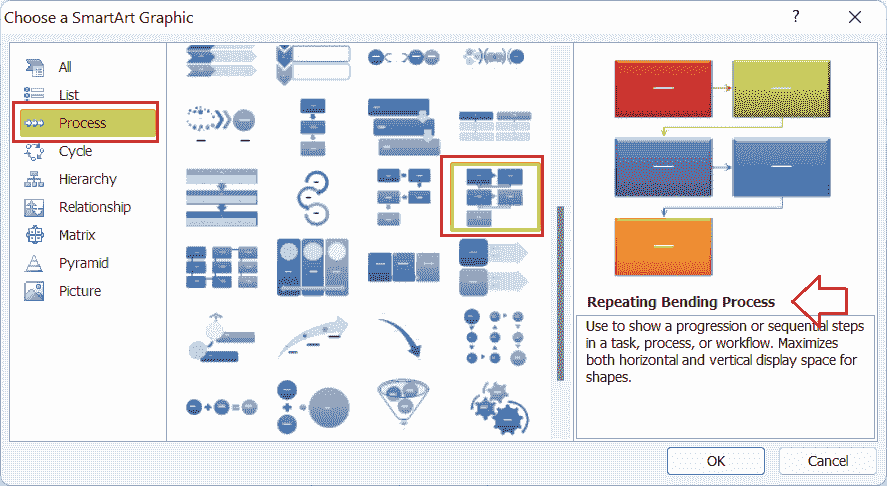

# 流程图 Excel

> 原文：<https://www.javatpoint.com/flow-chart-excel>

微软 Excel 或微软 Excel 是微软公司设计的功能强大的电子表格软件之一。默认情况下，它提供各种功能。它是相当流行的电子表格软件，用于可视化数据或添加相关的图形元素，如形状、图像、剪贴画、图表等。

流程图是流程驱动方法中广泛使用的一种流行图表类型。它们用于各种程序或软件中，包括 Excel。但是，没有像其他典型的 Excel 图表那样直接插入流程图的选项。但是，有一些方法可以在 Excel 中创建所需的结构化流程图。本文讨论了流程图的简要介绍以及在 Excel 中轻松插入这些图表的详细分步教程。

## 什么是 Excel 中的流程图？

流程图(也称为流程图)是描述任何流程、任务或工作流的步骤的图表。它通常有助于显示各种数据点之间的关系，使我们的工作表更加清晰。流程图也被称为过程图、过程流程图、过程图、过程流程图、功能流程图等。

流程图无论是技术人员还是非技术人员都很容易绘制和理解。这就是为什么在各种领域中，用简单易懂的图表来计划、研究或交流复杂的过程是很常见的。这些图表可以是简单的手绘结构，也可以是计算机创建的综合结构，用于说明相关的步骤和执行方向。

流程图是程序员、工程师、系统分析师和许多其他管理者使用的基本可视化工具之一。它是描述各种任务的通信手段，包括以下内容:

*   数据流
*   文档工作流
*   系统操作流程
*   算法

下图显示了在 Excel 工作表中绘制的简单流程图:

### 常见元素及其在流程图中的应用

流程图中的典型结构或标准总结了从左到右和从上到下的方向。但是，它使用不同的元素和特定的符号来定义不同的实体或动作。下面列出了一些这样的要素:

*   **矩形:**它是一个带有直角(形成 90 度角)的盒子，通常用于表示工艺阶段。
    T3】
*   **带圆角的矩形:**是矩形，但不结束直角。相反，它有圆角，用于标记过程的开始和结束阶段。
    T3】
*   **平行四边形:**是边几乎没有拉伸的盒子。平行四边形用于说明数据输入/输出。
    T3】
*   **钻石:**它是一个钻石形状的盒子，但呈二维形状。流程图中使用的菱形通常标记条件分支。
    T3】
*   **箭头:**用于显示整个过程的工艺流程。
    T3】

上述元素是流程图中最常用的元素，但它们并不仅限于这些。根据需求等，可能有许多其他元素。

## 如何在 Excel 中创建流程图？

创建流程图不同于在 Excel 中创建其他典型图表。然而，我们可以利用许多方法在 Excel 工作表中创建流程图。最常见的方法如下:

*   使用形状创建流程图
*   使用智能艺术创建流程图
*   使用模板创建流程图

现在让我们详细讨论每一个:

### 示例 1:使用形状创建流程图

由于流程图以箭头连接的不同形状结束，我们可以使用 Excel 内置形状在工作表中创建流程图。让我们创建一个简单的流程图来说明组织中的沟通流程。一般来说，组织流程图包括以下流程:

创始人>主管部门>经理>团队领导>团队成员

要为上述流程创建 Excel 流程图，我们必须执行以下步骤:

*   首先，我们需要从活动工作表中删除网格线。虽然不是强制性的，但会使流程图清晰可见或易于阅读。为此，我们必须导航至**页面布局**选项卡，并取消勾选**网格线下与**视图**相关的复选框。**
    
*   接下来，我们需要进入**插入**选项卡，点击与**形状链接的下拉图标。**将显示 Excel 中存在的所有内置形状。我们需要在流程图下选择矩形，用鼠标画出来，如下图:
    
    我们可以通过按住 Alt 键，用鼠标拖动，根据列/行的结束来调整框的大小。
*   接下来，我们需要在框中插入所需的文本。为此，我们必须在插入的框上按下**右键**，并选择**编辑文本**选项。
    
    之后，我们可以使用键盘输入想要的文字。例如，我们在框中键入文本“方正”。
    
    我们也可以根据自己的要求调整方框或文字的格式和样式。然而，为了保持它是一个典型的流程图，我们只移除了框的边框，并更改了文本的大小&颜色。
    
*   一旦我们有了组织流程图的第一个框，我们必须从形状中插入一个箭头来定义流程向底侧的方向，如下所示:
    
    从第一个框插入箭头后，我们必须在箭头下方插入一条水平直线。如果我们考虑一个组织流程图中的四个主管部门，我们需要插入四个箭头，如下图:
    
*   我们必须再次在四个箭头的每一个下方插入一个矩形框。接下来，我们在每个框中插入一段文字，提到具体负责人的部门。
    
    在我们的例子中，我们为主管部门插入了四个框。然而，我们可以根据我们的要求或多或少地插入。
*   我们需要在每个部门负责人的盒子的中间底部插入四个箭头，并再附上四个盒子。然后我们在每个框中插入文本(在我们的例子中是管理器)。
    
    同样，我们为团队负责人再插入四个箭头和方框。
    
*   接下来，我们需要在每个组长框的左下方插入垂直直线，并以以下方式插入连接直线的水平箭头:
    
*   最后，我们必须插入连接到每个剩余箭头的矩形框，并为高管输入文本，如下图所示:
    

这是在 Excel 中创建流程图最简单的方法。在上面的组织流程图中，沟通的流程清晰可见。

### 示例 2:使用智能艺术创建流程图

在 Excel 中创建简单流程图的另一个简单方法是使用智能艺术。Excel 默认由几个 SmartArt Graphics 组成，可以帮助制作出漂亮的流程图。虽然 SmartArt Graphics 有一些特定的流程图，但我们可以进行相应的更改。

让我们考虑建立组织的常见步骤，并使用 Excel SmartArt Graphics 绘制流程图。

*   首先，我们需要从 Excel 工作表中删除网格线，使图表看起来更加清晰和信息丰富。
*   接下来，我们需要进入“插入”选项卡，点击 SmartArt 图标，如下图:
    
*   在“智能艺术图形”窗口下，我们需要单击窗口左侧的“处理”选项。它将显示许多进程驱动的图形。然而，为了创建一个好的流程图，我们需要向下滚动并选择重复弯曲过程图形。
    
*   选择所需的基于流程的图形后，我们将在 Excel 工作表中获得默认流程图。在我们的例子中，我们得到了默认的重复弯曲过程图，如下所示:
    
*   在我们得到默认流程图后，我们必须按照我们的要求编辑文本和类型。由于我们正在创建建立组织的流程图，因此我们将相应地包括步骤。例如，决定实体类型、注册公司、获取 CIN(客户识别号)、创建网站、雇用员工等。在框中输入文本后，我们的示例流程图如下:
    
*   假设我们想在流程中添加更多的框。然后，我们可以选择现有的形状(特定的方框、箭头等)。)并粘贴到同一张纸上。我们再插入两个框来建立一个组织，插入文本来购买软件，并为员工设置规则。之后，我们的示例流程图如下:
    
*   插入完整的图表后，我们可以选择任何图表元素，并相应地安排设计或格式。一旦我们选择了流程图元素，我们就会在功能区上获得新的选项卡。使用选项卡，我们可以调整形状颜色、文本颜色、字体大小、样式等。
    
    在调整了一些格式和样式之后，我们的示例流程图看起来是这样的:
    

### 示例 3:使用 Excel 模板创建流程图

在 Excel 中创建流程图的第三种也是最简单的方法包括使用 Excel 模板。Excel 有大量预先设计的模板，可以帮助我们快速开始各自的项目或任务。当使用模板在 Excel 中创建流程图时，我们必须到模板存储中搜索“流程图”。Excel 将显示许多模板，我们可以选择所需的模板，并通过相应地编辑其元素来开始工作。

或者，我们可以导航到微软模板的官方网站([https://templates.office.com/](https://templates.office.com/))并从那里进行搜索。

找到模板后，我们可以在设备上下载并使用微软 Excel 软件打开它。

一旦模板在 Excel 中打开，我们就可以根据我们的要求进行必要的更改并调整格式和样式。

## 需要记住的重要事情

*   我们可以使用不同的形状给我们的流程图带来美丽的视觉效果。
*   我们可以为每个形状使用不同的颜色，使流程图看起来更有吸引力。
*   创建简单的流程图时，最好使用 SmartArt Graphics。
*   创建复杂的流程图时，最好使用形状。此外，我们必须将流程图保存为模板，以便将来在必要时进行修改。
*   使用商店中的模板创建流程图时，一定要记住，所有模板都不是免费使用的。

* * *