# Excel 方框图

> 原文：<https://www.javatpoint.com/excel-box-plot>

进行统计分析时，您可能需要一个标准的方框图来显示一组数据的分布。借助方框图，您可以看到数据中数字的分布。你可能现在还不明白方框图的意思，但是按照下面这一章，你会明白得多。

Excel 没有方框图，但是有一个叫做**方框的图表和一个集两个图表于一身的触须**图表。方框表示选定范围的中间值，触须图表示选定范围的最小值和最大值。

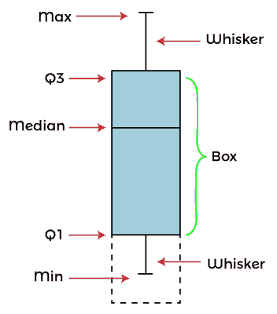

> 盒须图也叫盒形图。

本章将带您进入创建方框图和须图的每一步，并帮助您理解它。

## 什么是方块和触须图？

盒须图又称盒图，是表示一个数据集的**展开**和**中心**的一种方式。这张图表分为两部分:触须图和盒子图。这意味着——这张图表是由触须图和方框图组成的。

**箱线图**代表所选数据集的中间值或中间值。此框从第一个四分位数到第三个四分位数绘制。Q1 代表第一个四分位数，Q3 代表第三个四分位数。

图表中有一条从最小值到最大值的垂直线穿过这个叫做**须**的方框。触须上的线条表示选定数据集的最小值和最大值。

## 方框图和触须图的元素

基本上，方框图和触须图总共有五个数字，因为它包含了图表中的五个元素，即最小值、最大值、中值、Q1 和第三季度。

这个方块和触须图包含五个元素，其细节如下-

1.  **Min -** 是所选数据集中的最小值。它绘制在图表的最底部。
2.  **Max -** 是所选数据集中的最大值。它绘制在图表的顶部。
3.  **中间-** 这是在图表的方框图中绘制的选定数据集的中间值。
    中位数的计算方法是从选定的数据范围中找出两个中间的数字，并将其除以 2。
4.  **第一个四分位数(Q1) -** 它是代表 25%数据的方框的底部。
5.  **第三个四分位数(Q3)—**是方框的上侧代表 75%的数据。

## 示例 1:插入一个简单的方框和触须图

我们将为具有偶数数据集的 Excel 数据插入一个方框和晶须图。Excel 会计算中位数，作为中间数。我们有这组数据，包含了这个例子的一些数值-

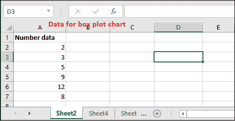

此数据未排序。要么排序，要么保持不变；Excel 会在插入图表时自动为您完成。不用担心；它不会影响你的图表结构。

**创建方框和须图的步骤**

以下是插入和创建偶数数据的方框图和触须图的一些步骤

**第一步:**选择数据范围(A2:A7)。这张纸有六条记录。

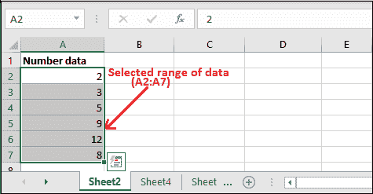

**第二步:**现在，转到**插入**选项卡，您将看到**统计图**选项。

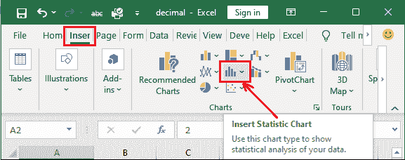

**第三步:**点击此**统计图**并从中选择**框和**图。

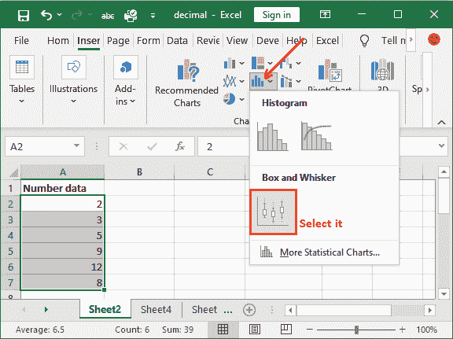

**第 4 步:**将图表插入到您的 Excel 工作表中，以显示您选择的数据范围。

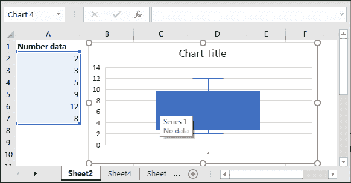

在这里，

**Excel 数据集-** {2，3，5，9，12，8}

如果你分类，数据会像-

**排序数据-** {2，3，5，8，9，12} (Excel 自动这么做)

**中间值-** {2，3， **5，8** ，9，12} = > {5，8}(没有中间值。所以，取 5 和 8)

中位数= (5+8)/2 => 13/2 = 6.5

**解释**

现在，是时候理解给定数据的图表了。以下是对它的详细解释-

在选定的数据范围内，2 是最小值，12 是最大值，由触须图线条显示。方框代表中间值(中值)，即:

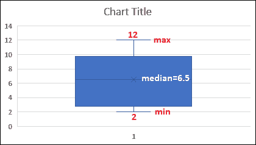

*   在这里，您可以看到方框内的一条线代表中间值(7)。这条线位于中间值 6 和 8 之间，即 6.5。
*   中间的数字将数据分为两部分:底部- {2，3}和顶部- {9，12}。
*   方框的底线代表第一个四分位数 Q1，即 3。
*   方框的顶线代表第三个四分位数 Q3，即 9。
*   此外，您还会看到一条名为**须**的垂直线，代表所选范围的最小值和最大值。

**第 5 步:**编辑插入图表的图表标题，并给出有价值的标题。

单击图表标题进行编辑。

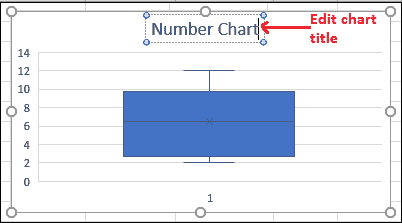

你的图表现在完成了。要获得更多样式，您还可以更改图表主题。

### 示例 2:插入方框和须图

我们将为一组简单的数据插入一个方框和触须图，通过这些数据你将学习这个图表。我们有这组包含一些数值的数据。它有奇数个记录，即 7 个。

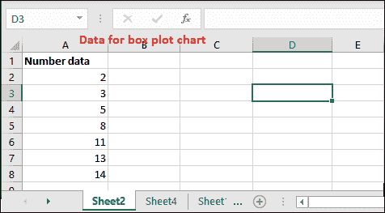

此表中插入了七条记录，已经按照顺序进行了排序。

**创建方框和须图的步骤**

以下是插入和创建奇数数据的方框图和触须图的一些步骤

**第一步:**选择数据范围(A2:A8)。

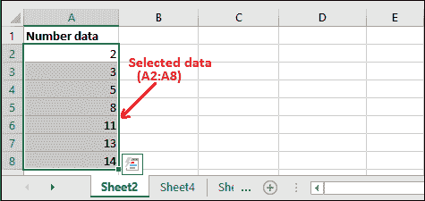

**第二步:**现在，转到**插入**选项卡，您将看到**统计图**选项。

**第三步:**点击此**统计图**并从中选择**框和**图。

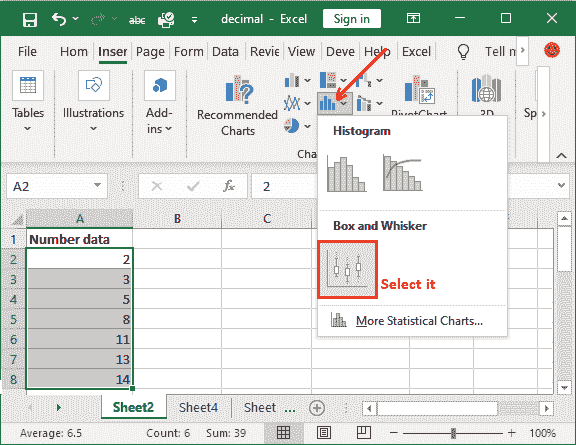

**第 4 步:**针对所选的数据范围，在 Excel 表中插入一个方框和触须图。

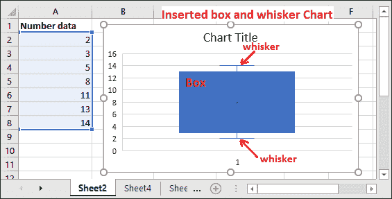

Excel 数据集- {2，3，5，8，11，13，14}

中间值- {2，3，5， **8** ，11，13，14}

该数据集有一个中间数字。所以，这是中位数本身。没有必要明确计算中位数。

中位数= 8

现在，是时候理解给定数据的图表了。以下是对它的详细解释-

**解释**

在选定的数据范围内，最小值为 2，最大值为 14。这些值由触须图的线条表示。另一边，方框代表中间值，即 8。

在此图表中，中间值为 8，其中{2，3，5}位于其上方，而{11，13，14}位于其下方。因此，

最小值= 2，最大值= 14，中间值/中值= 8

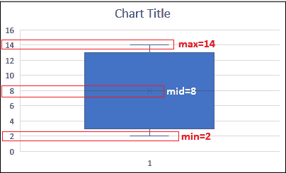

*   在上面的截图中，您看到框内有一条线，代表所选数据范围的中间值(8)。盒子里的 8 号线。
*   中间的数字将数据分为两部分:底部- {2，3，5}和顶部- {11，13，14}。
*   方框的底线代表第一个四分位数，即 3。
*   方框的顶线代表第三个四分位数，即 13。
*   此外，您会看到一条名为**须**的垂直线，代表所选范围的最小值(2)和最大值(14)。

所以，方框图和触须图是 MS Excel 中两个图表的组合。

**第 5 步:**编辑插入图表的图表标题，并给出有价值的标题。

单击图表标题进行编辑。

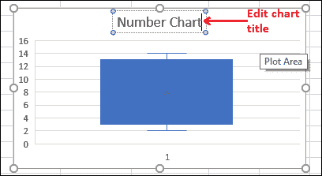

这些是简单数据的方框图和触须图。现在，我们再举一个例子，为复杂的 Excel 数据创建图表。

### 例 3

我们举一个例子，通过这个例子，我们将解释每个值是如何在方框图和触须图中计算和绘制的。它可以帮助你以更好的方式学习方块图和须图。正如我们告诉你的，那个方块和触须图总共有五个数字，因为它包含了这个图表中的五个元素，即最小值、最大值、中间值、Q1 和第三季度。

借助一个循序渐进的例子，我们将帮助您更好地学习每一步。

### 找到五个数字的摘要

假设以下是存储在 Excel 表格中的十个数字，将为其创建一个方框图和触须图。

9, 12, 14, 18, 19, 23, 29, 35, 42, 49

**计算该数据的方框图元素**

1.我们的数据已经按照递增的顺序排序了。如果没有排序，则对数据进行排序。

9, 12, 14, 18, 19, 23, 29, 35, 42, 49

2.找出这个数据集中的中间数来计算中位数。对于这个数据，我们找到了两个中间数，即 19 和 23。

9、12、14、18、 **19、23** 、29、35、42、49

**中间数-** 19，23

3.现在，从这两个中间数字计算出中间值。中位数是所选数据集中两个中间数字的平均值。它会在这里-

(19+23)/2 = 42/2 => 21

**中位数-** 21。

4.现在，找出四分位数。

9、12、14、18、 **19、23** 、29、35、42、49

5.第一个四分位数(Q1)是左边数据点的中间数/中位数。所以，在这里-

9、12、 **14** 、18、19

**第一四分位数(Q1) -** 14

6.第三个四分位数(Q3)是右侧数据点的中间数/中位数。所以，在这里-

23、29、 **35** 、42、49

**第三四分位数(Q3)-(T1)35**

7.找出整个数据集的最小值和最大值。我们已经按照递增的顺序对数据进行了排序，以便很容易找到最小值和最大值。

9, 12, 14, 18, 19, 23, 29, 35, 42, 49

**Min -** 9

**最大值-** 49

8.五号的完整总结是-

{最小值、最大值、中值、Q1 值、第三季度} - {9、49、21、14、35，}

**将计算出的五个数字绘制成方框图**

五个数求和计算。现在，让我们为以上五个数值数据创建一个方框图和触须图。

1.  缩放五个数字摘要的垂直标签以绘制在上面。
2.  现在，画一个从第一个四分位数(Q1=14)到第三个四分位数(Q3=35)的方框，用水平线穿过中间值。
3.  从 Q1 到最小(9)和第三季度到最大(49)画一个须。
4.  这是方块和须图。它就是这样创造出来的。

* * *