# Excel 转置函数

> 原文:[https://www.javatpoint.com/excel-transpose-function](https://www.javatpoint.com/excel-transpose-function)

在使用 Excel 时，很多时候需要切换或旋转工作表中的单元格。实现这一点的困难方法是将数据复制、粘贴到所需的单元格中。这种方式，很费时间。**切换和旋转单元格的另一种方法是使用 Excel 转置功能。**但是这个函数表示重复的数据。如果您不想在工作表中重复，您可以键入自定义公式，而不是使用内置的转置函数。

例如，在下面的参考图像中，**函数=转置(A24:B44)取单元格 A24: B27 的范围并水平组织它们**(参考下面的截图)。

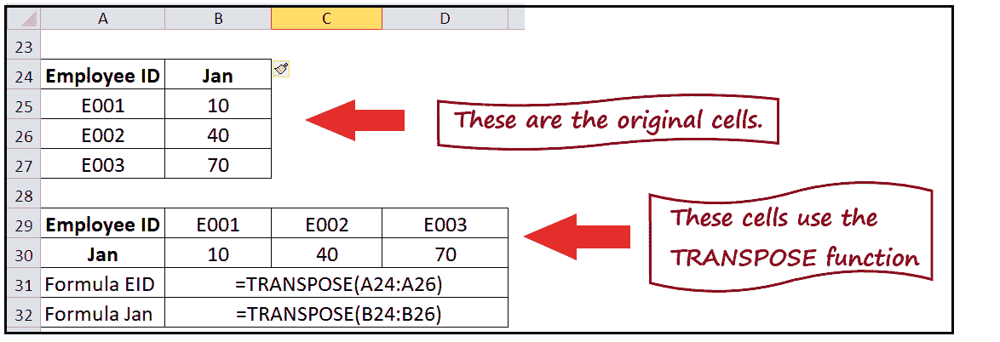

## 什么是转置函数？

> Excel 转置()函数将单元格的数据垂直范围复制到单元格的水平范围，反之亦然(即，将水平范围的方向更改为垂直范围)。

简单来说，我们可以说这个函数“翻转”了给定范围的单元格或 Excel 数组的位置:

1.  当您处理垂直范围的单元格时，**转置()功能将垂直范围的方向更改为水平范围**。
2.  当您处理水平范围的单元格时，**转置()函数将方向更改为垂直范围**。

换句话说，当一个数组被转置时，第一行被翻转，成为新数组的第一列；同样，前一个数组的第二行成为新数组的第二列，第三行将转换为第三列，以此类推。

在 Excel 中，**转置()函数既可以用于单元格区域，也可以用于数组**。尽管用户更喜欢使用转置范围，因为它们是动态的，即如果原始范围中的数据发生变化，转置()数据将立即更新新范围中的数据。

### 句法

=TRANSPOSE (array)

### 因素

**数组(必选)** -该参数表示要从垂直变为水平或从水平变为垂直的数据。

### 返回值

转置函数通过将单元格的水平范围转换为垂直范围来返回单元格或数组的范围，反之亦然。

### 使用转置函数的步骤

1.  选定的移调范围必须等于源范围。
2.  您将要输入的函数必须以数组公式的形式键入。
3.  要指定数组公式，您应该选择需要公式的所有单元格。
4.  选择单元格后，键入公式，即=转置(A1:A5)。
5.  最后按 Ctrl +Shift+ Enter 确认。
6.  如果您想对转置公式进行任何更改，您必须突出显示整个源数组，您可以进行编辑，再次完成后，按 Ctrl +Shift +Enter 键盘快捷键来确认更改。
7.  确认后，你会注意到 Excel 会自动在函数周围放上花括号“{ }”。大括号表示它是一个数组公式。

## 示例 1:使用转置功能将单元格从垂直更改为水平

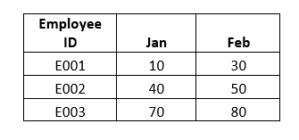

按照以下步骤解决上述问题:

### 步骤 1:选择与原始区域大小相同的空白单元格

第一步是**在 Excel 工作表中选择与原始区域大小相同的空白单元格。但是一定要记得在另一个方向选择同样大小的单元格。**例如，在下面的示例中，我们有 12 个垂直排列的单元格:

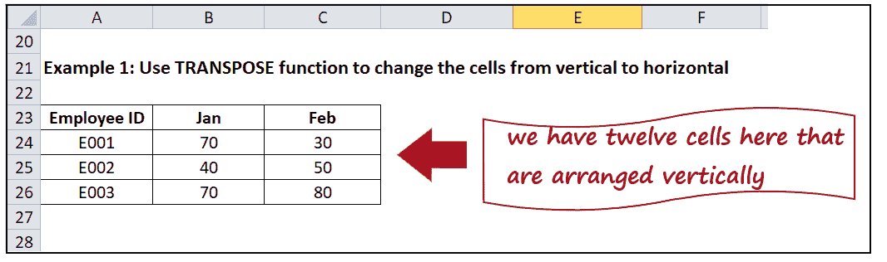

所以，我们将选择十二个水平单元格，如下图所示:

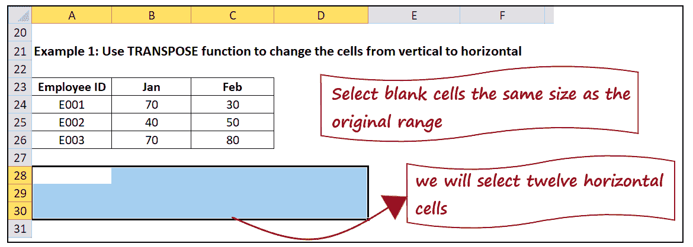

这些空白单元格是转置单元格以后放置的位置。

### 第二步:键入公式，即=转置(

选择空白单元格后，只需输入公式:**=转置(**

它看起来类似于下图:

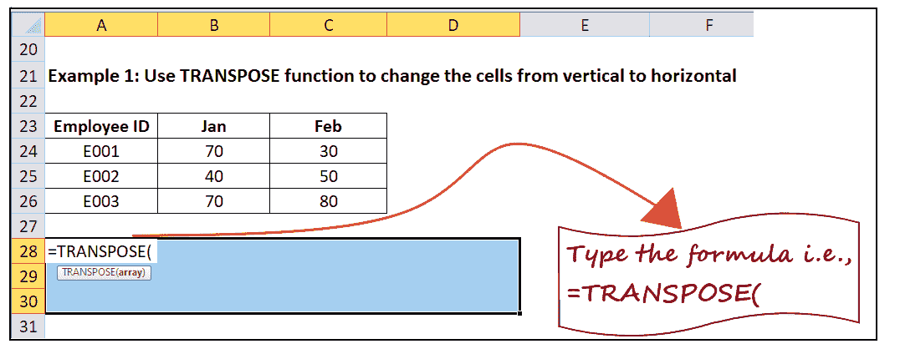

**注意:你会注意到，即使你已经开始输入转置函数，那九个水平单元格仍然在你的 Excel 工作表中被选中。**

### 第三步:输入你想转置的单元格范围

下一步是键入要转置的单元格范围。尽管您可以不用键入，而是指向并拖动鼠标光标来选择原始单元格组。

在本例中，原始单元格位于 A23 到 C26 之间。因此我们的公式变成:**=转置(A23: C26)。进入范围后，您会注意到**整个阵列用蓝色矩形框突出显示。

它看起来类似于下图:

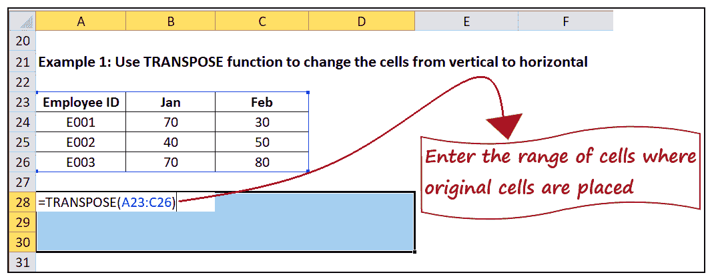

注:输入公式后，请记住，不要按回车键，因为它会显示#VALUE 错误。停止打字，进入最后一步。

### 第四步:一起按 CTRL+SHIFT+ENTER

最后一步是一起按 CTRL+SHIFT+ENTER 键盘按钮，Excel 会立即为你转置原始单元格。下面给出的是使用转置()函数转置原始单元格后的输出。

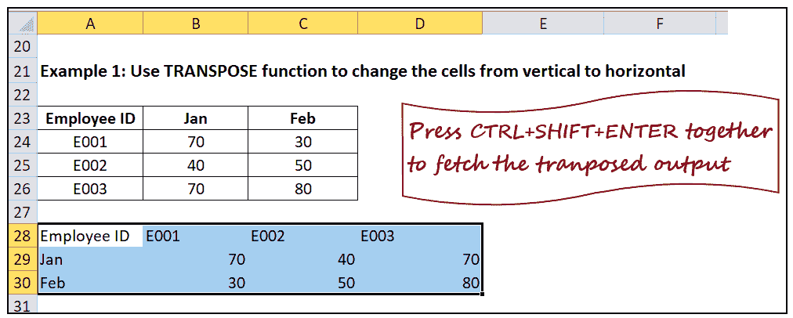

#### 注意:你会注意到花括号会自动添加到你的转置公式的开始和结束，以表明它是数组函数。

### 问题:现在问题来了，为什么只按 CTRL + SHIFT +ENTER 才能工作？

**答案:**这个问题的答案是因为转置函数只在数组公式中使用，你就是这样终止数组函数的。数组公式应用于多个单元格。回想一下，在第 1 步中，您选择了多个单元格；因此，该公式将应用于多个单元格。

## 示例 2:使用转置函数更改 4 行 x 6 列动态数组(如下所示)的方向。

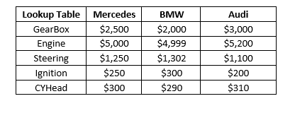

按照以下步骤转置上面的 **4 行×6 列动态数组**:

### 步骤 1:选择空白单元格

要将 4 行×6 列水平范围转置为 6 行×4 列垂直范围 ***，请选择 24 个空白单元格(6 行 4 列)*** 。在本例中，我们选择了单元格 B4:C7 的范围。

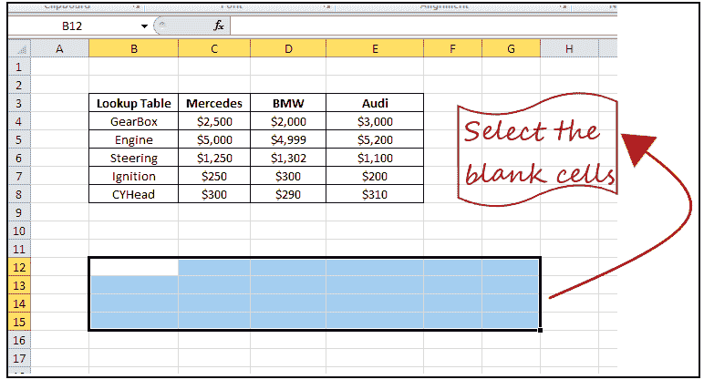

### 第二步:输入公式并输入单元格区域的数组

*选择空白单元格*后，只需输入公式，选择需要翻转的单元格范围即可。你会得到下面的公式。

**=转置(B3:E8)**

#### 注意:一旦你键入公式，你会注意到一个蓝色的矩形框覆盖了你的数组。

它看起来类似于下图:

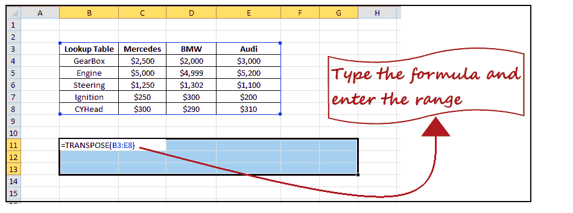

### 第三步:按 Ctrl+Shift+回车获取输出

最后一步是**一起按 CTRL+SHIFT+ENTER** 键盘按钮，Excel 会立即**将 4 行×6 列原始动态数组转置到 6 行×4 列范围的单元格**。

它看起来类似于下图:

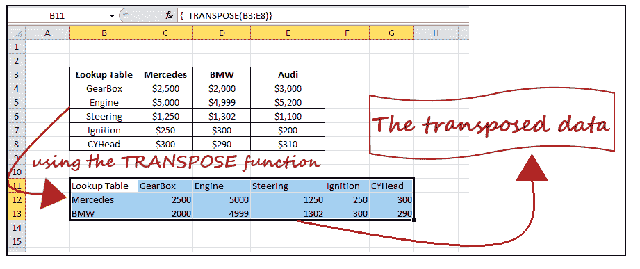

发现了。现在我们已经理解了转置函数在 Excel 工作表中是如何工作的。您也可以将此功能与其他 Excel 公式集成。去试试吧。

## 需要记住的要点

1.  您**不需要手动输入整个单元格范围**。写完=转置(你可以用鼠标选择单元格组。只需将光标指向第一个单元格，然后将指针从区域的起点拖到所选内容的终点。但是请记住，一旦完成，不要按回车键(它会抛出#value 错误)；相反，按 CTRL+SHIFT+ENTER 即可获得结果。
2.  **转置()函数处理文本数据，它也复制单元格格式**。但请始终记住，此函数会创建重复数据。

## 置换替代-粘贴特殊选项

当您需要动态解决方案时，转置功能是合乎逻辑的，只要原始数据有任何变化，该解决方案就会自动更新翻转的输出。**然而，Excel 提供了一个简单的替代转置功能，即粘贴特殊选项。**当你只需要一次转换时，它会非常有用。您可以使用“特殊粘贴”，并且可以轻松地翻转工作表数据的方向，而无需保持与源数据的链接。

按照以下步骤使用“特殊粘贴”选项来置换工作表数据:

1.  **选择源数据，按 CTRL + C 键盘快捷键复制**。
    T3】
2.  **将光标放在想要转置操作开始的单元格**上。在我们的例子中，我们选择了 B11 细胞。
    T3】
3.  转到 Excel 功能区的主页选项卡，**点击剪贴板选项卡最左边的粘贴下拉**箭头。
    T3】
4.  将显示以下下拉粘贴选项。**选择转置(T)粘贴选项**。
    T3】
5.  **Excel 会将数据转置后粘贴到选中的单元格**。
    T3】
6.  由于我们在两个位置有相同的数据，您可以删除原始数据，尽管这一步是可选的。

#### 注意:确保选择单个单元格或一组单元格来粘贴转置数据。如果光标在源数据单元格上，Excel 将抛出一个错误，“由于复制和粘贴区域的大小和形状不同，因此无法粘贴信息”

* * *