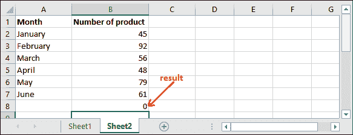
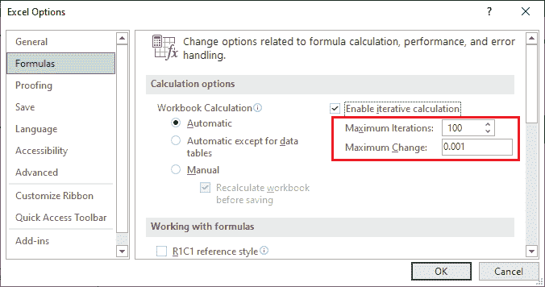

# Excel 中的循环引用

> 原文：<https://www.javatpoint.com/circular-reference-in-excel>

通常，在单元格中输入公式计算某些数据时，会提供其他单元格的引用。但是有时候，当你在 Excel 表格中输入公式时，你会发现它不起作用。当您在公式中使用结果单元格引用时，就会出现这种情况。因此，您会收到一条关于循环引用出现的警告消息。

当您的公式试图引用自身，并且名为**迭代计算**的 Excel 功能可能关闭时，您会面临这个问题。公式可能是这样的-

这里，C3 单元格包含一个正在执行三个单元格相加的公式，其中包括 C3 单元格内的计算公式。所以，循环引用指的是计算自身引用的公式。

## 本章讨论的主题

以下是我们在本章中讨论的主题-

*   [什么是循环引用？](#Whatis)
*   [圆形参考示例](#Example)
*   [什么是迭代计算？](#iterative)
*   [启用或禁用迭代计算](#Enableordisable)
*   [检测圆形基准](#Detect)
*   [如何去除循环引用？](#remove)
*   [为什么要避免循环引用](#avoid)
*   [圆形参考的类型](#Types)
*   [如何找到隐藏的循环引用](#hidden)

## 什么是循环引用？

当公式直接或间接引用自己的单元格时，就会出现循环引用。

**直接循环引用**

当公式在执行任何操作时直接包含结果单元格的引用时，就会发生直接循环引用。在下面的示例中，公式是用 C3 单元格编写的，并且在公式中包含自己的单元格(C3)引用。

当您按下回车键时，会弹出一个窗口，向您显示一条警告消息。

单击此警告弹出窗口上的“确定”将其关闭，Excel 将返回 0。

**间接循环引用**

当不同的公式以循环方式相互依赖单元格数据时，会发生间接循环引用。下面是间接循环引用的一个例子。

为此，我们首先在 C1 单元格中取一个数值(20)。

**步骤 1:** 现在，我们已经将该值乘以 2，并将其存储在 E5 单元格中。这样，E3 细胞指的是 C1 细胞。

**第二步:**按回车键，在 E5 单元格得到计算结果。

**第三步:**现在，对 E5 单元格值再执行一次乘 2 的乘法运算，并将其存储在 A5 单元格中。这里，A3 指的是 D3 单元。

**第四步:**按回车键，在 A5 单元格中得到计算结果。

到目前为止，本表中没有循环引用。现在，如果我们对结果将存储在 C1 单元中的 A5 单元数据执行任何操作，它将创建一个间接循环引用。

**第 5 步:**从 C1 单元格中删除上一个值，并在其中写入以下公式。

=A5*2

**第六步:**按回车键，会产生循环引用的错误信息。

**第 7 步:**在此警告信息上，单击确定按钮。您将看到它返回 0，并向您显示创建的循环引用。

**第 8 步:**进入**公式**选项卡，点击公式审核组内的**显示公式**选项。

**步骤 9:** 将启用所有三个单元格中使用的公式。请看下面的截图-

**步骤 10:** 双击任一单元格；您将看到所有三个单元格之间的循环引用。

E3 小区指 C1，C1 小区指 A3 小区，A3 小区指 E3。

## 循环引用示例

在下面的这个例子中，我们计算了六个月销售总额(单元格 B2:B7)和存储在 B8 单元格中的结果。这种计算没有问题，而且是毫无问题地计算出来的。

但是万一你不小心选择了包含结果的 B8 单元格引用而不是 B7。所以，我们正在进行计算，包括结果单元格，像这样-

当你按下**进入**键时，它会给你一个警告，因为这种类型的计算是不可能的。Excel 警告用户一个或多个循环引用。

当你点击**确定**按钮时，该警告弹出，该警告将关闭。您也可以通过**帮助**选项了解更多信息。

如果单击“确定”，值 0 将填充到 B8 单元格中，该单元格被选中以保留结果。

## 什么是迭代计算？

**迭代计算**允许用户执行循环引用，并使用结果单元格引用重新计算数据。因此，您可以在 Excel 工作表中允许循环引用。

当公式包含结果所在的单元格时，会出现循环引用。可以是直接的，也可以是间接的。有时，您可能需要循环引用。但是当您意外使用循环引用时，它会返回 0，这是一个意外的结果。

Excel 提供了迭代计算功能，允许用户重复计算，直到满足特定条件。您可以在 Excel 中启用迭代计算选项，使循环引用成为可能。

## 启用或禁用迭代计算

在某些情况下，迭代计算是重复的重新计算，直到它满足特定的条件。如果要使用循环引用，必须在 Excel **文件**菜单中启用**启用迭代计算**。默认情况下，该选项(**启用迭代计算**)处于关闭状态(未标记)。

**第一步:**点击 Excel 中的**文件**页签。

**第二步:**在 Excel 退格的左侧，点击**中的**选项**更多…** 。

**第三步:**导航到左侧窗口的**公式**选项卡，并在此标记**启用迭代计算**选项。

之后，点击**确定**保存该更改。

这样，您可以启用迭代计算，一旦启用，用户就可以控制最大迭代次数以及最大更改选项。你应该知道什么是最大迭代次数和最大变化。所以，这是对他们的详细描述-

**最大迭代次数-** 最大迭代次数是指 Excel 重新计算的次数。您可以定义最大迭代次数。但是如果迭代次数增加，计算将比以前花费更多的时间。

默认情况下，最大迭代次数为 100 次。你可以改变它。

**最大变化-** 最大变化定义迭代公式值之间的最大收缩。数字越小，结果越准确。

默认情况下，最大迭代次数为 0.0001。你也可以改变它。

默认情况下，最大迭代次数为 100，最大更改次数为 0.0001。这意味着 Excel 将在 100 次迭代后或变化小于 0.0001 后停止计算。

## 检测循环引用

当您不自己创建工作表并从其他人那里接收它时，您不知道其中有任何循环引用。因此，为了确保没有循环引用，您可以手动检测文件中的循环引用。

**方法 1:从错误检查**

为此，请遵循下面给出的步骤:

1.  导航至**公式**选项卡，点击公式审核组内的**错误检查**。
    
2.  现在从列表中选择**循环引用**，即**公式** > **检错** > **循环引用**。
    Excel 会显示包含循环引用的单元格引用。
    
3.  Excel 将带您进入包含循环引用的单元格。

**方法二:直接从状态栏**进入

检测 Excel 工作表中循环引用的另一种方法是在 Excel 状态栏中找到它。这是在 Excel 工作表中查找循环引用最简单的方法。

如果一张 Excel 表格的任何一个单元格包含循环引用，你会看到**循环引用以及写在表格底部(左下角)的单元格号**。

它还包含 Excel 工作表中存在循环引用的单元格编号。

#### 提示:如果循环引用不在当前活动工作表中，但不在同一工作簿的另一个工作表中，它将显示“循环引用”，并且没有单元格编号。

**例如，** Sheet2 包含一个循环引用，而 Sheet1 不包含。因此，Sheet1 的状态栏将是-

忽略 sheet1 数据。

## 如何移除循环引用？

Excel 没有任何快捷方式或预定义方法可以从 Excel 工作表中删除循环引用。借助上述步骤，您必须在 Excel 表中找到每个循环引用。然后你需要一个接一个地手动移除它们。您可以完全删除创建循环引用的公式，也可以用另一个公式替换它。

## 为什么要避免循环引用？

Excel 用户应避免使用循环引用。这使得 Excel 数据更加复杂，也会影响性能。每次打开包含循环引用的 Excel 工作表时，都会向您显示如下警告消息-

但是假设您已经允许迭代计算(通过标记**启用迭代计算**)。在这种情况下，它不会显示任何警告消息，甚至您也无法从“公式”选项卡内的“错误检查”中找到循环引用。除此之外，循环引用还可能因为循环引用而导致其他几个问题。

**例如**，如果选择了一个有循环引用的单元格，意外切换到公式编辑模式。还有，您按下了**进入**键，公式没有任何变化；它将返回 0。

#### 注意:公式编辑模式通过按 F2 键或双击选定的单元格来启用。

当您的大型数据电子表格包含太多公式时，循环引用风险很高。一旦循环引用可能会导致计算错误。

## 不同类型的循环引用

你会在 Excel 中发现不同类型的循环引用，比如-

*   非预期循环引用
*   预期循环引用
*   隐藏循环引用

你会发现大多数循环引用都是**非预期的**。Excel 自动为用户搜索非预期类型的实例。

还有**预期的循环引用**。这些类型的循环引用通常由有经验的用户进行，并用于进行迭代计算。

多一种循环引用，即**隐藏循环引用**。隐藏的循环引用很难检测到，因此它们可能很危险。这种类型的循环引用的操作依赖于另一个单元格值。

## 如何找到隐藏的循环引用？

隐藏的循环引用很难检测到。因此，我们将描述在 Excel 工作表中查找隐藏循环引用的步骤。通常，当您打开包含循环引用的 Excel 工作表时，会向您显示如下警告消息-

但是，如果您通过启用迭代计算允许循环引用，则不会显示此警告消息。甚至在公式选项卡内的**错误检查**选项中也找不到循环引用。

* * *