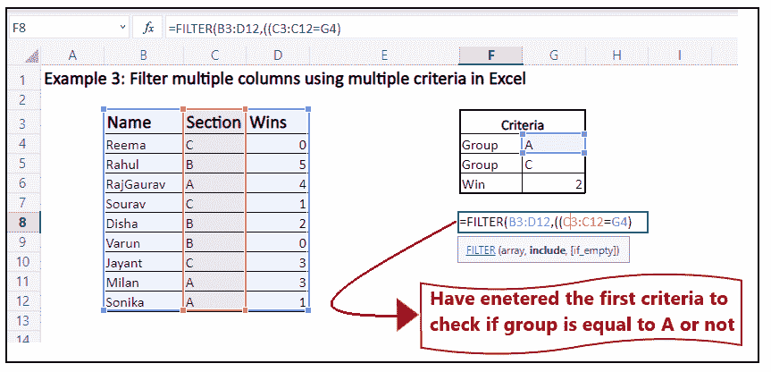
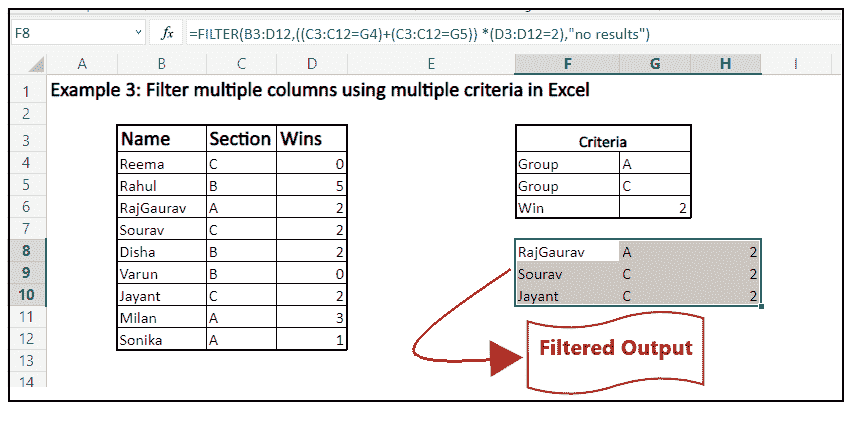

# Excel 过滤函数

> 原文：<https://www.javatpoint.com/excel-filter-function>

筛选选项是 Excel 常用的功能之一。用户通常使用自动过滤器过滤掉数据，在更复杂的数据问题中使用高级过滤器。虽然这些方法快速而强大，但它们不是动态的。简单地说，只要原始数据有任何变化，这些方法就不会自动更新。因此，您必须移除过滤器，更改数据，然后再次应用过滤器。这种方式，非常耗时。

为了防止这个缺点，Excel 引入了期待已久的替代方案，即 Excel 365 中的 **FILTER 函数。与之前的方法**不同的是，Excel FILTER()函数会在每次工作表更改时自动重新计算数据**，减轻了您的任务，因为现在您只需要设置一次过滤器！**

## 什么是过滤功能？

> Excel FILTER 函数用于根据给定的条件筛选值的范围或数组。此函数返回一个输出，该输出包含原始区域的值数组，该数组会自动溢出到一个单元格区域，从输入 Filter 函数的 excel 单元格开始。

FILTER 函数产生动态输出。当原始数据中的值发生变化或原始数据数组的大小发生变化时，FILTER 函数会自动更新输出。此外，该函数的结果将“溢出”到 Excel 工作表的各个单元格中。过滤器函数属于动态数组函数组。

FILTER 函数的主要作用是通过提供一个或多个逻辑测试(或标准)从给定的数据集中提取匹配的值。使用' include '参数应用逻辑测试，它可以保存各种类型的公式标准。例如，FILTER 可以匹配特定员工表中的数据，并获取销售额低于 350000 印度卢比(或任何其他指定阈值)的所有员工姓名。

#### 注意:FILTER()函数仅适用于最新的 Excel 版本，即 Office 365 订阅和 Excel 2021。因此，与 Excel 2019、Excel 2016 和所有其他早期版本不同，以前的版本不支持此功能。

### 句法

=FILTER(array, include, [if_empty])

### 因素

*   **数组(必选)** -此参数表示 Excel 工作表中要筛选的单元格区域或数值数组。
*   **包含(必需)** -该参数表示您希望应用于阵列的标准。它可以作为布尔数组(真值和假值)提供。
    例如， ***(B2:B6) > 2 是一个布尔准则*** ，这里我们已经提到过滤函数应该只从范围 B2:B6 提取数据，如果它们的值大于 2。
*   **If_empty(可选)** -此参数表示当不满足任何条件时返回的值。通常，它包括一个定制的用户消息，如“找不到值”，但您也可以提供其他值。您不要在此参数中传递任何值，它将使用空字符串("")作为默认值，并且不返回任何内容。

### Excel FILTER 函数的注意事项

下面给出了一些要点，这些要点将帮助您在 Excel 工作表中有效地应用 FILTER 函数:

*   FILTER 函数分析标准，并根据标准 ***自动水平或垂直溢出输出*** ，具体取决于您的源数据在 Excel 工作表中的排列方式。所以，永远记住要有足够的空单元格在单元格的下方和右侧；否则，Excel 将抛出# SPILL 错误。
*   ***FILTER 函数生成动态输出*** ，意思是原始数据中的值发生变化，或者如果原始数据数组的大小发生变化，FILTER 函数会自动更新输出。但是，当向原始数据添加新值时，为参数“array”提供的范围不会更新。但是如果您想自动调整数组参数的大小，您必须将其转换为 Excel 表或创建一个动态命名区域。

### 例 1:从下面的 Excel 表格中过滤出学生的名字，学生的分数大于 50。

按照以下步骤解决上述问题:

**第一步:选择一个单元格**

选择要放置筛选数据的单元格。始终确保所选单元格的右侧和底部有足够的空单元格，因为它可以根据您的原始数据值多个值。

如下图所示， ***这里我们选择了*的单元格 E5**。

**第二步:输入公式，即=Filter(**

选择空白单元格(E5)后，只需输入公式: ***= Filter(***

它看起来类似于下图:

**第三步:输入想要转置的单元格或数组的范围**

下一步是键入(或选择)要筛选的单元格或数组的范围。尽管您可以不用键入，而是指向并拖动鼠标光标来选择原始单元格组。

在本例中，原始单元格的位置从 B4 到 9。因此我们的公式变成: **=FILTER (B4: C9** )。它看起来类似于下图:

**第四步:输入条件**

我们将进入下一个参数(标准)，所以首先我们将放一个逗号(，)。在这里，我们需要过滤分数大于 50 的学生的名字。所以我们的标准是 Score(单元格范围)> 50。

在本例中，乐谱单元位于从 C4 到 C9 的位置。因此我们的公式变成: **=FILTER (B4: C9，C4:C9 > 50** 。它看起来类似于下图:

### 第 4 步:在第三个参数中填充值(尽管这一步是可选的)

在这个参数中，我们将键入一个定制的用户消息，如“对不起！未找到记录”，但您也可以提供其他值。如果不在此参数中传递任何值，它将使用空字符串("")作为默认值，并且不返回任何内容。

因此我们的公式变成: **=FILTER (B4: C9，C4:C9 > 50，“对不起！未找到记录”)**。它看起来类似于下图:

**第五步:回车，Excel 给出过滤后的输出**

一旦你按下回车键，你就会看到过滤后的记录。

在我们的例子中，我们有三个分数大于 50 的字段。我们收到了同样的三个字段。

### 示例 2:在 Excel 中使用两个标准(如下所示)过滤多个列。

这是我们的基本 Filter()函数的扩展。在本例中，我们将学习如何在两个不同的列上应用两个标准，并过滤掉我们的数据。

按照以下步骤解决上述问题:

**第一步:选择一个单元格**

选择要放置筛选数据的单元格。如下图所示，这里 ***我们选择了细胞 F7*** 。

**第二步:输入公式，输入单元格范围**

下一步是键入 Filter 函数并选择要筛选的单元格范围。在我们的例子中，原始细胞的位置是从 B3 到 D12。因此我们的公式变成: **=FILTER (B3: D12** )。

它看起来类似于下图:

**步骤 3:应用第一个标准**

首先，我们将设置标准来指定组。为此，我们在单元格 G4 中输入了目标组名( *criteria1* )。因此，我们将检查 C3: C12 之间的任何值是否等于 G4。公式如下:

**=FILTER(B3:D12，(C3:C12=G4)，**

**步骤 4:应用第二个标准，并使用 AND (*)运算符**组合它们

在第二个标准中，我们将在单元格 G5 (criteria2)中指定所需的最小获胜次数。同样，我们将检查 D3: D12 之间的值是否等于 G5。稍后使用 and 运算符组合准则 1 和 2，我们将使用 AND 的逻辑表达式，即' * '。公式如下:

**=FILTER(B3:D12，(C3:C12=G4)*(D3:D12= G5)，“无结果”)**

#### 注意:如果是“与”或“*”逻辑运算符，只有当两个条件都为真时，才会提取数据条目。如果任何条目的标准为假，它们将被过滤掉。

**第五步:按回车键获取输出**

Excel 将为您筛选条目，并从 A 组中获取一个已获得 2 次以上胜利的候选人列表。

它看起来类似于下图:

### 示例 3:具有多个条件的 Excel 筛选函数(使用 AND & OR 逻辑)

您还可以实现 Filter 函数来获取具有多个条件的数据。通常，当我们想要在公式中应用多个条件时，我们会使用“或”和“与”条件。与前面的例子不同，我们已经为 AND (*)使用了逻辑表达式，但是在许多情况下，您还需要添加(使用+逻辑表达式)它们。

在逻辑运算符为“与”或“*”***的 ***的情况下，只有当两个条件都必须为“真”*** 时，才会提取数据条目。如果任何条目的标准为假，它们将被过滤掉。***

在 ***“或”或“+”逻辑*** 运算符的情况下，如果两个条件都不满足，结果数组将返回 0，并显示为假 ***。如果任一指定标准为真，它将提取该条目的数据*** 。

按照以下步骤解决上述问题:

**第一步:选择一个单元格**

选择要放置筛选数据的单元格。如下图所示，这里 ***我们选择了细胞 F8*** 。

**第二步:输入公式，输入单元格范围**

接下来，我们将键入 Filter 函数并输入范围。在我们的例子中，原始细胞的位置是从 B3 到 D12。因此我们的公式变成: **=FILTER (B3: D12** )。

它看起来类似于下图:

**步骤 3:应用第一个标准**

首先，我们将设置标准来指定组。为此，我们在单元格 G4 中输入了目标组名( *criteria1* )。因此，我们将检查范围 ***C3: C12 之间的任何值是否等于 G4***。公式如下:

**=FILTER(B3:D12，((C3:C12=G4)**

**步骤 4:应用第二个标准，并使用“+”(OR)运算符组合第一个和第二个标准。**

接下来，我们将指定 c 组的标准。我们将检查原始范围内 C3: C12 之间的任何值是否等于 G5。

这次公式没有到此结束，因为我们将使用“+”(或)运算符组合准则 1 和准则 2。如果至少有任何条件为真，它将返回条目。

公式如下:

**=FILTER(B3:D12，((C3:C12=G4)+(C3:C12=G5)**

**步骤 4:** **应用第三个标准，并使用' *(AND)运算符将它们与其余标准结合起来。**

在第三个标准中，我们将在单元格 G6 中指定所需的最小获胜次数(*标准 3* )。同样，我们将检查 D3: D12 之间的值是否等于 2。稍后使用 and 运算符将准则 3 与另外两个准则结合起来，我们将使用 AND 的逻辑表达式，即' * '。公式如下:

**=FILTER(B3:D12，((C3:C12 = G4)+(C3:C12 = G5))*(D3:D12 = 2)，“无结果”)**

**第五步:按回车键获取输出**

Excel 将根据指定的标准过滤条目，并为您提取输出。

它看起来类似于下图:

## 筛选器函数在 Excel 中不起作用

在使用 Excel FILTER 公式时，您可能会多次遇到以下错误之一。让我们看看为什么会出现错误以及如何修复它们:

### #CALC！错误

如果您删除了可选的 *if_empty* 参数，并且函数无法获取任何输出，因为没有一个值符合标准，则会出现此错误。出现此错误的主要原因是因为 Excel 工作表不支持空数组。

去搞定 **#CALC！错误**，在定义 Excel FILTER 函数时，确保始终在可选的 *if_empty* 参数中指定一个值。

### # 值错误

如果在数组中输入了不兼容的维度并包含参数，则可能需要处理此错误。

为防止此类错误，请始终确保在 FILTER 参数中输入有效值。

### # 不适用、# 价值等。

使用过滤器功能时，您可能会遇到这些类型不同的错误。如果您在*包含*参数中输入了无法转换为布尔值(真或假)的无效值，可能会出现这些错误的主要原因。

请始终记住在 include 参数中包含一个可以转换为布尔值的条件。

### # 名称错误

当您在不支持的旧版本中实现 FILTER 函数时，会出现#NAME 错误。始终确保仅在最新的 Excel 版本(即 Office 365 和 Excel 2021)中使用此功能。

如果您错误地拼错了函数的名称，那么在新的 Excel 版本中也会遇到这个错误。

### # 溢出错误

如果溢出范围内的一个或多个单元格具有某些值且不为空，则可能会出现此错误。

为了防止这种错误，您只需要清除或删除溢出范围内的数据。

### #REF！错误

#REF！当您在不同的工作簿之间使用 FILTER 函数，并且主工作簿关闭时，会出现错误。

恭喜你！现在，您已经简要了解了 FILTER 函数。继续使用 Excel 筛选器功能筛选您的数据。

* * *