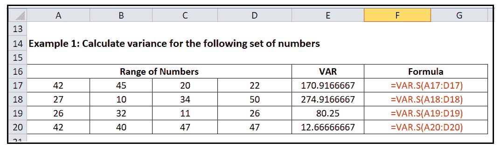
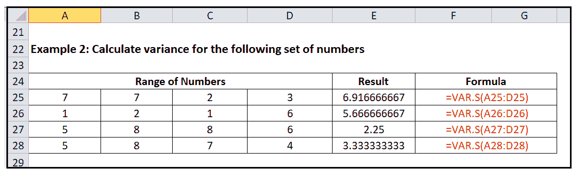

# Excel VAR。函数

> 原文:[https://www.javatpoint.com/excel-var_s-function](https://www.javatpoint.com/excel-var_s-function)

风险值。s()函数(也俗称 VARS 函数)是 Excel 中的一个统计函数。该函数的主要目的是帮助用户计算给定样本数据集的方差。现在，让我们看看这个函数的详细定义。

> 风险值。s()函数给出给定的一组值或一系列值的方差。它基本上是一个值偏离其平均值的平方和除以值的个数。它是标准差的平方，就像标准差一样，方差越小越好，因为它意味着数据没有那么不同。空白单元格、文本和错误值将被忽略。

虽然 VAR。s 将忽略作为单元格引用传递的文本和逻辑值，它将计算作为参数直接传递的逻辑值和数字值。简单来说，我们可以说，当它到达像 B2:B11 这样的范围时，这个函数将忽略真，但是当它作为参数传递时，它将考虑真。

风险值。s()函数直到 Excel 2010 版本才引入。在此之前，Excel 用户使用的是 VAR 函数。风险值。s 函数是 VAR 函数的升级版；因此，没有太大的区别。如果你想计算整个人口的方差，那就用 Excel 的 VAR。p 函数(也俗称 VARP)。这两种功能的工作方式相同。

#### 注:风险值。函数忽略空白、文本、错误和非数值，包括布尔值。

### 句法

=VAR.S([number1],[number2] and so on..)

### 参数

*   **数字 1(必选):**此参数表示计算方差的第一个数字或引用。第一个数字是强制性的。
*   **【数字 2】等等..(可选):**要查找差异的数字。在 VAR 中。函数，这些数字可以作为单个数字、单元格引用、范围、数组来提供。

#### 注意:您最多可以为风险值提供 254 个参数或数组。s 函数。

### 关于风险价值需要了解的重要事实。S

1.  风险值。s()函数将给定的参数视为数据集的样本，而不是整个总体。如果你想计算整个人口的方差，使用 Excel VAR。p 函数。
2.  风险值。函数只考虑引用中的数字，忽略空白单元格、文本、错误和布尔值，如真或假。
3.  传递的参数可以包含数字或名称、数组或包含数字的单元格引用。
4.  参数可以是硬编码值，而不是单元格引用。
5.  如果要计算单元格引用中的逻辑值(真或假)和/或文本，请使用 Excel VARA()函数。

### 例子

**例 1:计算以下一组数字的方差。**

| 数字范围 |
| forty-two | Forty-five | Twenty | Twenty-two |
| Twenty-seven | Ten | Thirty-four | Fifty |
| Twenty-six | Thirty-two | Eleven | Twenty-six |
| forty-two | Forty | Forty-seven | Forty-seven |

按照以下步骤计算上述一组数字的方差:

**第一步:**打开 Excel 工作表，粘贴上面的数据。

**步骤 2:** 插入另一行，名称为 VAR。

**步骤 3:** 应用风险值。在 numbers 参数中，传递数字的范围。只需选择列中的单元格，Excel 就会为您计算方差。

**第四步:**将公式拖到后面的列，会有如下输出。

#### 注意:使用标准电动汽车。s 函数来计算这些数字的标准差，然后用 SQRT 函数来计算方差的平方根——结果将是相同的

### 示例 2:计算以下一组数字的方差

| 数字范围 |
| seven | seven | Two | three |
| one | Two | one | six |
| five | eight | eight | six |
| five | eight | seven | four |

按照以下步骤计算上述一组数字的方差:

**第一步:**打开 Excel 工作表，粘贴上面的数据。

**步骤 2:** 插入另一行，名称为 VAR。

**步骤 3:** 应用风险值。在 numbers 参数中，传递数字的范围。只需选择列中的单元格，Excel 就会为您计算方差。

**第四步:**将公式拖到后面的列，会有如下输出。

## Var。函数错误

如果 Excel Var。函数返回任何错误，都有可能是因为以下任何一个原因:

*   #DIV/0！-如果您向变量提供的数值少于 2，则会出现此错误。函数。
*   #VALUE！-如果 Var 参数中提供的值。函数是不能转换成数字的文本值。

## 风险值的差异。P & VAR。轴功能

| S.NO | 有 p | 风险值。S |
| 1. | 风险值。p()函数帮助我们计算总体方差。 | 风险值。s()函数帮助我们计算样本方差。 |
| 2. | 只要数据值的范围表示整个总体，就可以使用此函数。 | 只要数据值的范围只描述了一个值的样本，而不是代表整个总体，就可以使用此函数。 |
| 3. | 在许多情况下，不可能收集整个人口的数据值，在这种情况下，我们通过使用风险值来使用人口样本的数据。s 函数。 | 当我们想要研究整个人口的数据时，这个函数。它对政府机构、各种调查等都很有用。, |

#### 注:风险值()和风险值。s()函数返回完全相同的输出，因此我们可以使用任一函数来计算给定数据集的样本方差。

* * *