# 电子邮件工作簿

> 原文:[https://www.javatpoint.com/email-workbook](https://www.javatpoint.com/email-workbook)

Excel 是最强大的电子表格软件之一，具有广泛的功能。我们经常使用 Excel 来组织我们的数据，无论是小数据集还是大数据集。当我们在任何团队项目中工作，并且需要向其他用户或经理发送工作簿时，电子邮件是最常见的方法。我们可以很容易地在工作完成后或在任何需要的时候通过电子邮件发送工作簿。

在给工作簿发邮件时，我们经常使用我们的电子邮件客户端(如 Gmail、雅虎、Outlook 等。)通过浏览器的网络应用。我们首先填写收件人的电子邮件地址，键入主题，创建电子邮件正文，使用文件资源管理器附加工作簿，然后发送它。这是通过电子邮件发送工作簿的传统方式。但是，在发送工作簿电子邮件时，还有一些其他方法更有帮助，也更节省时间。


在本文中，我们将讨论一些替代方法，以便将当前工作簿快速发送给特定的人。我们讨论每种特定方法的逐步教程，这将有助于我们更容易地理解整个过程。

## 如何通过 Excel 邮件发送工作簿？

Excel 具有广泛的内置功能。使用 Excel 功能的最大好处是，我们几乎可以以多种方式使用每一项功能。同样，它提供了几种通过电子邮件发送工作簿或以附件形式发送工作簿的方法。

以下是通过电子邮件发送所需工作簿的一些快速简便的方法:

*   使用保存和发送从 Excel 中通过电子邮件发送工作簿
*   使用 VBA 代码从 Excel 中通过电子邮件发送工作簿
*   使用快速访问工具栏中的快捷方式向工作簿发送电子邮件

在使用上述任何方法之前，我们需要在设备上配置一个电子邮件客户端，并将其设置为默认电子邮件客户端。在本文中，我们使用了微软的电子邮件客户端 Outlook，默认情况下，它在 Windows 设备中可以找到。

现在让我们详细讨论每种方法:

### 方法 1:使用保存和发送从 Excel 中通过电子邮件发送工作簿

Excel 中的“保存并发送”命令是从 Excel 中通过电子邮件发送工作簿的常用方法。Excel 允许我们使用默认的电子邮件客户端以附件、PDF、XPS 或传真的形式快速发送整个工作簿。

我们需要执行以下步骤，使用 Excel 中的“保存并发送”命令通过电子邮件发送工作簿:

*   首先，我们需要打开一个我们希望通过电子邮件发送给某人的工作簿。
*   接下来，我们需要点击**文件**选项卡，选择**选项【保存&发送】。**
    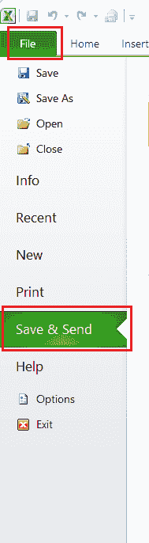
    它将进一步显示其他共享选项。我们需要点击选项**‘使用电子邮件发送’，**如下图所示:
    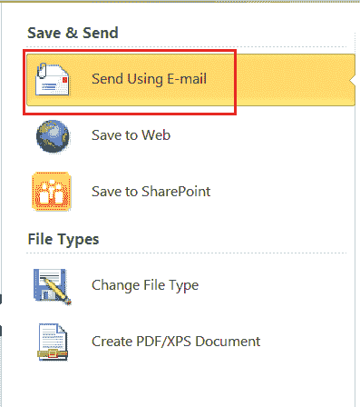
    上图取自 Excel 2010。对于 Excel 2007，我们必须点击**办公按钮**，然后点击**发送**按钮。
    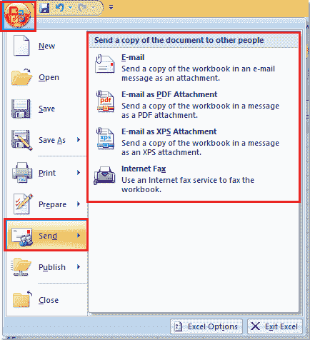
    在 Excel 2013 及以上版本中，我们需要转到**文件>共享>邮件。**
    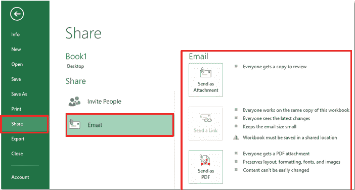
*   在下一个窗口中，我们将获得相关选项，如下图所示:
    由于我们想通过电子邮件将工作簿发送给其他人，我们需要选择显示**“作为附件发送”的块。**
    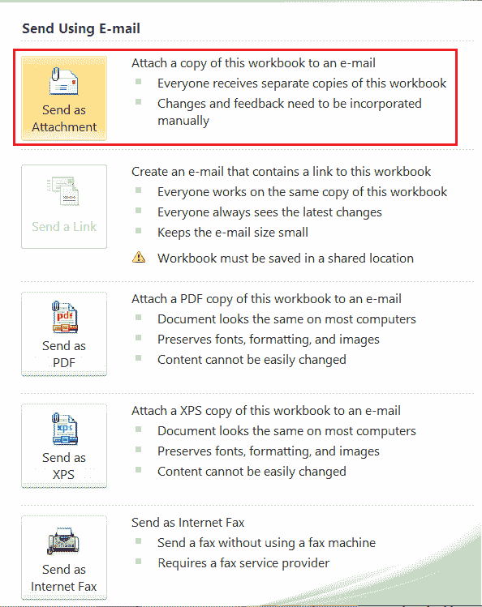
*   完成上一步后，Excel 将启动一个 Outlook 窗口。使用 Outlook 窗口，我们可以在文本**【To】**和**【Cc】旁边的框中指定收件人姓名。**同样，我们可以输入任何想要的主题，在介绍框中输入一些信息。工作簿将自动附加到其上。
    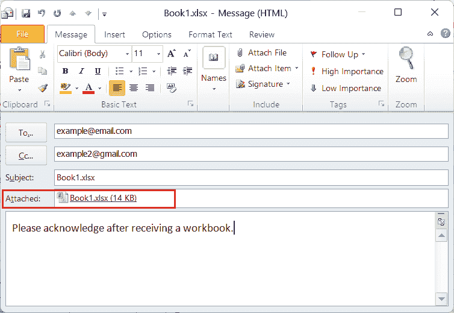
*   输入所有需要的详细信息后，我们必须点击**发送**按钮，通过电子邮件向选定的收件人发送附件工作簿和消息。

这样，我们可以在不离开 MS Excel 的情况下通过电子邮件发送当前工作簿。

### 方法 2:使用 VBA 代码在 Excel 中通过电子邮件发送工作簿

VBA 是 Excel 的强大元素之一。它允许我们使用 Excel 中的编码来使用各种高级工具和选项。这样，我们可以使用一些特定的代码将当前工作簿作为附件发送

我们需要执行以下步骤，使用 Excel 中的 VBA 代码通过 Outlook 将当前工作簿作为附件发送:

*   首先，我们需要打开一个要通过电子邮件发送的工作簿。
*   接下来，我们需要打开 Microsoft Visual Basic 编辑器来插入要运行的代码。为此，我们需要使用快捷键 **Alt + F11。**按下快捷键后，我们将获得应用程序窗口的 VBA，如下图所示:
*   我们需要在应用程序窗口中单击 VBA 的插入选项卡，并选择**“模块”**选项。
    T3】
*   完成上一步后，我们将看到 VBA 编辑器窗口，我们必须在其中粘贴以下代码:

```

Sub SendWorkBook()
'Update 20131209
Dim OutlookApp As Object
Dim OutlookMail As Object
Set OutlookApp = CreateObject("Outlook.Application")
Set OutlookMail = OutlookApp.CreateItem(0)
On Error Resume Next
              With OutlookMail
    .To = "example@email.com"
    .CC = ""
    .BCC = ""
    .Subject = "Excel Workbook"
    .Body = "Please acknowledge after receiving the workbook"
    .Attachments.Add Application.ActiveWorkbook.FullName
    .Send
End With
Set OutlookMail = Nothing
Set OutlookApp = Nothing
End Sub

```

上面的代码如下图所示:

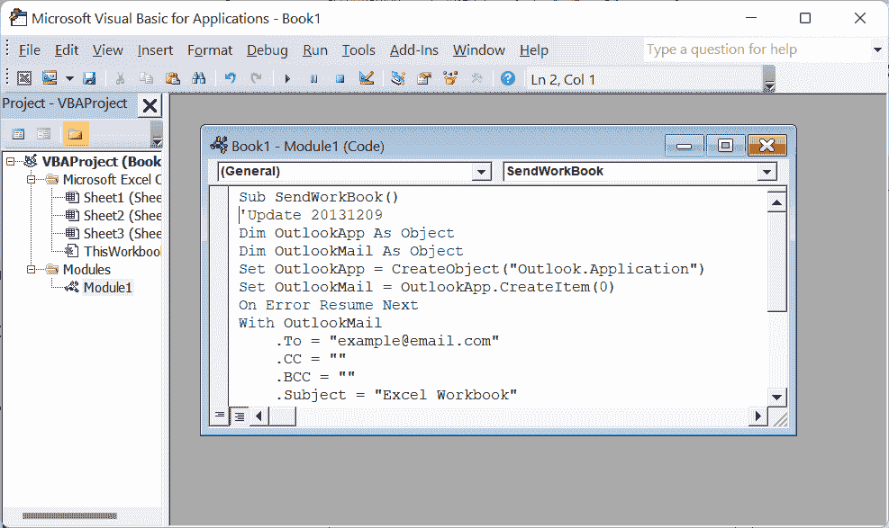

在上面的代码中，我们可以相应地更改下面的行。

*。To = " [【邮件保护】](/cdn-cgi/l/email-protection) "*

*。CC = "*

*。BCC = "*

*。主题=“Excel 工作簿”*

*。Body =“收到工作簿后请确认”*

*   复制并修改代码后，我们需要运行该代码来通过电子邮件发送当前工作簿。我们必须按键盘上的 F5 键，这将立即运行我们在编辑器中复制的代码。只要我们运行代码，Outlook 就会再次要求确认。我们必须单击“允许”按钮，将当前工作簿通过电子邮件发送给代码中指定的收件人。
    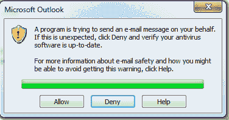

这样，我们可以使用 VBA 代码通过电子邮件发送当前工作簿，而无需离开微软 Excel。

### 方法 3:使用快速访问工具栏中的快捷方式向工作簿发送电子邮件

快速访问工具栏是 Excel 的有用功能之一。它可以用来添加所需的 Excel 功能，无论何时需要，都可以以最快的方式使用。因此，我们可以在 QAT 上添加一个快捷方式，只需点击几下鼠标即可将当前工作簿发送给所需的收件人。

我们只需要添加一次快捷方式，就可以根据需要立即使用多次，而无需一次又一次地添加快捷方式。要在 QAT 上添加通过电子邮件发送工作簿的快捷方式，我们需要使用以下步骤:

*   首先，我们需要在 Excel 窗口内的任意选项卡上按下右键按钮，然后点击**“自定义快速访问工具栏”**选项。
    T3】
*   我们需要在下一个窗口的“选择命令来源”下拉菜单下选择**“所有命令”**选项。
    T3】
*   我们需要找到名为**【发送给邮件收件人】**的选项，如下所示:
    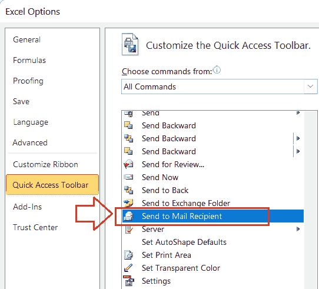
*   通过选择“发送给邮件收件人”选项，我们需要点击**添加**按钮。一旦选项被添加到右侧框中，我们必须单击**确定**按钮来应用首选项。
    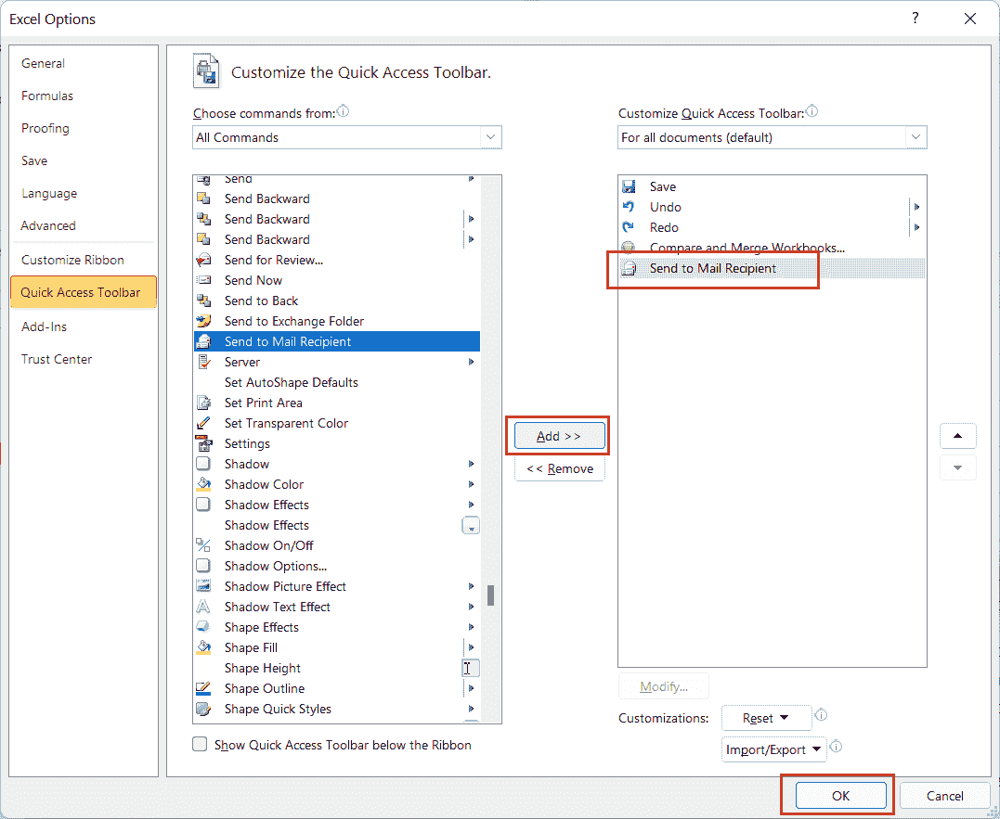
*   按照前面的步骤，我们将在快速访问工具栏上获得一个新的快捷方式。会是这样的:
    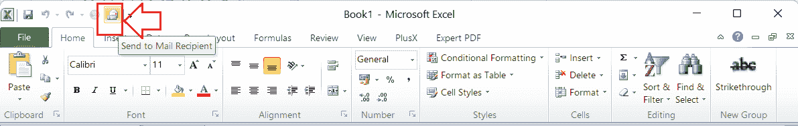

以上快捷方式主要帮助在 Excel 中执行以下任务:

*   在电子邮件正文中发送工作表的一部分。
*   将单个 Excel 工作表作为电子邮件附件发送。
*   将整个工作簿作为电子邮件附件发送。

一旦快捷方式被添加到 QAT 中，方法的主要部分(通过电子邮件发送工作簿)就开始了。现在让我们了解如何使用我们添加的快捷方式发送整个工作簿:

*   首先，我们需要打开一个想要通过电子邮件发送的特定工作簿。
*   接下来，我们必须从快速访问工具栏中单击快捷方式**“发送给邮件收件人”**。
    T3】
*   在打开的下一个窗口中，我们必须选择与选项**“将整个工作簿作为附件发送”相关联的单选按钮。**选择相应的单选按钮后，我们需要点击**确定**按钮。
    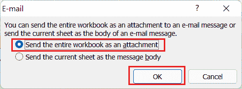
    我们可以在发送工作簿中的任何特定工作表或工作表的某些特定部分时，选择上图中的其他选项。
*   完成上一步后，Excel 将在默认电子邮件客户端(在我们的例子中是 Outlook)中创建新的空白邮件，并将当前工作簿附加到该邮件中。它看起来像这样:
    
    在上图中，我们需要指定收件人的电子邮件地址，我们希望向他们发送相应的工作簿。
*   填写完所有详细信息后，我们必须单击“发送”按钮，通过电子邮件将工作簿发送给选定的收件人。
    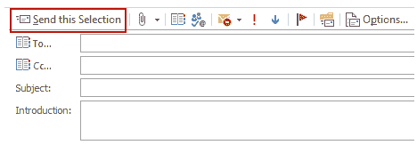

需要注意的是，只有在我们的设备上配置了默认电子邮件客户端后，才会显示“发送”按钮。这样，我们可以使用 QAT 中的快捷方式通过电子邮件发送当前工作簿，而无需离开 MS Excel。

## 需要记住的重要事情

*   必须在设备中配置电子邮件客户端，以便直接从 Excel 发送当前工作簿。
*   需要 Internet 连接才能通过电子邮件将工作簿发送给所需的收件人。
*   建议在通过电子邮件发送工作簿之前，始终仔细检查收件人的地址。这样，我们就可以消除重要数据到达不需要的人手中的可能性。
*   通过 Outlook 窗口发送工作簿后，它会自动关闭。因此，建议进入 Outlook 并检查发送的邮件，以确保电子邮件已成功发送。

* * *