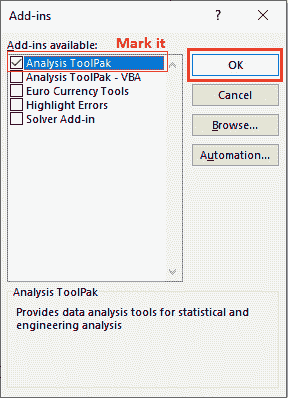

# Excel 中的相关性

> 原文：<https://www.javatpoint.com/correlation-in-excel>

在 MS Excel 中，计算相关系数可以发现两个变量之间的关联有多强。相关系数值介于 1 和-1 之间。它基本上衡量两个变量之间的线性关系，并显示它们的关系强度。

在这一章中，我们将使用微软 Excel 软件来寻找一组 Excel 数据的相关系数。这将有助于 Excel 用户明确相关性的概念及其用法。

## 相关性是如何工作的？

相关系数 1 表示**正相关。**表示如果变量 X 增加，变量 Y 也会增加。同样，如果变量 X 减少，Y 也会减少。

同样，相关系数-1 指的是**负相关。**好像变量 X 增加，变量 Z 也会减少。同样，如果变量 X 减少，Z 也会增加。

## 相关分析

你可以分析变量之间的相关性，发现是强相关还是弱相关。对于强关联和弱关联，我们有几个现实生活中的关联示例。

### 强相关

这些是强相关性的例子，比如-

*   正相关——你的体重和你摄入的热量。
*   负相关——你的取暖费和外面的温度。

所以，在这两种情况下，两个变量都是强关联的。

## 弱相关性

这些是弱相关或无相关的例子，例如-

*   你的宠物狗和它喜欢的食物。
*   你的发色和身高。

您可以看到，在这两种情况下，变量之间没有关系或弱关系。

## 寻找相关性的 Excel 方法

Excel 支持两种不同的方法来查找两个变量之间的相关系数。他们彼此完全不同，他们的过程也完全不同。

1.  通过使用 CORREL 函数
2.  使用分析工具箱外接程序

## 使用 CORREL 函数

CORREL()是 Excel 中可用的函数，有助于找到两个变量或一组数据之间的相关系数。可以直接对 Excel 数据应用 CORREL 函数，计算变量之间的相关系数。

**语法**

这个函数接受两个数组参数，这是一个数据范围来寻找相关性。

```

CORREL(array1, array2)

```

两者都是必需的参数。

### 例子

**例如**我们在两列(A 和 B)中有一个数据列表，我们将为其计算相关系数。


**第一步:**为此，选择一个空单元格写入公式，并在其中输入该公式-

=CORREL(A2:A6，B2:B6)


这里，A2:A6 和 B2:B6 是我们比较的两个变量列表。

**第二步:**现在，点击**进入**键，得到计算出的相关系数结果，见截图。


计算的相关性接近 1。

**第三步:**如果想直观查看相关系数，插入折线图。


如果相关性接近 0，则表示没有相关性。但在这里，返回的相关结果接近 1。因此，变量是强关联的。

## 使用分析工具箱外接程序

此外，还有一种方法可以找出相关系数。分析工具箱允许用户计算多个变量之间的相关系数。借助分析工具库插件，可以方便快捷地找到相关系数。

要了解相关系数是如何计算的，请按照下面给出的步骤操作:

**第一步:**我们取了以下数据，对于这些数据，我们将通过求相关系数来计算它们之间的关系。


**第二步:**这个方法首先要去**数据**页签，在分析组里面可以找到**数据分析**。


**第三步:**点击这里的**数据分析**选项，将打开数据分析面板。


**第 4 步:**从分析工具列表中选择**相关性**，点击**确定。**


**第五步:**一个关联面板会这样打开-


**第 6 步:**在该面板中，选择以下选项-

1.  在该面板中，点击**输入范围**字段，选择要查找关系的数据范围。
    T3】
2.  选择**行**或**列**单选按钮进行选项分组。我们保留了默认值，即“列”单选按钮。
    
3.  现在，如果您的数据包含标签，请选中第一行中的**标签复选框。
    T3】**
4.  在输出选项中，根据您的数据需求选择其中一个单选按钮。
    我们选择了**输出范围**，并提供了输出将放置的单元格参考。
    

**第七步:**在该面板中设置好所有内容后，点击这里的**确定**按钮。


**步骤 8:** 分析范围将显示在您上面指定的范围内。


现在，您可以插入折线图，直观地查看相关系数分析。


### 分析工具箱加载项在 Excel 功能区中不可用

如果在 Excel 功能区的任何地方都找不到“分析工具箱”加载项选项，这意味着它不会添加到那里。您可以手动添加它，因为它是隐藏的。分析工具箱是 Excel 的高级功能。因此，它可能在 Excel 功能区中不可用。

默认情况下，下载时不会在 Excel 中添加。您必须显式添加到 Excel 中。您可以从加载项添加分析。请按照以下步骤操作:

**步骤 1:** 右键单击 Excel 功能区任意位置，从列表中选择**自定义功能区**。


**步骤 2:** 转到该 Excel 选项面板左侧的**加载项**选项卡。


**第 3 步:**点击【管理 Excel 加载项】旁边的**转到**按钮。


**第 4 步:**在这里，标记**分析工具箱**并点击**确定**将其添加到 Excel 功能区。



您选择的分析工具箱将添加到数据选项卡内的 Excel 功能区。你可以在那里找到它。

**步骤 5:** 现在，转到数据选项卡，从中可以找到数据分析选项，并执行上述步骤。


## 要点

有一些关键点用户应该知道。

1.  计算相关系数是一个耗时的过程。但是如果你使用像微软 Excel 这样的软件，你可以节省时间和精力，也可以使计算变得容易。
2.  它显示了两个变量是如何紧密相关的。它可以用于统计、经济和商业计划。
3.  如果返回的系数值为 0，则表明没有线性关系。
4.  0、1 和-1 之间的相关系数值代表弱、强和中等关系。

* * *