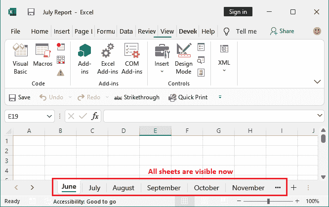

# excel 工作簿默认有多少张？

> 原文：<https://www.javatpoint.com/how-many-sheets-are-there-in-excel-workbook-by-default>

最初，Excel 用户打开 MS Excel 软件时，Excel 2016 中默认有**一张工作表**。此工作表名为工作表 1。但是，用户可以在名为 Sheet2、Sheet3 等的 Excel 工作簿中添加更多工作表。

> 在 Excel 2013 和早期版本的 Excel 中，默认工作表为 3。

Excel 工作表名称最初并不提供信息。Excel 允许用户重命名工作表名称，并根据它们包含的数据提供这些名称。借助有意义的名字，你可以很容易地接触到你的数据。

在本章中，我们将尝试为 Excel 工作表提供所有有用的信息。我们还将详细说明与工作表相关的操作。

### Excel 工作表上的操作

我们使用的是 Excel 2016 版本。Excel 允许其用户提供选项来更改工作表的默认设置。可以对 Excel 工作表执行多种操作，如添加、删除、重命名、分组和取消分组工作表。

*   [重命名 Excel 工作表](#Rename)
*   [添加更多工作表](#Add-more)
*   [删除 Excel 工作表](#Delete)
*   [设置默认工作表数](#Set)
*   [分组和取消分组工作表](#Group-Ungroup)
*   [隐藏和取消隐藏工作表](#Hide-unhide)

我们将尝试解释执行这些操作的最简单方法。除了这些方法，您还可以找到其他方法和方式来执行以下操作。你可以喜欢你觉得容易的任何东西。

## 重命名 Excel 工作表

创建新工作表时，会附带名为 Sheet1、Sheet2、Sheet3 等的默认工作表。这些默认名称信息不足，难以直接接触到数据。

为了解决这个问题，Excel 允许其用户根据包含的数据重命名工作表名称。因此，无需查找每个工作表数据，就可以在很短的时间内轻松访问您的数据。

以下是重命名工作表名称的简单步骤-

**第 1 步:**在当前工作簿中，转到底部的工作表面板，您将找到该工作簿的所有工作表。


**步骤 2:** 双击其中一个工作表名称进行编辑，然后按退格键为其提供新名称。例如，Sheet1。


**第三步:**点击表单上的任意位置，保留新名称。你会看到名字已经从第一张**改成了一月**。


通过遵循相同的方法，您可以更改其他工作表的名称，并根据它们包含的数据给予它们。

重命名工作表是一项非常简单的任务，它对查找目标工作表数据非常有帮助。

## 添加更多工作表

Excel 工作簿附带了 Excel 提供的一些默认工作表。这些默认工作表可以是一个或多个。Excel 不仅限于此。它使用户能够根据需要添加更多的工作表。

Excel 允许在一个工作簿中插入大约 255 个工作表。我们建议您不要使用超过 12 张工作表，因为文件会变得很重，处理速度也会降低。

以下是在工作簿中插入新工作表的步骤-

**步骤 1:** 打开目标工作簿，在其中插入新的工作簿。您将在工作表状态栏上看到一个圆形的 **+** 符号。


**第二步:**点击此加号插入新工作表。


**第三步:**一旦点击插入按钮(+)，新的工作表将添加到工作簿中，如下所示。


您在这里注意到一件事，一个新的工作表(工作表 4)被插入到工作表 1 和工作表 2 之间，因为在插入新工作表时，您在工作表 1 上是活动的。

如果需要，可以更改工作表的位置并移动它们。

**改变工作表位置**

要更改工作表位置，可以移动工作表。

**第四步:**只需将鼠标控制保持在目标工作表(Sheet4)上，并将其移动到您想要放置它的方向(左或右)。


**第五步:**将鼠标放在想要保留目标工作表的位置。我们已将第 4 张放在第 2 张之后。


## 删除 Excel 工作表

有时，您不再需要 Excel 文件中的工作表。因此，Excel 允许将其从工作簿中删除。没有任何用处，你不需要保存它。您可以从工作簿中永久删除工作表，释放存储空间并减小文件大小。

小心，不要混淆工作表和工作簿，因为它们是不同的。工作簿是一个 Excel 文件，其中包含一个或多个工作表。

以下是从工作簿中删除现有工作表的步骤-

**第一步:**打开要删除工作表的目标 Excel 工作簿(文件)。您会发现工作簿状态栏中添加了一堆工作表，如下所示-


**步骤 2:** 右键单击要删除的工作表。将出现不同选项的列表，其中选择**删除**选项。


这将从此活动工作簿中永久删除选定的工作表。

**第三步:**在给定的截图中，可以看到 Sheet4 已经被删除，这里不再显示。


删除工作表可能会影响同一工作簿中的其他工作表，如果这些数据直接或间接依赖于该工作表的话。因此，在删除任何工作表时要小心，并确保在删除之前。

## 设置默认工作表数

默认情况下，每当您打开或创建新的 Excel 工作簿时，Excel 中都有三个工作表。您也可以从 Excel 高级选项中进行更改。这意味着您可以设置工作簿中最初有多少工作表。

在**通用**选项里面，你会发现一个选项“**包含这多张**”。您可以将其更改为 1 到 255 之间。

**第一步:**首先打开 MS Excel，新建一个工作簿。默认情况下，您最初会在此工作簿中找到一个工作表。


**第二步:**在 MS Excel 中，转到**文件** > **更多** > **选项**。


**第三步:**选择面板左侧的**通用**选项，会看到“包含这么多张”。


**第四步:**在这里，设置每次打开 MS Excel 或新建工作簿时需要的张数。

我们在这里设置了 4，在创建新工作簿时设置为默认，点击**确定**。


**第五步:**关闭 MS Excel，重新打开创建新工作簿。这次您将看到新工作簿中有四个工作表。


## 将工作表分组和取消分组

分组是 Excel 的一个有趣功能，如果您想在多个工作表中执行相同的操作，分组有助于节省时间和精力。您可以将所有要执行相同操作的工作表分组在一起。完成任务后，您可以再次取消它们的分组。

一个工作表中的任何更改都会反映在分组工作表的所有其他工作表中。按照给定的步骤对 Excel 工作表进行分组和取消分组。

**将纸张分组**

我们以一个包含四张工作表的 Excel 工作簿为例。


**第一步:**要将 Excel 工作簿中的工作表分组，请按住 **Ctrl** 键逐个选择要分组的工作表。


我们已经使用 Ctrl 键选择了第 1 张、第 3 张和第 4 张。因此，三张纸被组合在一起。


**提示:**按住 **Shift** 键，多张纸可以一次组合在一起。

**步骤 2:** 任何一个分组表中的任何变化都会反映在其他表中。**例如，**我们在 Sheet4 内部的 F5 单元格中输入了一个简单的文本“**欢迎使用**”。


我们在第三张纸上写道。

**第 3 步:**现在，移至其他纸张(sheet 1)；该文本也将自动反映在 Sheet1 的 F5 单元格中，因为它与 Sheet4 组合在一起。


**第四步:**但是如果你看到 Sheet2 的 F5 单元格没有分组，你将不会在其中找到文本。因为 Sheet2 没有分组。


**取消纸张分组**

要取消 Excel 工作表的分组，用户不需要付出太多努力。单击状态栏中未分组的工作表，或者按照我们下面描述的步骤操作:

**步骤 5:** 右键单击工作表状态栏中的一个分组工作表，并从列表中选择**取消工作表分组**选项。


**第 6 步:**本工作簿中所有分组的工作表将立即取消分组。


## 隐藏和取消隐藏工作表

隐藏和取消隐藏是微软 Excel 的一个有趣的概念。如果您不想删除工作表，但又不想在不需要时不必要地显示工作表，这将非常有帮助。

您可以隐藏 Excel 工作表，而不是删除它。它暂时隐藏在工作簿中。当您再次需要时，也可以将其取消隐藏。请参阅隐藏和取消隐藏一个或多个 Excel 工作簿工作表的步骤。

**隐藏工作表**

我们以包含四张工作表的 Excel 工作簿为例。

**第一步:**右键点击想要隐藏的目标工作表，从工作表中选择**隐藏**选项。


我们已选择隐藏 Sheet2。

**第二步:**工作表将立即从工作簿中隐藏，在此工作簿中不再可见，但也不会被删除。


按照隐藏工作表的相同步骤，可以隐藏任意数量的工作表。

**取消隐藏隐藏的工作表**

要取消隐藏工作表，请按照下面给出的步骤操作:

**步骤 1:** 右键单击 Excel 工作簿状态栏中的工作表标签，从列表中选择**取消隐藏**选项。


**第二步:**将打开一个取消隐藏面板，选择要取消隐藏的工作表，点击**确定**。


**步骤 3:** 请注意，我们在前面步骤中隐藏的选定工作表(Sheet2)现在可见。


如果将隐藏多个，可以使用此方法。但是这一次，只有一个工作表被隐藏，因为您必须一个接一个地选择工作表来取消对它们的保护。

**提示:** Shift/Ctrl + Click 在这里不适用多选。

当您想要取消隐藏特定工作表而不是全部工作表时，此方法效果很好。

**一次取消隐藏所有隐藏的工作表**

上面指定的方法来逐个取消隐藏所有隐藏的工作表。因此，我们有另一种方法(即使用 VBA 代码)来一次取消隐藏所有隐藏的工作表。这个方法和上面的完全不同。

您必须在 Excel visual studio 中编写一个小的 VBA 代码，并将其作为宏运行，以取消隐藏所有隐藏的工作表。看看这个方法和 VBA 代码是如何工作的

**第一步:**取一个有一些隐藏工作表的 Excel 工作簿。看到那里有多张纸，但有些是隐藏的。


**第二步:**现在，进入**开发者**选项卡，点击这里的**宏**选项，创建一个新的宏。


**第三步:**命名宏名，即**取消隐藏**并点击此处**创建**按钮。


**步骤 4:** 使用一些默认语法或 VBA 初始代码自动创建一个模块。


**第五步:**现在，在 Excel visual studio 提供的默认代码里面写下下面两行代码，点击**运行**按钮，运行写好的 VBA 代码。


```
Dim sheet As Worksheet
For Each sheet In Worksheets: sheet.Visible = True: Next sheet 

```


**第 6 步:**将打开一个宏窗口，选择您创建的要取消隐藏工作表的宏，然后单击**运行**。


**第七步:**一旦你仔细完成了所有的步骤，你所有隐藏的工作表都会被取消隐藏。请参见 Excel 工作表状态栏中的所有工作表现在都可见。



关闭 Excel visual studio 窗口，使用所需的工作表。通过执行这些步骤，您可以一次取消隐藏 Excel 工作簿中的所有隐藏工作表。

* * *