# 什么是 Excel 中的 Mod 函数

> 原文：<https://www.javatpoint.com/what-is-mod-function-in-excel>

在 Excel 中，MOD 函数是一个**内置函数。** MOD 功能被归类为**数学/触发功能。**在 Excel 中，可以作为**工作表函数(WS)使用。**和工作表函数一样，MOD 函数可以作为公式的一部分输入到工作表单元格中。

Excel 中的 MOD 函数用于计算一个数除以另一个数(除数)后的余数。这种运算在数学上被称为**模运算**或**模**，因此得名 MOD。

### 句法

以下是 MOD 函数的语法:

```

=MOD(number,divisor)

```

### 参数或参数

以下是 MOD 函数的参数:

1.  数字
2.  除数

**号**

一个我们需要求余数的数。

除数

这是一个我们想要用来除数的数。

## Excel 中 MOD 函数需要了解的重要内容

关于 Excel 中的 MOD 函数，以下是我们必须了解的重要内容:

1.  MOD 函数的结果具有与除数相同的符号**。**
***   MOD 函数返回 **#DIV/0！**错误，如果除数是 **0** 因为我们不能除以**零。***   MOD 函数返回 **#VALUE！**如果数字或除数是**文本值，则出现错误。****

 **## 如何在 Excel 中使用 MOD 函数？

MOD 功能真的很好用。让我们看一些如何在 Excel 中利用 MOD 函数的例子。

**例 1:** 考虑数字 **n=4** 和 **d=3。**使用 MOD 功能:

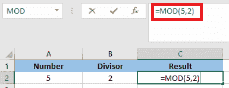

应用公式后，结果将是:

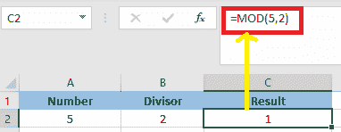

**MOD** 功能返回 **1** ，因为 **2** 进入 **5** 一次，剩余的 **1。**

**例 2:** 在这个例子中，我们必须从除法中得到余数。

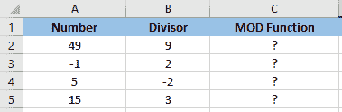

我们将应用 **MOD** 功能。

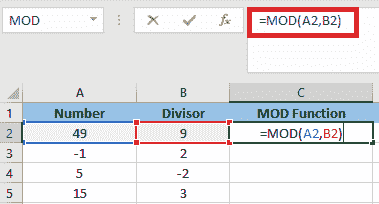

应用 **MOD** 功能后，结果将是:

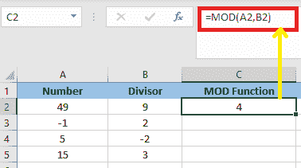

现在，为了得到剩余值的结果，我们将拖放公式，将得到以下结果:

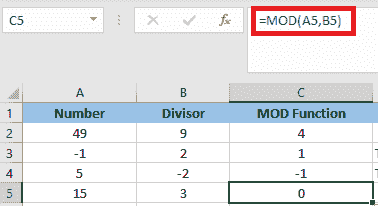

### 示例 3:仅添加给定数据集中的偶数:

在这个例子中，我们只需要使用 **mod** 函数将数据集中的偶数相加。

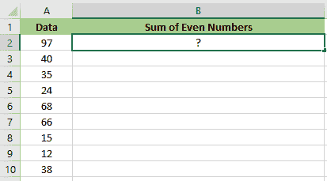

我们将使用下面的公式在上面给定的数据集中添加偶数值:

```

=SUMPRODUCT($A2:A10*(MOD($A$2:10$A$10,2)=0))

```

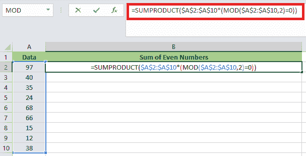

在偶数的情况下， **(MOD($A$2:$A$10，2)=0)** 返回一组**真值，**的 **SUMPRODUCT** 函数只添加那些返回**真值的数字。**

应用公式后，结果将是:

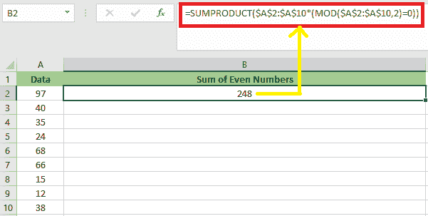

### 示例 4:仅添加给定数据集中的奇数:

在这个例子中，我们只需要使用 **mod** 函数将数据集中的奇数相加。

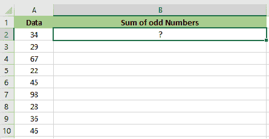

为了在上面给定的数据集中添加奇数，我们必须使用下面的公式。

```

=SUMPRODUCT($A$2:$A$10*(MOD($A$2:$A$10,2)=1))

```

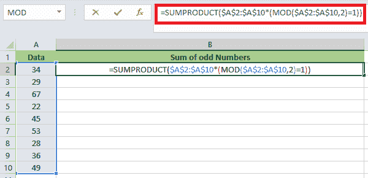

在奇数情况下， **(MOD($A$2:$A$A10，2)=1)** 返回一组**真值，**的 **SUMPRODUCT** 函数只将那些返回**真值的数字相加。**

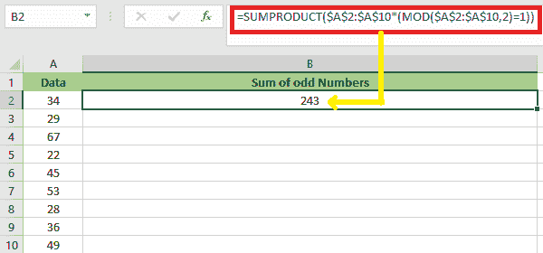

因此，该公式通过使用 **MOD** 函数计算余数来工作。

* * ***