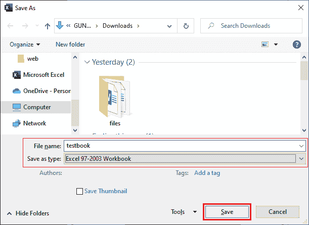

# Excel 中的兼容模式

> 原文:[https://www.javatpoint.com/compatibility-mode-in-excel](https://www.javatpoint.com/compatibility-mode-in-excel)

**兼容模式**是 Excel 文件的查看模式。兼容模式下的 Excel 文档在所有版本的 Excel(旧版本和新版本)中均可查看。到目前为止，Excel 已经发布了几个版本。在新版本中创建的文档可能与旧版本的 Excel 不兼容。这取决于存储在该 Excel 工作簿中的数据。

**例如**，在 Excel 2016 中实现的一个功能在 Excel 2013 中兼容性不够，不会正确显示数据。

本章包含兼容性模式的所有基本信息，以及使用屏幕截图逐步解释的示例。

### 兼容性问题

当您将 Excel 文件保存为旧格式后，它会以兼容模式运行。如果您的 Excel 软件已升级到更新版本的 Excel，您也可能会面临此兼容性问题。但是您创建的文件没有升级。

您可以运行兼容性检查器来查找先前为升级软件创建的文件中没有的功能。因此，您可以在与其他用户共享之前解决它。

## Excel 文件兼容模式的属性

1.  如果 Excel 文件处于兼容模式，您可以使用新版 Excel 提供的任何新功能。
2.  如果要使用 Excel 的所有功能，必须通过将 Excel 文件格式更改为当前应用程序版本，将文件从兼容模式转换为正常模式。

## 以兼容模式保存文档

Excel 允许其用户以兼容模式保存文档。当您为旧版 Excel 保存文档时，兼容模式适用于文件。创建文档时，您可以进入兼容模式，尤其是对于文档。

要以兼容模式保存 Excel 文档，请执行以下步骤:

**第一步:**创建一个文档，学习如何在兼容模式下保存。

**第二步:**转到**文件**，然后点击**另存为**选项。

保存 Excel 文件的默认格式是。如果你只是保存文件。

**第三步:**在电脑上选择一个文件夹保存这个 Excel 文件。

下一步是选择旧版本格式(。xls)以兼容模式保存文件。

**第四步:**点击**另存为类型**下拉列表，从下拉列表中选择 **Excel 97-2003 工作簿**文件格式。

**第五步:**提供该文件的名称，点击**保存**按钮。

此 Excel 文件已在兼容模式下成功保存。

## 检查文档是否处于兼容模式

当您将 Excel 文件保存为旧格式后，它会以兼容模式运行。Excel 用户可以很容易地发现一个 Excel 文档是否处于其 Excel 软件的兼容模式。打开 Excel 文件时，Excel 文件顶部的文档名称会是这样的: **filename.xls【兼容模式】**。

请注意，以下文档处于兼容模式，其名称显示为**测试本【兼容模式】- Excel** 。

这是我们在前面步骤中创建的文档。

## 找到 Excel 文档的兼容模式

假设您从其他人那里收到了一个 Excel 文档，您可能不知道它是在哪个版本的 Excel 中创建的。通过仅仅看到一个 Excel 文档，用户不能发现一个 Excel 文档正在使用哪种兼容模式。Excel 提供了兼容性检查器来检查文档的兼容性模式。

运行此兼容性检查器来检查您打开的文档使用的兼容模式。当你收到别人的文件时，这很有帮助。

按照以下步骤查找 Excel 文档的兼容模式:

**第一步:**首先打开已经处于兼容模式的 Excel 文档。我们的文档已经处于兼容模式。

**第二步:**现在，点击**文件**选项，然后点击 Excel 后屏幕左侧的**信息**选项卡。

**步骤 3:** 点击**检查问题**下拉按钮，然后从该列表中选择**选择兼容性**选项。

**第 4 步:**您将返回到您的文档，在这里，要么将您的文档转换为早期版本的 Excel，要么以相同的格式使用。

请查看您现在用于本文档的兼容模式。

## 离开 Excel 文档的兼容模式

当 Excel 文档处于兼容模式时，您可能无法访问该工作簿中 Excel 的所有功能。因此，要使工作簿完全正常工作，可以将兼容模式保留为正常模式。这将有助于用户获得功能齐全且可访问的 Excel 文件。

在退出兼容模式之前，您应该注意以下几点:

*   用户可以离开兼容模式，或者您可以说将文件从兼容模式转换为正常模式。
*   通过退出兼容模式，您可以根据当前版本的 Excel 为文件启用所有功能。
*   转换后，原始工作簿将被删除，无法恢复。

如果任何其他用户也在旧版本的 Excel 中使用该工作簿，请不要将文档从兼容模式转换。一旦用户离开兼容模式，它将永久更改为正常模式。因此，Excel 还会就此发出警告，指出文档在转换后可能会有所不同。

以下是退出兼容模式的步骤:

**第一步:**打开目标兼容模式 Excel 文件。我的目标 Excel 文件处于兼容模式。

**第二步:**现在，只需进入**文件**选项卡，点击 Excel 后屏幕左侧的**信息**。

**第三步:**点击**转换**兼容模式按钮，将文件临时更改为正常模式。

**第四步:**点击**确定**不做任何操作，你的文件将离开兼容模式。

**第五步:** Excel 会给你显示一条弹出消息，说明你的文件已经成功更改为当前文件格式。单击**是**重新打开工作簿以获取增强功能。

**第六步:**还可以看到**兼容模式**已经从文件名中删除。它现在可以在具有所有功能的新版 Excel 中运行。

按照以下步骤，可以退出兼容模式。

## 关闭兼容模式

有时，用户会面临一个新问题，即所有的 Excel 文档都是以兼容模式打开的。但是，它们没有为旧版本的 Excel 设计的所有文件。出现这种问题是因为 Excel 的默认设置可能设置为在兼容模式下使用旧版本的工作簿。

如果你也面临这种类型的问题，不用担心，这个问题是可以解决的。我们将逐步向您介绍:

**第一步:**打开 MS Excel 或打开已有的 Excel 文档。

**第二步:**点击**文件**菜单，导航到**更多…** 然后是**选项**选项在 Excel 后屏幕的左侧。

**步骤 3:** 将打开 Excel 选项窗口面板，转到该面板上的**保存**选项卡。

**第四步:**点击**旁边的下拉按钮，将文件保存为**格式，选择 **Excel 工作簿(。xlsx)** 格式来自列表。

**第五步:**最后点击**确定**保存本次改动。

您的文件现在将在当前版本的 Excel 中正常打开。

* * *