# 没有密码如何取消 Excel 工作表保护？

> 原文：<https://www.javatpoint.com/how-to-unprotect-excel-sheet-without-password>

Excel 用户在他们的 Excel 工作表中设置密码，以保护文件数据免受其他用户的攻击。当他们不希望其他用户未经其许可编辑数据和工作表结构时，他们会使用密码保护工作表。因此，任何不知道相应工作簿密码的用户都不能修改它。

要使受密码保护的工作表可编辑，需要在对工作表的数据或结构进行任何更改之前输入密码。如果用户不知道密码，他就做不到。本章将定义使用和不使用密码取消保护 Excel 工作表的方法。

## 受保护的工作表与受保护的工作簿

不要混淆受保护的工作表和受保护的工作簿。保护工作簿时，包含所有工作表的整个工作表都会受到保护。另一方面，当您保护工作表时，单个工作表将受到保护。

以下是在 Excel 工作表和 Excel 工作簿中可以执行和不能执行的一些操作。

### 受保护的工作表

*   当 Excel 工作表受到保护时，特定的工作表结构会被锁定。
*   当 Excel 工作表受到保护时，您不能输入、更新、修改和删除受保护工作表的数据。
*   如果用户想要对受保护的工作表数据进行更改，他们必须使用有效的密码取消对工作簿的保护才能执行这些操作。
*   但是，用户可以对同一工作簿上的其他工作表执行操作。
*   当工作簿受到保护时，用户可以添加、删除、移除、移动、隐藏、取消隐藏该工作簿中除受保护工作表以外的工作表。

### 受保护的工作簿

*   当工作簿受到保护时，工作簿结构被锁定。
*   您不能对该工作簿执行添加、删除、移除、移动、隐藏、取消隐藏等操作。
*   用户必须取消对工作簿的保护才能执行这些操作。
*   但是，当工作簿受到保护时，用户可以对工作表数据执行操作，如输入、删除、更新工作表数据。

## 无密码的无保护工作表

Excel 用户不会在受保护的工作表中写入内容。可以使用密码或不使用密码来保护工作表。他们必须取消对工作表的保护才能使其可编辑。如果不取消对工作表的保护，任何人都不能编辑它。

受密码保护的工作表在取消保护时需要密码。另一方面，没有密码保护的工作表不需要密码。我们将描述两种方法来取消对没有密码的工作表的保护。

下面我们讨论了这三种方法:

[方法 1:取消保护片](#Method1)

[方法二:取消密码保护工作表](#Method2)

[方法三:取消无密码的密码保护单](#Method3)

### 方法 1:取消对受保护工作表的保护

如果工作表在不使用密码的情况下受到保护，对用户来说将非常容易。这意味着工作表被锁定，但用户在保护它时没有使用密码。在这种情况下，任何 Excel 用户都可以在没有密码的情况下轻松取消工作表保护。他们只需要遵循一些简单的步骤，工作表就会不受保护。

> 没有密码保护的工作表在解除保护时不需要密码。

请参阅取消保护没有密码保护的工作表的步骤-

**第一步:**打开目标 Excel 文档，该文档中包含受保护的工作表。这里，Sheet2 是一个受保护的工作表。


**第二步:**如果您试图在此受保护的工作表中写入或修改某些内容，您将收到以下警告消息-

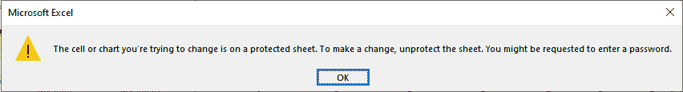

因此，我们必须取消对此工作表的保护，使其可编辑。

**步骤 3:** 在 Excel 功能区中，导航至**查看**选项卡。

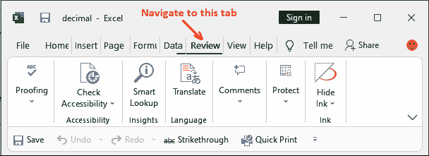

**第 4 步:**您将在保护组中看到**取消保护工作表**选项，该保护组是以前的保护工作表。点击此选项。

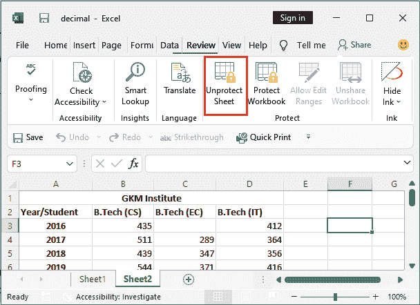

只有当工作表受到保护时，它才可见。

**提示:**如果一张纸没有被保护，您将找不到“未保护的纸”选项。你会发现它是保护表，而不是那个。

单击“取消工作表保护”选项后，当前工作表将不受保护。它不会在不受保护的情况下询问密码。

**第 5 步:**您现在可以在此工作表上编辑、删除、输入和修改数据。

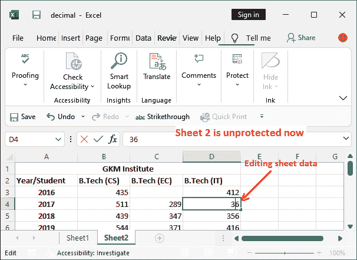

如果工作表有密码保护，它会询问保护工作表时使用的密码。

#### 注意:右键单击受保护的工作表，可以找到“取消工作表保护”选项。

### 方法 2:取消保护受密码保护的工作表

请参阅取消保护使用密码保护的工作表的步骤-

**第一步:**打开目标 Excel 文档，该文档中包含受保护的工作表。这一次，Sheet2 是受密码保护的工作表。


**第二步:**如果您试图在此受保护的工作表中写入或修改某些内容，您将收到以下警告消息-


因此，我们必须取消对此工作表的保护，使其可编辑。

**步骤 3:** 在 Excel 功能区中，导航至**查看**选项卡。


**第 4 步:**您将在保护组中看到**取消保护工作表**选项，该保护组是以前的保护工作表。点击此选项。


**第 5 步:**将打开一个弹出窗口，要求输入解除工作表保护的密码。输入保护纸张时使用的密码，点击**确定**。

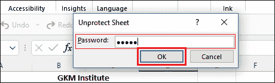

**步骤 6:** 当前工作表将不受保护。现在，您可以在此工作表上执行编辑、删除、输入和修改数据。

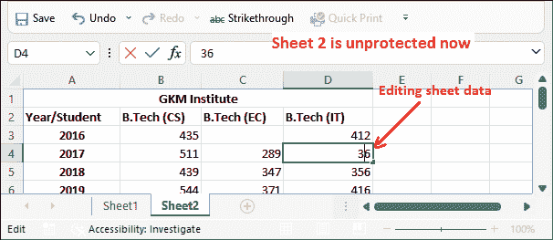

### 方法 3:取消对没有密码的受密码保护的工作表的保护

有时，用户在使用密码保护纸张后会忘记。他不知道密码。受保护的工作表不可编辑。因此，如果不采取保护措施，用户就无法修改其数据。没有办法使用忘记密码来恢复密码。Excel 没有提供这样的方法。在那种情况下，该怎么办。

Excel 提供了其他方法来取消对没有密码的受密码保护的工作表的保护，而不是忘记密码方法。

**使用 VBA 代码**

Excel 密码保护算法基于简单加密技术。人们可以使用 VBA 密码轻松破解密码保护表的密码。他们只需运行使用 VBA 代码编写的宏来识别受保护工作表的密码。

我们再一次保护工作表 2(同一张工作表)，学习使用 VBA 代码取消无密码保护工作表。

**使用 VBA** 取消纸张保护的步骤

以下是使用 VBA 代码在没有密码的情况下取消工作表保护的步骤

**第一步:**打开 Excel 文件，导航到有密码保护的 Excel 工作表。这里，Sheet2 是一个受保护的工作表。

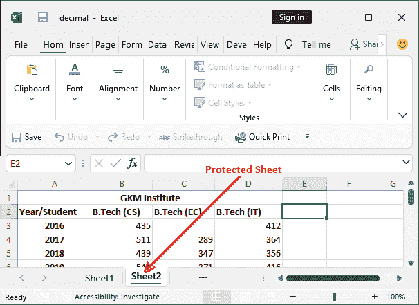

**第 2 步:**进入**显影剂**标签，点击**查看控制组下提供的代码**选项。

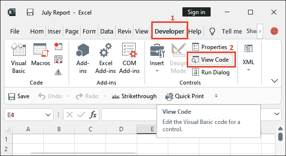

**第三步:**像下面这样的代码编辑器将在 Microsoft visual studio 中打开。在该代码编辑器的左侧面板上，右键单击受密码保护的工作表，选择**插入>模块**。

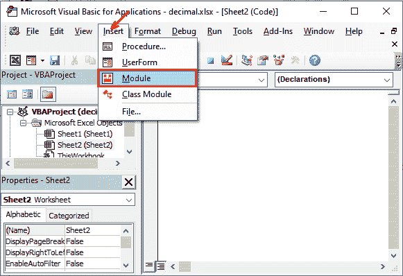

**步骤 4:** 将插入如下所示的新模块。

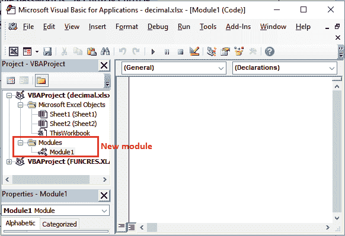

**步骤 5:** 现在，在所选工作表模块的代码编辑器窗口中编写以下 VBA 代码。

```

Sub PasswordBreaker()
Dim i As Integer, j As Integer, k As Integer
Dim l As Integer, m As Integer, n As Integer
Dim i1 As Integer, i2 As Integer, i3 As Integer
Dim i4 As Integer, i5 As Integer, i6 As Integer
On Error Resume Next
For i = 65 To 66: For j = 65 To 66: For k = 65 To 66
For l = 65 To 66: For m = 65 To 66: For i1 = 65 To 66
For i2 = 65 To 66: For i3 = 65 To 66: For i4 = 65 To 66
For i5 = 65 To 66: For i6 = 65 To 66: For n = 32 To 126
ActiveSheet.Unprotect Chr(i) & Chr(j) & Chr(k) & _
Chr(l) & Chr(m) & Chr(i1) & Chr(i2) & Chr(i3) & _
Chr(i4) & Chr(i5) & Chr(i6) & Chr(n)
If ActiveSheet.ProtectContents = False Then
MsgBox "One usable password is " & Chr(i) & Chr(j) & _
Chr(k) & Chr(l) & Chr(m) & Chr(i1) & Chr(i2) & _
Chr(i3) & Chr(i4) & Chr(i5) & Chr(i6) & Chr(n)
Exit Sub
End If
Next: Next: Next: Next: Next: Next
Next: Next: Next: Next: Next: Next
End Sub

```

**第五步:**写完代码后，点击**运行**图标运行写好的代码。

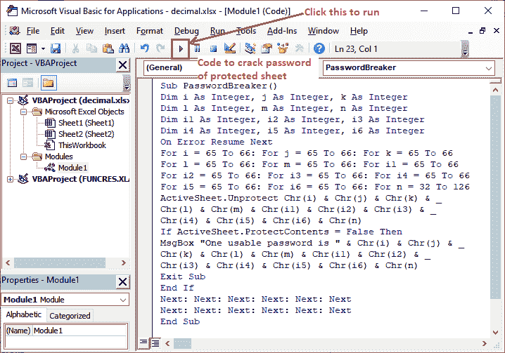

该文件将不受保护。这些都是帮助您取消使用密码或不使用密码保护的工作表保护的方法。

* * *