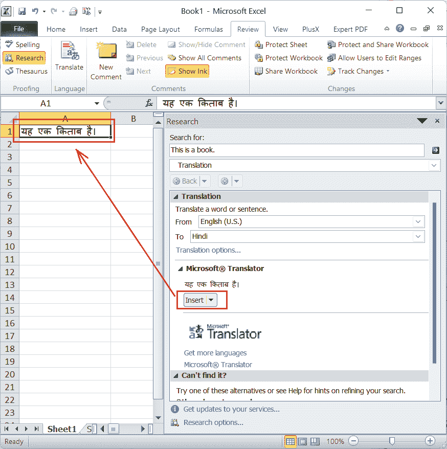

# 翻译工作表

> 原文:[https://www.javatpoint.com/translate-worksheet](https://www.javatpoint.com/translate-worksheet)

微软 Excel 或微软 Excel 是强大的电子表格软件，在世界各地的各种公司或组织中使用。在行和列中组织数据是一个很好的解决方案。虽然英语是最常见的语言，但 Excel 也允许我们使用许多其他语言。

由于用本地语言输入和分析数据要容易得多，大多数人更喜欢使用它们。但是，在某些情况下，我们可能会收到数据不是英文的 Excel 工作簿。在这种情况下，翻译 Excel 工作表变得很重要。通过翻译数据，我们可以轻松地将 Excel 电子表格从一种语言转换为另一种语言。此外，它有助于我们促进与世界各地不同的人或我们公司可能位于海外领土的不同分支机构的业务交流。

本文讨论了一些易于使用的方法，将所需的工作表翻译成所需的语言。我们用一步一步的教程来讨论每个具体的方法，以便更好地理解整个过程。

## 如何翻译工作表？

有许多方法可以用来翻译工作表中不同语言的文本。我们可以从各种来源翻译所需的数据，例如短语或段落、特定单词，甚至整个工作表或工作簿。

以下是根据目的翻译工作表时最常用的方法:

*   使用内置的 Excel 翻译工具翻译工作表
*   使用在线翻译工具翻译工作表
*   使用外接程序翻译工作表

现在让我们详细讨论上述每一种方法:

### 方法 1:使用内置的 Excel 翻译工具翻译工作表

虽然许多方法有助于翻译工作表，但在 Excel 工作表中翻译文本最简单的方法是使用 Excel 中内置的翻译功能。Excel 附带了一个翻译工具，只需点击几下鼠标，就可以将工作表数据翻译成所需的语言。

要在 Excel 中使用内置翻译工具，我们需要执行以下步骤:

*   首先，我们要打开一个 Excel 工作表，选择需要翻译成另一种语言的内容。
*   接下来，我们需要进入**查看**选项卡，选择**翻译**工具，如下图所示:
    T5
*   只要我们点击翻译工具，Excel 就会启动另一个窗口，该窗口提供了一个选项来选择我们要将所选内容翻译成的语言。
*   要翻译兼容的内容，我们需要从下拉列表中选择所需的语言。我们可以在窗口中看到翻译内容的实时预览。但是，要将内容的翻译版本/副本插入到我们的 Excel 工作表中，我们必须单击“**插入**按钮。
    T3】

这样，我们可以将数据翻译成我们想要的任意数量的单元格。翻译完所有需要的内容后，我们可以根据自己的喜好将更改保存到新的或现有的文件中。此外，我们可以添加一个翻译工具，作为缩短整个过程的快捷方式。

**在快速访问工具栏**中添加 Excel 翻译快捷方式

如果我们经常需要在 Excel 工作表中转换不同的语言，添加快速快捷方式是一个好主意。通过将快捷方式添加到快速访问工具栏(QAT)，我们只需点击一下就可以立即访问 Excel Translate 功能。

我们可以按照下面讨论的步骤在 QAT 中添加相应的快捷方式:

*   首先我们需要打开 Excel，点击**文件**选项卡，从列表中选择**选项**。
    或者，我们也可以在功能区的任意**选项卡**上按下**右键，然后选择“**自定义快速访问工具栏**”。
    **
*   选择快速访问工具栏选项后，我们必须单击“**从**选项中选择命令”下的下拉菜单，并从列表中选择“**查看选项卡**”。
    
*   完成上一步后，我们必须从列表中找到“ **Translate** ”选项，如下图:
    
*   找到“翻译”选项后，我们需要选择它并点击“**添加> >** 按钮。
    T3】
*   单击添加> >按钮后，翻译选项将移动到右侧框中。之后，我们必须点击**确定**
    
    这将在快速访问工具栏上添加一个新的快捷方式来访问翻译功能。
    

因此，每当我们需要翻译 Excel 工作表中的任何内容时，我们必须选择特定的单元格，然后单击我们在 QAT 上添加的翻译快捷方式。

### 例子

假设我们有一个 excel 工作表，单元格 A1 中有一些文本。例如——“这是一本书。”

现在，我们想把它翻译成印地语。因此，我们执行以下步骤:

*   首先，我们需要选择要翻译的特定单元格。在我们的例子中，我们选择单元格 A1，如下所示:
    
*   接下来，我们需要点击添加到快速访问工具栏的**翻译快捷方式**。此外，我们可以从**查看>翻译**选项访问它，该选项将启动另一个窗口。
*   在下一个窗口中，我们必须选择要翻译的语言。由于我们需要将文本翻译成印地语，我们从下拉列表中选择“印地语”。
*   选择语言后，我们选择的单元格中的文本将立即转换为印地语，如下图所示:
    单击“**插入**按钮，将文本的翻译版本插入相应的单元格。
    

同样，我们可以从列表中选择其他语言，将所选内容翻译成任何其他所需的语言。

### 方法 2:使用在线翻译工具翻译工作表

虽然 Excel 内置的翻译工具很容易使用，但是用不同的语言翻译包含数百到数千个单元格的工作表可能会有点棘手。该工具主要在翻译工作表的几个单元格或一小部分时有所帮助，这是因为我们在使用 Excel Translate 工具时一次只能翻译一个单元格。

因此，我们可以使用在线工具来翻译工作表，这有助于一次翻译整个工作表，而与要翻译的单元格数量无关。此外，许多在线工具允许用户翻译多个工作表。但是，如果工作表包含图表、图表和 Excel 函数，由于兼容性问题，某些在线工具可能无法正常工作。

以下是一些免费的在线翻译工具，有助于将 Excel 工作表翻译成我们需要的语言:

*   **DocTranslator**:DocTranslator 是网络上最好的免费工具之一，可以将 Excel 工作表翻译成任何其他语言。它不需要任何安装或注册，并通过网络浏览器工作。该工具主要利用谷歌翻译器的功能，智能地将翻译后的文本重新插入到提供的表单中，保留了原始布局。
    
    DocTranslator 是一款可靠、快速、易用的在线翻译机，支持一百多种语言的翻译。DocTranslator 的其他一些特性包括草书、文档布局镜像、复杂布局的渲染以及双向语言的文本对齐。
*   **Aspose 在线 Excel 翻译器** : Aspose 在线 Excel 翻译器是另一款在线提供的免费翻译工具。这个特殊的工具可以翻译各种 Excel 文件格式，并允许用户将它们保存为所需的格式。此外，它最多可以同时翻译 10 个文件。虽然这个免费的在线工具有助于快速翻译 excel 工作表，但它只支持十种主要语言。
    T3】
*   **谷歌翻译工具**:谷歌翻译是网络上可以使用的热门翻译工具之一。我们一般用谷歌翻译来翻译文本；但是，这个工具也允许我们翻译文档中的内容。
    T3】

虽然谷歌翻译速度快，使用自由，但也有一些局限性。如果我们使用谷歌翻译工具翻译工作表，我们无法下载工作表的翻译副本，翻译后的副本只能在浏览器中查看。如果我们想将翻译后的文本转移到工作表中，我们必须使用复制粘贴方法手动完成。

### 如何使用在线翻译工具翻译工作表？

对于网络上的不同工具，使用在线工具翻译工作簿几乎是一样的。通常，在线翻译工具包括以下步骤:

*   首先，我们需要通过网络浏览器打开或启动一个特定的工具。
*   接下来，我们需要上传我们想要翻译的工作簿。
*   文件上传后，我们需要选择要将提供的数据翻译成的语言。最后，我们必须点击“翻译”按钮。一些在线工具可能会在我们选择要上传的文件后立即自动开始翻译工作表。
*   翻译过程完成后，我们可以根据喜好查看或下载工作簿的翻译版本。

#### 注意:对于包含敏感信息的文件，我们不建议使用在线翻译工具。当我们想要翻译内容以供个人阅读或理解时，在线工具被认为是好的。这是因为在线工具，主要是免费工具，存在一些数据泄露或隐私问题的风险。

### 方法 3:使用插件/插件/扩展翻译工作表

Excel 支持安装扩展，以扩展功能或包括附加功能。网络上有许多扩展，可以安装并用来翻译工作表中的内容。但是，它们不是免费提供的，用户必须购买这样的扩展才能利用翻译功能。

安装扩展时，我们通常会在 Excel 功能区中包含另一个选项卡。每当我们想要翻译内容时，我们可以通过特定的选项卡并访问翻译功能。使用好的专业扩展，我们可以点击几个按钮将**完整的工作簿、一整张工作表或一系列选定的单元格**翻译成所需的语言。

### 需要记住的要点

*   我们必须有互联网连接才能在 Excel 中使用内置的“翻译”功能。
*   如果我们想在应用一些翻译后保存 excel 工作表，最好备份原始工作簿。
*   不建议使用在线工具或加载项来翻译包含敏感或私有数据的 Excel 工作表。
*   使用在线工具和加载项进行的翻译应经过审查和编辑，以确保准确性和一致性。

* * *