# Excel IFNA 函数

> 原文:[https://www.javatpoint.com/excel-ifna-function](https://www.javatpoint.com/excel-ifna-function)

如果你是一个 Excel 用户，你可能知道这些错误有多烦人和耗时。大多数时候，当你使用不同于 HLOOKUP、VLOOKUP、MATCH 等的函数时。，您会遇到#不适用错误。当你向你的同事或管理层展示配方表时，生硬的“不适用”看起来不专业且凌乱。现在的问题是如何处理这个错误。令您惊讶的是，Excel 也为此提供了解决方案。您可以 ***使用内置的 IFNA Excel 功能，用您定制的消息替换#不适用错误。*T3】**

## 什么是 IFNA 函数？

> 微软推出的 Excel IFNA 函数专门用于捕获和管理工作表中的#N/A 错误，忽略其他错误。如果 Excel 在函数中发现任何#N/A 错误值，此函数将返回您指定的自定义消息；否则，在没有错误的情况下，IFNA 返回公式的结果。

您可以切换到 IFNA 函数来捕获和处理可能出现在执行查找公式(如 MATCH、VLOOKUP、HLOOKUP 等)的函数中的#N/A 错误，而不是使用 IFERROR 函数(捕捉所有类型的错误)。每当 Excel 捕捉到任何#N/A 时，IFNA 函数都会返回一个自定义输出，好的一面是，如果在工作表中没有检测到错误，它会返回正常输出。请注意，IFNA 函数将仅处理#N/A 错误，所有其他 Excel 错误仍将显示在您的 Excel 工作表中。 ***IFNA 函数属于 Excel 逻辑函数的范畴。*T3】**

#### 注意:微软 Excel 在 Excel 2013 版本中引入了 IFNA 函数，所以如果您使用的是旧版 Excel，可能找不到这个函数。

**语法**

```

=IFNA(Value,[Value_if_error])

```

## 因素

*   **值(必需)—**该参数代表您要检查是否存在#不适用错误的文本值。
*   **Value_if_error(可选)-** 在此参数中，如果单元格中有#N/A 的值，我们将指定替换错误的自定义文本

## 返回

每当 Excel 捕捉到任何#N/A 时，IFNA 函数都会返回一个自定义输出，好的一面是，如果在工作表中没有检测到错误，它会返回正常输出。

## IFNA 函数需要记住的要点

1.  如果用户提供 ***“值”或“value_if_na”作为空单元格，*** 则 IFNA 函数 ***将其视为空字符串值(" ")。***
2.  如果您在【值】 参数中传递一个数组公式，***IFNA 函数将为值中给定范围内的每个单元格*** 返回一个输出数组。
3.  IFNA 函数有助于捕捉和处理#N/A 错误，并且在处理庞大而复杂的数据集时非常方便。
4.  ***该功能在故障排除时速度更快*** 因为与其他功能如 IFERROR、ISERROR 等相比，它是针对特定错误(#N/A)而设计的。

## 例子

### 示例 1:将列 A 除以列 B，并使用 IFNA 函数显示结果。

当你只想捕捉#N/A 错误时，IFNA 变得非常有用。要使用 IFNA 函数捕获和处理#不适用错误，请遵循以下步骤:

### 步骤 1:添加一个名为“使用 IFNA 输出”的帮助列

将鼠标光标放在“ColA”旁边的单元格上，并将新列命名为“使用 IFNA 输出”。

它看起来类似于下图:

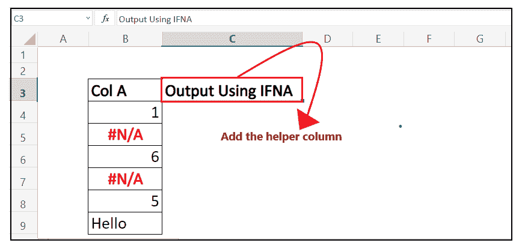

在这一栏中，我们将输入我们的 IFNA 公式，并为不同的数据值补漏白#N/A 错误。

#### 注意:格式化帮助列，并将其与第一列匹配，以使您的 Excel 工作表更有吸引力。

### 第二步:输入 IFNA 公式

将光标放在第二行，开始键入函数= IFNA(

它看起来类似于下图:

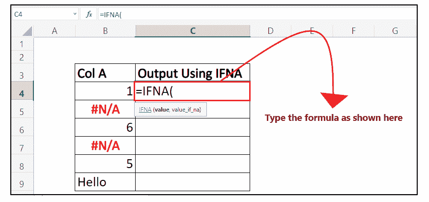

### 步骤 3:插入文本参数

*   公式首先会要求您输入“值”参数。我们将指定第一个单元格值，或者传递您要检查#N/A 错误的单元格引用。这里，我们数据的单元格引用是 B4，所以我们的公式变成: ***=IFNA( B4，***

它看起来类似于下图:

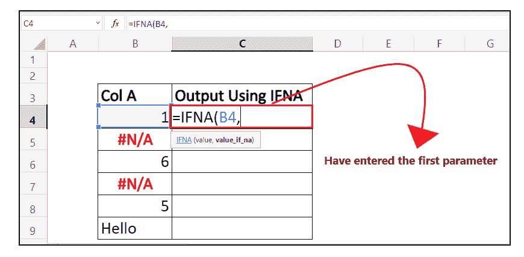

*   在第二个参数中，我们将指定该函数在单元格中发现任何#N/A 错误时将抛出的自定义消息。在这里，我们提到了“OOPs！错误”，所以我们的公式变成: ***=IFNA( B4，“OOPS！*错误】**

它看起来类似于下图:

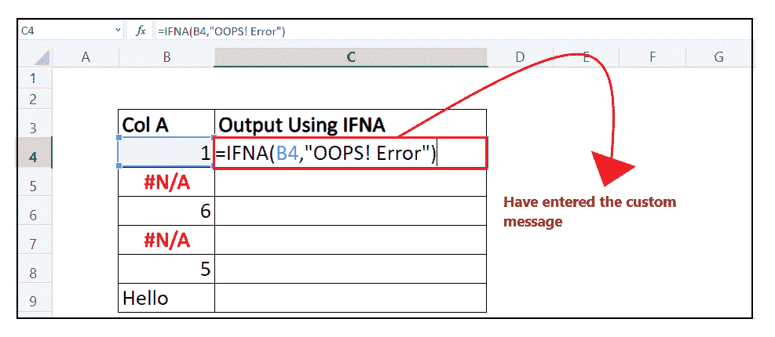

### 第四步:IFNA 将返回结果

由于 IFNA 没有发现#N/A 错误，所以它返回了原始值。当我们对下一行应用公式时，我们将看到如果它遇到#N/A 错误会发生什么。

它看起来类似于下图:

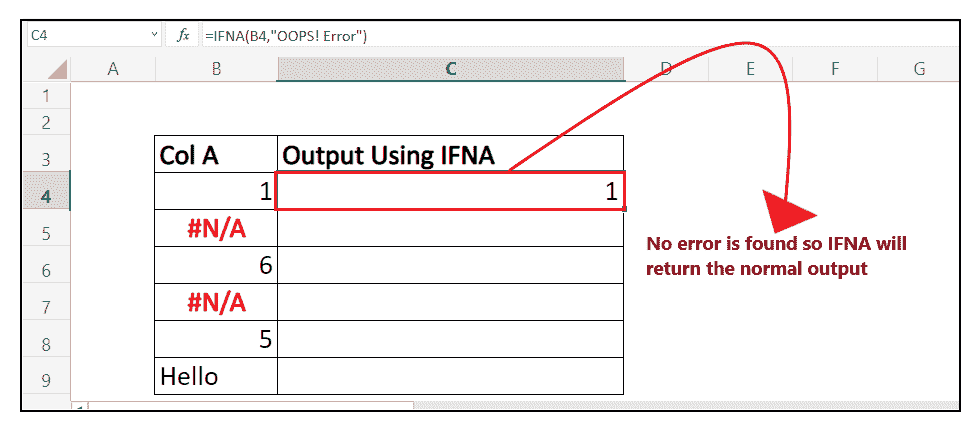

### 步骤 5:将公式拖到其他行重复

将鼠标光标放在公式单元格上，并将光标指向单元格的右上角。让你惊讶的是，鼠标指针会变成一个“+”图标。

参考下图:

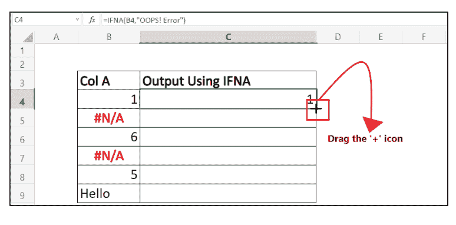

将“+”图标拖到单元格下方。它会将该函数复制到所有单元格中，将单元格引用更改为相应的单元格。如下图所示，当函数遇到#N/A 错误时，由 IFNA 函数处理，并用自定义文本“OOPS！错误”并显示它。

它看起来类似于下图:

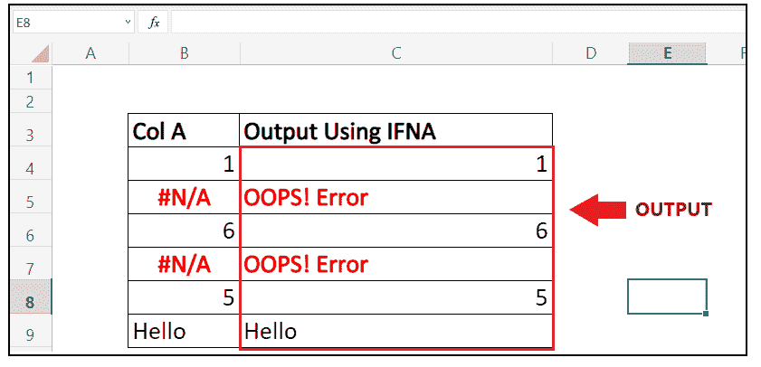

就是这样；按照上面的几个步骤，您可以轻松地将 IFNA 函数应用到 Excel 工作表中，以处理# N/A 错误。

## 示例 2:使用 IFNA 函数查找给定员工的月薪，如果出现#N/A，则将其更改为“薪资错误”。

| 电磁脉冲识别码 | 指定 | 年薪 |
| E0001 | 血管加压素 | **8 万** |
| E0002 | 分析师 | **5 万** |
| E0003 | 数据科学家 | **#不适用** |
| E0004 | 分析师 | **4 万** |

当您处理大量复杂的 Excel 数据时，IFNA 函数变得很方便，因为用户可以跳过不同类型的错误。要使用 IFNA 函数捕获和处理#不适用错误，请遵循以下步骤:

### 第一步:添加一个名为“月薪”的助手栏

将鼠标光标放在“年薪”旁边的单元格上，并将新列命名为“月薪”。

它看起来类似于下图:

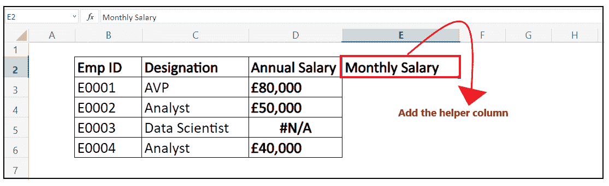

在这一栏中，我们将输入我们的 IFNA 公式，并为不同的数据值补漏白#N/A 错误。

### 第二步:输入 IFNA 公式

将光标放在第二行，开始键入函数= IFNA(

它看起来类似于下图:

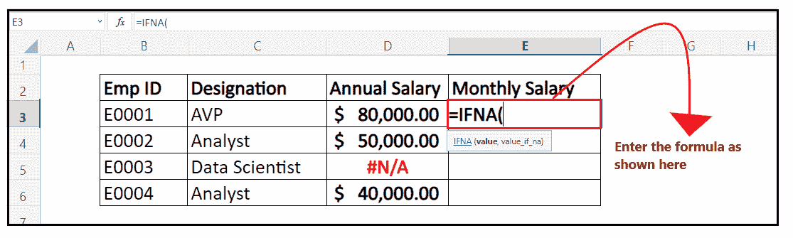

### 步骤 3:插入文本参数

*   公式首先会要求您输入“值”参数。我们将指定第一个单元格值，或者传递您要检查#N/A 错误的单元格引用。
*   因为我们还必须找到月薪，所以我们要用 12 除这个值。这里，我们数据的单元格引用是 D3，所以我们的公式变成: ***=IFNA( D3/12，***

它看起来类似于下图:

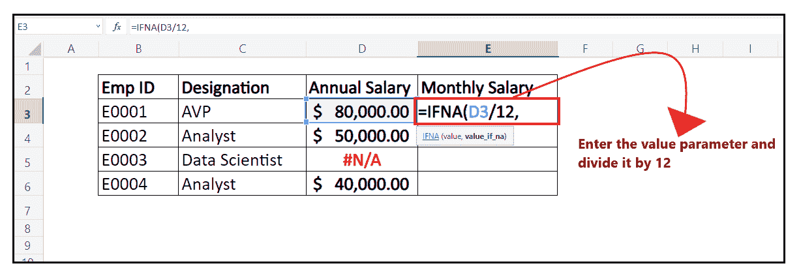

*   在第二个参数中，我们将指定该函数在单元格中发现任何#N/A 错误时将抛出的自定义消息。这里我们提到了“薪资错误”，所以我们的公式变成: **=IFNA( D3，“薪资错误”)**

它看起来类似于下图:

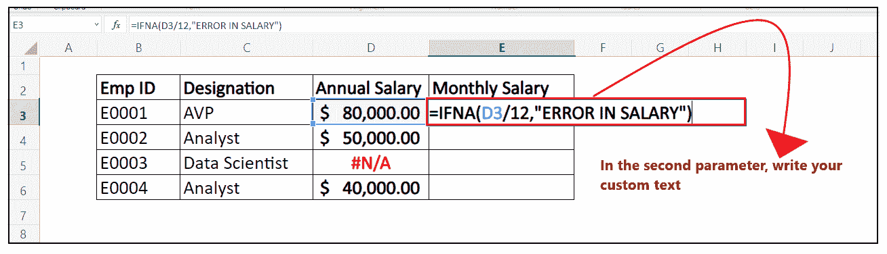

### 第四步:IFNA 将返回结果

由于 IFNA 没有发现#N/A 错误，所以它通过将年薪除以 12 来返回月薪。

它看起来类似于下图:

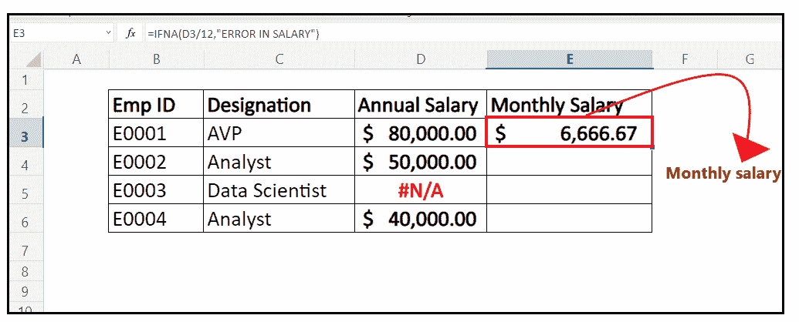

### 步骤 5:将公式拖到其他行重复

*   将鼠标光标放在公式单元格上，并将光标指向单元格的右上角。它会变成一个“+”图标。
*   将“+”图标拖到单元格下方。它会将该函数复制到所有单元格中，将单元格引用更改为相应的单元格。如下图所示，当函数遇到#N/A 错误时，由 IFNA 函数处理，并用自定义文本“ERROR IN SALARY”替换“#N/A”并显示。

它看起来类似于下图:

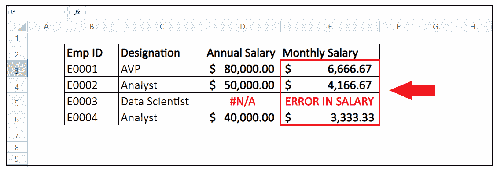

* * *