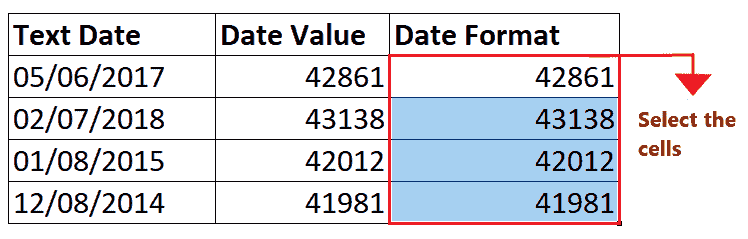

# Excel 日期值函数

> 原文:[https://www.javatpoint.com/excel-datevalue-function](https://www.javatpoint.com/excel-datevalue-function)

大多数情况下，您在 Excel 中处理日期。但是，这些日期不会在 Excel 中键入，因为在企业中，您使用不同的应用程序。因此，您通常从其他应用程序(如数据库、. csv 文件或其他外部来源)导入 Excel 工作表中的数据。当您导入数据(尤其是日期)时，日期很可能会作为文本条目导出。用肉眼，它们看起来像日期，但 Excel 会将它们识别为文本条目，而不是日期值。对于这样的值，如果应用日期函数，它会给你一个错误。

在这种情况下，您应该将文本值转换为日期。尽管在本教程中有各种将文本转换为日期的方法，但我们将介绍将文本日期条目快速转换为有效的 Excel 日期的内置 Excel DATEVALUE 函数。

## 什么是日期值函数？

> 函数的作用是:将输入为文本的日期转换为数字格式的日期值。例如，公式= DATevalue(“01/08/2015”)将在代表 2015 年 8 月 1 日的 Excel 日期系统中以序列号(42012)的形式返回输出。

有时，Excel 中的日期看起来像是不被识别为正确日期的文本值。当您将任何日期公式应用于这些日期值时，会出现#Value 错误。(参考下图)。这通常发生在您从外部数据应用程序导入数据时，Excel 很可能会将该数据的日期条目转换为文本字符串。


您可以通过使用内置的 DATEVALUE 函数来解决上述问题。此函数将日期文本字符串转换为有效的 Excel 日期。Excel 日期比文本日期更有用，因为它们可以格式化、用于不同的日期公式，甚至可以与其他公式一起操作。

#### 注意:DATEVALUE 函数返回一个序列号作为输出。您必须应用日期数字格式将此序列号显示为日期。

### 句法

```

=DATEVALUE(DATE_TEXT)

```

## 参数

**DATE_TEXT(必选):**此参数表示需要从文本格式转换为日期格式的日期。

## 关于 Excel 日期值函数需要记住的事情

在使用 Excel DATEVALUE 函数将日期字符串数据转换为日期之前，请查看下面给出的要点:

*   日期值功能 ***忽略文本字符串*** 中指定的时间信息。它只将字符串日期值转换为日期序列号。如果您想要同时保存日期和时间的文本字符串， ***您可以应用*** 的值功能。
*   如果文本字符串 中省略了 ***年份，那么 Excel DATEVALUE 函数将会 ***自动从你电脑的系统时钟中选择当前年份*** 。***
*   如你所知，微软 Excel ***读取 1900 年 1 月 1 日以来的日期，使用*** 这个 Excel DATEVALUE 函数 ***对更早的日期*** ，它会 ***抛出一个#VALUE！错误*** 。
*   DATEVALUE 函数不是用来将随机数转换成日期的*，也不能处理看起来像数值的文本字符串。对于这种情况，您必须利用 Excel VALUE 函数。*

 *## 返回

DATEVALUE 返回一个序列号。例如，在 Excel 的日期系统中，序列号 42012 表示 2015 年 8 月 1 日。

## 例子

### 示例 1:使用 DATE 函数计算日期，并将其转换为适当的日期格式。


要使用 DATEVALUE 函数将日期文本条目转换为日期值，请执行以下步骤:

### 步骤 1:添加两个名为“日期值”和“日期格式”的帮助列

*   将鼠标光标放在“文本日期”旁边的单元格上，并将新列命名为“日期值”。
*   将光标移到下一列，添加第二个帮助列，并将其命名为“日期格式”。

它看起来类似于下图:


在第一列中，我们将使用 DATEVALUE 函数将文本条目转换为日期类型。

由于 DATEVALUE 返回一个序列号，我们将应用一个日期数字格式，在第二个帮助列中将这个数字表示为日期。

#### 注意:格式化帮助列，并将其与第一列匹配，以使您的 Excel 工作表更有吸引力。

### 第二步:输入日期值函数

将光标放在 C4 单元格(日期值列第二行)上，开始输入函数 ***=日期值(***

它看起来类似于下图:


### 步骤 3:插入日期文本参数

DATE_TEXT 参数表示需要从文本格式转换为日期格式的日期。这里，B5 代表日期文本单元格。公式为: ***=DATEVALUE(B5)***

它看起来类似于下图:


### 步骤 4:日期值将返回结果

该函数将日期文本条目转换为日期类型，并将返回一个序列号。在我们的例子中，它返回了 42861，在 Excel 的日期系统中代表 2017 年 6 月 5 日。

它看起来类似于下图:


### 步骤 6:将公式拖到其他行重复

将鼠标光标放在公式单元格上，并将光标指向单元格的右上角。让你惊讶的是，鼠标指针会变成一个“+”图标。

参考下图:


将“+”图标拖到单元格下方。它会将 DATEVALUE 函数复制到所有单元格中，将单元格引用更改为相应的单元格。它会将日期文本条目转换为日期类型，并返回所有行的序列号。

参考下图:


### 步骤 5:应用日期数字格式

由于返回的输出是序列号格式(尽管 excel 将只将其视为日期)，我们需要将其转换为日期数字格式，以便任何人都可以轻松理解日期。

*   首先，我们将所有的日期值输出复制到日期格式列。(我们添加了一个额外的帮助列，因为我们必须在这里显示步骤，但是如果您愿意，您可以在同一个输出单元格中应用日期数字格式。)
    
*   选择要应用日期数字格式的单元格。
    
*   转到主页->号码。在数字部分，你会发现一个白色的下拉框。点击它。
    
*   您将拥有以下格式选项列表。选择长日期选项。
    
*   您会注意到 DATEVALUE 序列号被转换为长日期格式。参考下图:
    

### 示例 2:使用 DATE 函数计算日期，将它们转换为适当的日期格式，并获取每个日期的月份。


要将日期文本条目转换为日期值并查找每个日期的月份，请按照下面给出的步骤操作:

### 步骤 1:添加两个名为“日期值”和“月份值”的帮助列

*   将鼠标光标放在“文本日期”旁边的单元格上，并将新列命名为“日期值”。
*   将光标移动到下一列，添加第二个辅助列，并将其命名为“月值”。

它看起来类似于下图:


在第一列中，我们将使用 DATEVALUE 函数将文本条目转换为日期类型。

在第二列中，我们将应用 Date MONTH 函数来获取每个日期的 MONTH 值。

#### 注意:格式化帮助列，并将其与第一列匹配，以使您的 Excel 工作表更有吸引力。

### 第二步:输入日期值函数

将光标放在 C4 单元格(日期值列第二行)上，开始输入函数 ***=日期值(***

它看起来类似于下图:


### 步骤 3:插入日期文本参数

DATE_TEXT 参数表示需要从文本格式转换为日期格式的日期。这里，B5 代表日期文本单元格。公式为: ***=DATEVALUE(B5)***

它看起来类似于下图:


### 步骤 4:日期值将返回结果

该函数将日期文本条目转换为日期类型，并将返回一个序列号。在我们的例子中，它返回了 41197，在 Excel 的日期系统中代表 2012 年 10 月 15 日。

它看起来类似于下图:


### 步骤 6:将公式拖到其他行重复

*   将鼠标光标放在公式单元格上，并将光标指向单元格的右上角。让你惊讶的是，鼠标指针会变成一个“+”图标。
*   将“+”图标拖到单元格下方。它会将 DATEVALUE 函数复制到所有单元格中，将单元格引用更改为相应的单元格。它会将日期文本条目转换为日期类型，并返回所有行的序列号。

参考下图:


### 步骤 5:应用日期数字格式

由于返回的输出是序列号格式的(尽管 excel 将只将其视为日期)，我们需要将其转换为可读的日期格式。

*   选择要应用日期数字格式的单元格。
    
*   转到主页->号码。在数字部分，你会发现一个白色的下拉框。点击它。
    
*   您将拥有以下格式选项列表。选择长日期选项。
    
*   您会注意到 DATEVALUE 序列号被转换为长日期格式。参考下图
    

### 步骤 6:应用月份函数

*   移至辅助列“月值”，输入公式:***=月(***
    
*   传递日期参数的单元格引用。所以我们的公式变成:***= MONTH(C5)***
    
*   将公式拖到下面的单元格中。它会将 MONTH 函数复制到所有单元格中，将单元格引用更改为相应的单元格。所有日期都有月份值。
    

发现了。我们已经成功地解决了这个问题，希望您已经理解了如何使用 Excel DATEVALUE 函数将文本数据条目转换为有效的日期。

* * **