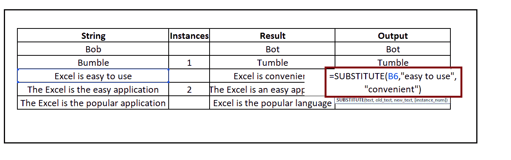
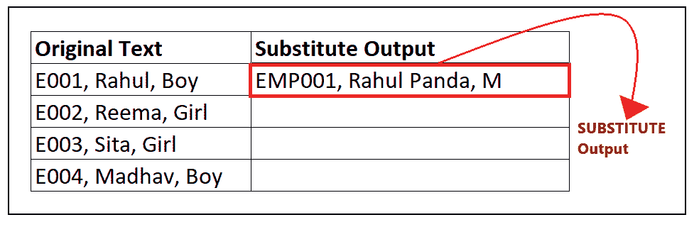

# Excel 替代函数

> 原文:[https://www.javatpoint.com/excel-substitute-function](https://www.javatpoint.com/excel-substitute-function)

用其他文本替换文本是我们在 Excel 中都要做的一项常见工作，我们都有不同的方法。但是你知道吗，Excel 已经 ***提供了一个名为*** 的内置函数，用另一个替换一个或多个文本字符串的实例。在本教程中，我们将更深入地了解 SUPPORT 函数。

## 什么是 SUBSTITUE 功能？

> 函数的作用是:用其他文本替换字符串中的一部分文本。replace 函数用于通过替换导入数据中的一个或多个字符来清除数据。例如，如果我们从一个格式为 458-299-605 的 PDF 文件中导入了一些数据，我们将应用 replace 函数将其转换为 458299605。

函数的作用是:用其他文本字符串替换文本字符串。您可以使用 replace 函数根据匹配来替换文本(请记住，它不适用于位置)。您也可以用无数据替换一个或多个文本字符串；您需要在参数中传递空字符串(" ")。“替代”是一个内置函数，分类在 Excel 文本函数下。

替代函数区分大小写。可以在 Excel 中作为工作表函数使用。替代函数可以作为工作表函数插入到单元格中的另一个公式中。该函数允许您轻松替换字符串中的文本，并让您能够决定要替换字符串的哪一部分。此功能的替代选项是使用查找和替换 Excel 功能。

#### 注意:单个替换函数一次只能替换一个文本值。但是，您可以将 SUPPORT 函数嵌套在自身内部来替换多个字符串。\

### 句法

```

=SUBSTITUTE(Text, Old_Text, New_Text, [instance_number])

```

## 因素

*   **文本(必需):**此参数指定要替换文本的文本。
*   **Old_Text(必需):**此参数指定要替换的旧文本。
*   **New_Text(必需):**此参数指定要用来替换原始文本的新文本。
*   **实例号(可选):**要用新文本替换的旧文本的出现。当您跳过实例参数时，所有出现的 old_text 参数都将被 new_text 参数替换。

## 替代函数需要记住的要点

*   函数的作用是:在一个指定的字符串中，用 new_text 搜索并替换 old_text 参数。
*   实例限制了 old_text 的特定实例的替换。
*   当您跳过实例参数时，所有出现的 old_text 参数都将被 new_text 参数替换。
*   “替换”是区分大小写的函数，不支持通配符。

### 示例 1:使用 replace 函数对下面的一些字符串进行更改，以获得“Result”列中提到的结果。

| 线 | 例子 | 结果 |
| 上下移动 |  | 马胃蝇蛆 |
| 犯错误 | one | 混乱 |
| Excel 很容易使用 |  | Excel 很方便 |
| 电子表格是最简单的应用程序 | Two | Excel 是一个简单的应用程序 |
| 电子表格是最流行的应用程序 |  | Excel 是流行的语言 |

要替换您的数据，请遵循以下步骤:

### 步骤 1:添加一个名为输出的帮助列

将鼠标光标放在“结果”旁边的单元格上，并将新列命名为“输出”。

它看起来类似于下图:


我们将在此栏中键入我们的“替换”公式，并将“替换”数据用于不同的文本值。

#### 注意:格式化帮助列，并将其与匹配列进行匹配，以使您的 Excel 工作表更具吸引力。

### 第二步:输入替代公式

将光标放在第二行，开始输入函数:**= replace(**

它看起来类似于下图:


### 步骤 3:插入参数

*   **文本:这里我们将指定我们要更改的**文本。它是字符串的参考单元格，即 B4 OR HUT，所以我们的公式变成:**= replace(B4**，
    
*   **Old_text:** 在这个参数中，我们将指定我们想要更改的字符串(我们现有的文本字符串)。在这里，在我们的例子中，我们想要改变字符串 b，所以用双引号输入它，即“b”，所以我们的公式变成:**= DELETE(B4，**“b”，
    
*   **New_text:** 在这里，我们将指定我们想要对 Old_text 进行的更改。它将以双重报价输入。与这里不同，我们想用“t”替换 Old_text，所以我们的公式变成了**= replace(B4，“b”，“t”**
*   **Instance_num:** 此参数指示我们针对哪个特定实例进行替换。因为这里只有一次出现“b”，所以我们将跳过这个可选参数。

我们的最终公式将类似于下图:

### 替换将返回结果

“替换”将字符“b”替换为“t”，并将输出返回为“Bot”。

它看起来类似于下图:


**步骤 5:对其他行重复公式**

*   在 E5 单元格中，键入公式:**= replace(B5，“B”，“T”，1)** 。由于 Bumble 有两个 b，我们在实例 1 中指定了，所以它会用字母 t 替换第一个 b 的实例。
    
*   在 E6 单元格中，键入公式:**= replace(B6，“易于使用”、“方便”)。**该功能将字符串“易用”替换为便捷如下图所示:
    
*   在 E7 单元格中，键入公式:**=代入(B7，“the”，“an”，2)** 。因为文本“Excel 是简单的应用程序”有两个。因此，我们在实例 2 中指定了，所以它将用字母“an”替换第二个实例“the”。
    T3】
*   在 E8 单元格中，键入公式:**=代入(B8，“the”，“)。**replace 函数区分大小写。因此，它将“该”和“该”视为不同的字符串。该函数将用空字符串替换字符串“the”。
    T3】

有关所有输出，请参考下图:


就是这样，现在你已经成功学会了如何在 Excel 中使用 replace 函数。让我们探索一些复杂的例子。

### 示例 2:使用下表演示嵌套替代函数的使用:


SUPPORT 函数不能在一个函数中替换多个字符串。因为在上表中，我们必须替换所有的三个字符串，所以我们需要在同一个单元格中有三个单独的 SUPPORT 函数，并替换其中的三个。要实现这一点，最好的方法是将一个替换函数嵌套在另一个函数中。

要理解嵌套的替代函数，请遵循下面给出的步骤:

### 步骤 1:添加一个名为“替代输出”的帮助列

将鼠标光标放在“原始文本”旁边的单元格上，并将新列命名为“替代输出”。

它看起来类似于下图:


我们将在此栏中键入我们的“替换”公式，并将“替换”数据用于不同的文本值。

### 第二步:输入替代公式

*   将光标放在第二行，通过键入以下命令启动嵌套公式:***= replace(***
*   因为我们有三个要替换的字符串，所以我们将把三个替换函数一个嵌套在另一个里面。公式将为:***=替补(替补(替补(***
    【T5)】

### 步骤 3:插入嵌套替代的参数

*   **首先我们将输入第三个替代函数的参数。我们将用字符串“M”替换字符串“Boy”。公式将变为:= replace(replace(replace)(C4，“男孩”，“M”)**
    
*   接下来，我们将输入第二个替代函数的参数。我们将用新字符串“Rahul Panda”替换旧字符串“Rahul”。在第二个嵌套函数中，不需要再次放入文本参数；我们将只指定旧文本和新文本参数。公式将变成:***= replace(replace(replace)(C4，“男孩”，“M”)，“Rahul”，“Rahul Panda”)，***
    
*   对于第三个嵌套函数，添加参数。我们将用新字符串“EMP001”替换旧字符串“E001”。在第三个嵌套函数中，不需要再次放入文本参数；我们将只指定旧文本和新文本参数。公式将变成:

***= replace(replace(replace(C4，“男孩”、“M”)、“Rahul”、“Rahul Panda”)、“E001”、“EMP 001”)***


我们的公式如下图所示:

### 替换将返回结果

嵌套的替换函数将用新字符串替换所有旧字符串，并将立即返回数据。

输出将类似于下图:


### 步骤 5:对以下行重复上述公式

*   在 D5 单元格中，键入公式:***= DELETE(DELETE(DELETE(C5，“女孩”，“F”)，“Reema”，“Reema 熊猫”)，“E002”，“EMP002”)。***
    它会用新 _Text 替换所有旧 _Text，并给你结果。
    
*   在 D6 单元格中，键入公式:***= DELETE(DELETE(DELETE(C6，“女孩”，“F”)，“悉塔”，“悉塔加尔格”)，“E003”，“EMP 003”)***
    
*   在 D7 单元格中，键入公式:***= replace(replace(replace(C7，“Boy”，“M”)，“Madhav”，“Madhav Jain”)，“E004”，“EMP004”)。*T3】**

它会用新文本替换所有旧文本，并给出结果。


嵌套的替换函数将用新字符串替换所有旧字符串，并将返回所有行的输出。

参考下图:


### 示例 3:使用枯草杆菌功能从 Excel 工作表中删除换行符。


要替换文本中的换行符，可以结合使用 DELETE 和 CHAR 函数。要删除单元格中的换行符，请按照下列步骤操作:

### 步骤 1:添加一个名为“替代输出”的帮助列

将鼠标光标放在“字符串”旁边的单元格上，并将新列命名为“输出”。

它看起来类似于下图:


在这一栏中，我们将输入我们的替代公式，并为不同的文本值放置替代数据。

### 第二步:输入替代公式

将光标放在第二行，并开始键入函数=代入(

它看起来类似于下图:


### 步骤 3:插入参数

replace 可以在单元格中的任何位置找到匹配的文本，并用您选择的文本替换它。replace 最多可以接受四个参数，但是我们将只使用前三个参数，并跳过第四个参数。

*   在文本参数中，我们将指定要删除换行符的字符串。它是字符串的引用单元格，即 B2，所以我们的公式变成:***= replace(B4、***
    
*   在第二个参数(Old_text)中，我们将指定换行符，因为这是我们想要替换的。我们知道 excel 中的 ASCII 字符集是 CHAR(10)，所以我们的公式变成:***= replace(B2，CHAR (10)***
    
*   在第三个参数中，我们将指定要用来替换旧文本的新文本，在我们的例子中，旧文本是逗号(，)，因此我们的公式变成:= DELETE(B5，CHAR(10)，"，"，")

参考下图:


### 替换将返回结果

replace 函数将用逗号(，)替换 B4 单元格中的所有换行符或字符(10)，并将返回最终输出，即 C4 单元格中的“红色、黄色、橙色”。

参考下图:


### 步骤 5:将公式拖到其他行重复

*   将鼠标光标放在公式单元格上，并将光标指向单元格的右上角。让你惊讶的是，鼠标指针会变成一个“+”图标。
*   将“+”图标拖到单元格下方。它会将 SUBSTITUE 函数复制到所有单元格，将单元格引用更改为相应的单元格。


* * *