# Excel CORREL 函数

> 原文：<https://www.javatpoint.com/excel-correl-function>

在统计分析中，很多时候，要求你找到两个性质之间的关系。然而，有多种方法可以实现这一点，其中之一是使用 Excel 内置的 CORREL 功能。在本教程中，我们将深入研究 CORREL 函数。

## 什么是 Excel CORREL 函数？

> Excel CORREL 函数返回两个数据集之间的相关系数。相关性介于-1 和 1 之间，称为负相关和正相关。它返回数组 1 和数组 2 的相关系数。例如:随着婴儿年龄的增长，身高或体重增加——意味着年龄与身高或年龄与体重之间有关系，并且随着其中一个的增加，另一个也在增加，即正相关。

相关系数有助于找出这两个性质之间的关系。如果指定的数组或引用参数包含文本/字符串、逻辑数据或空值，这些数据将被自动忽略。但是，此函数在其计算中包含零值单元格。CORREL 函数属于 Excel 统计函数。

虽然这个函数给出了与 Excel 皮尔逊函数相同的输出，唯一的区别是在早期版本的 Excel 中(在 Excel 2003 之前)，皮尔逊函数可能会抛出一些舍入误差。因此，如果您正在使用早期版本的 Excel，建议使用 CORREL，因为它将返回更有效和更准确的输出。在以后的版本中，两个函数(CORREL 和 PEARSON)返回相同的输出。

#### 注:如果相关系数 r 的值接近+1，则表示确定的正相关，如果 r 的值接近-1，则表示确定的负相关。

## 句法

```

=CORREL([Array1],[Array2])

```

## 因素

**Array1(必选)-** 此参数表示要计算相关值的第一个数组。

**数组 2(必选)-** 此参数表示要计算相关值的第二个数组。这是一组可靠变量。

## 返回

CORREL 函数返回数组 1 和数组 2 的相关系数。

## 要记住的事情

*   如果指定的数组或引用参数 ***包含文本、逻辑值或空白单元格，CORREL 函数将忽略这些值。*** 但是，该函数在其计算中包括值为零的单元格。
*   如果两个参数(数组 1 和数组 2)的数据点数不同， 此函数 ***返回#不适用错误。***
*   如果 ***的任何一个参数为空，*** 或者如果它们的值的 s(标准差)等于零，这个函数 ***返回一个#DIV/0！错误。***
*   高达 ***的相关系数 r 的值接近+1，它表现出确定的正相关。如果 r 的值接近-1，则表明存在明确的负相关性。*** 正相关表示如果一个参数中的值增加，另一个数组中的值也会增加。相反，负相关意味着如果一个参数中的值减少，另一个数组中的值也会减少。
*   下面给出的是
    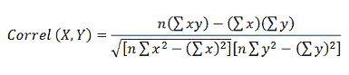
    值的 ***公式，其中，值代表样本。***

## 例子

### 示例 1:计算以下一组数字的年龄和体重之间的相关性。

| 年龄 | 重量 |
| one | five |
| Two | Fourteen |
| three | Fifteen |
| four | Twenty |
| five | Twenty-four |
| six | Thirty |
| seven | Thirty-five |
| eight | Thirty-eight |
| nine | Forty |
| Ten | Forty-five |

要确定年龄和身高之间的相关系数值，请遵循以下步骤:

### 步骤 1:添加名为“相关性”的帮助列

*   将鼠标光标放在任意单元格上，并将新列命名为“相关性”。

它看起来类似于下图:

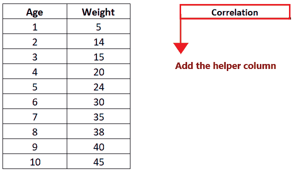

在这一栏，我们将输入我们的 CORREL 公式。虽然这只是供我们参考，但如果你愿意，你可以跳过这一步，直接进入第二步。

#### 注意:格式化帮助列，并将其与第一列匹配，以使您的 Excel 工作表更有吸引力。

### 第二步:输入相关函数

将光标移动到辅助列的第二行(单元格引用 E4)，并开始键入函数 ***= CORREL(***

它看起来类似于下图:

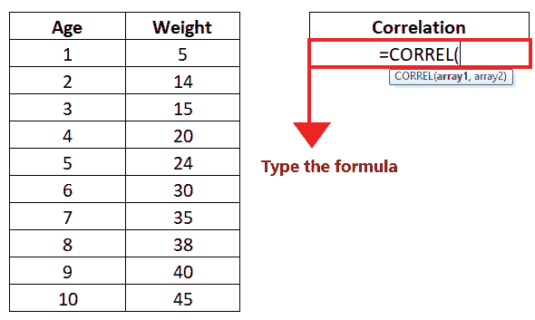

### 步骤 3:插入参数，数组 1 和数组 2

*   插入第一个参数“array1”。在这种情况下，我们将输入您想要计算相关值的第一个数组。这里我们传递 Age 列数据的数组范围引用，即 B4: B13。公式将为: ***=CORREL (B4:B13)、***
    看起来类似下图:
    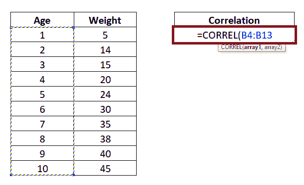
*   插入第二个参数“array2”。在这种情况下，是要计算相关值的第二个数组。这里，我们传递 Weight 列数据的数组范围引用，即 C4: C13。所以公式会是: ***=CORREL(B4:B13，C4:C13 )***
    看起来会和下图类似:
    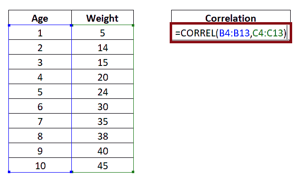

### 步骤 4:日期值将返回结果

*   完成后，按回车键获取输出。
*   CORREL 函数将分析数组 1 和数组 2 的数据，并将 ***返回两个数据集之间的相关系数。*** 在我们的例子中，它返回了 0.993023515 的相关值。
    看起来和下图类似:
    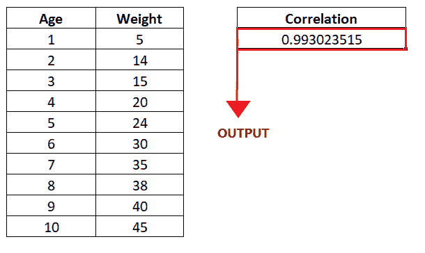

### 例 2:在本例中，我们在 C 栏中给出了股票 A 的周变化数据集，在 C 栏中给出了 S&P 的周变化数据集(参见下表)。基于这些数据值，使用 excel 中的 CORREL 公式计算两个数据的相关系数。

| 周 | 股票 A%变化 | S&P 每周变化 |
| one | 2.50% | 1.27% |
| Two | 2.57% | 1.53% |
| three | -0.50% | -1.89% |
| four | 1.75% | 2.27% |
| five | -1.90% | 5.80% |
| six | 2.63% | 0.34% |
| seven | 0.82% | 1.48% |
| eight | 5.80% | 1.70% |
| nine | -0.23% | 2.25% |
| Ten | 2.98% | -0.27% |

要确定两个数据集之间的相关系数值，请遵循以下步骤:

### 步骤 1:添加名为“相关性”的帮助列

*   将鼠标光标放在任意单元格上，并将新列命名为“相关性”。

它看起来类似于下图:

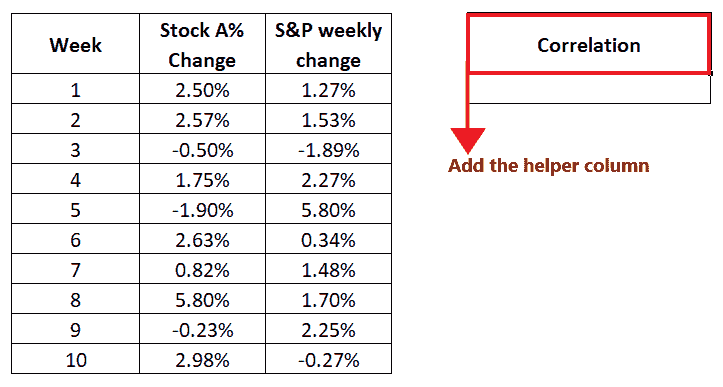

在这一栏，我们将输入我们的 CORREL 公式。虽然这只是供我们参考，但如果你愿意，你可以跳过这一步，直接进入第二步。

#### 注意:格式化帮助列，并将其与第一列匹配，以使您的 Excel 工作表更有吸引力。

### 第二步:输入相关函数

将光标移动到帮助列的第二行(单元格引用 c4)，并开始输入函数 ***= CORREL(***

它看起来类似于下图:

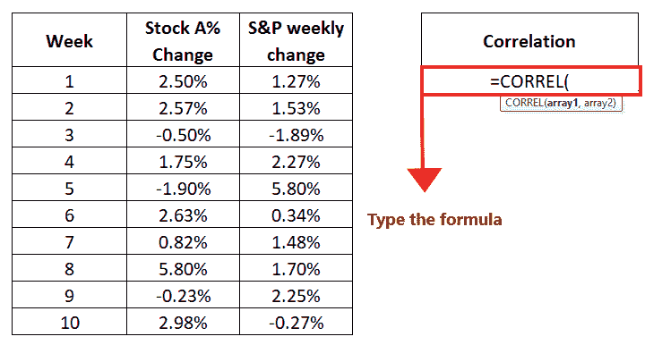

### 步骤 3:插入参数，数组 1 和数组 2

*   插入第一个参数“array1”。在这种情况下，我们将输入您想要计算相关值的第一个数组。这里，我们传递“股票 A%变动”列数据的数组范围引用，即 C4: C13。公式将为: ***=CORREL (C4:C13)、***
    看起来类似下图:
    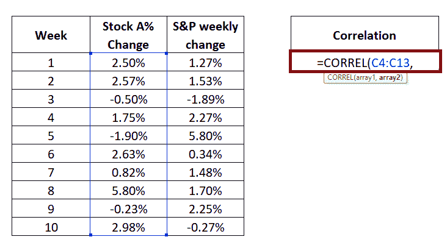
*   插入第二个参数“array2”。在这种情况下，是要计算相关值的第二个数组。这里，我们通过“S&P 周报”栏目数据的数组范围引用，即 D4: D13。因此公式会变成: ***=CORREL (C4:C13，D4: D13)***
    看起来会和下图类似:
    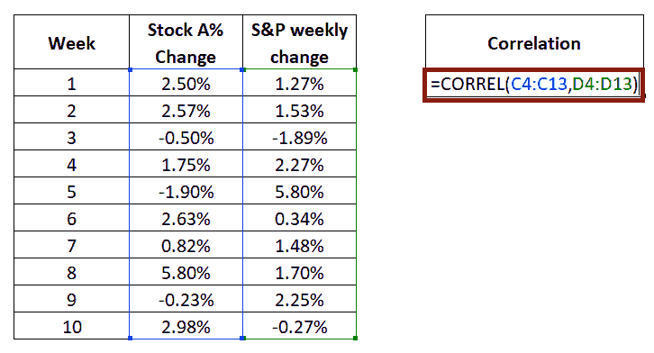

### 步骤 4:日期值将返回结果

完成后，按回车键获取输出。

CORREL 函数将分析数组 1 和数组 2 的数据，并将 ***返回两个数据集之间的相关系数。*** 在我们的例子中，它返回了一个相关值 ***-0.309639228。***

它看起来类似于下图:

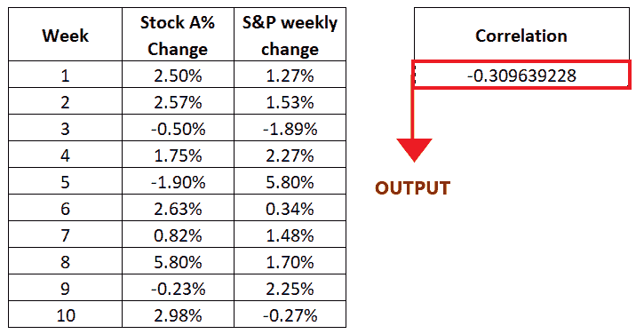

### 示例 3:在下表中，两个数据列的高度不同。让我们看看如果你为下面这组数字计算年龄和身高之间的相关性会发生什么。

| 年龄 | 重量 |
| one | five |
|  | Fourteen |
|  | Fifteen |
| four | Twenty |
| five | Twenty-four |
| six |  |
| seven |  |
| eight | Thirty-eight |
| nine | Forty |
|  | Forty-five |
|  | Forty-six |

要确定年龄和身高之间的相关系数值，请遵循以下步骤:

### 步骤 1:添加名为“相关性”的帮助列

*   将鼠标光标放在任意单元格上，并将新列命名为“相关性”。

它看起来类似于下图:

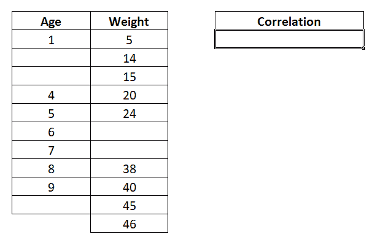

### 第二步:输入相关函数

将光标移动到辅助列的第二行(单元格引用 E4)，并开始键入函数 ***= CORREL(***

它看起来类似于下图:

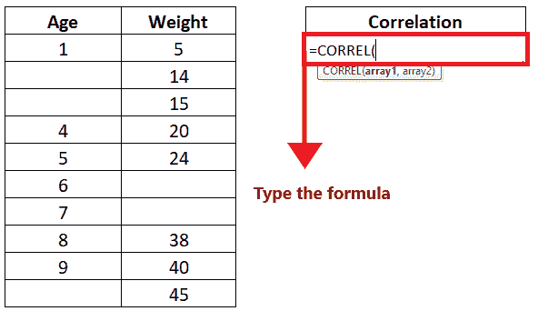

### 步骤 3:插入参数，数组 1 和数组 2

*   插入第一个参数“array1”。在这种情况下，我们将输入您想要计算相关值的第一个数组。这里我们传递 Age 列数据的数组范围引用，即 B4: B13。公式将为: ***=CORREL (B4:B13)、***
    看起来类似下图:
    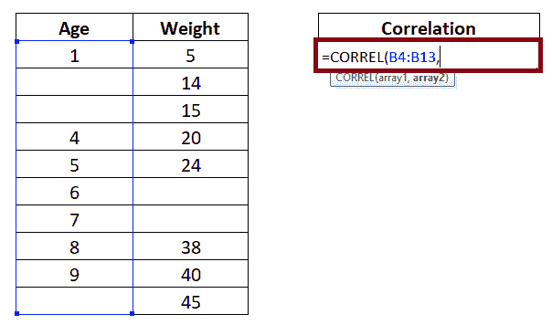
*   插入第二个参数“array2”。在这种情况下，是要计算相关值的第二个数组。这里，我们传递 Weight 列数据的数组范围引用，即 C4: C13。因此公式会变成: ***=CORREL(B4:B13，C4:C13 )***
    看起来会和下图类似:
    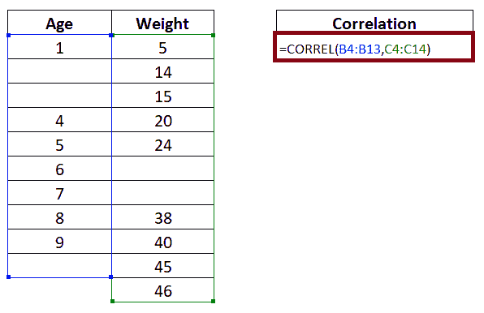

### 步骤 4:日期值将返回结果

*   完成后，按回车键获取输出。
*   CORREL 函数将分析数组 1 和数组 2，并返回#N/A 错误。出现此错误是因为数组 1 和数组 2 的高度不同。

输出请参考下图:

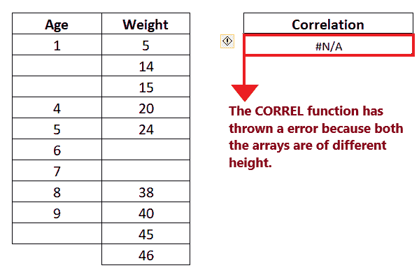

#### 注:只有当数组 1 和数组 2 的长度相同时，相关函数才计算相关系数值。

## 相关函数误差

使用 CORREL 函数时，如果出现错误，可能是由于以下原因:

*   **#N/A -** 如果参考数组(数组 1 和数组 2)的长度不同，则会出现此错误。
*   **#DIV/0！-** 如果任何一个参考阵列为空或其值的 s(标准偏差)等于零，则会出现此错误。

* * *