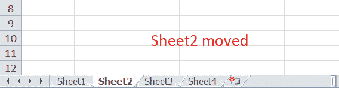
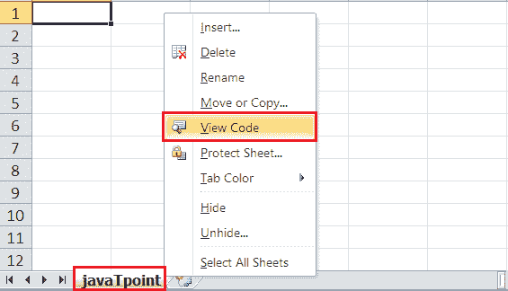
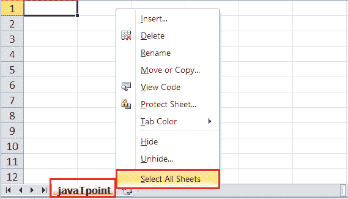

# Excel 中的工作表选项

> 原文：<https://www.javatpoint.com/sheet-options-in-excel>

MS Excel 或微软 Excel 是目前微软开发的最强大的电子表格软件。它允许我们跨多个工作表组织大量数据。每个 Excel 工作簿至少有一张工作表。默认情况下，当我们创建一个新的 Excel 文件时，它通常有三个工作表，即工作表 1、工作表 2 和工作表 3。此外，我们可以相应地添加或删除所需的页数。

在本文中，我们将讨论 Excel 中的各种工作表选项。但是，在理解工作表选项之前，让我们首先借助工作表的定义对其进行简单介绍。

## 什么是 Excel 中的工作表？

Excel 工作表，也称为工作表，是 Excel 工作簿中的单页或文档，其中包含单元格集合以帮助我们组织数据。根据要求，一个 Excel 工作簿可以有许多工作表。工作表通常列为选项卡，可以从 Excel 窗口的底部访问。

在上图中，默认的 Excel 工作表显示在工作表工具栏上。我们可以通过单击要查看的工作表名称在工作表之间切换。此外，我们可以用 Excel 工作表执行许多事情或任务。使用 Excel 中的**工作表选项**可以访问工作表的所有相应功能。

## Excel 中有哪些工作表选项？

由于 Excel 工作表是工作簿的核心元素之一，因此工作表选项中有多个核心选项可供执行。我们可以通过以下方式访问各种工作表选项:

*   功能表选项
*   在“图纸选项”上单击鼠标右键

让我们详细讨论每一个:

### 功能区工作表选项

Excel 的功能区提供了所有基本和高级选项。同样，Excel 功能区上也有一些快速工作表选项，可以通过转到**页面布局>工作表选项进行访问。**它主要有四个切换选项:两个用于**网格线**和两个用于**标题，**，它们可以通过选择和取消选择复选框来打开和关闭。

*   **网格线:**
    *   **视图:**该选项允许用户在活动工作表中显示/隐藏网格线。关闭此选项将删除工作表中的网格线，并显示一个空白的 Excel 工作表。
    *   **打印:**该选项允许用户在将要打印在纸上的 Excel 文档上显示/隐藏网格线。
*   **标题:**
    *   **视图:**该选项允许用户在活动工作表中显示/隐藏标题。关闭此选项将从当前工作表的页眉和页脚中删除标题。
    *   **打印:**该选项允许用户在 Excel 文档上显示/隐藏标题，该文档将打印在纸上。

上述工作表选项是特定于工作表的，更改仅适用于活动工作表。这意味着我们必须为新的工作表和工作簿再次调整这些选项。

在上图中，我们还看到“图纸选项”组的角上有一个带箭头图标的小框。它通常被称为“更多”按钮，用于访问相应组或类别的高级选项。

### 页面设置下对话框中的工作表选项

单击“更多”选项(功能区中“图纸选项”组角上的箭头图标)后，我们将获得各种图纸选项。这些纸张选项主要用于调整打印首选项。例如，当我们打印 Excel 文档时，通常不会打印网格线。我们可以从工作表选项中调整首选项，以包括打印和管理其他工作表选项的网格线。

*   **打印区域:**我们可以使用该选项选择打印区域。我们可以用鼠标拖动并选择单元格区域。
*   **打印标题:**
    *   **要在顶部重复的行:**该选项帮助我们为相应的行选择要在顶部显示的标题。
    *   **要在左侧重复的列:**该选项帮助我们为列选择要在左侧显示的标题。
*   **打印:**
    *   **网格线:**通过选择/取消选择复选框，可以启用或禁用该选项。它帮助我们决定是否在打印的 Excel 文档上显示网格线。
    *   **黑色&白色:**与网格线一样，我们可以选择此复选框以黑白颜色打印当前 Excel 文档，即使我们附带了彩色打印机。
    *   **草稿质量:**选择与草稿质量相关的复选框，允许我们使用打印机的草稿质量设置打印 Excel 文档。
    *   **行&列标题:**我们可以选择此选项来显示打印的 Excel 文档的行和列标题。
*   **页面顺序:**
    *   **向下，然后向上:**该选项允许用户先打印下一页，然后打印右页。
    *   **先上后下:**该选项允许用户先打印右页，再打印下页。
*   **打印:**点击该选项，向设备发出命令，使用默认打印机打印当前 Excel 文档。
*   **打印预览:**该选项显示将要打印在纸上的 Excel 文档的预览。
*   **选项:**该选项允许用户选择布局类型(纵向或横向)和纸张模式(A4、A5 等)。)用于要打印的 Excel 文档。

### 在“图纸选项”上单击鼠标右键

在 Excel 中，用鼠标右键单击通常会显示所选元素的上下文菜单。当我们在任何工作表标签上按下右键时，Excel 会显示与 Excel 工作表相关的选项列表。该列表包括各种图纸选项。然而，这个列表通常被称为“工作表菜单”。

下图显示了右键单击工作表选项:

在上图中，我们可以看到各种工作表选项。让我们详细了解每个选项的用法:

### 插入

在 Excel 上工作时，我们有时可能需要更多的工作表。为此，我们需要通过右键单击工作表选项卡上的工作表名称来转到工作表选项，然后从列表中选择插入。只要我们单击“插入”，新的空白工作表就会出现在当前工作簿中。

我们也可以使用**新建工作表按钮**(工作表标签旁边的加号按钮)立即添加新工作表。

我们还可以更改要添加到每个新工作簿中的默认工作表数。为此，我们需要转到**文件> Excel 选项>通用>包括这多张。**

### 删除

Excel 还允许我们从工作簿中删除不需要的工作表。例如，假设我们只想在单个工作表中组织数据，那么删除剩余的工作表将使我们的工作簿看起来专业而整洁。

要从工作簿中删除任何所需的工作表，我们必须首先在工作表标签上右键单击特定的工作表，然后从工作表选项列表中选择**删除**选项。

只要我们单击“删除”按钮，相应的工作表就会立即从工作簿中删除。

### 重新命名

每当我们创建一个新的 excel 工作簿时，我们通常会得到三个默认名称为 Sheet1、Sheet2 和 Sheet3 的 Excel 工作表。此外，如果我们插入一个新的工作表，Excel 会遵循相同的顺序，插入新的工作表，其名称如 Sheet4、Sheet5 等。但是，我们可以重命名任何工作表，并将默认工作表名称更改为任何所需的名称，以更好地反映其内容。

要重命名工作表，我们可以在工作表标签上右键单击所需的工作表名称后，使用工作表选项中的**重命名**。之后，我们需要为具体的工作表输入想要的名称，点击**进入**键。工作表将立即被重命名。

### 移动或复制

当我们需要在 Excel 中将数据从一个工作表复制到另一个工作表时，我们可以使用右键单击工作表选项列表中的移动和复制选项。我们必须首先右键单击要复制的工作表，然后选择**“移动并复制”**选项。

之后，Excel 会显示一个移动和复制对话框，我们需要在其中选择所需的首选项。例如，我们可以在**“在工作表之前”**选项下选择放置或复制工作表内容的位置。如果我们想将工作表的内容放在最后一张工作表的右边(或放在新的工作表)，我们可以从列表中单击“移动到结尾”选项。

最后，我们可以点击**“创建副本”**选项旁边的复选框，在不删除原始内容的情况下复制内容。如果我们没有选中该复选框，则所选工作表中的原始内容将被删除或移动到所需位置。复制的工作表将保留源内容的标题、版本号和其他详细信息。

这样，我们可以创建所需工作表的副本，或将内容移动到另一个工作表中。Excel 还允许我们将工作表内容复制到完全不同的工作簿中。为此，我们必须从**“预定”**选项下的下拉列表中选择另一个工作簿(应该已经打开)。

有时，我们可能需要在工作表标签中移动任何特定的工作表来重新排列工作簿。Excel 允许我们用鼠标来做这件事。要移动工作表，我们必须首先选择特定的工作表，单击并按住它，直到看到工作表标签上的黑色小箭头。

我们可以将光标放在工作表标签上的所需位置，然后松开鼠标按钮，放下选定的工作表。

### 查看代码

我们可以启动 VB (Visual Basic)编辑器，方法是转到任何工作表选项卡，右键单击并选择“查看代码”选项。但是，这个选项很少用于启动 VB 编辑器。

如果我们使用任何工作表标签上的“查看代码”选项启动 VB 编辑器，Excel 将为该特定工作表打开一个代码窗口。因此，这个启动 VB 编辑器的选项在编写只适用于特定工作表的代码时非常有用。例如，创建工作表事件。

### 保护工作表

如果我们保护工作簿中任何所需的工作表，Excel 会限制用户编辑或删除特定的工作表。要保护 Excel 工作簿中的任何特定工作表，我们需要右键单击所需的工作表并选择“保护工作表”选项。

单击保护表后，Excel 将显示另一个窗口来设置锁定首选项。此外，我们可以设置一个密码来限制其他人解锁或取消保护工作表。

如果有人想要取消工作表保护，必须在单击“取消工作表保护”选项后输入正确的密码。

### 标签颜色

工作表标签可以用所需的颜色进行着色。我们可以使用此选项更改默认工作表标签的颜色。在任何特定工作表的选项卡上使用任何特定的颜色都有助于我们在各种工作表之间轻松导航到该工作表。

要更改工作表标签的颜色，我们需要从右键单击工作表标签后得到的列表中选择**标签颜色**选项。接下来，我们必须单击所需的颜色，它将立即应用于选定的工作表标签。

当我们将鼠标悬停在任何特定颜色上时，Excel 也会显示选项卡颜色的预览。如果同一工作表处于活动状态，选项卡颜色的可见性会大大降低。但是，选择另一个工作表会突出显示选项卡颜色，并使其易于搜索。

### 隐藏

默认情况下，Excel 在“工作表”选项卡上显示工作簿的所有工作表。我们可以从工作表标签中查看或访问任何工作表。然而，可能有些情况下，我们不想向其他人显示任何特定的工作表，但是它在其他工作表的上下文中有重要的数据。在这种情况下隐藏具体的工作表就好了，对引用的数据不会有影响。

要隐藏工作表，我们需要从右键工作表选项列表中点击**隐藏**选项。一旦我们单击“隐藏”选项，相应的工作表将不再显示在工作表标签上。

### 取消隐藏

就像我们在 Excel 工作簿中隐藏工作表一样，我们可以用同样的方式取消隐藏工作表。我们需要从右键工作表选项列表中选择**取消隐藏**选项，相应的工作表将再次可见。

如果工作簿中有多个隐藏工作表，Excel 会显示所有隐藏工作表的列表，并要求我们选择想要取消隐藏的工作表。

### 选择所有工作表

如果我们想一次选择所有工作簿工作表，我们可以单击列表中的“选择所有工作表”选项。一旦选择了所有的工作表，我们就可以一次对所有选择的工作表执行一些特定的任务。

### 附加工作表选项

虽然 Excel 工作表有许多任务，但是工作表的分组、取消分组以及在工作表之间切换是一些基本的任务，它们不作为直接工作表选项出现。我们需要使用特定的方法来执行这些任务，如下所述:

### 分组工作表

Excel 允许我们同时对多张工作表进行分组。当我们需要同时使用多个工作表和一些公共数据时，这很有帮助。例如，输入候选人姓名、月份名称、周数等。对一张图纸所做的任何更改也将复制到组中的其他图纸。

要在 Excel 中对多个工作表进行分组，我们必须首先从工作表选项卡中选择要包含在工作表组中的任何工作表。

选择一张后，我们需要按住键盘上的 **Ctrl** 键。我们需要在工作表标签上点击下一个要包含在组中的工作表。一旦选择了所有要分组的工作表，我们必须释放 Ctrl 键，这将对所有工作表进行分组。

虽然我们可以导航到创建的组中的任何工作表并进行相应的更改，但我们不能选择不在该组中的工作表。如果我们这样做，所有的工作表将自动取消分组。

### 取消工作表分组

当我们在工作簿中有多个工作表分组并希望取消分组时，我们需要右键单击组中的任何工作表。这将打开工作表选项，如下所示:

我们必须选择“取消工作表分组”选项来取消上述图像工作簿中的工作表分组。这种方法主要用于工作簿中分组的工作表太多，以至于我们无法轻松找到不属于该组的工作表时。通常，我们可以单击不属于该组的任何工作表，所有工作表都将被取消分组。

### 在工作表之间切换

当我们需要从工作表标签中查看不同的工作表时，我们通常使用鼠标点击所需的工作表名称。但是，当工作簿有如此多的工作表时，很难滚动工作表标签来查找并单击它们以切换到所需的工作表。在这种情况下，我们需要按下 Excel 窗口左下角滚动箭头上的右键按钮，如下图所示:

Excel 显示包含当前工作簿所有工作表的列表。我们可以轻松地从列表中选择所需的工作表，立即查看其内容。

这样，我们可以在 Excel 工作表之间轻松切换，而无需使用工作表标签。

* * *