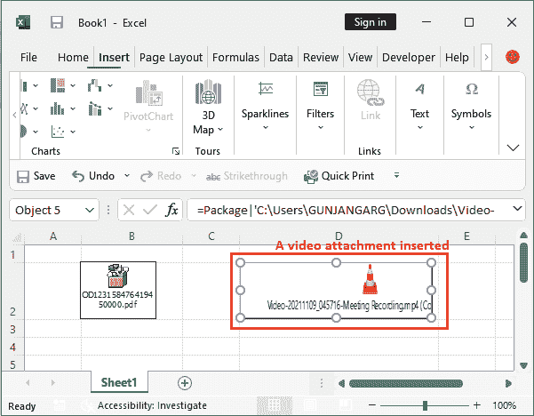
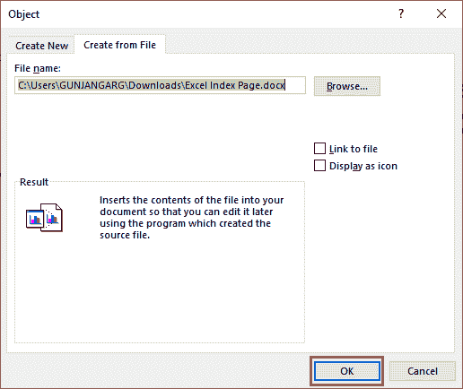
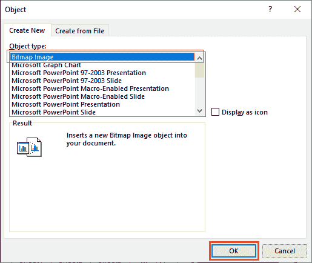

# 如何在 excel 中附加文件

> 原文：<https://www.javatpoint.com/how-to-attach-file-in-excel>

Excel 用户可能需要将文件作为附件插入到他们的 Excel 工作表中。他们可以在文件附件的帮助下分享更多信息。excel 用户可以在 Excel 工作表中插入任何类型的文件。用户必须遵循一些简单的步骤来做到这一点。

附加文件后，它会浮动在电子表格上，而不是您选择的单个单元格上。有几种方法可以将任何类型的文件作为附件插入到 Excel 工作表中。附件文件可以是图像文件、pdf、word、文本或任何类型的文件。

本章的 Excel 文件附件将帮助您学习在 MS Excel 工作表中附加文件。

## 将文件作为图标插入 Excel 工作表

在 Excel 中有几种方法可以将文件插入到 Excel 工作表中。我们将在 Excel 表格的 B2 单元格中插入一个文件。

按照以下步骤将现有文件作为附件插入到 Excel 工作表中:

**步骤 1:** 选择需要插入附件文件或图像(任何你想要的)的单元格。然后导航至**插入**标签。

**第二步:**单击位于功能区末端的 ***文本*** 组下拉列表中的**对象**。

**步骤 3:** 将打开一个对象窗口面板，导航至**从文件创建**选项卡。

**第四步:**点击**浏览**按钮，在系统本地存储器中搜索文件附件。

**第五步:**现在，浏览一个要插入的现有文件，点击**打开**按钮。我们选择了要插入的 pdf 文件。

**第 6 步:**如果要将附件作为链接到此附件文件的图标插入，请选中 ***显示为图标*** 复选框。

单击**确定**完成以图标形式插入附件的过程。

> 您也可以更改附件文件进入 Excel 工作表后显示的图标。

**第 7 步:**可以看到一个文件已经作为图标插入到 Excel 工作表中。

**提示:**可以调整图标大小。

**第八步:**双击此图标时，会弹出如下图。单击此弹出窗口中的**打开**。

**第九步:**插入的文件会在软件中打开这是哪种类型的文件。我们的附件文件将在浏览器中打开。

## 将文件作为链接插入 Excel 工作表

正如您在前面的步骤中学习到的那样，将文件作为图标插入到 Excel 工作表中。现在，我们将向您展示将文件附件作为链接插入 Excel 文件的步骤。按照以下步骤将现有文件作为链接附件插入到 Excel 工作表中:

**步骤 1:** 选择需要插入附件文件或图像(任何你想要的)的单元格。然后导航至**插入**标签。

**步骤 2:** 单击位于功能区末端的*文本*组部分内的**对象**。

**步骤 3:** 将打开一个窗口面板，导航至**从文件创建**选项卡。

**第四步:**点击**浏览**按钮，在系统本地存储器中搜索文件附件。

**第五步:**现在，浏览您系统中的现有文件，点击**插入**按钮。我们正在插入一个视频文件作为附件。

**第 6 步:**这一次，勾选 ***链接到文件*** 复选框，将附件作为链接插入，而不是图标或完整的文件视图。

单击**确定**完成以图标形式插入附件的过程。

**第七步:**可以看到一个视频文件已经作为这个文件的链接插入到 Excel 工作表中。

**提示:**可以调整链接大小。您还可以看到文件链接以及文件类型图标。

**第八步:**当你点击你所附文件/图片的这个链接时，一个弹出窗口会像这样打开。单击此弹出窗口中的**打开**。

插入的视频附件文件将在软件中打开并播放，这是哪种类型的文件。我们的附件文件将在浏览器中打开。

## 附件应该在同一台计算机上

您可以根据需要在 Excel 中附加不同类型的文件。您也可以插入带有其他图形的文件。用户必须知道该文件应该在同一台计算机上可用，或者在使用文件时或演示过程中必须可用的服务器上可用。

在 MS Excel 中，可以使用对象链接或嵌入将其他格式文件附加到 Excel 工作表中。该文件可以是 word 文件、图像文件或 Excel 文件。

## 将文件插入 Excel 工作表

您可以直接将文件插入到 Excel 单元格中，而不是插入显示为链接或图标的文件。这将在文件中完全可见。

我们已经解释了将显示为图标或链接的文件插入到 Excel 工作表中的步骤。现在，我们将向您展示插入文件附件的步骤，该附件将在 Excel 工作表中直接可见，无需单击任何链接或图标。按照以下步骤将现有文件作为链接附件插入到 Excel 工作表中:

**步骤 1:** 选择需要插入附件文件或图像(任何你想要的)的单元格。然后导航至**插入**标签。

**步骤 2:** 单击位于功能区末端的*文本*组部分内的**对象**。

**步骤 3:** 在**从文件**选项卡上，选择要插入的对象类型。

**第四步:**点击**浏览**按钮，在本地存储器中查找文件。

**第五步:**从系统中选择一个文件，点击这里的**打开**按钮。对于这个例子，我们选择了一个 word 文件。

**第 6 步:**在此不做任何操作，点击**确定**完成该过程，并插入一个附件作为图标。

**第七步:**可以看到一个文件已经插入到 Excel 工作表中，在 Excel 中完全可视化，无需点击任何图标或链接。

word 文档已插入到 Excel 工作表中，该工作表当前不可编辑。

**第八步:**要使这个插入的文档在 Excel 中可编辑，双击它。它将在 Excel 中以其支持的格式打开，如下所示-

现在，您可以从这里编辑插入文档中的任何内容。

## 从 Excel 内部创建一个新对象

您可以基于另一个程序创建一个全新的对象，而无需离开工作簿。例如，如果您想在图表或表格中添加更详细的说明，可以在 Excel 中创建嵌入文档，例如 Word 或 PowerPoint 文件或图像文件。

在 MS Excel 文件中，用户可以将对象直接显示在工作表中，也可以添加打开文件的图标。

它允许用户直接从 Excel 创建对象类型，而无需离开微软 Excel 屏幕。之后，创建的对象将自动插入文件。

**步骤 1:** 选择需要插入附件文件或图像(任何你想要的)的单元格。然后导航至**插入**标签。

**步骤 2:** 单击位于功能区末端的*文本*组部分内的**对象**。

**步骤 3:** 在**新建**选项卡上，选择要插入的对象类型。例如，我们选择

**第四步:**在 MS Excel 内部会打开一个画图窗口，在这里可以绘制和编辑任何图像。

**第五步:**你可以画出你需要的任何东西，就像我们设计的下图一样。

**第六步:**图像作为对象自动插入到这个 Excel 文件中。

你现在什么都不要做。只需保存您的 Excel 文件。如果您想要编辑插入的对象图像，请双击该图像，从这里直接在画图中打开。

**提示:**通过 Excel 对象创建的任何图像或文件都不会从外部保存到您的系统中。它只保存在您创建它的微软 Excel 文件中。

通过这种方式，您可以创建 word 文档、图表、PowerPoint 文档和其他需要的文档。

* * *