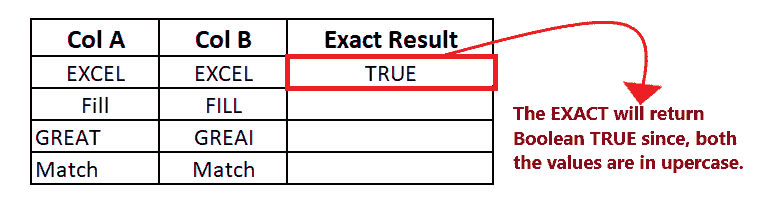
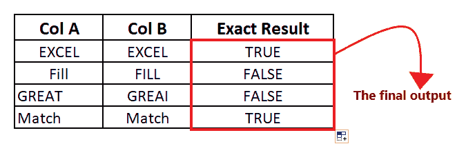
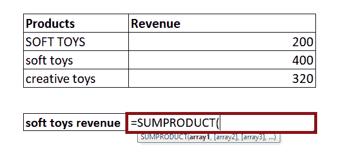
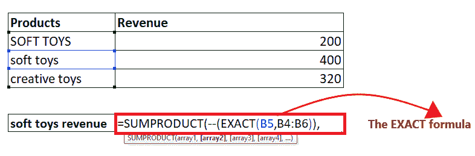

# Excel 精确函数

> 原文：<https://www.javatpoint.com/excel-exact-function>

当分析大量的 Excel 数据时，您经常需要将一些数据的确切值与另一个数据进行匹配。微软 Excel 有一个比较两个字符串并说明它们是否完全匹配的特殊功能， ***精确功能。*** 这是一个区分大小写的函数，用于比较两个文本值，并返回布尔值 True 或 False。

在本教程中，我们将更深入地了解 EXACT 函数，并将学习在 Excel 工作表中应用该函数的分步过程。

## 什么是 EXACT 函数？

> 函数比较两个字符串，如果两个值相同，则返回真。否则，它将返回 FALSE。该函数区分大小写。

EXACT 函数是一个内置函数，可以在 Excel 中用作工作表函数(WS)。作为一个工作表函数，可以在工作表的单元格中输入 EXACT 函数作为公式的一部分。

该函数属于 Excel 字符串/文本函数。EXACT 函数帮助用户检查指定的两个文本或字符串值是否完全相等(包括大小写)。如果它们相等并且 100%匹配，这个函数返回布尔真。否则，它返回 FALSE。EXACT 是一个区分大小写的函数，这意味着“cat”和“CAT”将被认为是不同的，因为一个是大写的，一个是小写的。

在金融工作中，您经常需要在分析数据时检查和比较两个值。在这种情况下，EXACT 函数支持您轻松进行比较。当与他人共享我们的工作簿并让他们以特定格式输入数据时，该功能也变得很方便。

#### 注意:精确函数在比较两个字符串时区分大小写。

### 句法

```

=EXACT (Text1, Text2)

```

### 参数

*   **Text1(必需):**此参数指定要检查其完全匹配的第一个字符串。
*   **Text2(必需):**此参数指定要测试的第二个字符串。

### 返回

*   如果两个参数(文本 1 和文本 2)相同，则 EXACT 函数返回布尔值 TRUE。
*   如果两个参数(文本 1 和文本 2)不同，则 EXACT 函数返回布尔值 FALSE。

### 精确函数

*   Remember that the dot standard equals (=) operator is case insensitive.
*   EXACT can only compare and find matches of string values. If you pass a numeric value in its parameter, it will convert it to text.

### 例 1:测试条件 1 和条件 2，使用 Excel EXACT 函数检查数字是否大于 0。

| 上校 | 乙栏 | 确切的结果 |
| 超过 | 超过 |  |
| 充满 | 充满 |  |
| 伟大的 | 太好了 |  |
| 比赛 | 比赛 |  |

要检查列 A 是否与列 B 完全匹配，请执行以下步骤:

### 步骤 1:插入一个帮助列

在“列 B”旁边添加一列，并在单元格顶部键入列名“精确结果”。

它看起来类似于下图:


在 helper 列中，我们将为每一行键入 EXACT 函数，并检查列 A 是否与列 b 完全匹配。

#### 注意:如上图所示，我们已经用边框和字体格式化了列，以使工作表在视觉上更有吸引力。

### 步骤 2:插入精确的公式

下一步是输入公式，将光标放在助手列的第二行，开始键入:= EXACT(

它看起来类似于下图:


### 步骤 3:添加参数

*   第一个参数包括“Text1”，它代表您要检查的第一个字符串。这里，单元格引用 B4 保存我们的文本 1。所以我们的公式变成:=Exact(B4，
    看起来和下图类似:
    
*   第一个参数包括“Text1”，表示您想要检查是否完全匹配的第一个字符串。这里，细胞参考 C4 持有我们的文本 1。所以我们的公式变成:=Exact(B4，C4)
    看起来和下图类似:
    

### 精确将返回结果

精确(B4，C4)将返回布尔真作为结果，因为两列(EXCEL，EXCEL)中的值都是大写的，并且正在匹配。



### 步骤 5:将公式拖到其他行重复

将光标放在公式单元格上，并将其移向矩形框的右侧。您会注意到光标将变成“+”图标。

它看起来类似于下图:


将+图标拖到它下面的所有单元格。这将自动将精确函数复制到所有单元格。因此，如果两个字符串都匹配，则 EXACT 将返回布尔值 TRUE，如果不匹配，则返回 false。

输出请参考下图:



#### 注意:在上面的例子中，第二行和第三行的结果是 FALSE，因为 EXACT 函数区分大小写。在第二行中，第一个值是大写和小写的组合，而第二个值是大写。

### 示例 2:使用精确函数从下面给定的表格中计算产品(毛绒玩具)的详细信息，并找到其当年的收入。

| 制品 | 收入 |
| 毛绒玩具 | Two hundred |
| 毛绒玩具 | four hundred |
| 创意玩具 | Three hundred and twenty |

如上表所示，我们有两个用 soft toys 命名的值，唯一的区别是一个值是小写的(soft toys)，另一个值是大写的(SOFT TOYS)。但我们想要小写数据值的“软玩具”。但是，还有其他 Excel 函数如 VLOOKUP 和 INDEX/MATCH 来查找给定值，但唯一的问题是它不区分大小写。因此，我们将使用“SUMPRODUCT + EXACT”的组合来实现区分大小写的查找。

遵循下面给出的步骤，了解毛绒玩具的产品详情和收入:

### 步骤 1:插入一个名为“毛绒玩具收入”的帮助行

将光标放在产品表下的任意位置，并在单元格顶部键入行名“毛绒玩具收入”。

它看起来类似于下图:


在帮助列中，我们将键入 SUMPRODUCT + EXACT 函数的组合来查找收入详细信息。

### 步骤 2:插入 SUMPRODUCT 公式

*   下一步是输入公式，将光标放在助手列的第二行，开始键入:= SUMPRODUCT(

它看起来类似于下图:



#### 注意:Excel SUMPRODUCT 函数返回数组中数字相乘后的总和，也可用于根据提供的条件对单元格进行计数。该函数以数组为参数。

*   在插入参数之前，添加两个负号。我们使用了一个双负数来将输出的真值和假值转换为 1 和 0。所以我们的公式变成:=SUMPRODUCT( -(

参考下图:


### 步骤 3:插入精确函数作为 SUMPRODUCT 的第一个参数

*   在第一个参数中，我们将键入 EXACT 函数。所以我们的公式变成:=SUMPRODUCT( - (EXACT(
*   接下来，我们将传递 EXACT 的参数。在第一个参数中，我们将传递您想要检查的字符串。这里，单元格引用 B4 保存我们的文本 1。所以我们的公式变成:=SUMPRODUCT( - (EXACT(B5，
*   在下一个参数中，我们将传递您想要测试的产品名称。所以我们的公式变成:=SUMPRODUCT( - (EXACT(B5，B4:B6))

它看起来类似于下图:



### 步骤 4:插入 SUMPRODUCT 的第二个参数

输入收入范围作为 SUMPRODUCT 的第二个参数。这里，细胞范围 C4:C6 持有的收入范围。所以我们的公式变成:=SUMPRODUCT( - (EXACT(B5，B4:B6))，C4:C6)。


### 步骤 Excel SUMPRODUCT 和 EXCAT 函数的组合将返回结果

在对列 B 中的值进行测试后，EXACT 将返回公式的输出，将 TRUE/FALSE(EXACT 函数的输出)转换为 1 和 0。如下所示，使用 SUMPRODUCT 和 EXACT 的组合，您将获得“毛绒玩具”产品的收入。


发现了。现在，您已经成功地完成了 EXACT 函数的所有步骤和示例。继续，在你需要做任何比较的时候使用它，把它和其他函数结合起来，得到满意的结果。

* * *