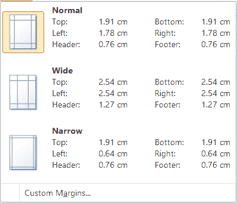
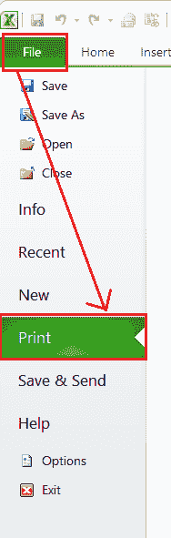
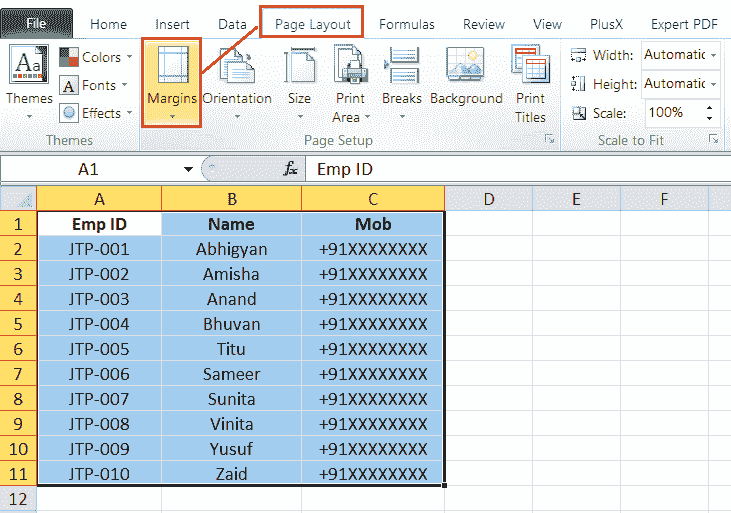
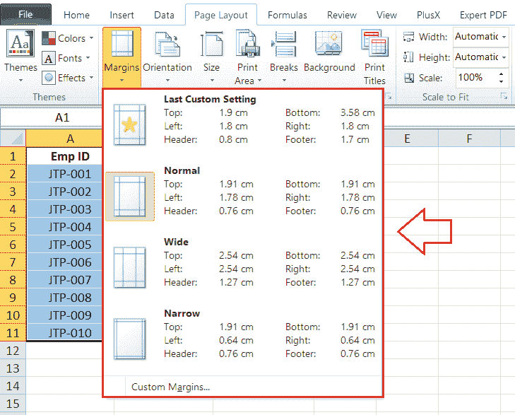
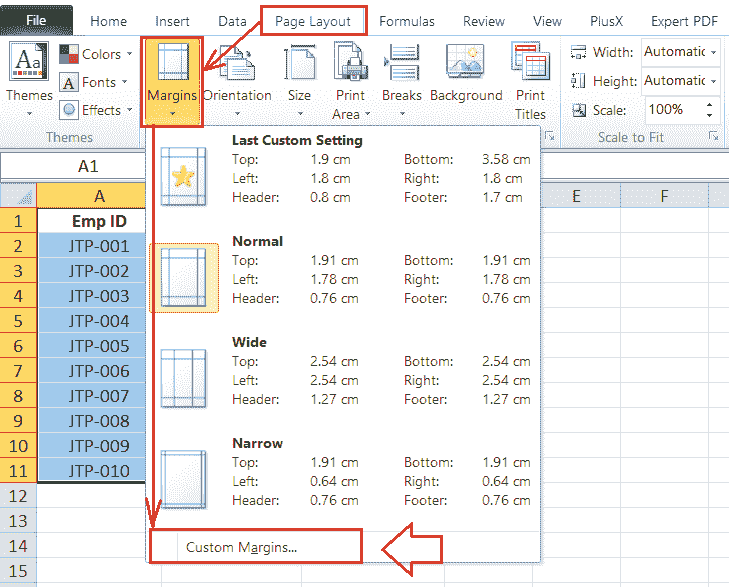
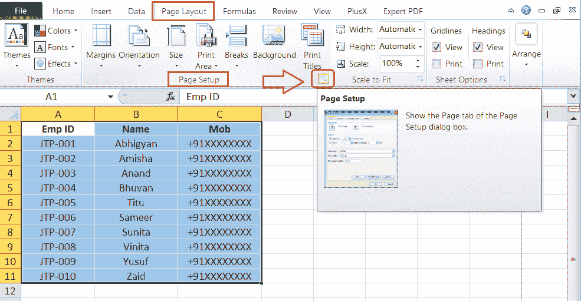
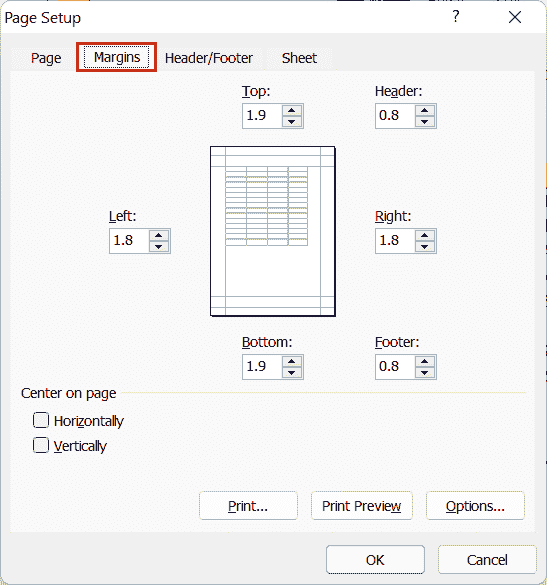
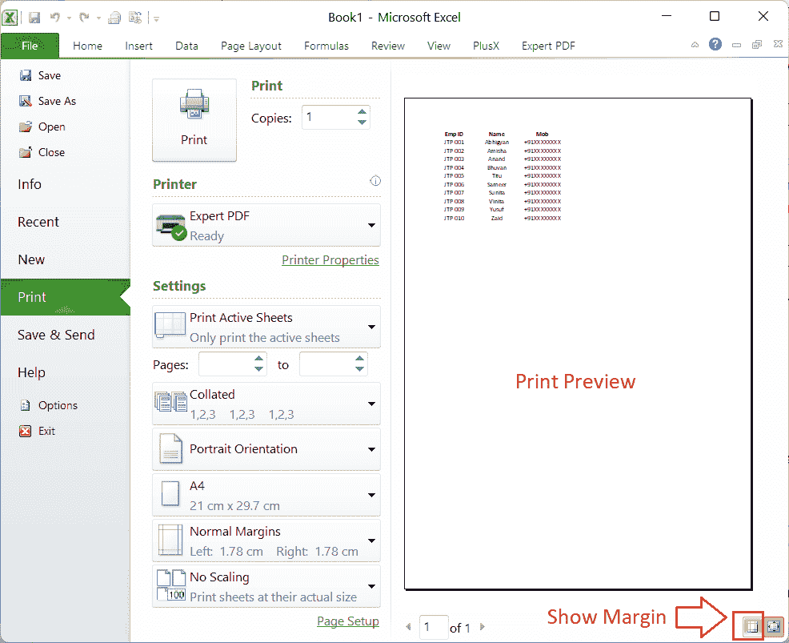
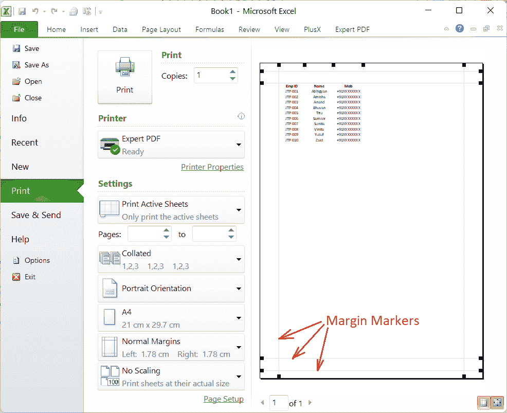

# 在 Excel 中调整边距

> 原文:[https://www.javatpoint.com/adjust-margins-in-excel](https://www.javatpoint.com/adjust-margins-in-excel)

微软 Excel 或微软 Excel 是目前功能最强大的电子表格软件，具有各种功能和工具。它可以轻松地以数字方式处理大量数据集，并使用户能够在纸上打印所需的数据。在纸上打印 Excel 文档时，页边距在调整打印区域的整体外观方面起着重要作用。边距通常有助于我们更好地对齐打印纸上的工作表内容。

在本文中，我们将讨论在 Excel 中调整边距的分步教程。在了解步骤之前，我们先讨论一下边距的简要介绍，以及在 MS Excel 中有多少种边距类型或选项可用。

## 什么是 Excel 中的边距？

边距可以定义为 Excel 工作表内容与打印页面的上、下、左、右边缘之间的空白。上边距和下边距有助于用户显示不同的内容，如页眉、页脚和页码，而其他边距有助于在打印页面上更好地对齐工作表数据。

Excel 使用户能够手动调整边距，以便在工作表数据周围添加更多或更少的空白。当我们将页边距设置得太高时，工作表内容可能会在打印时超出页数。此外，当我们将边距设置得太低时，工作表数据可能看起来不太好，或者在打印纸上看起来很精致。因此，我们应该在 excel 中适当调整边距，使其看起来很棒，并在打印前在预览中检查我们的打印文档。

#### 注意:使用 MS Excel 一次打印的 Excel 表格的所有页面都将遵循相同的边距。当所有页面一起打印时，我们不能为每页单独指定页边距。但是，我们可以一页一页打印，并单独调整页边距。同样，我们也可以针对不同页面调整不同的页边距。

## Excel 中有哪些边距选项？

与 Word 不同，Excel 除了默认或普通样式外，只有两组内置边距样式。因此，我们只需点击几下鼠标就可以选择这些现有的页边距。在我们继续调整边距的过程之前，让我们了解一下 Excel 中可用的边距选项。它们如下:

**正常**:正常的边距设置是 Excel 对每个 Excel 工作表及其页面遵循的默认边距。它使用 3/4 英寸的标准上、下、左、右页边距，其中 1/4 英寸分别将页眉和页脚与上、下页边距分开。尽管默认了边距，但 Excel 允许我们从另外两种边距设置中进行选择，即宽和窄。

**宽**:Excel 应用于所选工作表的宽边距设置使用 1 英寸的标准上、下、左、右边距，其中 1/2 英寸将页眉和页脚分别与上、下边距分开。

**窄化**:Excel 应用于所选工作表的窄化页边距设置使用标准的上下页边距 3/4 英寸，左右页边距 1/4 英寸，其中 0.3 英寸分别将页眉和页脚与上下页边距分开。

**自定义**:如果不喜欢默认的页边距和其他内置的页边距设置，可以使用我们的自定义页边距。使用 Excel 中的自定义页边距，我们可以为页眉和页脚指定所需的页边距，并将工作表内容垂直和水平居中。自定义边距调整有助于我们根据自己的喜好改进工作表的外观。

**提示**:当我们想要整页打印 Excel 文档的内容，覆盖页面最大空间时，应该使用窄边距。或者，我们可以使用自定义页边距，根据自己的喜好减少页边距，并在打印页面上实现最大可能的行数和列数。

## 在 Excel 中调整边距

Excel 有很多内置功能，我们可以用不同的方法访问大部分功能。同样，我们可以使用以下两种方法在 Excel 中调整边距:

### 方法 1:使用文件菜单(或标签)

调整 Excel 文档边距的简单方法是使用文件菜单命令。具体来说，我们需要遵循以下步骤:

*   首先，我们需要选择特定的纸张来调整页边距。
*   接下来，我们需要转到**文件**选项卡，并从列表中单击**打印**选项。
    
*   Excel 在下一个窗口中显示各种打印选项，如选择打印份数、默认打印机、页面方向、缩放比例、边距等。我们必须点击**边距**选项来访问 Excel 中的可用边距。
    T3】

在上图中，我们可以看到如上所述的三个预定义边距，即*正常、宽*和*窄*。我们可以单击所需的边距，它将立即应用于当前的纸张或打印区域。

除此之外，我们还可以从列表中选择“自定义边距”来启动自定义边距对话框并相应地调整边距。

### 方法 2:使用页面布局选项卡

访问调整 Excel 边距功能的另一种常见方法是使用功能区上的“页面布局”选项卡。我们可以执行以下步骤来使用“页面布局”选项卡设置页边距:

*   首先，我们需要选择要调整页边距的特定工作表。我们可以根据需要同时选择单张或多张。同样，按住 **Ctrl** 可以选择多个相邻或不相邻的纸张
*   一旦选择了所有需要的纸张来应用特定的页边距，我们需要转到**页面布局**选项卡，并单击**页面设置**
    下的**页边距**工具
*   在下一个窗口中，Excel 显示所有现有的边距选项。我们可以点击任何预定义的边距，如*正常、宽*或*窄*。选定的边距将立即应用于活动工作簿中所有选定的工作表。
    

在上图中，我们可以根据自己的喜好选择“自定义边距”来设置边距大小。

## 在 Excel 中使用自定义边距的步骤

如上所述，自定义边距使用户能够根据自己的喜好调整边距。此选项可能会扩展边距的自定义选项。我们可以在为每一侧提供的框中输入所需的边距，并使用自定义边距为页眉和页脚创建单独的区域。此外，我们可以根据需要垂直和水平居中页面。

我们可以使用以下任何方法来调整 Excel 中的自定义边距:

### 方法 1:使用页面设置对话框

我们需要执行以下步骤来使用“页面设置”对话框调整页边距:

*   首先，我们需要选择要应用自定义边距的工作表。
*   接下来，我们需要转到**页面布局**选项卡，并在页面设置组中单击与**边距**命令相关联的下拉图标。
*   在下一个窗口中，我们必须点击“**自定义边距**”选项。
    
    我们也可以在**页面设置**部分右下角点击**更多**按钮(箭头图标)。
    
    之后，我们可以选择“**页边距**”选项卡。
*   我们需要从“页面设置”对话框的“页边距”选项卡中，在*左侧、右侧、顶部、*和*底部*框中输入所需的页边距。此外，我们可以点击方框旁边的向上和向下箭头(旋转按钮)来改变小数值的边距。
    
    在页面设置窗口的底部，我们可以选择“**页面居中选项**下的复选框，并将数据垂直和水平对齐到应用的边距设置之间的中心位置。
*   最后，我们可以单击“页面设置”对话框中的“打印预览”按钮，以确保页边距设置正确。一旦相应地配置了所有边距首选项，我们必须单击**确定**按钮来应用设置。

### 方法 2:使用打印预览工具(文件选项卡)

使用打印预览屏幕中的边距工具，我们可以自由调整活动 Excel 文档的边距。这意味着我们可以用鼠标拖动页边距，然后将它们放到任何地方来应用页边距设置。这样，我们就可以在 Excel 中快速有效地调整边距。

我们需要执行以下步骤来使用打印预览工具调整页边距:

*   首先，我们需要选择要应用所需自定义页边距的特定工作表。
*   接下来，我们需要转到**文件>打印**。
    T3】
*   在下一个窗口中，Excel 显示活动文档的打印预览。我们必须点击打印预览右下角的“**显示边距**图标或工具，如下图:
    
*   单击“显示边距”按钮后，Excel 会显示边距标记。我们可以使用鼠标按钮点击、按住并拖动任意一侧的**边距标记**，松开鼠标按钮重新绘制新的边距设置。此外，我们还可以使用相同的方法调整列宽。
    
    在【打印预览】面板中调整好页边距后，我们可以点击**打印**按钮，将文档打印到应用了页边距的纸上。

## 需要记住的要点

*   需要注意的是，Excel for web 不提供调整页边距的功能。但是，它在页面布局选项卡下有一些**页面设置**选项。我们可以从网上的 Excel 下载特定的 Excel 文件，在桌面的 Excel 中打开，并根据我们的选择调整页边距。
*   Excel 使我们能够同时调整多个工作表的边距。
*   如果我们之前在 Excel 中使用过自定义边距，那么在边距下拉列表下显示的设置将与**上次自定义设置**相同
*   建议保持页眉和页脚设置小于顶部和底部边距设置，并大于或等于使用的最小打印机边距。

当我们在 Excel 中调整任何特定工作表的边距时，边距设置仅存储在该工作表中，不会更改其他工作表或新工作簿的默认边距。

* * *