# Excel 中的单元格样式

> 原文：<https://www.javatpoint.com/cell-styles-in-excel>

微软 Excel 或微软 Excel 是功能强大的电子表格软件，具有一系列独特的内置功能。它可以处理大量数据，并支持记录在电子表格中的数据的各种格式选项。Excel 有不同的格式选项来快速格式化我们的工作表，从简单地从其他单元格复制格式到预定义的条件格式。除此之外，单元格样式是在工作表中格式化 Excel 单元格的另一个很好的特性。

本文简要介绍了 Excel 中的单元格样式，以及在 Excel 中应用预定义单元格样式和创建自定义单元格样式的分步教程。

## 什么是 Excel 中的单元格样式？

单元格样式是指我们可以在 Excel 单元格中应用的许多格式或属性的组合。虽然我们可以分别应用每种组合格式，但这需要更多时间。我们最好应用单一样式来同时实现一组格式，而不是单独使用各种格式。单元格样式是有效更改工作表外观的快速方法。

单元格样式可以结合以下六个属性的首选项:

*   字体(类型、颜色和大小)
*   对齐(垂直和水平)
*   数字格式
*   模式
*   边界
*   保护(锁定和隐藏)

我们可以将上述格式组合成单个单元格样式。例如，我们可以创建一个样式，其中包括特定字体颜色、单元格背景颜色、斜体字体样式、单元格边框和数字格式的设置。每当我们需要使用这样的格式组合时，我们可以通过简单地选择我们创建的样式来快速应用它们，而不是逐个应用每种格式。它可以帮助我们快速地一次应用多种格式，并增加工作表整体外观的一致性。

## Excel 中的单元格样式有什么帮助？

虽然 Excel 中的单元格样式不如 Word 强大，但它们有助于在工作表中快速应用复杂的格式并节省时间。例如，假设我们输入了一些数据到大约 40 到 50 个单元格，字体大小为 12 磅。但是，后来，我们意识到我们需要使用 16 pt 的字体大小。而不是 12 pt。在这种情况下，我们可以编辑单元格样式，并将字体设置为 16 pt。，而不是编辑每个对应单元格的字体大小。具有该特定样式的所有单元格将自动更改为 16 磅的字体大小。

同样，我们也可以修改其他属性(如字体类型、颜色、大小、数字格式、边框、垂直和对齐等)。)通过单元格样式。

## 如何在 Excel 中使用单元格样式？

Excel 通常提供两种有效的选项来在选定的单元格或多个单元格区域中使用单元格样式。我们可以使用安装在 Excel 中的任何现有单元格样式，也可以通过选择特定的字体、颜色、阴影等手动创建自定义样式。

现有的单元格样式是已创建的格式选项的组合，我们可以将其用于所需的单元格或单元格区域。Excel 有各种各样的现有单元格样式，分为不同的类型:正常、不良、良好和中性。此外，样式也根据不同的数据类型进行划分。例如，数据和模型。现有的单元格样式几乎涵盖了所有内容，从标题和标题到不同元素和重音的颜色，再到货币和数字格式。

我们需要执行以下步骤来使用或应用 Excel 中现有的/预定义的单元格样式:

*   首先，我们需要选择要应用样式的特定单元格或多个单元格的范围。
*   选择所需单元格后，我们需要进入**主页**选项卡，点击**样式**
    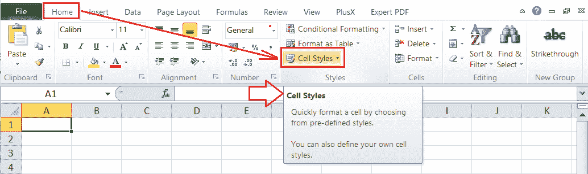下与“**单元格样式**选项相关的下拉图标
*   点击单元格样式下拉图标会弹出一个窗口，如下图:
    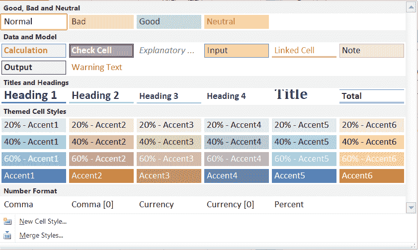
    上图中，这些是 Excel 中已有的单元格样式。我们可以点击所需的单元格样式，同样的样式会立即应用到活动工作表中选定的单元格或区域。除此之外，我们还可以通过移动鼠标指针来检查任何特定样式的实时预览。只要我们的指针停留在特定的样式上，Excel 就会在选定的单元格或区域上临时显示相应的样式。

这样，我们可以在 Excel 中应用现有的或默认的单元格样式。

## 如何在 Excel 中创建单元格样式？

虽然 Excel 有几种默认的单元格样式，但我们有时可能需要特定的样式才能在任何特定的工作簿中使用。我们可以为样式中的每种对应格式创建带有所需设置的自定义单元格样式。每当我们想要使用我们的自定义样式时，我们可以选择它并像 Excel 默认单元格样式一样重用它。

我们需要执行以下步骤在 Excel 中创建自定义单元格样式:

*   首先，我们需要选择一个单元格或一系列单元格。
*   接下来，我们需要进入**首页>单元格样式**点击“**新单元格样式**选项，如下图:
    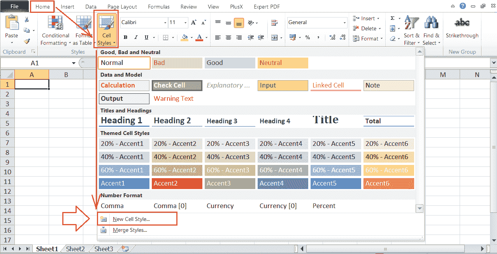
*   在下一个窗口中，Excel 显示已应用样式的现有首选项。我们可以在窗口顶部的“**样式名称**旁边输入我们的样式名称。输入自定义样式的名称后，我们需要单击“**格式**按钮来指定格式首选项。
    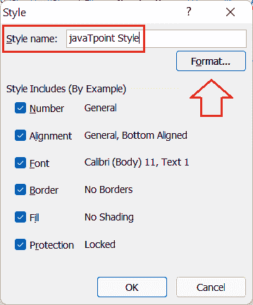
*   从样式窗口点击格式按钮后，我们会看到**单元格格式对话框**。在“设置单元格格式”对话框中，我们需要浏览所有选项卡，并选择所需的首选项，如数字、字体、边框等。
    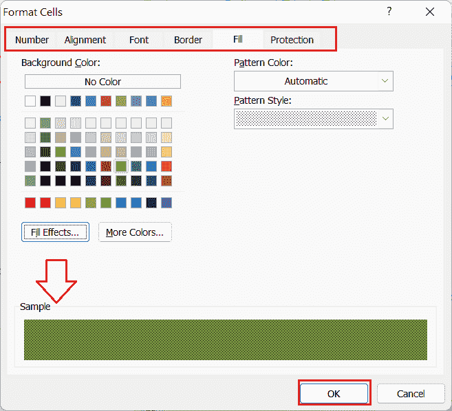
    我们选择了上图中绿色背景的自动图案颜色和点状图案样式。
*   在通过不同的选项卡选择了想要的偏好后，我们需要点击**确定**它会再次将我们移回样式窗口，如下图所示:
    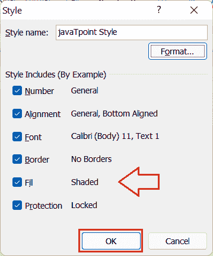
    在上图中，我们可以注意到样式窗口中的偏好与之前的有所不同。现在，它显示了我们从“设置单元格格式”对话框中选择的首选项。
*   从“样式”窗口验证选定的格式首选项后，我们需要单击**确定**按钮，将我们的自定义样式保存在活动工作簿中。我们可以在单击“确定”按钮之前，从“样式”窗口中取消选中我们不想使用的任何格式设置的复选框。
*   创建自定义样式后，我们可以通过进入**主页>单元格样式>自定义**进行访问。我们将在“自定义”选项下的样式选择窗口顶部获得我们保存的样式，如下所示:
    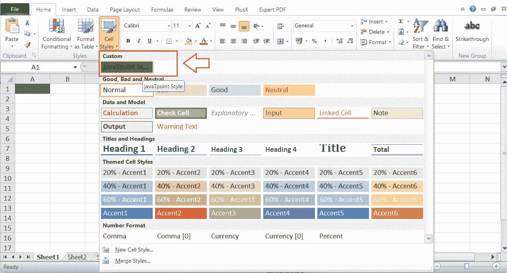
    我们可以单击我们创建的样式，它将应用于当前工作簿中选定的单元格。

#### 注意:当我们在 Excel 中创建自定义样式时，样式会保存在工作簿中。这意味着我们只能在当前工作簿的所有工作表中访问我们创建的样式，而不能在其他工作簿中访问。

## 如何将单元格样式从一个工作簿合并或导出到另一个工作簿？

如上所述，我们创建的自定义单元格样式仅保存在各自的工作簿中。因此，我们需要合并单元格样式，以便与其他工作簿使用相同的样式，这通常会将应用的样式从一个工作簿复制到另一个工作簿。

我们可以执行以下步骤将单元格样式从一个工作簿合并或导出到另一个工作簿:

*   首先，我们需要打开两个工作簿:一个是要复制/合并单元格样式的工作簿，另一个是要应用样式的工作簿。
*   接下来，我们需要转到要应用样式的工作簿。之后，我们必须导航**主页>单元格样式**并点击“**合并样式**选项，如下所示:
    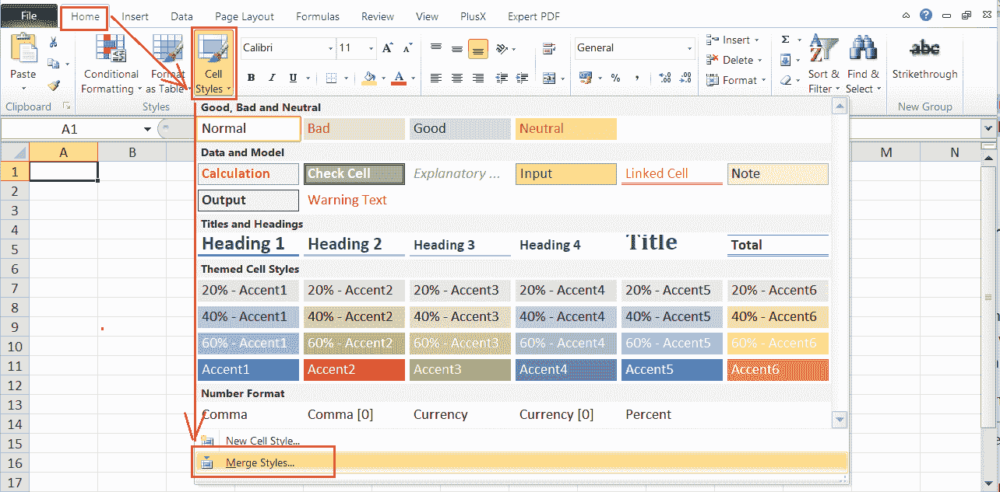
*   单击“合并样式”选项后，Excel 会显示在后台运行的其他工作簿的列表。我们可以选择要将样式合并到当前工作簿中的工作簿名称。选择好想要的工作簿后，我们必须点击**确定**
    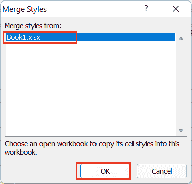
    在上图中，我们正在将 Book1.xlsx 中的样式合并到 Book2.xlsx 中
    将样式合并到想要的工作簿后，我们可以从**主页>单元格样式>自定义**中进行访问。
    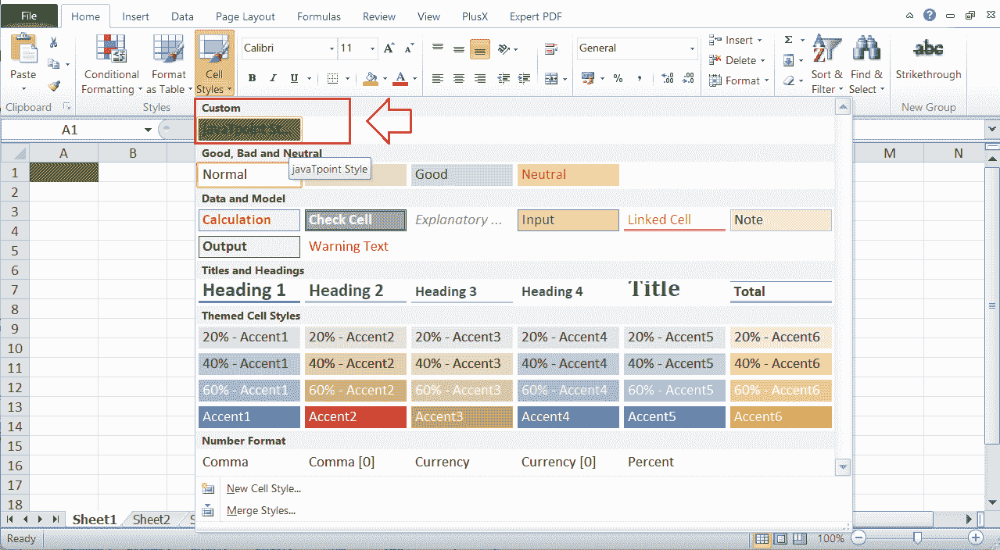

## 如何编辑单元格样式？

Excel 还允许用户根据自己的选择编辑单元格样式。我们可以在 Excel 中编辑自定义样式和现有样式。为此，我们需要完成以下步骤:

*   首先，我们需要进入**主页>单元格样式**并在我们想要编辑的样式上按右键。接下来，我们必须从列表中点击**修改**选项，如下所示:
    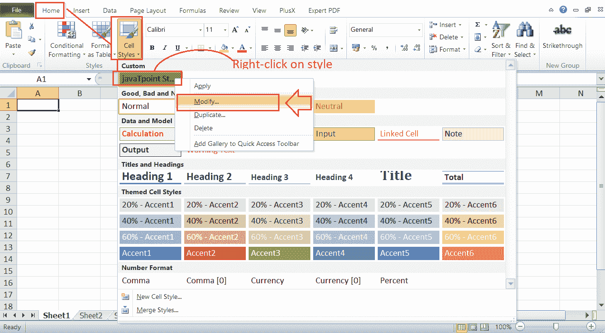
*   单击修改选项后，Excel 启动**样式**窗口，显示保存在相应样式中的当前格式首选项。由于我们想要编辑样式，我们需要从样式窗口点击**格式**按钮。
    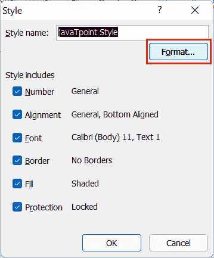
*   在**设置单元格格式**对话框中，我们可以在设置单元格格式窗口中使用它们各自的标签来更改格式。一旦我们编辑了格式首选项，我们需要点击**确定**按钮返回到样式窗口。
    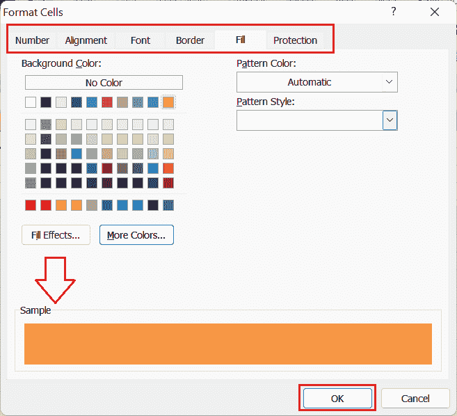
*   最后，我们需要从样式窗口中点击**确定**按钮，以保存所选样式中的所有更改。我们还可以在单击“确定”按钮之前为修改后的样式输入新名称。
    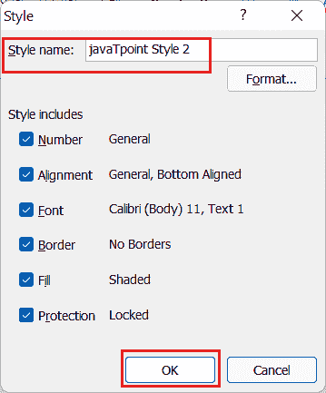
    同样，我们可以使用右键菜单列表中的其他选项来执行相关操作，如应用样式、复制样式、删除样式等。
    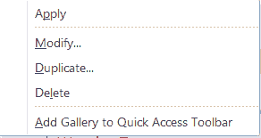

## 如何删除/清除 Excel 中的单元格样式？

如果我们不喜欢该样式，或者我们想从工作簿中完全删除应用的样式，只需遵循几个步骤。

首先，我们需要选择所有那些单元格或一个单元格范围，我们愿意从中删除应用的样式。接下来，我们需要进入**主页**选项卡，点击单元格样式图标。在下一个窗口中，我们需要单击位于顶部附近的“好、坏和中性”下的“**普通**样式。看起来是这样的:

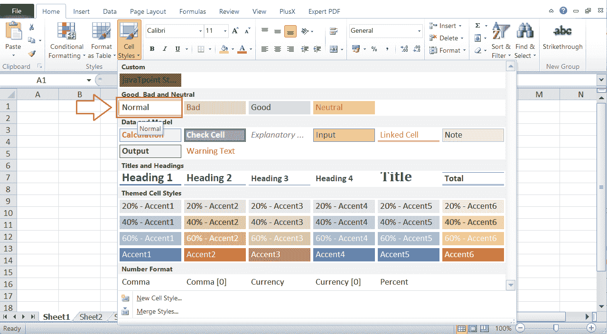

单击“正常”选项将从活动工作簿中的选定单元格中移除任何应用的样式。

## 单元格样式的快速键盘快捷键

键盘组合键或快捷键是访问 Excel 中任何特定功能或命令的最快方式。Excel 为大多数内置功能预定义了快捷方式。不幸的是，我们在 Excel 中没有任何明确的单元格样式组合键。然而，Alt 键方法工作得很好。

每当我们在 Excel 窗口处于活动状态时按下 Alt 键，我们就会激活 Excel 工具或命令的快速快捷键。Excel 然后在活动窗口内的内置工具上显示特定的键。我们只需要一个接一个地按组合键，就可以依次在 Excel 工具或功能中移动。

要访问 Excel 中的单元格样式，我们需要使用 Alt 键后跟' H '和' J '键，即" **Alt + H + J"** 。Alt 键激活快速快捷键，H 键导航主页选项卡，J 键从功能区选择单元格样式选项。

按下快捷键组合后，我们可以使用**箭头**键选择想要的样式，点击**回车**键进行应用。

对于其他单元格样式选项，我们需要使用以下快捷方式:

| 行动 | 快捷键 |
| 新单元格样式 | Alt + H + J + N |
| 合并样式 | Alt + H + J + M |

* * *