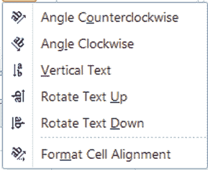
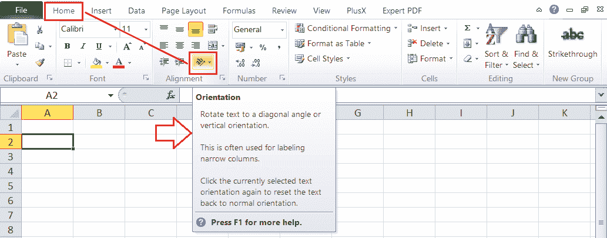
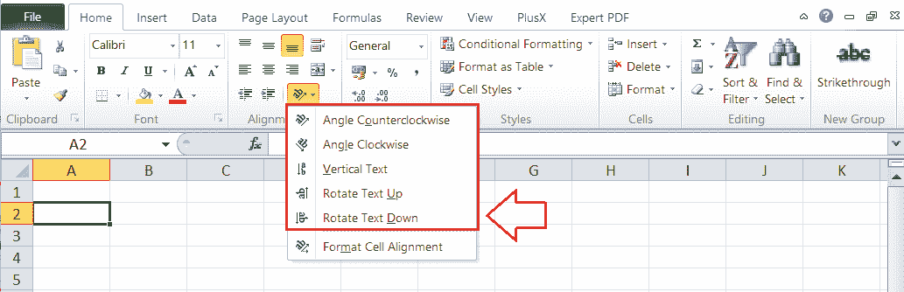
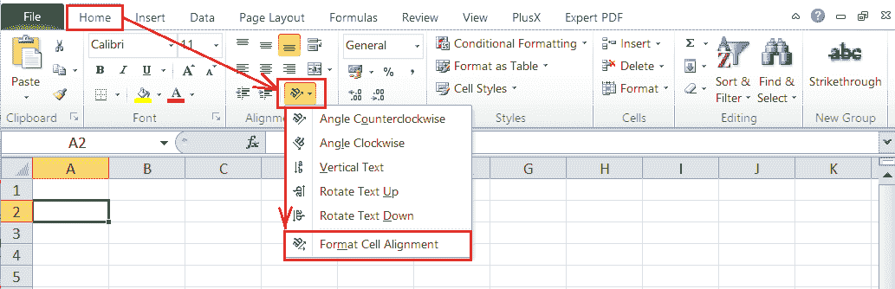
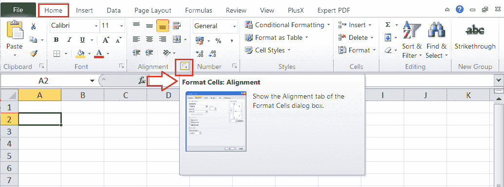
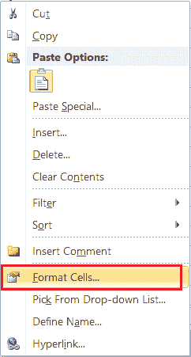
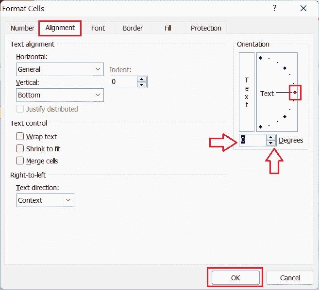
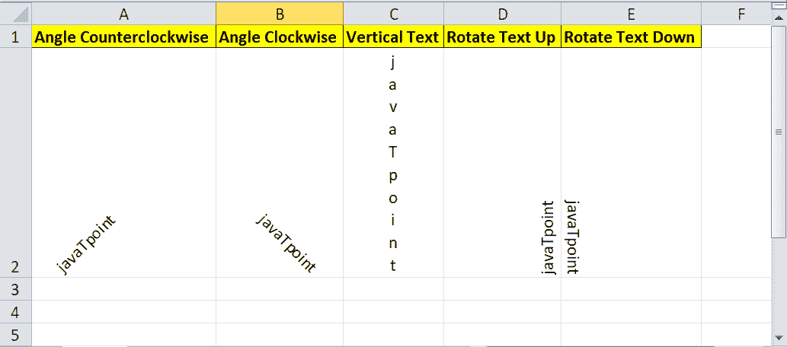

# 在 Excel 中旋转单元格

> 原文：<https://www.javatpoint.com/rotate-cells-in-excel>

Excel 是功能强大的电子表格软件，具有各种功能。它帮助我们记录大量数据，并根据我们的选择格式化数据。同样，我们使用不同的对齐选项来更改数据在单元格中的显示方式。我们可以用不同的样式改变文本的位置。Excel 中有一些旋转单元格的通用对齐选项，一般可以帮助我们在想要的单元格内旋转字体角度。

在本文中，我们将讨论在 Excel 中旋转单元格的分步方法。在讨论方法之前，让我们先了解一下 Excel 中旋转单元格的所有对齐选项。

## 在 Excel 中旋转单元格有哪些对齐选项？

当我们需要在 Excel 中旋转单元格时，我们有多个基于不同角度的对齐选项。我们可以选择预定义的选项将单元格或文本旋转到特定角度，或者为旋转角度指定任何所需的值。Excel 有以下对齐选项来帮助我们旋转单元格:

*   **逆时针角度**:该选项允许用户将单元格中的文本从单元格的左下角旋转到右上角。
*   **顺时针角度**:该选项允许用户将单元格中的文本从单元格的左上角旋转到右下角。
*   **竖排文字**:这个选项可以让我们将单元格中的文字定位到中间位置，将一个字母垂直放在另一个字母的顶部。
*   **向上旋转文本**:该选项允许我们将单元格中的文本定位到右下角，并进一步在单元格中垂直向上运行文本。
*   **向下旋转文本**:该选项允许我们将单元格中的文本定位到左下角，并进一步在单元格内垂直向下运行文本。
*   **设置单元格对齐方式**:该选项允许我们从“设置单元格格式”对话框中打开“对齐”选项卡，我们可以在其中输入任意自定义的旋转角度来相应地旋转所需的单元格。

## 如何在 Excel 中旋转单元格或文本？

Excel 有广泛的内置功能，它允许用户以不同的方式使用大多数这些功能。同样，我们也可以使用不同的方法旋转单元格。在 Excel 文档中旋转单元格或文本的最常见方法如下:

*   使用带状工具旋转单元格
*   使用单元格格式对话框旋转单元格
*   使用键盘快捷键旋转单元格

让我们详细讨论每种方法:

### 使用带状工具旋转单元格

在 Excel 中，从功能区访问任何特定的功能或工具是最常见和最直接的方法。Excel 几乎所有的内置功能都在功能区中，跨不同的选项卡和组分开。

默认情况下，当我们在 Excel 单元格中输入文本时，它会自动与单元格的左侧对齐。同样，数字与 Excel 单元格的右侧位置对齐。但是，我们需要使用 Excel 工具手动应用其他对齐选项或样式。当我们需要在 Excel 中旋转单元格时，我们可以执行以下步骤:

*   首先，我们需要选择一个单元格或单元格区域，在其中我们要应用单元格的旋转。
*   接下来，我们需要进入**首页**选项卡，点击**方位**选项，如下图:
    
*   在下一个窗口中，Excel 显示各种预定义的选项来旋转 Excel 中的单元格。
    
    我们可以点击任何想要的预定义旋转选项，它将立即应用于选定的单元格。但是，单击“设置单元格对齐格式”选项将启动“设置单元格格式”对话框。

### 使用单元格格式对话框旋转单元格

在 Excel 中旋转单元格的另一种有效方法是使用“设置单元格格式”对话框。除了预定义的角度方向选项之外，此方法对于以任何特定角度旋转像元都很有用。要使用这种方法，我们需要执行下面讨论的步骤:

*   首先，我们需要选择一个单元格或单元格区域，在其中我们要应用单元格的旋转。
*   接下来，我们需要启动一个格式化单元格对话框。为此，我们需要进入**主页**选项卡，点击**方向**图标，选择选项“**设置单元格对齐方式**”。
    
    或者，我们可以点击对齐组右下角的箭头图标。
    
    我们也可以右键点击选中的单元格，从列表中选择‘设置单元格格式’选项，启动设置单元格格式对话框。
    
    进入“设置单元格格式”对话框的快捷键是“ **Ctrl + 1** ”，其中“1”键必须只从键盘区域按下，不能从数字键盘按下。
*   在单元格格式窗口中，我们必须在**对齐**
    
    下的**方向**部分中为选定单元格指定所需的旋转角度。旋转按钮(与框链接的上下箭头)也可用于自动填充值，以将选定单元格旋转为小值。或者，我们可以单击，按住红点并用鼠标旋转它来获得所需的对齐。
*   设置好所需的旋转角度后，我们必须单击**确定**所需/选定的旋转角度将应用于工作表中选定的单元格。

### 使用键盘快捷键旋转单元格

当我们经常需要在 Excel 中旋转单元格时，选择工作表中的单元格后使用键盘快捷键是很好的，这大大节省了我们的时间。

下表显示了在选定单元格中旋转文本的键盘快捷键:

| 行动 | 快捷键 |
| 逆时针角度 | Alt + H + F + Q + O |
| 顺时针角度 | Alt + H + F + Q + L |
| 文字垂直排列 | Alt + H + F + Q + V |
| 向上旋转文本 | Alt + H + F + Q + U |
| 向下旋转文本 | Alt + H + F + Q + D |
| 单元格对齐格式 | Alt + H + F + Q + M |

使用上述键盘快捷键时，我们需要依次按下每个键。

## 移除单元格旋转

如果我们不喜欢，也可以去掉细胞的旋转。我们可以通过下面讨论的方法来做到这一点:

*   如果我们想在 Excel 工作表中应用单元格旋转后删除它们，我们可以使用 Excel 窗口中的“撤消”按钮。或者，我们也可以使用撤销快捷方式，即 **Ctrl + Z** 。
*   如果有一个单元格，我们想从中删除单元格旋转，我们需要选择特定的单元格。这将在“主页”>“方向(旋转)”命令下的选定单元格上显示应用的旋转样式。我们可以再次单击应用的旋转选项来禁用它。但是，如果使用“设置单元格格式”对话框应用了任何自定义旋转角度，则此方法不起作用。
*   消除单元格旋转的最有效方法是在 Excel 中使用“清除格式”选项。为此，我们需要选择特定的单元格或单元格范围，然后转到编辑组下的**主页>清除>清除格式**。当我们希望稍后在 Excel 文档中移除单元格旋转或应用了任何特定的旋转角度时，此方法非常有用。

## 带有旋转文本的单元格示例

如上所述，Excel 有各种旋转单元格的对齐选项。我们可以轻松地将所需的单元格或数据旋转到不同的角度，无论是顺时针、逆时针还是垂直。

旋转单元格的示例可以在下面的 Excel 工作表中看到:

在上图中，带有数据的单元格使用预定义的旋转选项进行旋转。如果我们想要旋转到任何精确的角度，我们可以使用“设置单元格格式”对话框指定旋转的度数。

* * *