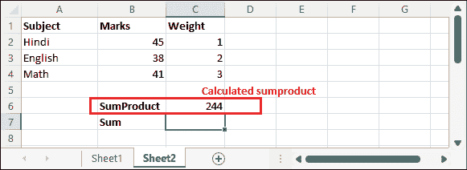
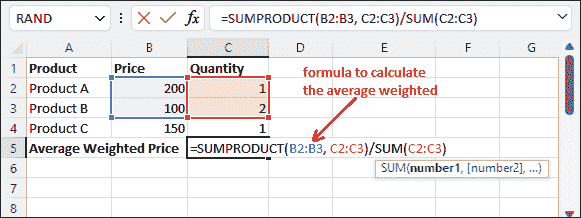

# 在 Excel 中计算加权平均值

> 原文：<https://www.javatpoint.com/calculate-average-weighted-in-excel>

你听说过加权平均数或平均值吗？通常，我们不能计算日常生活中的一切。让我们假设计算一周的天气。在这种情况下，我们不会告诉每天的温度。取而代之的是，我们将找到对一周温度的估计。

通常，用户将平均值计算为**数值之和/数值个数。**它返回这些值的平均值。要计算加权平均值，可以使用 Excel 的 SUM 和 SUMPRODUCT 函数。

可能会有各种情况，您可能需要计算平均加权。因此，我们将描述在微软 Excel 中使用其内置公式计算加权平均值的方法。

## 如何计算加权平均？

Excel 用户需要两个函数来计算加权平均值，即 SUM 和 SUMPRODUCT。这些函数将用于在 Excel 中找出加权平均值。如果你简单地使用 AVERAGE 函数，它会找到正常的平均值。所以，记住——简单平均和加权平均是不同的。

现在，让我们看看 SUM 和 SUMPRODUCT 函数是如何计算加权平均值的。

### SUM()

您可能已经在前面使用了 SUM()函数。这是 Excel 中最常用的函数，有助于计算数字的总和。该函数使用户能够计算单元格区域的总和。

**语法**

在 Excel 中，使用如下函数:

```

=SUM(number1, number2, .....)

```

### SUMPRODUCT（）

SUMPRODUCT()是与 SUM()函数一起使用的另一个函数，用于计算加权平均值。它返回数组或参数中给定值的乘积之和。当用户需要将多个单元格放在一起时，通常需要该功能。

**语法**

在 Excel 中，使用如下函数:

```

=SUMPRODUCT(array1, array2, .....)

```

通常，SUMPRORDUCT()函数接受两个参数。一个用于值数组，另一个用于它们的权重数组。所以，这些函数一起计算平均加权。

### 示例 1:简单平均计算

平均和平均加权项是不同的。所以，请不要混淆他们。如果用户简单地使用 AVERAGE()函数，它将在计算给定值后返回简单平均值。对于简单的平均值计算，Excel 用户使用数学公式，即**数值之和/数值个数。**

以下是计算简单平均值的示例和步骤。遵循给定的一条:

**第一步:**假设我们有一个学生三科成绩的以下数据。为此，我们需要计算平均值。


**第二步:**那么，我们就用简单的数学 Excel 公式。选择目标单元格，导航至**公式**选项卡。


**第三步:**在公式选项卡中，点击**自动求和**下拉按钮，选择**平均**公式。


**第 4 步:**一旦点击**平均值**，所选单元格的平均值将被计算并显示在下面的单元格中。


这是使用 Excel AVERAGE()公式进行的正常平均值计算。

## 计算平均加权

这一次，我们将使用 Excel 的 SUM 和 SUMPRODUCT 函数计算加权平均值，正如我们前面已经讨论过的那样。它的计算过程与简单的平均计算完全不同。

平均加权需要值及其相应的权重。SUMPRODUCT 函数的工作原理实际上类似于- (45*1)+(38*2)+(41*3)。让我们举个例子来计算平均加权。

### 例 1

**第一步:**我们有以下带有数值及其权重的数据，我们将为其计算加权平均值。


现在，我们将使用 SUM 和 SUMPRODUCT 函数来找出加权平均值。

**第二步:**首先使用 SUMPRODUCT 函数，通过分值范围和权重范围作为自变量。

=SUMPRODUCT(B2:B4，C2:C4)


**步骤 3:** 将计算结果保存在一个单元格中，该单元格将进一步用于计算加权平均值。



#### 注:SUMPRODUCT 函数以这样的方式执行此计算:(45 * 1) + (38 * 2) + (41 * 3) = 370。

**第 4 步:**现在，使用以下公式计算权重之和。

=SUM(C2:C4)


**第五步:**按**回车**键，将结果保存在单元格中。


**第 6 步**:现在，使用第 3 步和第 5 步的计算结果(分别存储在 C6 和 C7 单元格中)计算加权平均值。

=C6/C7


**第七步:**点击**进入**键，得到上述数据的加权平均值。


以这种方式，可以为数据集计算平均加权。

### 示例 2:当权重加起来达到 100%时

取 Excel 中的一些数据，用百分比而不是数字表示五个科目的分数和权重。我们有这个分数和百分比权重，如下所示。


在这里，你可以看到所有重量的总和是 100%。现在，让我们学习计算这些数据的加权平均值。

**第一步:**首先，使用 sumproduct()函数计算标记的 SUMPRODUCT。

=SUMPRODUCT(B2:B6，C2:C6)


**第二步:**点击**进入**键，得到和积的计算结果。


**第三步:**现在，使用下面的 SUM()函数计算权重之和。

=SUM(C2:C6)


**第四步:**再按一次**回车**键，得到结果，即 100%。


**步骤 5:** 现在，使用以下公式将计算出的总和除以总和。

=E3/E4


**第六步:**看到你会发现加权平均和计算出来的和积是一样的，是 43.76。


这是因为权重加起来是 100%。这意味着权重之和是 100%。

### 示例 3:当权重不等于 100%时

在上面的例子中，权重的分配方式是总和为 100%。现在，这次我们将给出一个权重总和不是 100%的例子。但是一直以来，不可能所有的权重总和都是 100%。

在这个例子中，我们将在 Excel 中获取一些数据，这些数据有五个主题的分数以及百分比权重。该数据创建如下。


在这里，你可以看到所有重量的总和不是 100%，就像上面的例子一样。现在，让我们学习在权重没有加到 100%时计算数据的平均加权。

**第一步:**首先，使用 sumproduct()函数计算标记的 SUMPRODUCT。

=SUMPRODUCT(B2:B6，C2:C6)


**第二步:**点击**进入**键，得到和积的计算结果。


**第三步:**现在，使用下面的 SUM()函数计算权重之和。

=SUM(C2:C6)


**第四步:**再按一次**回车**键得到结果，即 130%。


**步骤 5:** 现在，使用以下公式将计算出的总和除以总和。

=E3/E4


**第 6 步:**看到现在计算的是加权平均值，与前面例子中的 sumproduct 不同。


### 示例 4 -当需要计算权重时

这个例子与上面讨论的其他例子有点不同。对于这个例子，我们已经获取了您在日常生活中需要解决的真实场景数据。

您会注意到，该数据中还指定了权重。有时，也可能无法直接获得权重。在这种情况下，您可能需要先计算权重，然后计算加权平均值。

假设您有三种不同类型的产品详细信息，如下所述:


您可以使用以下 SUMPRODUCT 和 SUM 公式计算每种产品的加权平均价格。以下是您可以使用的公式:

=SUMPRODUCT(B2:B6、C2:C6)/SUM(C2:C6)



在这个公式中，我们将 SUMPRODUCT 结果除以权重(数量)的总和，以确保权重相加达到 100%。

现在，按下**进入**键，得到计算的平均加权结果。


* * *