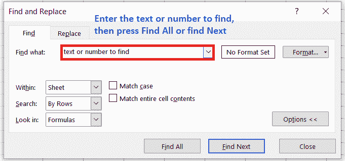
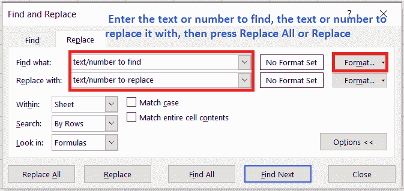
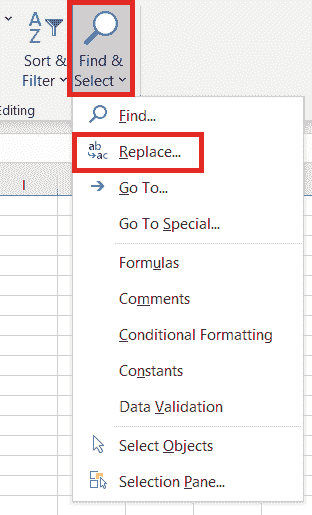
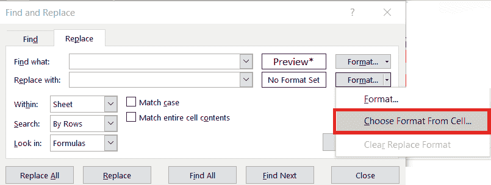
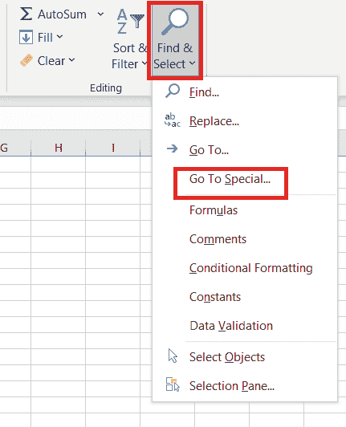
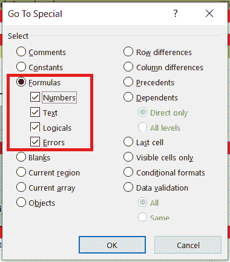

# 在 Excel 中查找和替换

> 原文：<https://www.javatpoint.com/find-and-replace-in-excel>

在 Excel 中，如果我们想搜索工作簿中的任何内容，如**特定数字**或**文本字符串**，那么我们可以使用**查找和替换**功能。我们可以选择定位搜索项以供参考，或者用其他东西替换它。我们可以在搜索词中包含各种通配符，如**星号、潮汐、问号、**和**数字**。我们可以按行和列搜索，在值或注释中搜索，以及用工作表或整个工作簿搜索。

如果我们在 Excel 中处理大量数据，查找特定信息可能会很有挑战性且耗时。我们可以使用**查找**功能来快速搜索我们的工作簿，我们也可以使用**替换**选项来更改文本。

使用大型 Excel 电子表格时，能够在任何给定时间轻松找到我们需要的信息至关重要。扫描数百行和数百列不是最好的方法，所以让我们更深入地看看 Excel 的**查找和替换**功能提供了什么。

## 查找内容

为了在工作簿中找到一些东西，我们必须按下 **Ctrl+F，**或者使用另一种方式，那就是我们去**主页>编辑>查找&选择>查找**。

#### 注意:在这个例子中，我们将点击选项>>按钮来显示整个查找对话框。默认情况下，它将显示隐藏的选项。

1.首先，在**中找到什么**；框中，我们必须键入需要查找的**号**或**文本**，或单击**中的箭头查找什么**:框，然后从列表中选择最近的搜索项目。

**提示:**在我们的搜索条件中，我们可以使用**通配符**，如**星号(*)、问号(？)，**和**颚化符(~)。**

*   我们可以使用**星号(*)** 来查找任意数量的字符。例如 **s*d** 发现**【伤心】****【开始】。**
*   我们可以用一个**问号(？)**查找任意单个字符。例如，**年代？测试**找到**“坐位”**和**“设定”。**
*   我们可以用**颚化符(~)** 后跟**？、*、**或 **~** 以便查找问号、星号或其他颚化符。比如 **fy91~？**找到**“91 财年？”。**

2.现在，我们必须点击“查找全部”或“T2”【查找下一个】来运行我们的搜索。

**提示:**当我们点击**全部查找时，**会出现一个我们正在寻找的条件的所有出现的列表，点击列表中的特定出现会选择它的单元格。通过点击列标题，我们可以对**查找所有**搜索的结果进行排序。

3.接下来，我们必须点击**选项> >** ，以便在需要时进一步定义我们的搜索:

*   **在:**内选择**工作表**或**工作簿**在工作表或整个工作簿中搜索数据。
*   **搜索:**我们可以选择按行搜索**(默认)或按列搜索**。****
***   **向内看:**我们必须点击**公式、数值、注释、**或**注释**，才能搜索具有特定细节的数据。**

 **#### 注意:公式、值、注释和注释仅在“查找”选项卡上可用；“替换”选项卡上只有公式可用。

*   **匹配大小写:**如果需要搜索**区分大小写的**，可以用这个
*   **匹配整个单元格内容:**如果我们希望搜索仅包含字符的单元格，我们可以使用此选项，我们在**查找内容**:框中键入字符。
*   如果我们希望查找具有指定格式的文本或数字，请单击“格式”，然后使用“查找格式”对话框进行选择。

**提示:**如果我们希望查找只匹配特定格式的单元格，那么我们可以删除**查找什么**框中的任何条件；之后，选择特定的单元格格式。**点击**格式**旁边的箭头，从单元格**中选择格式，然后点击我们想要查找的格式的单元格。

## 替换所有内容

为了替换文字或数字，我们要按 **Ctrl+H** 或者去**首页>编辑>查找&选择** **>替换。**

#### 注意:在下面的示例中，我们通过单击选项>>按钮显示了整个查找对话框。它将打开，默认情况下隐藏选项。

1.在**查找什么**:框中，我们需要输入需要查找的数字或者文字，或者我们可以点击**查找什么**:框中的箭头，然后从列表中选择一个最近的搜索项目。

**提示:**我们可以使用**通配符**如**星号(*)、问号(？)，tilde (~)** 在我们的搜索条件中。

*   我们可以使用**星号(*)** 来查找任意数量的字符，例如， **s*t** 查找**sat**和**subject。**
*   我们可以用问号(？)以便找到任何单个字符——例如， **a？t** 找到**【alt】**和**【apt】**。
*   我们可以用波浪号(~)后跟**？、*、**或 **~** 以便查找问号、星号或其他颚化符-例如， **fy91~？**找到**“91 财年？”**。

2.在**替换为**框中输入我们需要替换搜索文本的文本或数字。

3.点击**替换** **全部**或**替换**

**提示:**当我们点击**全部替换时，**将会**替换**我们正在寻找的标准的所有出现，而**替换**将一次更新一个实例。

4.点击**选项> >** ，以便在必要时进一步定义我们的搜索。

*   **内:**要在工作表或整个工作簿中搜索数据，请选择**工作表**或
*   **搜索:**我们可以选择按行搜索**(默认)或按列搜索**。****
***   **查看:**要搜索具有特定细节的数据，请在框中单击**公式、注释、**T4】注释或**

 **#### 注意:公式、值、注释和注释仅在“查找”选项卡上可用；“替换”选项卡上只有公式可用。

*   **匹配大小写-** 如果我们想找区分大小写的，那么可以用这个。
*   **匹配整个单元格内容:**选择此选项，如果我们希望搜索仅包含字符的单元格，我们在**查找内容**:框中键入。

5.如果我们希望查找具有特定格式的文本或数字，请单击**格式**，然后使用**查找格式**对话框进行选择。

**提示:**如果需要查找只匹配特定格式的单元格，可以删除**查找内容**框中的任意条件，然后选择特定的单元格格式作为示例。单击**格式旁边的箭头，**单击**从单元格中选择格式，**然后单击包含我们需要搜索的格式的单元格。

## Excel 中查找和替换的用法(示例)

Excel 的查找和替换功能可以帮助我们节省大量的时间，这是目前最重要的。在本教程中，我们将讨论一些在 Excel 中使用**查找和替换**的例子。

### 示例 1:在 Excel 中查找和替换格式

如果我们希望用新格式替换旧格式，这是一个有用的特性。例如，假设我们有黄色背景颜色的单元格，并希望将所有单元格的背景颜色都更改为橙色。我们可以使用“查找和替换”一次完成所有操作，而不是手动完成。

以下是执行此操作的步骤:

1.  首先，我们必须选择需要查找和替换格式的单元格。如果我们需要在整个工作表中查找并替换特定格式，请选择整个工作表。
2.  转到**主页- >查找并选择- >替换(键盘快捷键-控制+ H)。**
    
3.  接下来，我们要点击**选项**这将展开对话框并显示其他选项。
    T3】
4.  单击查找格式按钮。将出现一个下拉菜单，有两个选项:**格式**和**从单元格**中选择格式。
    *   通过单击“格式”按钮，我们可以手动指定需要查找的格式，或者从工作表的单元格中选择格式。为了从单元格中选择格式，我们必须选择**“从单元格中选择格式”**选项，然后单击我们需要从中选择格式的单元格。
        T3】
    *   一旦我们从单元格中选择一种格式或从“设置单元格格式”对话框中手动指定它，我们将在“格式”按钮左侧看到一个**预览**。
        T3】
5.  接下来，我们必须指定我们想要的格式，而不是我们在前一阶段选择的格式。选择**用**格式按钮替换**。**将显示一个下拉菜单，有两个选项- **格式**和**从单元格中选择格式。**
    

    *   我们可以通过单击“格式”按钮手动指定它，或者通过单击包含它的单元格从工作表中选择现有格式。
    *   每当我们从一个单元格中选择一种格式或从格式单元格对话框中手动定义它时，我们会在格式按钮的左侧看到一个**预览**。
        T3】
6.  点击**全部替换**

### 示例 2:添加或删除换行符

当我们必须移动到 Excel 单元格中的新行时，我们该怎么办？

我们按 **Alt +回车**。

如果我们想恢复原状会发生什么？

我们手动删除它…对吗？

假设我们有大量需要删除的换行符。手动删除换行符可能需要很长时间，我们不必手动完成。Excel 的“查找和替换”功能有一个很酷的妙招，可以快速完成这项工作。

以下是我们必须使用的步骤，以便一次删除所有换行符:

1.  首先，我们必须选择需要删除换行符的数据。
2.  转到**主页- >查找并选择- >替换**(快捷键-控制+ H)。
    T3】
3.  在**查找和替换**对话框中:
    *   找到什么:按下**控制+ J** (除了一个闪烁的点，我们可能什么也看不到。
    *   替换为:**空格键字符**(按空格键一次)。
        T3】
4.  点击**全部替换。**

### 示例 3:在 Excel 中查找带有公式的单元格

如 Excel 的“查找”附加选项所述，我们只能使用 Excel 的**查找和替换**功能在公式中搜索给定值。使用**转到**特殊功能查找包含公式的单元格。

**第一步:**首先，我们要选择需要查找公式的单元格区域，或者点击当前工作表中的任意单元格，在整个工作表中进行搜索。

**第二步:**点击**旁边的箭头找到&选择**，然后我们要点击**去特价。**或者，我们可以输入 **F5** 打开 **Go T** o 对话，点击左下角的**特殊**按钮。

**第三步:**在**转到特殊**对话框中，我们必须选择**公式，**然后勾选我们想要查找的公式结果旁边的框，然后点击**确定:**

*   **数字:-** 查找返回包含日期的数值的公式，
*   **文本:-** 搜索返回文本值的公式。
*   **逻辑:** -查找返回布尔值**真**和**假**的公式。
*   **错误:-** 查找含有导致类似**#不适用，#名称？#REF！，#VALUE，#DIV/0！，#NULL！，**和**#小水！**

如果微软 Excel 找到任何符合我们标准的单元格，这些单元格将被突出显示；否则，将显示一条消息，说明没有找到这样的单元。

#### 注意:为了快速查找包含公式的所有单元格，无论公式结果如何，请单击“查找并选择”>“公式”。

## Excel 中查找和替换的快捷方式

以下是在 Excel 中查找和替换的快捷方式:

*   **Ctrl+F: -** 在 Excel 中，这个快捷方式是**查找**快捷方式，打开 ***查找&替换的**查找**标签。***
*   **Ctrl+H: -** 在 Excel 中，这个快捷键是**替换**快捷键，打开 ***查找&替换的**替换**页签。***
*   **Ctrl+Shift+F4: -** 此快捷键用于识别搜索值的在先出现。
*   **Shift+F4: -** 此快捷键用于查找下一个出现的搜索值。
*   **Ctrl+J: -** 我们使用这个快捷方式来查找或替换换行符。

* * *****