# Excel 偶数函数

> 原文:[https://www.javatpoint.com/excel-even-function](https://www.javatpoint.com/excel-even-function)

在本教程中，我们将发现如何使用 Excel EVEN 函数。偶数函数是一种数学函数，它将给定的数字四舍五入到最接近的下一个偶数。偶数函数以一个数字作为参数，并在单元格中返回一个偶数。

## 什么是 Excel EVEN 函数？

> Excel EVEN 函数将正数向上舍入，负数向下舍入到最接近的偶数。

Excel EVEN 函数通过将指定的数字舍入到下一个偶数来返回一个数值。偶数函数总是从零开始舍入数字。因此，正数变大，负数变小(即更负)。这个函数只接受一个参数(数字)，它应该是一个数值。如果在其参数中传递非数字，它将抛出#VALUE！错误。

### 句法

```

=EVEN (Number/Cell)

```

### 因素

**Number(必选):**此参数表示要转换为最接近的偶数的单元格。

### 返回

*   如果在参数中传递正数，EVEN 函数会将给定的数字四舍五入到下一个偶数，从而返回一个正偶数。
*   如果在参数中传递正数，EVEN 函数会将给定的数字从零向下舍入到下一个负整数，从而返回一个负偶数。
*   如果在参数中传递零(0)和已经是偶数的数字，则数字不变。
*   对于非数值，EVEN 返回#VALUE！错误。

### 偶数函数的注意事项

1.  EVEN 函数只适用于数值。
2.  EVEN 函数为任何指定的十进制数返回最近的下一个偶数。
3.  该函数返回远离零的数字。
4.  EVEN 函数只适用于数值。如果在其参数中提供任何非数值，它将抛出#VALUE！错误。
5.  如果在参数中传递零(0)和已经是偶数的数字，则不会发生舍入。

## 例子

### 示例 1:使用 EVEN 函数对以下示例中的数字进行舍入。

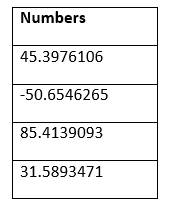

按照以下步骤将数字四舍五入到最接近的偶数:

**第一步:插入辅助栏**

在“数字”旁边添加一列，并在单元格顶部键入列名“偶数舍入”。

它看起来类似于下图:

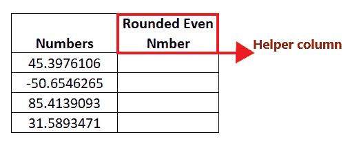

在帮助列中，我们将为每一行键入偶数函数，并将数字四舍五入到最接近的偶数。

#### 注意:如上图所示，我们已经用边框和字体格式化了列，以使工作表在视觉上更有吸引力。

**第二步:插入偶数公式**

下一步是输入公式，将光标放在助手列的第二行，开始键入:= EVEN(

它看起来类似于下图:

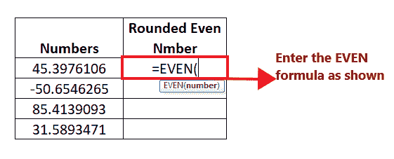

**第三步:添加“数字”参数**

第一个参数包括“number”，它表示要转换为最接近的偶数的单元格。这里，单元格引用 B5 保存我们的文本 1。所以我们的公式变成:=EVEN (B5)

它看起来类似于下图:

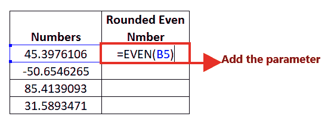

**第四步:偶数将返回偶数**

偶数(B5)将在四舍五入到最接近的偶数后返回偶数。 ***距离 45.3976106 最近的偶数是 46*** ，这个函数返回了同样的输出。

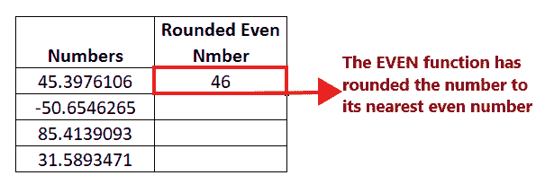

**第五步:将公式拖到其他行重复**

将光标放在公式单元格上，并将其移向矩形框的右侧。您会注意到光标将变成“+”图标。

它看起来类似于下图:

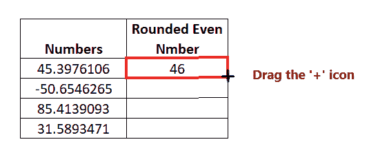

将+图标拖到它下面的所有单元格。这将自动将 EVEN 函数复制到所有单元格中。因此，在四舍五入到最接近的偶数后，偶数将返回整数。

每个数字都有以下输出:


**步骤 6:各输出的说明**

*   上表中的第一个数字是 45.3976106。当我们对这个数字应用偶数函数时，它返回了最接近的偶数整数值，即 46。EVEN 函数总是将数字从零舍入，因此正值变大，因此它返回 46。
*   对于第二个数字，-50.6546265 的四舍五入的负偶数是 52。EVEN 函数总是从零开始舍入数字，因此负数变小，因此它返回 52。
*   对于第三个数字，85.4139093 的四舍五入偶数是 86。
*   第四个值也是如此，31.5893471 的偶数为 32。

### 示例 2:在下表中，使用 Excel EVEN 函数查找所有偶数，并计算列表中有多少个偶数。

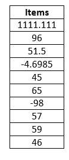

要从上面的列表中找到偶数的计数，我们将使用 Excel EVEN 和 COUNTIF 函数的组合。遵循下面给出的步骤来实现相同的效果:

**步骤 1:插入两个辅助列**

*   在“数字”旁边添加一列，并在单元格顶部键入列名“偶数”。
*   添加另一个帮助列，并将其命名为“偶数总数”

它看起来类似于下图:

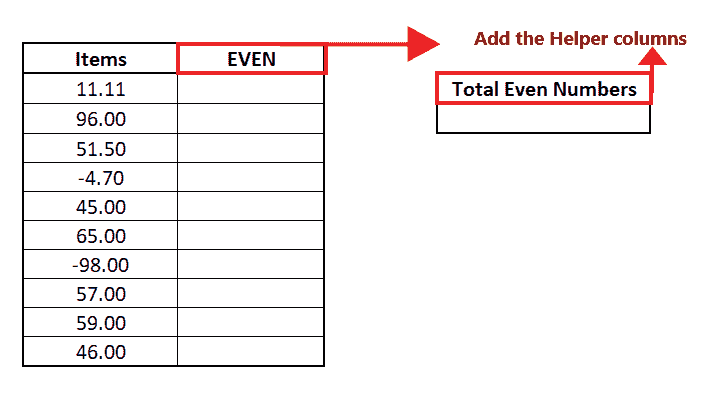

*   在第一个帮助列中，我们将应用偶数函数，并检查每个给定的数字，是偶数还是奇数。
*   在第二个帮助列中，我们将应用 COUNTIF 函数，并计算列表中出现的偶数。

**第二步:插入公式=单元格引用**

下一步是输入公式。以=(符号)开始公式，然后我们将传递数据单元格的引用。在我们的例子中，我们的数据在单元格 B5 中，所以我们的公式变成:=B5

它看起来类似于下图:

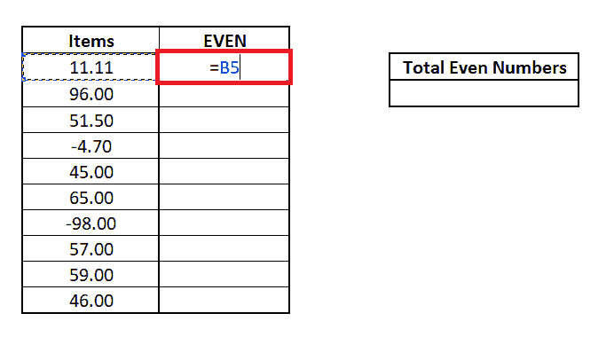

**第三步:插入偶数公式**

*   我们将以上公式与 EVEN 函数的输出进行比较。键入“=”符号，然后通过键入以下内容输入公式:= B5 = EVEN(

它看起来类似于下图:

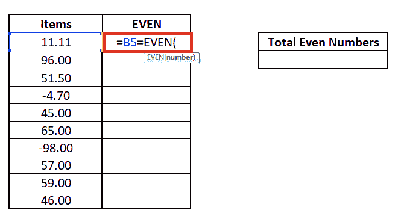

*   包括第一个参数“Text1”，它代表要转换为最接近的偶数的单元格。这里，单元格引用 B4 保存我们的文本 1。所以我们的公式变成:= B5 =偶数(B5)

它看起来类似于下图:

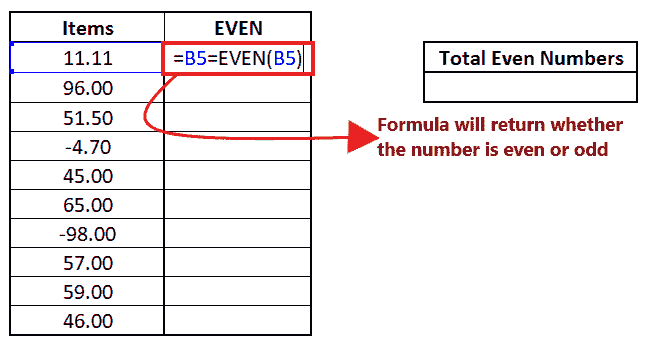

上面的公式将检查单元格 B5 中的值是否等于最接近的偶数。如果相等，则返回真；如果不相等，它将返回 FALSE。

**第四步:偶数将返回偶数**

上述公式的组合将返回布尔值 False，因为 A2 (11.11)和偶数(11.11)不相等。

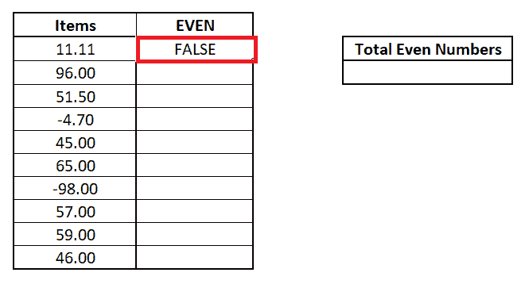

**第五步:将公式拖到其他行重复**

*   将光标放在公式单元格上，并将其移向矩形框的右侧。您会注意到光标将变成“+”图标。
*   将+图标拖到它下面的所有单元格。这将自动将 EVEN 函数复制到所有单元格中。因此，在四舍五入到最接近的偶数后，偶数将返回整数。

您将获得以下布尔输出:

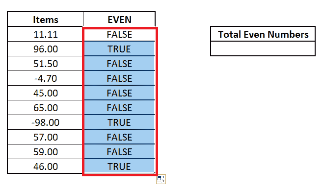

**第六步:应用 COUNTIF 公式得到偶数总数**

在单元格 E6 中应用 COUNTIF 公式，得到“真”的总计数，它代表列表中的偶数。所以我们将使用以下公式:

=COUNTIF (C5: C14，“真”)

参考下图:

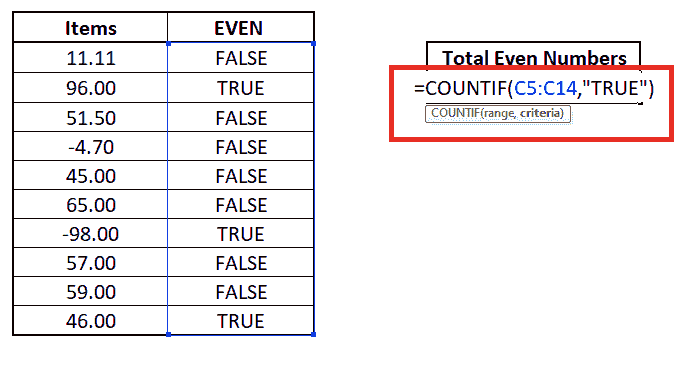

**第七步:COUNTIF 将返回偶数总数**

这里，COUNTIF 公式计算 C5: C14 范围内的所有真值，并返回所有真值的总数。C5: C14 范围内的真值总数为 3。这意味着列表中有 3 个偶数。

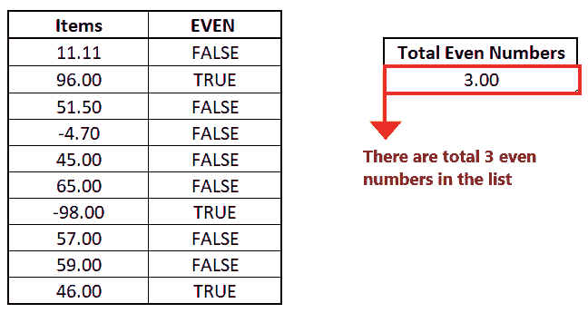

### 示例 3:在下表中，我们有一些数据输入的文本，让我们看看当我们使用 Excel EVEN 函数时会发生什么。

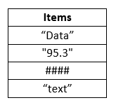

遵循下面给出的步骤来实现相同的效果:

**第一步:插入辅助栏**

在“项目”旁边添加一列，并在单元格顶部键入列名“偶数”。

它看起来类似于下图:

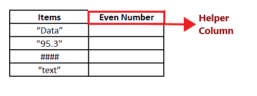

在帮助列中，我们将检查每个给定的数字是偶数还是奇数。

**第二步:插入偶数公式**

*   输入公式，将光标放在帮助列的第二行，开始键入:= EVEN(
*   包括参数“数字”，它表示要转换为最接近的偶数的单元格。这里，单元格引用 B4 保存了我们的值。所以我们的公式变成:= EVEN(B5)

它看起来类似于下图:

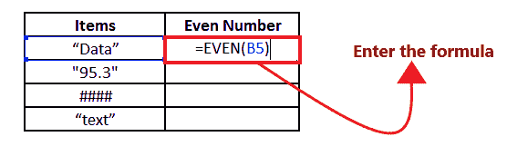

**步骤 3: EVEN 将返回错误**

EVEN 函数只适用于数值。如果在其参数中提供任何非数值，它将引发#VALUE！错误。在 B5 单元格中，我们提供了字符串值。因此，偶数(B5)公式返回了#VALUE！错误如下图所示:

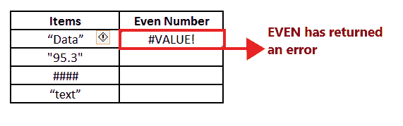

当您拖动其余单元格的公式时，您会发现相同的#VALUE！错误，因为所有值都不是数字。

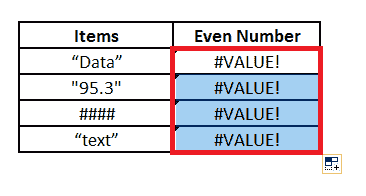

* * *