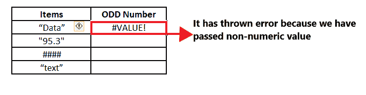

# Excel 奇数函数

> 原文：<https://www.javatpoint.com/excel-odd-function>

当你第一次听到 ODD 这个名字的时候，听起来可能像是某种正常的函数，告诉你一个数字是不是奇数。但是这个定义并不局限于此，因为你可以把 Excel ODD 函数和其他函数集成起来，解决各种复杂的问题。

在本教程中，我们将通过几个例子来发现 Excel ODD 函数的基本和高级应用，例如它的用法将变得非常清楚。

## 什么是 Excel ODD 函数？

> Excel 奇数函数将正数向上舍入，负数向下舍入到最接近的奇数整数。例如，如果您传递以下输入=ODD (-2.5)，此函数将返回-3 的舍入输出，如果指定的输入为=ODD(2.5)，则返回的输出将为 3。

Excel ODD 函数通过将指定的数字舍入到下一个奇数来返回一个数值。奇数函数总是从零开始舍入数字。因此，正数变大，负数变小(即更负)。这个函数只接受一个参数(数字)，它应该是一个数值。如果在其参数中传递非数字，它将抛出#VALUE！错误。

### 句法

```

=ODD (Number/Cell)

```

### 因素

**Number(必选):**此参数表示要转换为最接近的奇数的单元格。

### 返回

该函数将正数向上舍入，负数向下舍入到最接近的奇数后，返回奇数。

### 奇数函数的注意事项

1.  ODD 函数只适用于数值。
2.  ODD 函数为任何指定的十进制数返回最近的下一个奇数。
3.  该函数返回远离零的数字。
4.  ODD 函数只适用于数值。如果在其参数中提供任何非数值，它将抛出#VALUE！错误。
5.  如果在参数中传递零(0)和已经是奇数的数字，则不会发生舍入。

## 例子

**示例 1:使用 ODD 函数对以下示例中的数字进行舍入。**


按照以下步骤将数字四舍五入到最接近的奇数:

**第一步:插入辅助栏**

在“数字”旁边添加一列，并在单元格顶部键入列名“奇数舍入”。

它看起来类似于下图:


在帮助列中，我们将为每一行键入奇数函数，并将这些数字四舍五入到最接近的奇数。

#### 注意:如上图所示，我们已经用边框和字体格式化了列，以使工作表在视觉上更有吸引力。

**第二步:插入奇数公式**

下一步是输入公式，将光标放在助手列的第二行，开始键入:= ODD(

它看起来类似于下图:


**第三步:添加数字参数**

第一个参数包括“数字”，它代表要转换为最接近的奇数的单元格。这里，单元格引用 B4 保存我们的数值。所以我们的公式变成:=ODD (B5)

它看起来类似于下图:


**第四步:ODD 将返回最近的 ODD 整数**

奇数(B5)将在四舍五入到最接近的奇数后返回奇数整数。


**第五步:将公式拖到其他行重复**

将光标放在公式单元格上，并将其移向矩形框的右侧。您会注意到光标将变成“+”图标。

它看起来类似于下图:


将+图标拖到它下面的所有单元格。这将自动将 ODD 函数复制到所有单元格。因此，奇数将在四舍五入到最接近的奇数后返回整数。


**步骤 6:各输出的说明**

*   上表中的第一个数字是 45.3976106。当我们对这个数字应用 ODD 函数时，它返回了最近的 ODD 整数值，即 46。该函数将给定的数值从零舍入，因此正值变大，因此它返回 47。
*   对于第二个数字，-50.6546265 的舍入的负奇数是 52。该函数将给定的数值从零舍入到远离零的数字，因此负数变小，因此它返回-51。
*   对于第三个数字，85.4139093 的四舍五入奇数是 87。
*   第四个值也是如此，31.5893471 的奇数为 33。

### 示例 2:在下表中，使用 Excel ODD 函数查找所有奇数，并计算列表中有多少个奇数。


要从上面的列表中找到奇数的计数，我们将使用 Excel ODD 和 COUNTIF 函数的组合。遵循下面给出的步骤来实现相同的效果:

**步骤 1:插入两个辅助列**

*   在“数字”旁边添加一列，并在单元格顶部键入列名“奇数”。
*   添加另一个帮助列，并将其命名为“奇数总数”

它看起来类似于下图:


*   在第一个帮助列中，我们将应用 ODD 函数并检查每个给定的数字，它是偶数还是奇数。
*   在第二个帮助列中，我们将应用 COUNTIF 函数，并计算列表中出现的奇数。

**第二步:插入公式=单元格引用**

下一步是输入公式。以=(符号)开始公式，然后我们将传递数据单元格的引用。在我们的例子中，我们的数据在单元格 B5 中，所以我们的公式变成:=B5

它看起来类似于下图:


**第三步:插入奇数公式**

*   我们将以上公式与 ODD 函数的输出进行比较。键入“=”符号，然后通过键入以下内容输入公式:= B5 = ODD(

它看起来类似于下图:


*   包括第一个参数“数字”，它代表要转换为最接近的奇数的单元格。这里，单元格引用 B4 保存我们的数值。所以我们的公式变成:= B5 = ODD(B5)

它看起来类似于下图:


上面的公式将检查单元格 B5 中的值是否等于最接近的奇数。如果相等，则返回真；如果不相等，它将返回 FALSE。

**步骤 4:公式将返回布尔假**

上述公式的组合将返回布尔值 False，因为 A2 (11.11)和 ODD (11.11)不相等。


**第五步:将公式拖到其他行重复**

*   将光标放在公式单元格上，并将其移向矩形框的右侧。您会注意到光标将变成“+”图标。
*   将+图标拖到它下面的所有单元格。这将自动将 ODD 函数复制到所有单元格。因此，ODD 将整数四舍五入到最接近的奇数后返回。

您将获得以下布尔输出:


**第六步:应用 COUNTIF 公式得到偶数总数**

我们将使用单元格 E6 中的 Excel COUNTIF 公式来获取列表中所有真值的总数。所以公式如下:

```

=COUNTIF (C5: C14, "TRUE")

```

参考下图:


**第七步:COUNTIF 将返回偶数总数**

这里，COUNTIF 公式将计算 C5: C14 范围内的所有真值，并返回所有真值的总和。C5: C14 范围内的真值总数为 4。这意味着列表中有 4 个奇数。


### 示例 3:在下表中，我们有一些非数字的数据输入，让我们看看当我们使用 Excel ODD 函数时会发生什么。


遵循下面给出的步骤来实现相同的效果:

**第一步:插入辅助栏**

在“项目”旁边添加一列，并在单元格顶部键入列名“奇数”。

它看起来类似于下图:


在帮助列中，我们将检查每个给定的数字是偶数还是奇数。

**第二步:插入奇数公式**

*   输入公式，将光标放在帮助列的第二行，开始键入:= ODD(
*   包括参数“数字”，它表示要转换为最接近的偶数的单元格。这里，单元格引用 B4 保存了我们的值。所以我们的公式变成:= ODD(B5)

它看起来类似于下图:


**步骤 3: ODD 将返回错误**

ODD 函数只适用于数值。如果在其参数中提供任何非数值，它将引发#VALUE！错误。在 B5 单元格中，我们提供了字符串值。因此 ODD (B5)公式返回了#VALUE！错误如下图所示:



当您拖动其余单元格的公式时，您会发现相同的#VALUE！错误，因为所有值都不是数字。


* * *