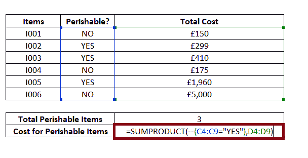
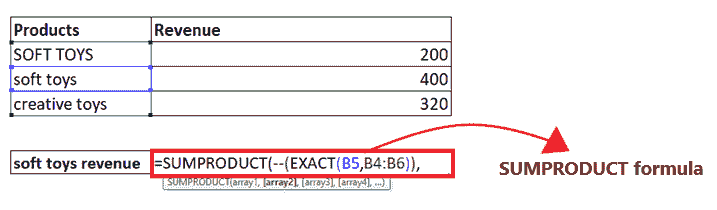

# Excel SUMPRODUCT 函数

> 原文:[https://www.javatpoint.com/excel-sumproduct-function](https://www.javatpoint.com/excel-sumproduct-function)

当分析大量 Excel 数据时，您通常需要根据提供的标准对单元格进行计数，或者在乘以数字后找到总和。微软 Excel 有一个特殊的函数来实现这个功能，***SUMPRODUCT 函数*** ，它是一个区分大小写的函数，比较两个字符串，返回布尔真或假。

在本教程中，我们将详细了解 SUMPRODUCT 函数，并将学习在 Excel 工作表中应用该函数的分步过程。

## 什么是 SUMPRODUCT 函数？

> Excel SUMPRODUCT 函数返回数组中数字相乘后的总和，也可用于根据提供的条件对单元格进行计数。这个函数非常通用，也可以用来计算和求和你的数据，不像 COUNTIFS 或 SUMIFS 这样的函数，但是更灵活。

您可以通过将该功能与 SUMPRODUCT 的其他功能结合起来或者在 SUMPRODUCT 内部插入其他功能来轻松扩展该功能。尽管最初，SUMPRODUCT 函数可能看起来更难、更复杂，甚至毫无意义。但是这个功能是一个极其通用的功能，有多种用途。使用该函数的原因之一是它可以平滑地处理数组，并且您可以利用它以快速、优雅的方式处理单元格区域。该函数在 Excel 数学函数下分类。

### 句法

```

=SUMPRODUCT(Array1, [Array2], [Array3],...and so on)

```

### 参数

**Array1(必选):**此参数表示首先需要相乘然后求和的单元格范围。

**Array2 等等..(可选):**此参数表示要相乘然后求和的第二个数组(或多个数组)或范围。

### 返回

此函数返回数组中数字相乘后的总和。

### 需要记住的要点

1.  SUMPRODUCT 函数将指定数组中的所有非数值视为零。
2.  所有指定的数组参数应该大小相同，否则这个函数会抛出一个#VALUE！错误。
3.  数组内部的逻辑测试将创建真值和假值。在大多数情况下，你会想要强迫这些 1 和 0。
4.  您可以很容易地在 SUMPRODUCT 中加入其他函数来扩展公式的功能。
5.  SUMPRODUCT 可以直接利用其他 Excel 函数的输出。
6.  SUMPRODUCT 不支持通配符。

## 例子

### 示例 1:使用 SUMPRODUCT 函数计算超市面临的总成本。

| 项目 | 易腐？ | 费用 | 单位数量 |
| I001 | 不 | £1.50 | One hundred |
| I002 | 是 | £1.99 | One hundred and fifty |
| I003 | 是 | £2.05 | Two hundred |
| I004 | 不 | £3.50 | Fifty |
| I005 | 是 | £4.90 | four hundred |
| I006 | 不 | £5.00 | One thousand |

按照以下步骤在 Excel 工作表中使用 SUMPRODUCT 函数:

**步骤 1:插入辅助行**

在 Excel 表格下添加一个名为“总成本”的帮助行。

它看起来类似于下图:


在助手行中，我们将键入 SUMPRODUCT 函数，并计算超级商场面临的成本。

#### 注意:如上图所示，我们已经用边框和字体设置了行的格式，以使工作表更具视觉吸引力。

**第二步:插入 SUMPRODUCT 公式**

下一步是输入公式，将光标放在助手列的第二行，开始键入:= SUMPRODUCT(

它看起来类似于下图:


**第三步:添加参数**

*   第一个参数包括“Array1”，表示首先需要相乘然后求和的单元格范围。这里，单元格区域 D4: D9 代表我们的数组 1。所以我们的公式变成:=SUMPRODUCT (D4:D9，

它看起来类似于下图:


*   第二个参数包括可选的数组，但是我们将只包括一个表示第二个数组或范围的数组来相乘然后求和。这里，细胞参考 C6 持有我们的文本 1。所以我们的公式变成:所以我们的公式变成:=SUMPRODUCT (D4:D9，E4: E9)

它看起来类似于下图:


**步骤 4: SUMPRODUCT 将返回结果**

SUMPRODUCT (D4:D9，E4: E9)将计算超级商场面临的总成本，并在数组 中乘以数字后返回和值 ***。***


它看起来类似于下图:

**以上公式的解释**

让我们理解 SUMPRODUCT 的工作机制(从数学角度来说):

*   SUMPRODUCT 函数将从第一个指定数组中获取第一个元素，并将其乘以第二个数组中的第一个元素。接下来，它从第一个数组中获取第二个元素，并将其乘以第二个数组中的第二个元素，以此类推，直到达到最后一个数字。
*   当所有的数组数相乘时，该函数将所有的乘积相加，最后返回和作为它的输出。

用数学术语来说，SUMPRODUCT 公式执行下面给出的操作:

```

SUMPRODUCT output = (D4 x E4) + (D5 x E5) + (D6 x E6) + (D7 x E7) + (D8 x E8) + (D9 x E9)

```

试想一下，如果您的 excel 工作表包含数百或数千行，这个函数会有多重要！

### 示例 2:使用 SUMPRODUCT 函数统计易腐物品的总数及其成本。

| 项目 | 易腐？ | 总成本 |
| I001 | 不 | £150 |
| I002 | 是 | £299 |
| I003 | 是 | £410 |
| I004 | 不 | £175 |
| I005 | 是 | £1,960 |
| I006 | 不 | £5,000 |

按照下面给出的步骤，使用 Excel SUMPRODUCT 函数计算上表中易腐物品的总数(其中易腐=是)及其成本:

**步骤 1:插入两个辅助行**

在 Excel 表格下添加两个帮助行，一个名为“易腐物品总数”，另一个名为“易腐物品成本”。

它看起来类似于下图:


*   在第一个帮助行中，我们将使用 SUMPRODUCT 函数来确定表中总共有多少易腐物品。
*   在第二个助手行中，我们将输入 SUMPRODUCT 函数并计算易腐物品的成本。

#### 注意:如上图所示，我们已经用边框和字体设置了行的格式，以使工作表更具视觉吸引力。

**第二步:插入 SUMPRODUCT 公式，找到易腐物品的数量**

*   下一步是输入公式，将光标放在助手列的第二行，开始键入:= SUMPRODUCT(
*   第一个参数包括“Array1”，它表示必须相乘然后求和的单元格范围。这里，该范围是指从单元地址 C5: C10。因为我们必须只找到易腐烂的物品，所以我们将它们等同于“是”。

所以我们的公式变成:= SUMPRODUCT(-(C5:C10 =“YES”))


#### 注意:在 Excel 中使用两个减号(-)将“真”的值返回 1，将“假”的值返回 0。

*   SUMPRODUCT 函数将返回易腐物品的数量。参考下图:


**第三步:插入第二个 SUMPRODUCT 公式，求出易腐物品的成本**

*   在第二个辅助行输入 SUMPRODUCT 公式:= SUMPRODUCT(
*   第一个参数包括“Array1”，它表示必须相乘然后求和的单元格范围。这里，范围指的是来自小区地址 C2: C10。所以我们的公式变成:=SUMPRODUCT( - (C4:C9=“是”)，
*   第二个参数包括可选的数组，但是我们将只包括一个表示第二个数组或范围的数组来相乘然后求和。这里，范围指的是来自小区地址 D4:D9。所以我们的公式变成:= SUMPRODUCT(-(C4:C9 =“YES”)，D4:D9)

它看起来类似于下图:



**步骤 4: SUMPRODUCT 将返回结果**

SUMPRODUCT ( - (C4:C9=“是”)，D4:D9)将计算易腐物品的成本，并在数组 中乘以数字后返回总值 ***。产出将为 2669 美元。***

参考下图:


### 示例 3:使用 SUMPRODUCT 函数从下面给定的表中计算产品(毛绒玩具)的详细信息，并找到其当年的收入。

| 制品 | 收入 |
| 毛绒玩具 | Two hundred |
| 毛绒玩具 | four hundred |
| 创意玩具 | Three hundred and twenty |

如上表所示，我们有两个用 soft toys 命名的值，唯一的区别是一个值是小写的(soft toys)，另一个值是大写的(SOFT TOYS)。但我们想要小写数据值的“软玩具”。但是，还有其他 Excel 函数如 VLOOKUP 和 INDEX/MATCH 来查找给定值，但唯一的问题是它不区分大小写。因此，我们将使用“SUMPRODUCT + EXACT”的组合来实现区分大小写的查找。

遵循下面给出的步骤，了解毛绒玩具的产品详情和收入:

**第一步:插入一个名为“毛绒玩具收入”的帮助行**

将光标放在产品表下的任意位置，并在单元格顶部键入行名“毛绒玩具收入”。

它看起来类似于下图:


在帮助列中，我们将键入 SUMPRODUCT + EXACT 函数的组合来查找收入详细信息。

**第二步:插入 SUMPRODUCT 公式**

*   下一步是输入公式，将光标放在助手列的第二行，开始键入:= SUMPRODUCT(

它看起来类似于下图:


#### 注意:Excel SUMPRODUCT 函数返回数组中数字相乘后的总和，也可用于根据提供的条件对单元格进行计数。该函数以数组为参数。

*   在插入参数之前，添加两个负号。我们使用了一个双负数来将输出的真值和假值转换为 1 和 0。所以我们的公式变成:=SUMPRODUCT( -(

参考下图:


**第三步:插入精确函数作为 SUMPRODUCT** 的第一个参数

*   在第一个参数中，我们将键入 EXACT 函数。所以我们的公式变成:=SUMPRODUCT( - (EXACT(
*   接下来，我们将传递 EXACT 的参数。在第一个参数中，我们将传递您想要检查的字符串。这里，单元格引用 B4 保存我们的文本 1。所以我们的公式变成:=SUMPRODUCT( - (EXACT(B5，
*   在下一个参数中，我们将传递您想要测试的产品名称。所以我们的公式变成:=SUMPRODUCT( - (EXACT(B5，B4:B6))

它看起来类似于下图:



**第四步:插入 SUMPRODUCT 的第二个参数**

输入收入范围作为 SUMPRODUCT 的第二个参数。这里，细胞范围 C4:C6 持有的收入范围。所以我们的公式变成:=SUMPRODUCT( - (EXACT(B5，B4:B6))，C4:C6)。

它看起来类似于下图:


**第五步:Excel SUMPRODUCT 和 EXCAT 函数组合将返回结果**

在对列 B 中的值进行测试后，EXACT 将返回公式的输出，将 TRUE/FALSE(EXACT 函数的输出)转换为 1 和 0。如下所示，使用 SUMPRODUCT 和 EXACT 的组合，您将获得“毛绒玩具”产品的收入。

它看起来类似于下图:


发现了。现在，您已经成功地完成了 SUMPRODUCT 函数的所有步骤和示例。继续，在你需要做任何比较的时候使用它，把它和其他函数结合起来，得到满意的结果。

* * *