# Excel 中的自定义数字格式

> 原文:[https://www.javatpoint.com/custom-number-format-in-excel](https://www.javatpoint.com/custom-number-format-in-excel)

MS Excel 或 Microsoft Excel 是微软通过结合所有必要的特性、功能和工具开发的功能强大的电子表格软件。当在电子表格中格式化数据时，Excel 有几个格式化选项来相应地格式化不同类型的值。Excel 的一个基本功能是使用数字格式，这使我们能够格式化单元格中输入的任何数值。Excel 有多种内置的数字格式。另外，它还支持自定义数字格式。


本文讨论了 Excel 中的**自定义数字格式**以及将其应用到我们的 Excel 表格中所需的步骤。在讨论 Excel 中的自定义数字格式之前，让我们先了解一下 Excel 数字格式的快速介绍:

## 什么是数字格式？

Excel 中的数字格式是指控制 Excel 单元格中值显示方式的特定代码或格式。Excel 有几种内置格式，可以帮助我们在电子表格中以不同的方式显示数字、百分比、货币、会计、日期和时间等值。

**示例:**下表根据给定或应用的代码显示相同日期的不同格式:

| 单元格中的给定日期 | 应用代码 | 单元格中显示的结果/值 |
| 2021 年 1 月 1 日 | 年份 | Two thousand and twenty-one |
| 2021 年 1 月 1 日 | 尤尼克斯 | Twenty-one |
| 2021 年 1 月 1 日 | 嗯 | 一月 |
| 2021 年 1 月 1 日 | 嗯 | 一月 |
| 2021 年 1 月 1 日 | d | one |
| 2021 年 1 月 1 日 | ddd | 经济报道 |
| 2021 年 1 月 1 日 | 嗒嗒球拍 | 星期五 |

数字格式的主要目的是改变数值的显示方式。这不会影响单元格中的实际值，我们仍然可以相应地进行相关计算。简而言之，单元格中记录的基础值不会改变。

## 什么是自定义数字格式？

虽然 Excel 由几种内置格式组成，但有时我们可能希望使用我们特定的格式，称为自定义格式。Excel 是一个强大的工具，我们可以创建自己的自定义数字格式。它帮助我们根据自己的选择控制电子表格中数值的执行。Excel 使用户能够利用多个格式选项，这些选项通过自定义格式自动应用于所需的或选定的单元格。

例如，我们可能需要使用自定义数字格式自动将数字 283020000 格式化为 283.02 百万美元。同样，我们可能需要将一位数的值格式化为五位数，即使我们只输入一个数字。不用输入 00001，我们可以设置自定义格式，输入 1，Excel 会自动添加前导零。

## 我们可以在哪里使用自定义数字格式？

我们可以在 Excel 工作簿的许多区域使用自定义数字格式。在图表、表格、公式、数据透视表和工作表中使用它们很容易。

*   在工作表中使用自定义数字格式时，我们从“设置单元格格式”对话框中应用它们。
*   在透视表中使用自定义数字格式时，我们从值字段设置中应用它们。
*   在图表中使用自定义数字格式时，我们使用数据标签和坐标轴选项来应用它们。
*   当在公式中使用自定义数字格式时，我们在 TEXT 函数的帮助下应用它们。

## 如何在 Excel 中访问数字格式？

要访问 Excel 中的数字格式，我们需要导航到**主页**选项卡并找到**“数字”**组。看起来是这样的:

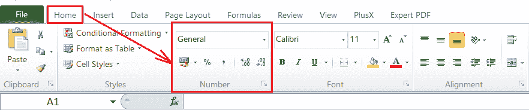

在上图中，这些是内置的数字格式。我们可以点击**‘通用’**旁边的下拉图标，访问所有常用的数字格式。但是，我们需要转到“设置单元格格式”对话框来访问更多的数字格式。

#### 注意:默认情况下，Excel 会对我们在单元格中输入的值自动应用不同的数字格式。例如，如果我们在 Excel 单元格中输入有效的日期，其格式将自动更改为默认的“日期”格式。同样，当我们输入一个百分比值，比如 10%时，它会变成百分比，以此类推。

## 如何在 Excel 中创建自定义数字格式？

要访问 Excel 中的所有数字格式或创建自定义数字格式，我们需要遵循以下步骤:

*   首先，我们需要选择或突出显示所有我们愿意应用数字格式或自定义数字格式的单元格。
*   接下来，我们需要启动“设置单元格格式”对话框。为此，我们需要从**首页>号**组点击**更多**按钮，如下图:
    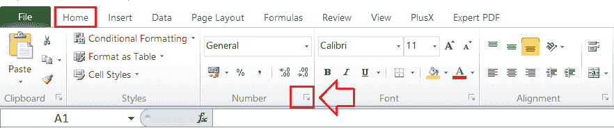
    或者，我们可以使用快捷键**‘Ctrl+1’**快速打开格式单元格对话框。
*   在单元格格式对话框中，如果没有选择，我们需要选择**编号**选项卡。在类别选项下，我们可以访问 Excel 所有可用的数字格式。我们必须单击自定义选项来创建我们想要的数字格式。
    T3】
*   在下一个窗口中，我们需要在“类型”框下输入格式代码，它将应用于选定的单元格。格式代码必须以正确的结构键入。
    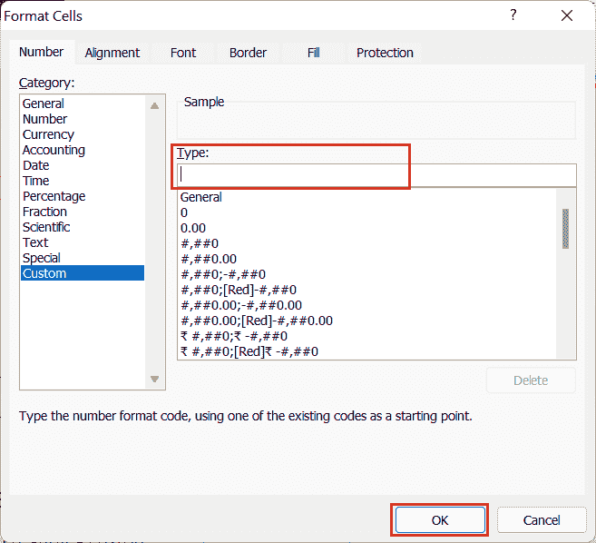
*   输入所需的格式代码后，我们必须点击**确定**按钮保存新创建的格式。

## Excel 数字格式的结构及参考

要在 Excel 中创建自定义数字格式，我们必须知道 Microsoft Excel 遵循的数字格式的正确结构。Excel 数字格式主要包含以下四个部分，按顺序用分号分隔:

```

POSITIVE; NEGATIVE; ZERO; TEXT

```

以下代码是 Excel 中自定义格式的典型示例:

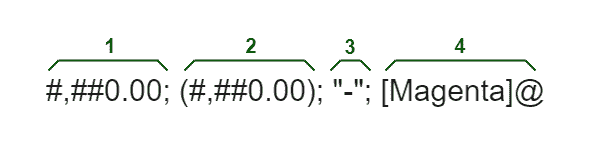

哪里，

1.  它表示正数的格式。我们的示例将显示两位小数和一千个分隔符。
2.  它表示负数的格式。它几乎与正数相同；但是，它包含在括号内。
3.  它表示零的格式。在上面的例子中，它将显示破折号而不是零。
4.  它表示文本值的格式。在上例中，它将以洋红色字体显示文本。

但是，Excel 数字格式最多可以有四个部分。但是，只有一个部分是强制性的。

## 自定义数字格式的重要规则

要创建没有错误的自定义数字格式，我们必须记住以下规则:

*   如果我们只以自定义数字格式输入一个部分，该格式将应用于所有数字类型，如正数、负数和零。
*   如果我们以自定义数字格式输入两个部分，第一部分应用于正数和零，而第二部分应用于负数。
*   自定义数字格式必须包含所有四个部分，才能将给定格式应用于文本值。
*   如果我们想对任何中间部分使用默认的数字格式，我们可以键入 **General** ，而不是在我们的自定义数字格式中输入相应的格式。例如:*将军；-一般；"-";将军。*这里，我们在第二部分添加了减号，因为第二部分表示负数的格式。
*   Excel 还允许我们编辑内置的 Excel 格式。但是，编辑后的格式副本将被创建，而原始的数字格式将保持不变。
*   要隐藏任何所需的节或值类型，我们可以通过只键入结束分号来跳过自定义格式的特定节。例如- *一般；；；将军。*负值和零只显示在公式栏中，不显示在单元格区域内。

## 自定义数字格式的数字和文本占位符

自定义数字格式代码中的某些字符有特定的含义。它们通常充当构建模块，可以帮助我们创建无限多的格式。下表显示了最常见的格式代码及其用途:

| 格式代码 | 描述 |
| 一般 | 通用数字格式 |
| Zero | 它是一个数字占位符，用于显示零。 |
| # | 它是一个数字占位符，用于显示可选数字，而不显示多余的零。 |
| ？ | 它是一个数字占位符，为无关紧要的零留出空间；然而，它没有显示那些无关紧要的零。 |
| 。(期间) | 它是一个小数点。 |
| ，(逗号) | 它是一个千位分隔符，后跟一个数字占位符，用于将数字按千进行缩放。 |
| *(星号) | 它用于重复下列字符，直到单元格宽度填满。它通常与空格字符一起用于对齐更改。 |
| _(下划线) | 它用于跳过下一个字符的宽度。它通常与括号一起使用，以包括左右缩进，如 _(和 _)。 |
| @ | 它是文本占位符。 |
| \ | 它用于显示关联字符。 |
| / | 它用于将十进制数显示为分数。 |
| " " | 它用于显示双引号内的文本。 |
| % | 它用于将单元格值乘以 100，并在单元格中添加一个百分号。 |
| E | 这是一种科学符号格式。 |
| [] | 它用于创建条件格式。 |

理论上，我们可以使用上表中列出的一组预定义的格式代码创建无限多种 Excel 自定义数字格式。

## Excel 自定义格式指南

以下提示或指南解释了 Excel 中预定义格式代码最常见和最有用的实现:

### 自定义数字格式中的小数位

我们可以使用自定义数字格式来控制小数位数。**小数点**位置以 Excel 数字格式显示一个**句点(。).**此外，所需的**小数位数**使用**零(0)来控制。**例如:

*   我们可以使用 **0** 或 **#** 来显示无小数位数的最近整数。
*   我们可以使用 **0.0** 或者 **#.0** 来显示小数点后一位的最近整数。
*   我们可以用 **0.00** 或者 **#.00** 来显示小数点后两位的最近整数，以此类推。

在格式代码的整数部分，0 和#之间的主要区别是，当我们在小数点左边使用井号(#)时，小于 1 的数字以小数点开始。例如，当我们使用格式代码 **#.00 时，**给定的数字 0.25 显示为. 25。但是，0.00 格式将给定的数字显示为 0.25。

下表显示了一些与常规格式相比的自定义数字格式示例:

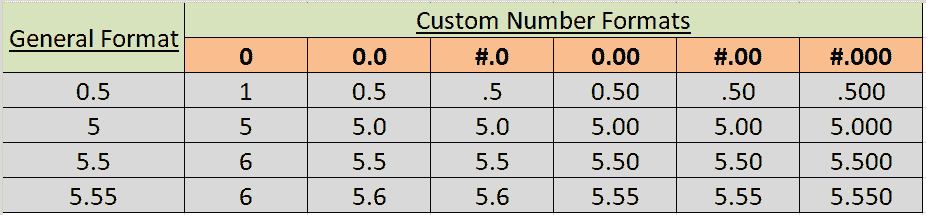

在上面的示例表中，需要注意的是，数字占位符遵循以下原则:

*   假设单元格内的数字在小数点右侧的位数多于应用格式中的占位符。在这种情况下，数字会自动“四舍五入”到与占位符一样多的小数位。这就是为什么在上面的示例表中，格式为 0.0 的数字 5.55 变成了 5.6。
*   无论占位符的数量是多少，小数点左边的所有数字都会显示该值。格式为#的数字 505.55。#将显示为 505.6。

### 自定义数字格式的千位分隔符

我们需要在自定义数字格式或代码中使用逗号(，)来包含一千个分隔符。例如:

*   我们可以用 **#，###** 显示一千个没有小数位的分隔符。
*   我们可以用 **#，##0.00** 显示一个带两位小数的千位分隔符，以此类推。

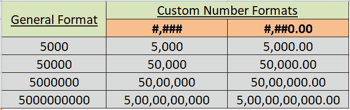

### 自定义数字格式的大数字

如上所述，我们可以使用一个逗号(，)来显示一千个分隔符。同样，我们可以使用两个逗号(，，)来显示百万。例如，我们可以使用格式 **0.0、、“M”**来显示一个小数位，给定值旁边的字母 M 来表示百万。

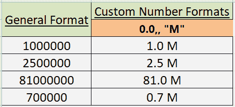

### 自定义数字格式中的前导零

默认情况下，当我们在常规格式的单元格中输入 05 或 0005 这样的数字时，Excel 会自动删除前导零并将该值更改为 5。从技术上讲，这三个值都是一样的。然而，有时，我们可能需要具有所需前导零数量的数字。

用前导零输入所需值的典型方法是在值前使用撇号(')**。这意味着我们需要输入**05**或**005，**，该值将被视为文本字符串，在单元格中保留前导零。**

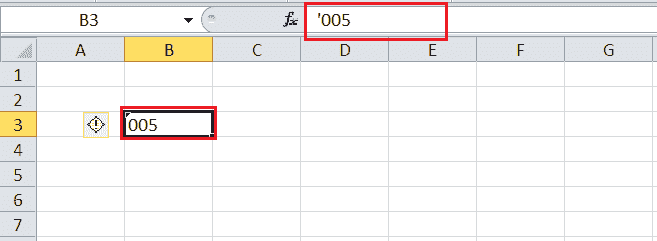

当我们想要在一列中包含特定数量的带有许多值的前导零时，很容易使用自定义的数字格式。如上所述，零(0)是用于显示不重要的零的占位符。因此，如果我们想在需要时输入最多 7 位的数字，并带有前导零，我们可以在相应的单元格中使用自定义格式代码作为 **0000000** 。之后，如果我们只输入 5，该值将显示为 0000005。

下表显示了更多示例:

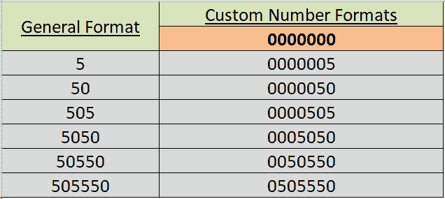

### 自定义数字格式的百分比

如果我们想将数字显示为 100 的百分比，我们必须在格式中使用百分比符号(%)。例如:

*   我们可以使用格式 **#%** 将百分比显示为整数。
*   我们可以使用格式 **#.00%** 来显示两位小数的百分比。
*   我们可以使用格式 **#，##.00%** 用两位小数和一千个分隔符来显示百分比，以此类推。

下表显示了与一般格式相关的上述数字格式的几个示例:

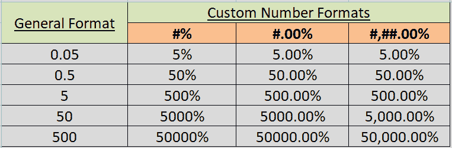

### 以自定义数字格式重复字符

如果我们想要重复任何特定的字符来填充单元格宽度，我们需要在字符前包含一个星号(*)。例如:

*   我们可以使用格式#*=在给定值后自动插入等号来填充单元格宽度。
*   我们可以使用格式*0#在给定值前添加前导零。
*   我们可以使用@*-格式在给定的文本值后添加破折号。@符号用于输入文本值。

下表显示了与一般格式相关的上述数字格式的几个示例:

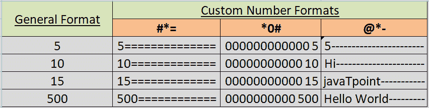

### 自定义数字格式的颜色

Excel 还允许用户更改单元格内特定值类型的字体颜色。技术上，Excel 只支持 8 种内置颜色。如果我们想在字体中使用任何内置颜色，我们需要在自定义格式代码的所需部分键入特定的颜色名称。但是，颜色名称必须作为特定部分的第一项输入。

下表列出了支持的颜色:

| [洋红色] | [黑色] |
| [黄色] | [绿色] |
| [青色] | [白色] |
| [红色] | [蓝色] |

例如，如果我们只想更改字体颜色，但保留所有默认或常规格式不变，则必须使用类似于以下的格式:

```

[Green]General;[Red]General;[Yellow]General;[Magenta]General

```

我们还可以控制每个部分的格式，并同时将颜色格式与它们结合起来。例如:

```

[Green]#,##0.00;[Red]-#,##0.00;[Black]"-";[Blue]@

```

上述格式将显示带有颜色和应用格式的一般值，例如，显示两位小数、一千个分隔符，并将零显示为破折号:

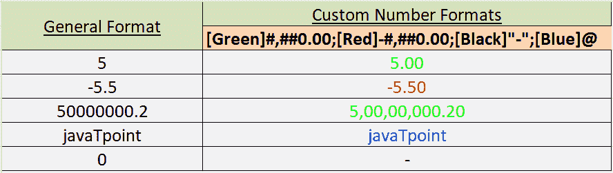

### 自定义数字格式的条件

我们还可以根据具体情况应用所需的格式。这意味着我们可以输入条件，包括比较运算符和值，并将它们括在**方括号[]中。**这里的方括号代表条件。例如:

*   我们可以使用格式**【红色】【<20】；【绿色】【>= 20】**给定数字小于 20 时显示红色，数字大于等于 20 时显示绿色。
*   同样，我们可以使用格式**【红色】【<20】0.00；[绿色][ > =20]0.00** 以上述条件显示两位小数，如下图所示:

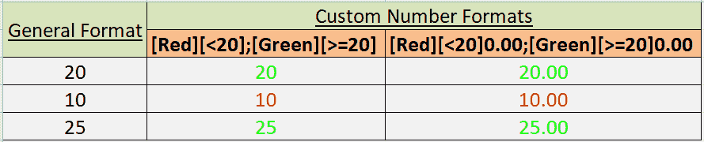

### 自定义数字格式的日期和时间

Excel 日期和时间格式基于具有唯一格式代码的特定案例。它们不容易操作，因为存在许多日期和时间格式。但是，我们可以使用自定义数字格式来控制日期和时间。

例如，假设我们在单元格 A1 中应用长日期格式，并将日期输入为 01-01-2021。它将显示为:

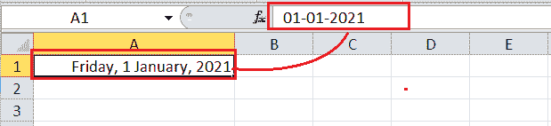

现在，我们需要点击“确定”按钮，并在与 **mm/dd/yyyy，dddd 相同的单元格中应用自定义数字格式。**

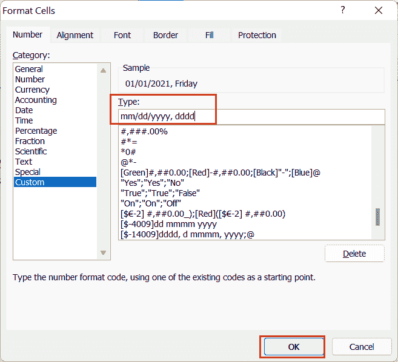

现在，日期将显示如下:

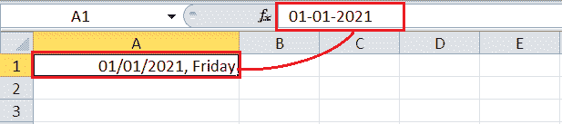

## 删除自定义数字格式

如果我们以后不想使用任何已创建的数字格式(自定义数字格式)，我们可以从列表中删除该特定格式。为此，我们需要进入**格式单元格**对话框，在类别下选择**自定义**，**定位**或在**类型**列表中输入特定的格式/代码，点击**删除**按钮。

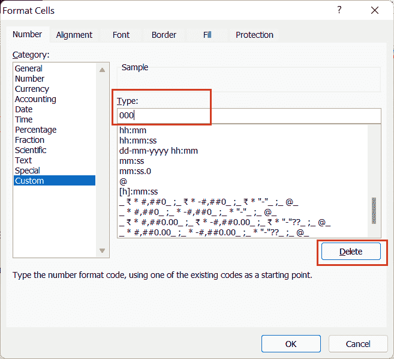

尽管如此，自定义数字格式存储在我们应用它的工作簿中。因此，如果我们想在另一个工作簿中使用相同的自定义格式，我们必须将相应的单元格从一个工作簿复制到另一个工作簿。这样，相同的自定义数字格式也可以在特定的工作簿中使用。

* * *