# Excel NPER 函数

> 原文：<https://www.javatpoint.com/excel-nper-function>

股票分析师或财务管理员通常想知道在筹集公司资金时需要多长时间才能获得所需的产出。在正常的银行业务中，申请贷款时，你可能需要确定还款总额。大多数贷款或抵押贷款是按月分期支付的。然而，有些人更喜欢按季度或半年分期付款。

在申请贷款之前，最好计算一下需要定期支付的次数，以归还全部贷款金额。现在，问题出现了，一个案例如何容易地找到定期付款的数量？为了满足这些要求，Excel 提供了一个内置的函数，***NPER 函数，代表“周期数”*** 。

在本教程中，我们将涵盖对 NPER 函数的简要洞察，包括其定义、计算归还贷款的周期数或达到目标金额所需的投资数的步骤、各种示例、NPER 可能无法在 Excel 中工作的情况等等！

## 什么是 NPER 功能？

> Excel NPER 根据固定利率和固定的定期付款计算所需的付款次数。

NPER 函数是 Excel 中的一个金融函数，用于返回投资或银行贷款的期数。NPER 函数有许多用途，例如它有助于获取贷款的支付周期数、指定金额、利率和定期支付金额。该功能是在 Excel 2007 中引入的，此后在所有版本中都可用，包括 Excel 2010、Excel 2013、Excel 2016、Excel 2017 和 Excel 365。

### 句法

```

=NPER (rate,pmt, pv, [fv], [type])

```

### 参数

**利率(必选)-** 此参数代表每期利率。

**pmt(必选)-** 此参数代表每个期间的付款。

**pv(必选)-** 此参数表示当前值，即现在所有付款的总值。

**Fv[可选]:** 此参数表示未来值，即用户在最后一次付款后想要的现金余额。因为它是一个可选参数，所以它的默认值是 0。

**键入[可选]:** 此参数提供有关付款到期时间的信息。

*   如果用户提供 0，则意味着周期结束
*   如果他提供 1，这意味着周期的开始。因为它是一个可选参数，所以它的默认值是 0。

### 关于 NPER 函数的注意事项

请查看下面给出的要点，以便在您的工作表中有效利用 NPER 功能，并避免 Excel 中的常见错误:

1.  使用正数表示流入(您获得的金额)，负数表示流出(您支付的金额)。
2.  如果 *pv* 参数的值为零或被忽略，则必须包括 *fv* 参数。
3.  您可以将*比率*参数指定为百分比或十进制数，例如 23%或. 23。
4.  始终确保提供与期间对应的利息*利率*。例如，如果贷款将按月支付，年利率为 26%，则使用 26%/12 或 0.26/12 作为利率参数。

## 例子

### 示例 1:使用以下给定值的 NPER 函数计算贷款的定期付款次数。

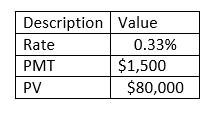

要确定定期费率支付，请遵循以下步骤:

**第一步:在表格底部增加辅助行**

将光标放在表格下方，并添加帮助行。在这一行中，我们将键入 NPER 公式，并获取给定数据的定期付款。

参考下图:

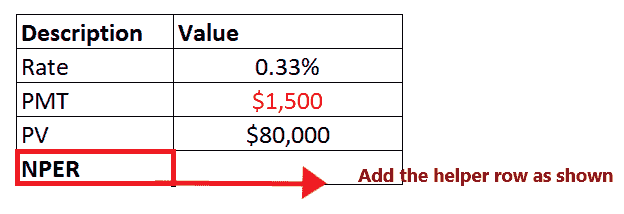

**第二步:输入 NPER 公式**

移动到帮助行的下一个单元格，并开始键入公式= NPER(

它看起来类似于下图:

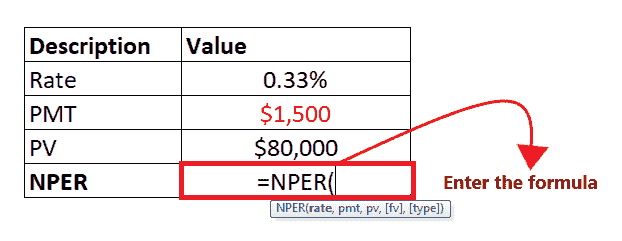

**第三步:将参数添加到公式中**

*   在第一个参数中，我们将指定每期的利息*利率*。在上表中，*率*在细胞 C4 中提到。所以我们的公式变成:=NPER (C4，
*   接下来，该功能将要求*付款*该参数表示每个期间的付款。在单元格 C5 中提到了*付款*。所以我们的公式变成:=NPER (C4，C5
*   *pv* 参数表示所有付款的当前值或总值。在《C6 细胞》中提到过。所以我们的公式变成:=NPER (C4，C5，C6
*   *fv* 是一个可选参数，表示未来值，或者用户在最后一次付款后想要的现金余额。因为它是一个可选参数，所以它的默认值是 0。所以我们的公式变成:=NPER (C4，C5，C6，0
*   最后一个参数，即 ***类型*** ，是可选的。在这种情况下，我们指定有关付款到期时间的信息。因为我们想要期末付款，所以我们将指定 0。所以我们的公式变成:=NPER (C4，C5，C6，0，0)

整个公式看起来类似于下图:

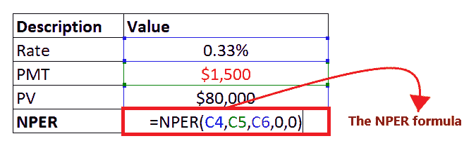

**步骤 4: NPER 将返回输出**

输入完公式后，请按回车键。Excel 将返回您的 NPER 公式的输出。如下所示，它将返回 59 作为您定期付款的输出。

*因此，我们可以得出结论，ABC 将不得不每月支付 59 笔 1500 美元的款项。*

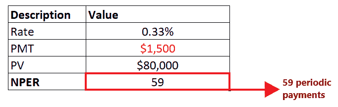

### 例 2:假设你想以 4%的年利率投资 2000 美元，并在每个月底额外出资 100 美元。你的目标是达到 2 万美元。计算每月投资的数量，包括 NPER 公式中给定的未来价值(fv)。

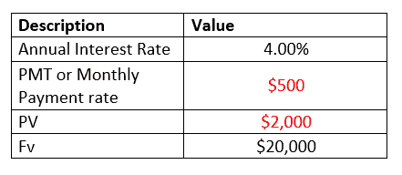

#### 注:在上表中，输入 pmt 和 pv 是负数(用红色文本表示)，因为它们表示流出。

要确定每月投资的数量，请遵循以下步骤:

**第一步:在表格底部增加辅助行**

将光标放在表格下方，键入帮助行的标题，即“NPER”。在这一行中，我们将键入 NPER 公式，并获取给定数据的定期付款。

参考下图:

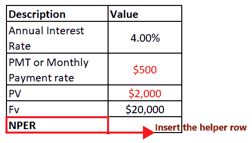

**第二步:输入 NPER 公式**

移动到帮助行的下一个单元格，并开始键入公式= NPER(

它看起来类似于下图:

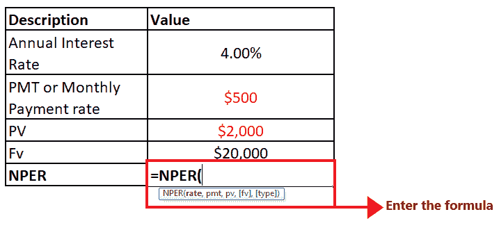

**第三步:将参数添加到公式中**

*   在第一个参数中，我们将指定每期的利息*利率*。由于我们必须以月为单位返回周期，我们将把*比率*参数除以 12(每年的周期数)。所以我们的公式变成=NPER (C3/12，
*   接下来，我们将指定*付款*负付款表示每个期间的流出付款。 *pmt* 在细胞 C4 中被提及。所以我们的公式变成:=NPER (C3/12，C4
*   *pv* 参数表示所有付款的当前值或总值。它在单元格 C5 中提到。所以我们的公式变成:=NPER (C3/12，C4，C5
*   上表中已经提到了未来值( *fv* )。所以我们的公式变成:=NPER (C3/12，C4，C5，0
*   最后一个参数(*类型*)被省略，因为付款在期末到期。

整个公式看起来类似于下图:

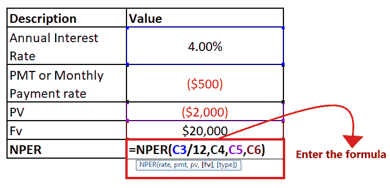

**步骤 4: NPER 将返回输出**

输入完公式后，请按回车键。Excel 将返回您的 NPER 公式的输出。如下所示，它将返回 33.6 作为您定期付款的输出。

*因此，我们可以得出结论，ABC* 33.6 个月投资才能达到目标金额。

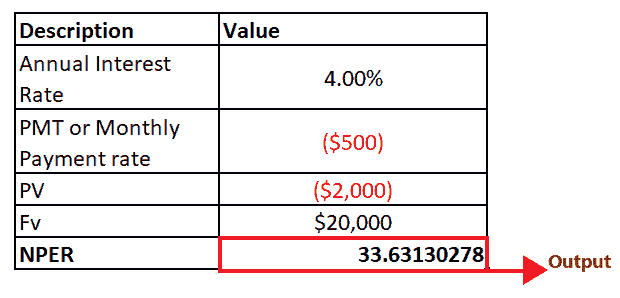

### 示例 3:在下表中，很少有非数字参数。让我们看看如果在 NPER 公式中指定非数字参数会发生什么。

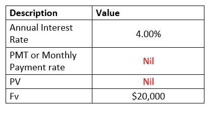

要获取上表的 NPER 输出，请遵循以下给定步骤:

**第一步:在表格底部增加辅助行**

将光标放在表格下方，并添加帮助行。在这一行中，我们将键入 NPER 公式，并获取给定数据的定期付款。

参考下图:

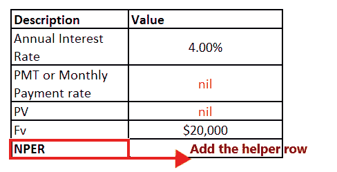

**第二步:添加公式及其参数**

*   移动到帮助行的下一个单元格，并开始键入公式= NPER(
*   将所有五个 NPER 参数相加，您将获得以下公式= =NPER(C3、C4、C5、C6)

#### 注:我们省略了类型参数，因为我们假设付款在期末到期。

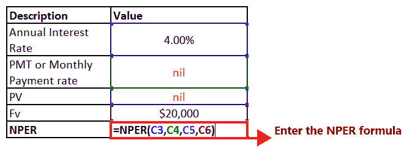

**第三步:NPER 将返回#VALUE！错误**

输入完公式后，请按回车键。Excel 将返回您的 NPER 公式的输出。如下所示，它将抛出#VALUE！错误。

参考下图:

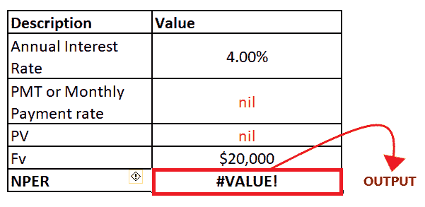

如果您的 NPER 公式中指定的任何参数不是数字，就会出现此错误。若要在 Excel 中修复此错误，请始终确保所有参数都是数字，并且所有指定的数字都没有格式化为文本。

## Excel NPER 函数不起作用

有时在使用 NPER 函数时，您可能会遇到错误或错误的结果，这主要是因为以下原因之一:

*   **num！错误〔t1〕**

如果在指定的利率(利率)和*付款*(付款)参数下从未获得给定的 *fv* 参数，则会出现此错误。假设您想要获得有效的 NPER 结果，尝试提高定期利率和/或支付金额。

*   **#VALUE！错误**

如果您的 NPER 公式中指定的任何参数不是数字，就会出现此错误。若要在 Excel 中修复此错误，请始终确保所有参数都是数字，并且所有指定的数字都没有格式化为文本。

*   **NPER 函数的输出为负数**

当您使用正数表示流出付款时，NPER 公式中会出现此问题。例如，当您计算贷款的付款期时，请将 *pv* (贷款值)参数作为正数，将 *pmt* 参数作为负数。

* * *