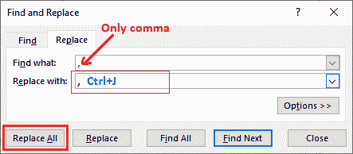
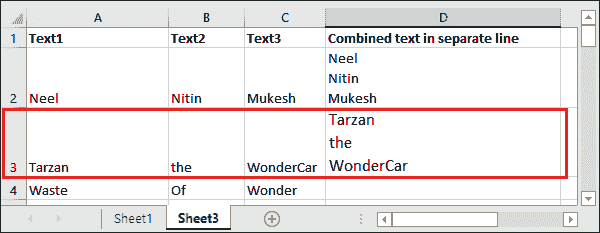

# 如何在 excel 中转到下一行？

> 原文：<https://www.javatpoint.com/how-to-go-to-next-line-in-excel>

在使用 Excel 工作表并操作其中的数据时，有时您希望从新行开始输入一些文本。但是，在 Excel 中问如何转到下一行是一个非常基础的问题，但是我们将定义转到下一行的最简单方法。

**例如，**姓名、手机号码、名称、性别等详细信息存储在用逗号分隔的单元格的单行中。在这种类型的数据中，用户可能希望将数据保存在同一单元格内的不同行中。

在大多数 Office 应用程序中，通过按键盘的**回车**键，很容易开始一个新段落或移动到下一行。在微软 Excel 中，回车键在这种情况下不起作用。它完成您正在对数据执行的输入或操作，并将光标移动到下一个单元格而不是下一行。

现在，出现的问题是——Excel 用户如何在 Excel 单元格中创建新行？

## 在 Excel 中回车键是做什么的？

通常，按回车键将光标控制到下一行。在微软 Excel 中，它不是以这样的方式工作的。在 MS Excel 中，如果用户按回车键，它会将用户控件移动到当前活动单元格正下方的下一个单元格。

按回车键不会将用户带到同一单元格内的下一行。那么，如果用户想转到 Excel 单元格中的下一行呢。我们有其他方法可以做到这一点。

### 在 Excel 中开始新行的方法

我们有不同的方法来使用哪些用户可以移动到下一行。这些方法如下:

*   [在同一单元格内开始一个新行](#Start)
*   [如何在 Excel 单元格中开始一个新行](#How)
*   [在 Excel 中做回车的提示](#Tips)
*   [在特定字符后的单元格中插入换行符](#Insert)
*   [用 Excel 公式转到新行](#Go)

## 在 Excel 单元格中开始新行

此方法使 Excel 用户能够插入换行符并移动到同一单元格中的下一行。您不能简单地通过按回车键来实现。若要开始新的一行，请使用 Alt+Enter 键，该键将在单元格数据中插入换行符。

按照给定的步骤，使用快捷方式转到 Excel 单元格中的新行:

*   双击单元格，将光标放在要插入换行符的文本位置(开始新行)。
*   点击**Alt+回车**快捷键，移动到同一单元格内的下一行。

希望你发现这一条是 Excel 中去新行最简单的方法。

## 如何在 Excel 单元格中开始新行

我们有一些快捷命令可以在 Excel 的同一单元格中插入换行符，这是简单的回车键无法做到的。以下是不同操作系统的快捷命令。

*   在**窗口**操作系统上，使用 **Alt +回车**换行。
*   在 **Mac** 操作系统上，用户可以使用 **Ctrl + Option + Return 或者 Ctrl + Command + Return**
*   在 **Excel 365 for Mac，**也可以使用**选项+ Return。**

> Mac 上的**选项**与 Windows OS 上的 Alt 键相同。因此，您会看到 Mac 命令看起来像是原始的 Windows 快捷方式(Alt + Enter)。

因此，通过在同一单元格中插入新行，用户可以在 Excel 单元格中添加多行文本。如果文本仍然显示为一行而不是多行，请验证是否启用了换行功能。您可以在主页选项卡中找到**环绕文本**功能。

## Excel 中回车的技巧

在使用微软 Excel 时，用户可能会犯一些错误。在单个单元格中插入多行文本时，以下提示将帮助您避免用户通常会犯的一些常见错误。

### 启用自动换行

有时，您会发现您已经正确地执行了添加多行文本的步骤，但它仍然显示在单元格的单行中。这可能是因为自动换行功能可能被禁用。因此，请确保您要插入多行的单元格启用了换行。

> 默认情况下，在 Excel 中为每个工作表启用自动换行。如果未启用，您可以手动启用它。

但是，您可以为整个工作表启用换行文本。这样，你就再也不会面对这个问题了。

要验证或启用换行文本，请按照下面给出的步骤操作:

**第一步:**首先，选择一个要插入多行文本的单元格。

**步骤 2:** 在默认打开的**主页**选项卡中，单击位于对齐组内的**环绕文本**按钮。


现在，每当您尝试从一个新行插入多行文本时，您都不会遇到任何问题。这篇课文很容易被分成多行。有时，您可能需要手动管理单元格宽度。

### 添加多个换行符以增加单元格宽度

有时，用户想要增加单元格宽度。Excel 允许用户增加单元格宽度，但用户也可以添加多条空行来增加单元格宽度。

所以，如果你想增加不同文字部分之间的行距，按 **Alt + Enter** 键两次或更多次。它将在单元格中添加连续的提要，您也可以在下面的截图中看到我们已经完成的工作:

## 在特定字符后插入换行符

假设您有一个工作表，该工作表中包含各种单行单元格条目。在无效的每个单元格中手动插入换行符会花费太多时间。

这种方法对于减少在多个单元格中插入多个换行符的工作量非常有用。我们将通过一个例子来学习如何在特定字符后插入换行符。

我们有以下数据。


**第一步:**选择要在特定字符后插入换行符的所有单元格。我们选择了 A2 和 A3 单元格。


**第二步:**现在，按 **Ctrl + H** 打开【查找】&替换对话框。


**步骤 3:** 在**查找和替换**对话框中，插入以下输入值:

*   在*查找内容*字段中，键入逗号和空格，如(，)。如果您的字符串仅由逗号分隔，而不是空格，请在*查找内容*字段中仅键入逗号(，)。
*   在*替换为中，*按 **Ctrl + J** 快捷命令插入回车。这意味着它会在找到任何逗号或空格的地方插入换行符。
    
    **将对使用此替换的数据进行四次替换**。
*   最后，点击**全部替换**按钮，将其应用于选定的数据单元格。之后，您现在可以关闭“查找和替换”对话框。

**用换行符代替逗号和空格**

文本已经到了下一行，在那里它找到了任何逗号和空白。双击查看结果。


请注意，文本已经到了下一行，并且已经删除了文本中的逗号和空白。


**在每个逗号后插入换行符**

*   如果您想保留逗号，而不想用行来替换它，请键入逗号，然后按下 **Ctrl + J** 命令。最后，点击**全部更换**按钮。
    
*   您可以看到文本已经到了下一行，在那里它找到了任何逗号，这次不是空白。它还保留了我们在替换为字段中使用的带文本的逗号。
    

## 使用 Excel 公式转到新行

我们在上面的例子中描述的方法与此不同。快捷命令 **Alt + Enter** 适用于在单个单元格中手动输入新的换行符。另一方面，**找&替换**的方法很适合一次插入多个换行符。

如果用户将多个单元格中的数据合并到一个单元格中，并且希望每个单元格都在一个新行中，那么这种方法对用户没有帮助。这可以通过使用 Excel 公式来完成，该公式使用户能够将多个单元格数据组合成一个单元格，并将它们保持在单独的行中。

### 如何使用 Excel 公式插入新行

Excel 提供了在单元格中插入不同字符的特殊功能，即 **CHAR()。**在 Windows 操作系统上，10 是换行符的字符代码。因此，使用像 CHAR(10)这样的函数。另一方面，使用 **CONCATENATE 函数**或 **CONCATENATE 运算符(& )** 将不同单元格的值放在一起， **CHAR()** 函数将在它们之间插入换行符。

**使用 CONCATENATE 运算符**

插入换行符的 Excel 通用公式

```

cell1 & CHAR(10) & cell2 & CHAR(10) & cell3 & ....

```

或者你也可以用这个公式作为-

**使用 CONCATENATE()功能**

```

CONCATENATE(cell1, CHAR(10), cell2, CHAR(10), cell3, ....)

```

### 示例 1:使用 CONCATENATE 组合文本

**步骤 1:** 假设我们在 A2、B2 和 C2 单元格中有以下数据。类似地，A3、B3 和 C3 细胞中的一些数据。


**第二步:**现在，我们将使用上述公式在相应的一个单元格中组合这些数据。

=A2 & CHAR(10) & B2 & CHAR(10) & C2


我们使用了 concatenate 运算符(&)来合并文本

**第三步:**点击**输入**键，获得带有换行符的连接文本的结果，该结果将存储到 D2 单元格中。


**第四步:**现在，我们将使用 CONCATENATE()函数，通过使用上述公式，将这些数据组合到其对应的一个单元格中。

=CONCATENATE(A3，CHAR(10)，B3，CHAR(10)，C3)


**第五步:**点击**输入**键，获得带有换行符的连接文本的结果，该结果将存储到 D3 单元格中。



## TEXTJOIN()

在 Office 365 中，用户还可以使用 TEXTJOIN()函数包含分隔符来分隔文本值。您也可以使用它，因为它使公式更紧凑，更容易构建。

**文本连接的语法**

TEXTJOIN()函数的语法是:

```

=TEXTJOIN(CHAR(10), TRUE, cell1, cell2, cell3, ....)

```

### 示例 2:使用 TEXTJOIN 组合文本

**步骤 1:** 我们已经在 A4、B4 和 C4 中添加了多一行文本，我们将使用 TEXTJOIN 函数将其组合在一起。


**步骤 2:** 使用以下 TEXTJOIN()公式将三个不同单元格的数据组合在一起，并将其放入 D4 单元格中。

= TEXJOIN(CHAR(10)，A4:C4)


**第三步:**现在，点击**进入**键，获取 textjoin()函数结果，并存储在 D4 单元格中。请参见下面的结果:


* * *