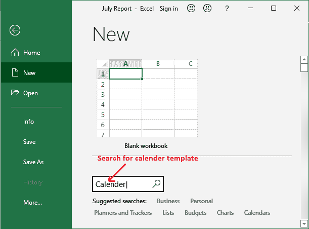
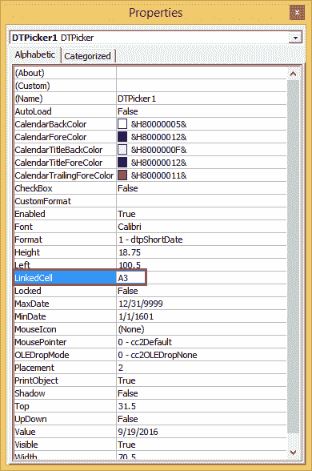

# 如何在 excel 中插入日历？

> 原文:[https://www.javatpoint.com/how-to-insert-calendar-in-excel](https://www.javatpoint.com/how-to-insert-calendar-in-excel)

日历是从中选择日期的视觉元素。在 Microsoft Excel 中，用户可以在工作表中添加代表特定月份的内容。它提供了一个内部功能来添加基本的日历布局并对其进行自定义。

Excel 提供了多种日历模板。你可以使用其中的任何一个。这是 Excel 的一项特殊功能，允许用户在 Excel 工作表中添加日历。此外，Excel 还支持各种其他方法在 Excel 文件中插入日历。


我们将定义在 Excel 工作表中插入日历的所有可能方法。跟着这一章直到最后，学习所有的方法，这样你可以选择其中的任何一个。

## 为什么要在电子表格中添加日历？

日历是 Excel 中的基本需求。如果用户需要，他们可以将它包括在他们的表单中。当用户试图计划即将到来的活动时，这对他们自己是有益的。

有时，用户经常需要输入日期。如果在 Excel 单元格中逐个手动输入日期，会花费太多时间。日期的手动输入要求以适当的格式输入。通过将日历添加到 Excel 工作表将解决这个问题，并且用户不需要担心格式。

插入日历后，您只需单击下拉日历并从中选择一个日期。通过使用电子表格中的日历，用户不需要考虑日期格式。

## 在 Excel 中插入日历的好处

当您将日历插入到 Excel 电子表格中时，用户会获得一些好处，例如-

1.  在 Excel 工作表中手动插入日期时，Excel 用户必须注意格式。将日历插入工作表有帮助；用户不需要担心日期格式。
2.  Excel 用户只需从日历中选择一个日期，将其插入到 Excel 工作表中。
3.  它还节省了用户手动逐个插入几个日期的时间。

## 如何将日历插入电子表格？

有几种方法可以将日历插入到 Excel 工作表中。

*   [使用在线模板插入日历](#online-template)
*   [使用日期选择器控件](#Date-Picker)插入日历
*   [下载第三方工具](#Download)
*   [在 Excel 中注册日历控件](#Register)

## 使用在线模板插入日历

Excel 提供了各种日历模板，您可以在 Excel 工作表中使用。需要下载这些日历模板，并在 Excel 中插入。您可以搜索并选择其中任何一个。请记住，您需要互联网连接来搜索这些模板。

> 您不需要在 Excel 之外搜索日历模板。

按照将日历插入 Excel 的简单过程，可以将日历插入 Excel 电子表格。

**第一步:**打开 Excel 表格或新建表格。在左上角，点击**文件**选项。


**第二步:**接下来点击 Excel 后屏左侧面板上的**新建**按钮。


**第三步:**在 Excel 后屏，看到一个搜索框，输入 ***日历*** 点击 ***进入*** 键搜索模板。



**第四步:**那里会出现多个日历模板，如学术日历、季节日历等。您可以从这里选择一个插入到当前工作表中。

**例如**我们从这里选择第二个模板。


**第五步:**点击**创建**按钮，完成日历到 Excel 表的插入。


你可以在上面的截图上看到一个左箭头和一个右箭头。使用这些箭头，您可以在创建模板之前更改模板。

**步骤 6:** 当您选择的模板成功插入到 Excel 工作表中时，会创建一个新的工作簿。本日历已插入【2021 年 1 月。


这将全屏显示 Excel 工作表，直到 H15 单元格。这是 2021 年唯一的一个月日历。

**步骤 7:** 如果要更改日历的月份，请选择 C1 单元格使其可编辑，并输入月份名称。然后点击**进入**自动更新修改月份的日历。


同样，可以通过更改 B1 单元格中的目标年份来更改年份。

**第 8 步:**要更改日历的年份，请选择 B1 单元格使其可编辑。然后点击**进入**自动更新插入年份的日历。


## 使用日期选择器控件插入日历

在 Excel 工作表中插入日历的另一种方法是 ***日期和时间选择器*** 控件。在 MS Excel 中插入日历很容易，但是有几个用户不知道 ***日期和时间选择器*** 控件的功能是隐藏的。

用户不容易获得该功能，因为它最初隐藏在 Excel 中。您可以在*开发者*选项卡中找到该功能。使用它，可以插入下拉日历来选择要插入单元格的日期。

我们将向您展示一个完整的例子。执行以下步骤，使用日期选择器控件插入日历。

1.  [启用显影剂标签](#Enable)
2.  [插入日历控件](#Insert-control)
3.  [自定义插入的日历控件](#Customize)
4.  [将日历控件链接到单元格](#Link)

就这样。

现在，按照我们解释的进行每一步。

### 1.启用开发人员控制台

通常，开发者控制台会随着 MS Excel 的安装而隐藏。如果用户需要它来执行相关操作，他们必须手动将其添加到 Excel 菜单栏中。因此，第一步是启用开发人员控制台。

执行以下步骤在微软 Excel 中启用开发人员选项卡:

**第一步:**右键点击 Excel 功能区任意位置，从中选择 ***自定义功能区*** 。


**步骤 2:** 将打开 Excel 选项窗口，在右窗格中标记**开发者**选项复选框，然后单击**确定。**


**第 3 步:**现在可以看到**开发人员选项卡被添加到**Excel 功能区的视图和帮助选项卡之间。


### 2.插入日历控件

下拉形式的日历在 Excel 中称为*日期和时间选择器控件*。它可以很容易地插入到 Excel 表格中。你需要遵循一个简单的流程。执行以下步骤:

**第 1 步:**在 Excel 功能区中，导航至**开发人员**选项卡，您可以在其中看到控制组。


**第二步:**在控制组中，点击**插入**下拉按钮，选择**更多控制**图标。


**第三步:**将打开“更多控件”对话框，在 ActiveX 控件中选择**微软日期时间选择器控件 6.0 (SP6)** ，然后点击**确定。**


最后，单击要插入工作表中的单元格。

一旦插入了 datepicker 控件，EMBED 公式将出现在公式栏中。它指示工作表中嵌入了哪种类型的控件。

#### 提示:当您插入任何 ActiveX 控件时，Excel 会自动进入设计模式，允许用户修改最近添加的控件的设计和外观

用户通常希望的最常见的更改是:调整插入的日历控件的大小并与特定单元格链接，以便它完全可见并易于选择日期。

**如果微软日期和时间选择器控件 6.0 (SP6)不可用**

如果在“更多控制”列表中找不到此选项，如下图所示-


你需要遵循本章末尾的说明。

### 3.自定义日历控件

日历控件添加到工作表后，您现在可以对其进行自定义。因此，首先将它移动到您想要放置它的位置，并使它适合单元格。

*   您可以通过将它切换到设计模式，然后拖动控件的角来调整它的大小。
*   您也可以从位于*设计模式*选项卡的**属性**选项中修改和设置日历的其他属性。


### 4.将日历控件链接到单元格

到目前为止，您已经成功地将下拉日历控件添加到 Excel 工作表中。有时，您可能还希望它链接到特定的单元格。如果用户希望将公式中的日期用于某些其他操作，则这是必需的。

**场景**

假设您想计算两个日期之间的差异。因此，您已经使用日期选择器控件插入了开始日期和结束日期。当您尝试使用 COUNTIF()计算插入日期之间的天数时，它会返回 0。

返回 0 的原因是 Excel 无法识别使用日期选取器控件插入的日期，该控件到目前为止与单元格没有关联。您必须将日期选取器控件链接到单元格才能解决此问题。

您将在**开发者**选项卡中的设计模式附近找到插入日历控件的**属性**选项。点击此**属性**选项。


将打开一个窗口，您可以在其中看到**链接单元格**属性。在要链接的链接单元格旁输入单元格引用，点击**确定。**



现在，计算两个插入日期之间的差异。它现在将返回正确的结果。

## 下载第三方工具

此外，Excel 用户还可以下载第三方工具或加载项，将日历插入 Excel 电子表格。这是将日期和选取器插入到 Microsoft Excel 中最简单的方法。

你可能会发现有些工具是付费的，有些是免费的。人们可以很容易地将它们下载到微软 Excel 中。如果您还想下载第三方工具，请按照以下步骤操作:

1.  去像谷歌这样的搜索引擎，搜索第三方插件/工具的日期和选择器控制。或者[点击这里](https://www.ablebits.com/excel-suite/index-2021.php?visitfrom=blog-text)。
2.  从网上下载一个工具并安装在你的系统上。
3.  工具安装好后，可以看到已经添加到 MS Excel 了。
4.  你会在末尾的 Excel 菜单栏找到它；请看下面的截图。
    我们已经下载了名为 **Ablebit 的第三方工具。**
5.  导航至**启用位工具**选项卡，点击**日期选择器**，激活工作表的日期选择器。
6.  现在，您可以通过从日历中选择日期，在所需的单元格中输入任何日期。从日历中选择一个日期。
7.  当您单击单元格选择日期时，日历弹出窗口将显示您可以从中选择日期。

这些是在 Excel 工作表中插入日历的不同方法。你可以选择一个你喜欢的。

## 在 Excel 中注册日历控件

在早期版本的 Excel 中，默认情况下，**日期和选择器控件**是随 Excel 的安装一起提供的。但在 Excel 2016 版及以上版本中，用户将不得不手动下载 Date 和 Picker 控件并在 Excel 中注册。看能怎么做:

**检查系统中是否存在 mscomct.ocx】**

您可以首先检查您的系统上是否有 Microsoft 日历控件。为此，您需要在系统中检查 *mscomct.ocx* 文件(日期和时间选择器)。为此-

1.  点击系统的**启动**按钮，然后
2.  在搜索框内输入 **mscomct.ocx** 。然后，
3.  按回车键在系统中找到它。

如果您发现这个 *mscomct.ocx* 在您的系统中可用，您可以跳过下一步(下载日期和时间选择器)。

**下载日期时间选择器**

如果在您的系统上找不到日期和时间选择器，您必须手动下载。可以通过以下[链接](http://www.gmayor.com/zips/mscomct2.zip)下载。

#### 提示:“此控件仅适用于 32 位版本的 Excel 2010 及更高版本。”


将下载一个 zip 文件。现在，提取下载的文件。您可以通过右键单击并选择**提取文件**选项来提取 zip 文件，如下图所示。


将提取的文件夹复制到 *C:\Windows\System64* 文件夹。

*   在 Windows 32 位 C:\Windows\System32 上
*   在 Windows 64 位 C:\Windows\System64 上


用户必须具有管理权限才能将文件复制到系统文件夹。但如果您仍然看到“目标访问被拒绝”对话框，只需点击此处的**继续**。


**在您的系统上注册日历控件**

下一步是在下载并提取 zip 文件后，在您的系统上注册日历控件。日历控件必须在系统上下载和注册。

按照以下步骤注册日历控件:

在“开始”菜单中搜索命令提示符(CMD)，并以管理员身份运行它。


在命令提示符下，根据您的系统配置键入以下命令之一-

```

On windows 32-bit system
C:\Windows\System32\regsvr32.exe mscomct2.ocx
On windows 64-bit system
C:\Windows\System64\regsvr32.exe mscomct2.ocx

```

我们的系统是 32 位系统。因此，我们将运行下面的命令。

*C:\ Windows \ system 64 \ regsvr 32 . exe mscomct2 . ocx*


成功注册 mscomct2.ocx 后，您将获得如下消息。


现在，一旦 mscomct2.ocx 注册，就重新启动 MS Excel。

然后，导航到现在包含日期和时间选择器控件的**开发者**选项卡，单击**插入**，然后单击**更多控件。**


你会看到，这个时间，日期和时间选择器控件在列表中。


* * *