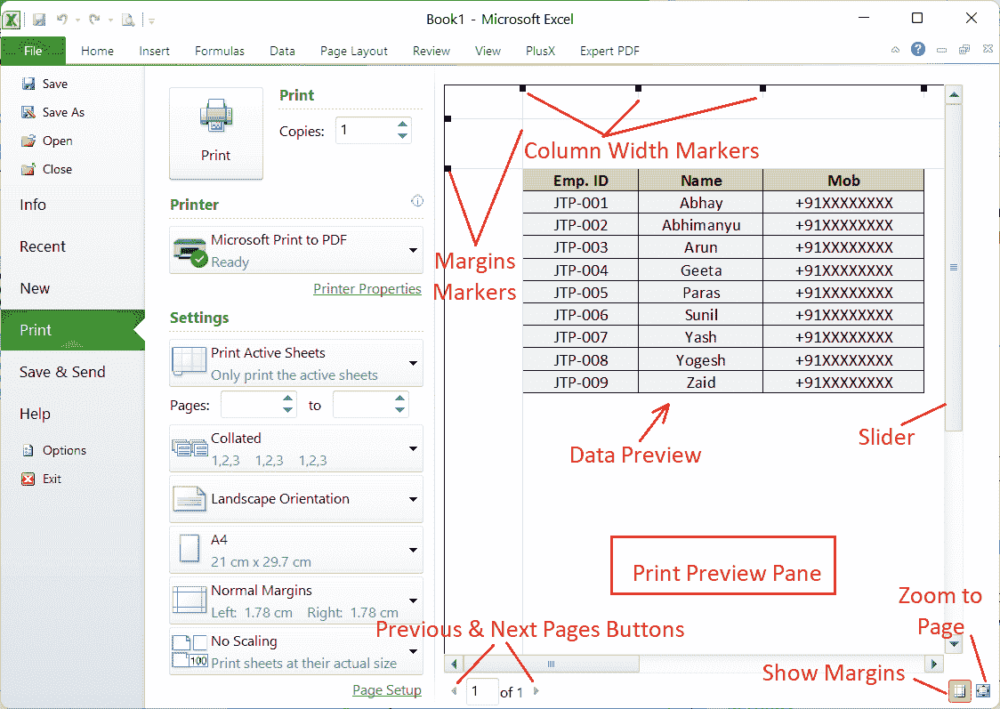

# 在 Excel 中打印工作表

> 原文：<https://www.javatpoint.com/print-worksheet-in-excel>

微软 Excel 是一个功能强大的电子表格软件，在世界各地被广泛使用。当用户与他人共享电子表格或整个工作簿中的数据时，这种情况很常见。虽然 Excel 中有很多共享选项，但可能会有我们需要将数据打印在纸上与某人共享的情况。此外，打印工作簿中的一个或多个工作表可能还有其他原因。

通常，使用“打印”按钮打印工作表似乎容易得多。然而，这并不总是意味着在显示器上看起来很好的格式精美的纸张也会打印得很漂亮。实际上，这在大多数情况下都是一团糟，因为 Excel 电子表格主要是为在计算机屏幕上查看和编辑而设计的，而不是为了在一张纸上舒适地打印。然而，在最终完成打印之前，Excel 为我们提供了各种定制选项。我们可以使用精确的设置使我们的工作表完全适合纸张。

本文将讨论如何在纸上适当地打印工作表数据。使用适当的知识，我们可以决定是打印工作表的特定区域，整个工作表，多个工作表，还是一次打印所有工作表。

## 如何在 Excel 中打印？

在 Excel 中打印一张或多张工作表非常容易。让我们首先了解在 Excel 中打印工作表的步骤，然后我们将讨论打印的每个基本功能的更多细节。要打印任何 Excel 工作表，必须执行以下步骤:

*   首先，我们需要打开一个特定的 Excel 文件，**从工作表选项卡中选择**工作表。
    T3】
*   接下来，我们需要转到**文件**选项卡，并从列表中单击**打印**选项。
    
*   单击打印选项后，我们可以选择所需的打印首选项(如份数、打印机、方向等)。)点击**打印**完成打印过程，看起来是这样的:
    T3

### 快速打印:在快速访问工具栏上添加打印按钮

如果我们不想更改默认打印机设置，但想立即打印副本，可以使用快速打印选项。使用此选项有以下两种方式:

*   我们可以使用键盘快捷键 **Ctrl + P** 并按回车键。我们不需要这样使用鼠标。
*   我们可以使用快速访问工具栏中的打印快捷方式或按钮。但是，在使用之前，必须将快捷方式添加到 QAT 中。

**在 QAT 上添加打印工具**

我们可以执行以下步骤在快速访问工具栏上添加快速打印快捷按钮:

*   首先，我们需要从 Excel 窗口顶部点击**自定义快速访问工具栏**按钮(下拉箭头)。
    T3】
*   接下来，我们需要点击列表中的“**打印预览和打印**”选项来激活快速访问工具栏上的这个工具。
    T3】
*   添加快捷方式后，我们可以点击快捷方式在 Excel 中快速打印工作表。
    

快速访问工具栏上的“打印”按钮对于经常在 Excel 中打印很有用。我们只需要在快速访问工具栏上添加一次打印工具快捷方式，它将适用于所有 Excel 工作簿，无论是现有的还是新的。

## 在 Excel 中打印预览

在 Excel 中给出打印命令后，显示打印预览窗口，查看各种打印设置和预览窗格。总是建议在完成打印之前检查预览窗格，以确保它看起来与我们在纸上想要的方式相似。这可以帮助我们节省纸张、墨水和时间。

打印预览窗格显示打印的虚拟副本，以帮助我们了解工作表内容在纸上的外观。此外，我们可以直接从打印预览窗口调整某些设置。

不幸的是，Excel 打印预览窗格不提供放大和缩小按钮。但是，我们可以使用常见的快捷方式 **Ctrl +鼠标滚轮**在一定程度上调整缩放。要取消缩放并返回正常视图，我们可以单击打印预览窗格右下角的**“缩放至页面**”按钮。此外，我们可以使用“上一页”和“下一页”按钮来检查多个打印页面中的打印预览。

## 选择打印选项:打印什么？

当我们需要调整设置以从工作表中选择需要打印的数据和对象时，我们必须单击设置选项下的“*打印活动工作表*”文本旁边的下拉箭头:

让我们理解上图中的每个选项:

### 打印整个工作表

当我们想要打印视图区域中的整个工作表**(工作表标签中的活动工作表)时，我们必须单击“*打印活动工作表*选项。**

 **如果我们想从工作簿中打印**特定工作表**(或多个工作表)，我们必须在按住 **Ctrl** 键的同时用鼠标选择所有需要的工作表。选择有效工作表后，我们必须点击“*打印活动工作表*”选项。

### 打印选择/范围

当我们想要打印工作表的**特定区域**(一个单元格或单元格区域)时，我们需要选择/突出显示特定区域，然后单击“*打印选择*选项。我们也可以选择不相邻的单元格进行打印。要选择不相邻的单元格或区域，我们可以在选择所需单元格时按住 Ctrl 键。

### 打印整个工作簿

当我们需要打印工作簿中的所有工作表时，我们必须单击“*打印整个工作簿*”选项。

### 打印 Excel 表格

当我们想从工作表中打印一张 Excel 表格时，我们需要点击或高亮显示表格的任何一个单元格，然后点击“*打印所选表格*”选项。只有在工作表中选择了表格或部分表格后，“打印所选表格”选项才会出现。

### 在多张纸上打印相同的范围

当我们的工作簿包含几个结构相似的工作表时，例如销售报告或发票，我们可能需要从每个工作表打印相同的特定范围。Excel 使我们能够从同一工作簿中的所有工作表打印相同的所需范围。我们需要遵循以下步骤:

*   首先，我们必须选择第一张工作表，并选择或突出显示需要打印的特定单元格范围。
*   在第一张纸中选择了所需的范围后，我们需要按住 **Ctrl** 键，并从**纸张**中选择其他不相邻的纸张。如果我们想从所有相邻的纸张中打印相同的范围，我们可以在按住 **Shift** 键的同时选择第一张和最后一张纸。
    
*   选择纸张后，我们必须使用快速打印快捷方式 **Ctrl + P** 并点击“**打印选择**选项。最后，我们必须点击打印磁贴(或按回车键)。
    
    我们应该在预览模式下检查要打印的页数，以确保所有范围都将打印。如果我们为每个工作表选择了一个范围，则页数必须等于所选的页数。如果从多个工作表中选择两个或多个范围，每个范围将打印在单独的页面上。

## 调整打印属性

当我们对 excel 工作表发出打印命令时，excel 会显示各种设置，我们可以调整这些设置，使 Excel 工作表在纸上看起来更好。以下是一些基本的设置或属性，以确保我们的工作表看起来像我们在纸上想要的那样:

### 多个副本

当我们需要打印一张工作表的多个副本时，我们可以使用上下箭头来增加或减少要打印的副本数量。如果一份拷贝中有多页，我们可以将它们整理或不整理。

例如，如果我们打印 5 份，校对选项可以帮助我们打印整个第一份、整个第二份等。此外，“未着色”选项将打印第 1 页的 5 份、第 2 页的 5 份，以此类推。

### 方向

Excel 允许我们在纵向和横向之间选择打印输出的方向。纵向方向在纸上显示更多的行但更少的列，而横向方向则相反。横向在纸上显示更多的列但更少的行。

我们可以在设置选项下选择所需的打印输出方向，如下所示:

### 页边距

Excel 使我们能够以各种方式调整页边距。我们可以选择任何默认的边距，例如正常、宽和窄，或者通过鼠标使用拖放方法根据需要进行调整。

要选择预定义的边距样式，我们需要单击边距旁边的下拉箭头图标，然后选择所需的边距设置。

要手动调整页边距，我们需要单击打印预览窗口右下角的“显示页边距”图标。这将使线条能够以标记为边界。然后，我们可以使用鼠标相应地拖放行来手动调整页边距。

### 页

如果我们的工作表中有多个页面，并且需要按顺序打印特定的区域，我们可以指定要打印的页面。我们必须输入从起始页到最后一页的页面范围，给定范围的所有页面都会被打印出来。此外，当我们需要打印特定的工作表页面时，我们可以在第一个框中输入页码并给出打印命令。

### 缩放比例

Excel 通常根据工作表的实际大小打印工作表。这意味着工作表中的数据越多，打印出来的页面就越多。但是，我们可以通过调整缩放设置在单页上打印 Excel 工作表。可以从打印预览面板的打印首选项/设置底部访问缩放选项。

缩放选项如下:

*   **无缩放**:该选项有助于去除缩放。
*   **将工作表放在一页上**:该选项将工作表内容缩小到一页。
*   **将所有列放在一页上**:该选项将所有列打印在一页上，同时行可以跨多页拆分。
*   **将所有行放在一页上**:该选项将所有行打印在一页上，同时可以将列拆分到几页上。

在单页上打印工作表数据时，我们必须小心，因为巨大的数据可能会缩小到不可读。即使数据不可读，Excel 也不会给出任何错误。

### 打印机

在完成打印输出之前，我们必须确保选择正确的打印机作为默认打印机。要选择打印机，我们需要单击打印机下的下拉箭头图标，如下所示:

如果电脑没有连接打印机，Excel 允许我们将工作表保存到文件中，如 PDF、XPS 等。该文件与工作表数据一起保存，以后当打印机在计算机上可用时可以打印。

## 将工作表打印到文件:保存以备将来使用

打印到文件是 Excel 的基本功能之一。它帮助我们创建工作表、选定区域或整个工作簿的 PDF 副本。然而，很多人很少使用或低估它。但是，有时会很有帮助。我们可以将输出保存为 PDF 文件，而不是发送给打印机打印。这样，每当我们想在纸上打印时，就不必修改设置。我们需要打开 PDF 版本，将打印命令交给打印机。此外，它允许我们轻松地与他人共享工作表的不可编辑副本，因为编辑 PDF 版本的工作表并不容易。

我们可以执行以下步骤将工作表打印到文件(PDF)中:

*   我们需要选择要打印的特定区域或工作表。我们应该转到**页面布局**选项卡，调整打印设置，如边距、缩放、方向等。
    T3】
*   接下来要用快速打印快捷键 **Ctrl + P** 。在下一个窗口，我们需要点击【打印机】下的**下拉**列表，如下图:
    
*   我们必须从列表中选择“**打印到文件**”选项，并点击**打印**这将在文件浏览器中启动另存为对话框。
    
*   我们可以使用文件资源管理器输入所需的名称来保存文件。此外，我们可以选择保存包含工作表内容的文件的位置。
    

## 将分页符插入工作表

当我们需要打印大型电子表格时，我们可以控制工作表内容在不同页面之间的划分(或打印)方式。为此，我们需要在某些区域插入分页符。要在 Excel 中插入分页符，我们必须执行以下步骤:

*   首先，我们必须选择要移动到新打印页面的特定行或列。
*   接下来，我们需要转到**页面布局**选项卡，单击**分页符**下的下拉图标，并从页面设置组中选择“**插入分页符**选项。
    
*   只要我们单击“插入分页符”选项，同样的内容就会立即插入选定的区域。要查看电子表格上的分页符，我们需要转到**查看**选项卡并选择“**分页符预览**”。
    
    上图以蓝色线条显示分页符，包括分隔工作表内容的页码。我们还可以通过鼠标拖动蓝色线条来更改特定分页符的位置。

要删除分页符，我们可以在选择应用分页符时选择的同一单元格后，转到**页面布局>分页符>删除分页符**。

## 打印公式

如果工作表中有多个要打印的公式，而不是它们的计算值，我们需要在 Excel 工作表中启用“显示公式”选项。要启用公式，我们必须转到**公式**选项卡，并从**公式审核**组中单击“**显示公式**工具”。

之后，我们可以像往常一样打印工作表。

## 打印工作表图表

当我们只需要从 Excel 工作表中打印特定的图表时，我们需要选择特定的图表并按下快速打印快捷键 **Ctrl + P** 。之后，我们需要从**打印预览窗口**中选择【设置】下的**打印选定图表**选项。如果打印预览窗格中的预览看起来不错，我们可以通过单击**打印**按钮来完成打印输出。我们可以像往常一样更改其他打印设置。

不允许从“打印预览”窗格更改图表的缩放比例。因此，我们需要从工作表窗口调整图表的大小，使其更大以适合整个页面。

## 打印带有网格线的工作表

默认情况下，当我们在 Excel 中打印任何内容时，不会打印网格线。但是，我们可以选择是否在打印时包含网格线和标题。我们需要转到**页面布局**选项卡，并从**工作表选项**组中选择/取消选择**网格线**下的**打印**选项前的复选框。

选中“网格线打印”选项的复选框后，网格线将与工作表内容一起打印。

同样，我们可以勾选/取消勾选标题的复选框，以便在工作表的打印副本中包含或删除标题。

## 要记住的要点

*   当打印在纸上变得不可读时，Excel 不会显示任何错误。因此，我们必须在最终完成打印输出之前检查打印预览窗口。
*   从打印预览窗口调整页边距非常困难。
*   建议打印带有网格线或边框的工作表，以便更容易区分单元格边界和正确读取数据。

* * ***