# 撤消 Excel 中的更改

> 原文：<https://www.javatpoint.com/undo-changes-in-excel>

人类犯错误是很常见的。当我们处理 Excel 数据时，我们通常会在某个时候出错，我们希望删除并恢复到原始数据，一个操作或步骤，两个操作或更多。撤销功能是一种解决方案，它允许我们跟踪对工作表所做的最后 100 项更改，并且我们可以在需要时随时撤销这些更改。

在本文中，我们讨论了用各种方法撤消 Excel 中的更改的分步教程。使用 Excel 的撤销功能，我们可以快速恢复任何意外错误，并返回到数据足够准确的状态，以便处理或修改。

## 如何在 Excel 中撤消更改？

Excel 有几种方法可以执行大多数操作。同样，我们也可以使用两种不同的方法撤消对工作表所做的更改，如下所示:

*   使用键盘快捷键撤消更改
*   使用快速访问工具栏撤消更改

现在让我们详细讨论每种方法:

### 使用键盘快捷键撤消更改

在 Excel 中执行任何操作或任务，键盘快捷键比任何其他方法都要快。Excel 有各种键盘快捷键，有些是预定义的，有些可以手动创建。但是，默认情况下，它确实提供了一个快速的键盘快捷键来撤消 Excel 中的更改。这意味着我们不需要在 excel 中为撤销操作设置任何快捷键。

要撤销 Excel 中的更改，我们需要按住 Ctrl 键，然后按键盘上的‘Z’键，即 **Ctrl + Z** 。这是撤消先前更改的最快方法；它只适用于 Windows。

在 MacOS 上，我们必须用 Command 键代替 Ctrl 键，操作将被撤销。

按一次键盘快捷键有助于我们撤销最后一个动作。但是，我们可以多次按快捷键来撤销多个更改。每当我们按一次撤销快捷键，Excel 就会还原相应的变化。通过这种方式，我们可以反转几个动作，特别是在活动模式下我们在工作表中执行的最后 100 个动作。

### 使用快速访问工具栏撤消更改

虽然我们可以使用键盘快捷键来撤消 Excel 中的更改，但当我们需要恢复大约 10 步前所做的更改时，这可能是一项艰巨的任务。在这种情况下，我们必须连续按几次键盘快捷键。我们可以使用快速访问工具栏，而不是多次按快捷键，这将更方便撤销更改。

快速访问工具栏位于 Excel 窗口的顶部。它包括快捷方式，帮助我们执行经常使用的任务，只需点击一下。

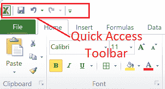

在快速访问工具栏上的重做快捷方式之前，可以找到使用撤消操作的快捷方式。仅在对工作表进行一些更改后才可见。这意味着，如果我们创建一个新的工作表，撤消快捷方式将变灰或不能被单击，因为没有要撤消的内容。像撤消键盘快捷键一样，我们可以从快速访问工具栏中单击一次或两次撤消快捷键，以相应地撤消相应的更改。

快速访问工具栏上的 Excel 撤消快捷方式如下图所示:

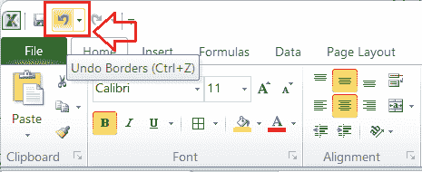

快速访问工具栏上“撤消”快捷方式的主要用途是在我们需要从多个最后的操作或步骤中恢复更改时发挥作用。在这种情况下，我们可以单击快速访问工具栏上撤消快捷方式旁边的下拉图标。它显示活动工作表中所有可以撤消的操作。我们可以从先前操作的下拉列表中选择一个特定的点或位置，以撤销所选点和当前点之间的所有更改。

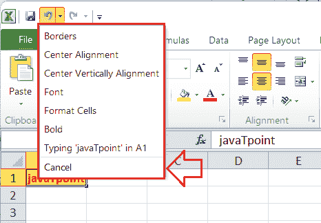

虽然默认情况下 Excel 会安装“撤消”快捷方式，但由于设置中的一些意外更改，有时我们在快速访问工具栏上看不到快捷方式。在这种情况下，我们可以从设置中手动添加快速访问工具栏上的撤消快捷方式，并在需要时相应地使用快捷方式。

**在快速访问工具栏上添加撤销按钮**

如果我们在快速访问工具栏中看不到“撤消”按钮，我们或其他人可能会误将该按钮从工具栏中移除。我们可以执行以下步骤，并在工具栏上恢复“撤消”按钮:

*   首先，我们需要进入**文件**标签，从列表中选择**选项**。
    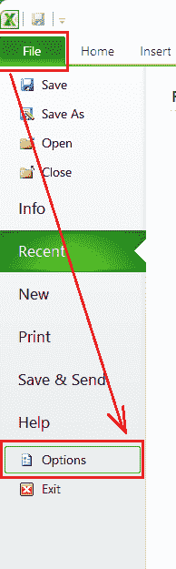
*   选择“选项”后，启动名为“ **Excel 选项**的窗口，我们可以在这里访问 Excel 的所有设置。但是，我们必须从左侧列表中单击“**快速访问工具栏**选项，如下所示:
    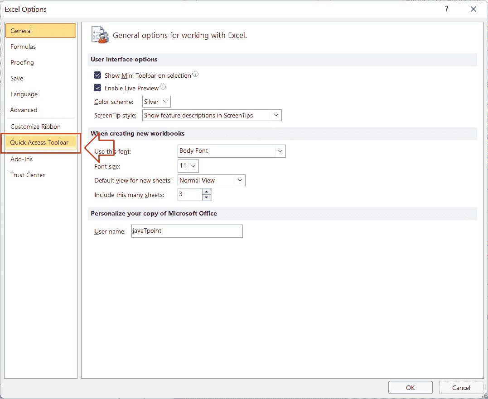
*   接下来，我们需要从中点击**下的下拉菜单选择命令，并选择**所有命令**选项。
    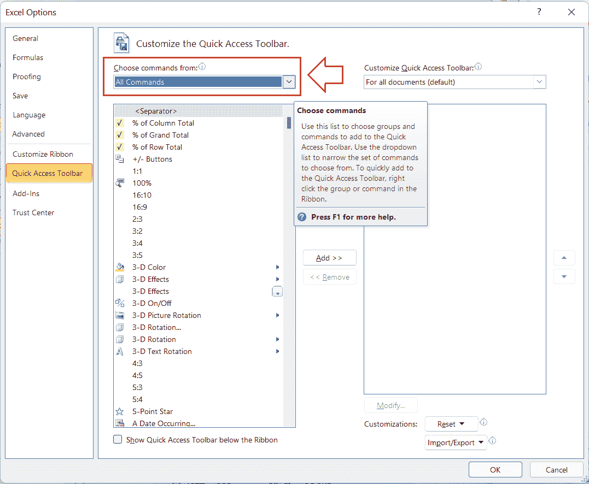**
*   得到 Excel 命令列表后，必须选择“**撤销**命令，点击“**添加> >** 按钮。
    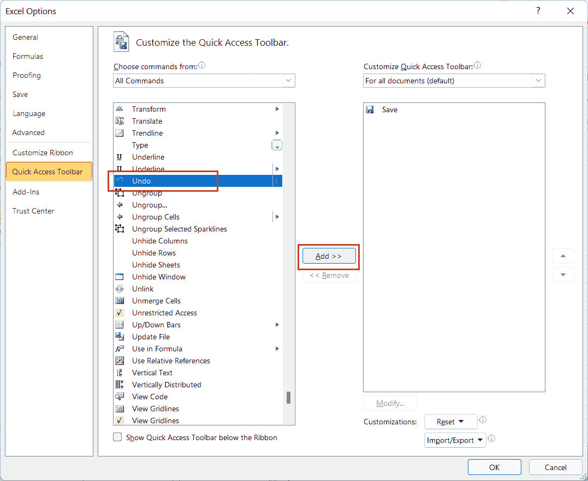
*   单击“添加> >”按钮后，撤销命令将被添加到右侧框中。一旦在右侧框中添加了命令，我们需要通过点击**确定**
    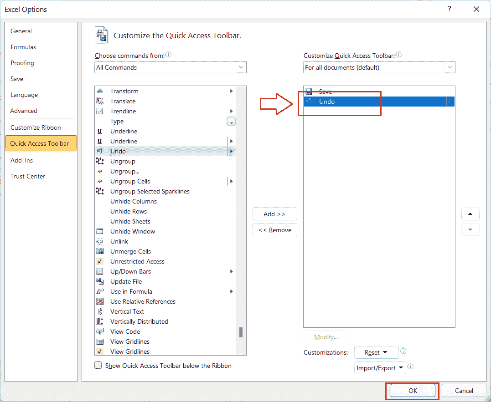来保存更改
*   保存设置后，我们可以从快速访问工具栏访问**撤销**命令快捷方式。
    T3】

## 还原撤消:重做撤消的操作

当我们在 Excel 中撤消更改，但意识到需要将这些更改返回到工作表中时，我们可以利用重做命令。重做命令与撤消命令完全相反。但是，如果在活动图纸中没有执行撤消操作，则重做命令不可访问。

“重做”命令可以通过键盘快捷键或快速访问工具栏与“撤消”命令类似地使用。它位于快速访问工具栏中的重做按钮旁边。如果上面的快速访问工具栏不存在，我们可以按照本文中的相同过程添加它，将撤销快捷方式添加到上面的快速访问工具栏中。

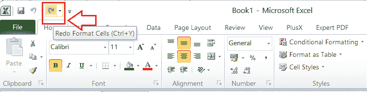

要快速重做一个动作或一组动作，我们可以根据需要使用键盘快捷键 **Ctrl + Y** (在 Windows 上)和 **CMD + Y** (在 MacOS 上)一次或多次。

### 示例:撤消 Excel 中的更改

让我们了解撤消命令的工作原理，并撤消 Excel 工作表中的更改。为了理解这一点，我们将首先在工作表中进行一些随机操作，然后使用撤销命令来恢复对工作表所做的所有更改。

假设我们创建一个空的 Excel 工作表，并通过应用 RANDBETWEEN 公式在单元格 A1 中插入随机值，如下所示:

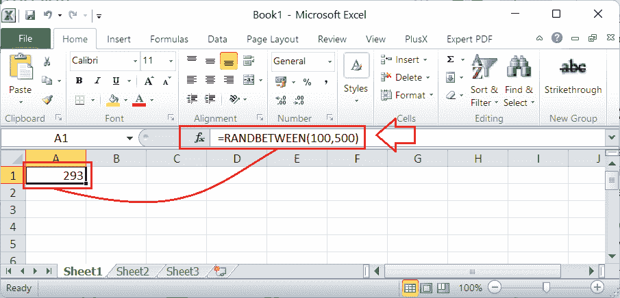

接下来，我们从单元格 A1 复制公式，并将其粘贴到单元格 A1 至 E10 的范围内。

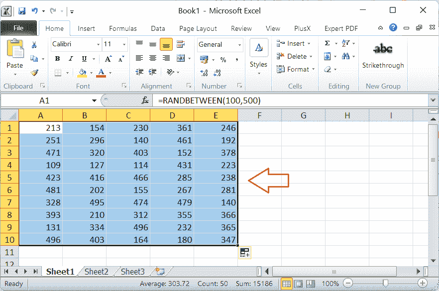

到目前为止，我们已经对空的或新创建的 Excel 工作表进行了两种不同的更改。接下来，我们将背景颜色、字体颜色和字体大小更改为选定的范围。

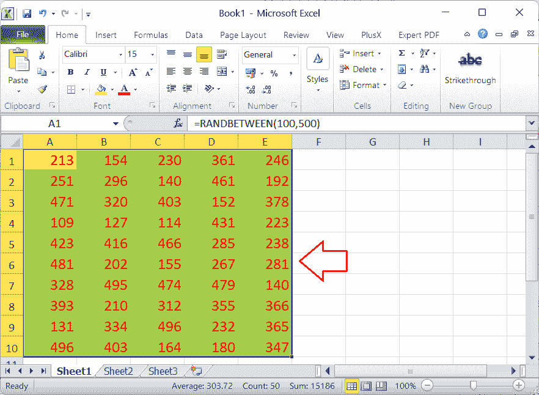

最后，我们复制整个范围，并使用“特殊粘贴”功能将其粘贴到与值相同的范围上。

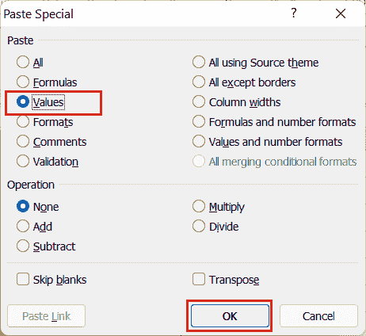

在这个阶段，Excel 将我们所做的所有更改存储在一个空的工作表中，并且工作表中的数据没有公式。

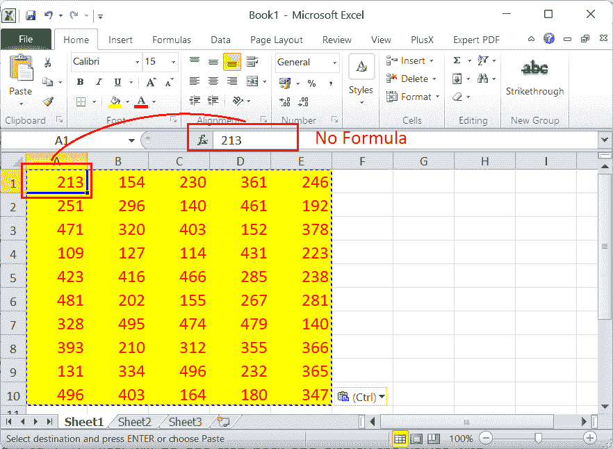

我们采取的最后一个操作是删除公式，并对选定范围内的值进行归一化。现在，如果我们按一次撤销快捷方式( **Ctrl + Z** ，Excel 将撤销更改，并显示值以及 RANDBETWEEN 公式。

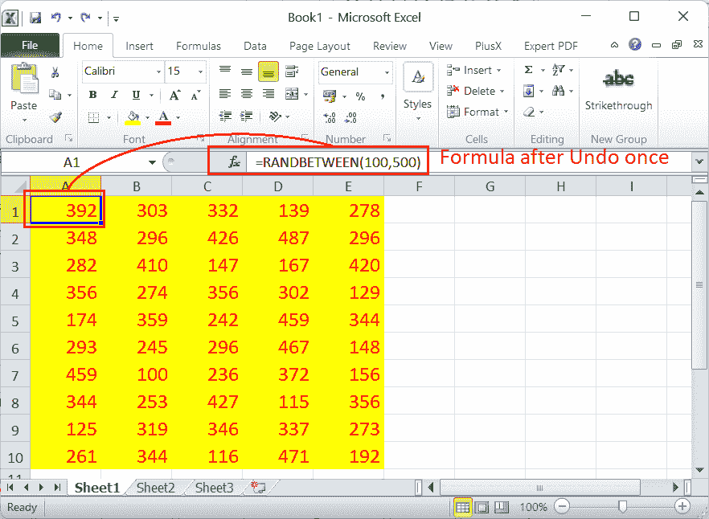

在上面的图像中，由于 RANDBETWEEN，这些值随机变化，因此它们与之前不同。

现在假设，我们想要撤销所有的更改，让我们的工作表回到空白状态。为此，我们必须按几次撤消快捷方式(Ctrl + Y)，直到工作表变空。或者，我们可以从快速访问工具栏访问“撤消”下拉列表，查看对工作表所做的所有更改，并单击列表中的特定操作以立即返回到该状态。在我们的示例中，我们可以单击撤消下拉列表中的最后一个选项，立即撤消所有更改(我们进行的 10 个操作)，并达到工作表为空时的状态。

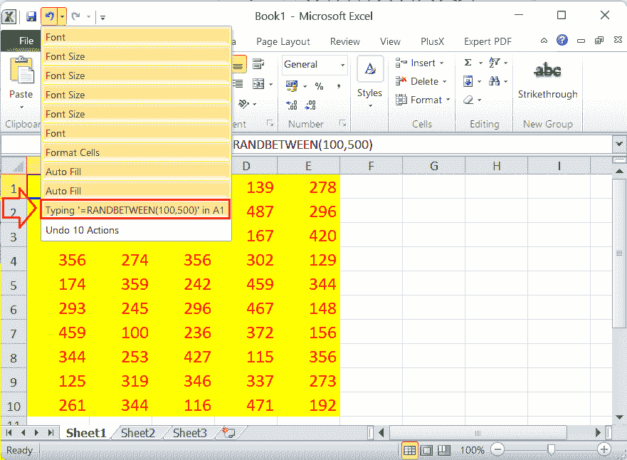

撤消所有更改后，我们的工作表变得和以前一样空。但是，操作仍会保存，并且可以使用重做进行恢复。下图显示了“重做”下拉列表下保存的所有操作:

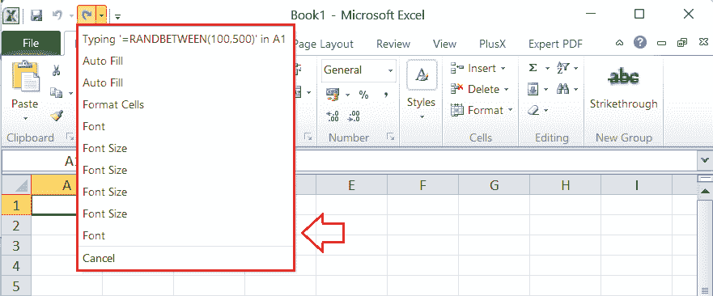

这样，我们就可以撤消 Excel 工作表中的更改。

## Excel 中撤销的局限性

*   创建新工作表时，“撤消”命令呈灰色，我们无法单击它。这是因为“撤消”命令直接依赖于对图纸所做的更改，而新创建的图纸是没有任何更改的空白图纸。
*   只有在同一活动会话中进行更改时，才能使用撤消命令。这意味着如果我们对工作表进行更改，关闭工作表并在 Excel 中重新打开它，撤消命令将不起作用。但是，我们可以撤消对工作表的更改，只要在进行更改后保持其打开状态。
*   如果我们从某人那里收到一个 Excel 文件，并试图撤消共享该工作表的人所做的更改，我们将没有资格这样做。在这种情况下，会话在人员进行更改后终止。但是，在使用 Excel 进行 Web 工作时，更改会保存在云上，并且可以在必要时恢复或撤消。

* * *