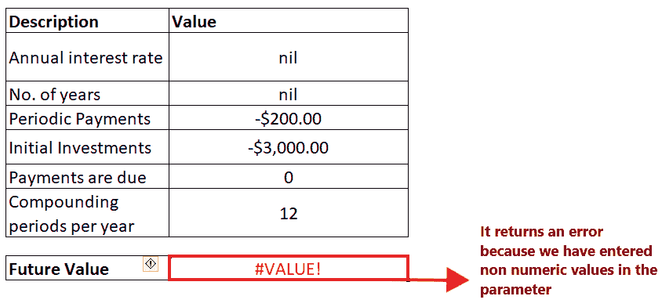

# Excel FV 函数

> 原文:[https://www.javatpoint.com/excel-fv-function](https://www.javatpoint.com/excel-fv-function)

未来规划对你的个人和公司财务至关重要。理解今天投资的未来前景和增长是成功的最重要因素之一。为了使这一步变得容易，Excel 提供了一个名为 ***FV(代表未来价值)*** 的内置函数。

在本教程中，我们将涵盖定义、语法以及为一系列现金流、各种示例等构建正确 FV 公式的步骤！

## 什么是 FV 功能？

> Excel 的 FV 函数告诉你以固定利率(固定价值)进行的固定支付的未来价值。它适用于两种类型的付款，无论是一系列定期付款还是一次性付款。

财务价值函数在 Excel 财务函数下分类。该函数用于以固定利率返回投资的未来价值。未来价值(FV)是有助于各种财务建模和财务规划的主要元素之一。换句话说，FV 定义了如果在特定时间投资，未来特定的货币或资产将上涨或增长多少。

一般来说， ***未来值是根据预测的增长率或收益率计算的。*** 当钱存入固定利率的储蓄账户，如 FD(定期存款、RD 等)时，确定未来价值相当容易。).虽然有些投资的回报率不稳定，而且利率也会波动，比如股票、债券或其他证券。这类投资很难准确计算。幸运的是，微软 Excel 引入了一个特殊的函数，它可以根据您给定的参数为您进行所有必要的计算。

该功能是在 Excel 2007 中引入的，此后在所有版本中都可用，包括 Excel 2010、Excel 2013、Excel 2016、Excel 2017 和 Excel 365。

### 句法

of that number.

```

= FV(rate, nper, pmt, [pv], [type])

```

### 因素

**利率(必选)-** 此参数代表每期利率。如果你一年支付一次，提供一个年利率；如果你每个月支付金额，那么你应该提供一个月利率，以此类推。

**Nper(必选** ) -此参数表示年金长度的支付周期总数。

**pmt(必选)-** 此参数代表每个期间的付款。如果省略此参数，默认值为 0，但在这种情况下，必须包括 *pv* 参数。

**PV[可选]:** 此参数表示当前值，或现在所有付款的总值。因为它是一个可选参数，所以它的默认值是 0。但是如果在这种情况下省略了它，就必须包含 *pmt* 参数。

**键入[可选]:** 此参数提供有关付款到期时间的信息。

*   如果用户提供 0，则意味着周期结束
*   如果他提供 1，这意味着周期的开始。因为它是一个可选参数，所以它的默认值是 0。

### 关于 FV 函数需要记住的几点

请查看下面给出的要点，以便在您的工作表中有效地利用 FV 函数并避免 Excel 中的常见错误:

1.  你支付的钱(流出的金额)用负数表示，你收到的金额与你的收入不同，用正数表示。例如，如果你把钱投资到一家公司(你支付给他们)，就会有现金流出；它将使用负数来表示
2.  如果 pv(现值)参数被省略或其值为 0，则必须包括 pmt(付款金额)参数，反之亦然。
3.  您可以将比率参数指定为百分比或十进制数，例如 13%或. 13。
4.  如果你想计算正确的未来值，统一使用*利率*和 *nper* 例如，如果你以 7%的年利率进行 6 年付款，请为 nper 参数指定值 6，为*利率(利率)参数*指定值 7%或 0.07。如果你计划投资 10 年的月供，那么 nper 将是 10*12(总共 120 个周期)和 7%/12*费率*。
5.  它抛出一个#VALUE！如果 PV 公式中指定的任何参数不是数字，则会出现错误。若要在 Excel 中修复此错误，请始终确保所有参数都是数字，并且所有指定的数字都没有格式化为文本。

## 例子

### 示例 1:使用下表中给出的数据的 FV 函数计算年金的现值。


#### 注:在上面的例子中， *pmt* 参数为负(用红色表示)，因为我们正在投资金额。

要确定给定利率的未来值，pmt 和 nper 遵循以下给定步骤:

**第一步:在表格底部增加辅助行**

将光标放在表格下方，添加辅助行，即“未来值”。在这一行中，我们将输入 FV 公式，并获取给定数据的未来值。

参考下图:


**第二步:输入 FV 公式**

移动到帮助行的下一个单元格，并开始键入公式= FV(

它看起来类似于下图:


**第三步:将参数添加到公式中**

*   在第一个参数中，我们将指定每个周期的利率。在上表中，该比率在 C4 单元格中提到。所以我们的公式变成:=FV (C3，
*   接下来，该函数将询问 NPER 参数。此参数表示年金的支付周期总数。单元格 C5 中提到了 NPER。所以我们的公式变成:=FV (C3，C5
*   付款功能代表付款。因为我们称之为流出，所以 pmt 为负，在单元格 C5 中提到。所以我们的公式变成:=FV (C3，C5，C4
*   **Pv 是一个可选参数，**代表当前值，或所有付款的总值。在《C6 细胞》中提到过。所以我们的公式变成:=FV (C3，C5，C4，C6)
*   最后一个参数，即**类型**，是可选的。所以它会自动取默认值 0，因为我们已经省略了。

整个公式看起来类似于下图:


**步骤 4: FV 将返回输出**

输入完公式后，请按回车键。Excel 将返回您的 PV 公式的输出。如下所示，它将返回 0 作为您定期付款的输出。

*FV 为 0 美元，这意味着我们将能够通过支付 48 个月的分期付款(每个月 1，806 美元)来偿还最初获得的 8 万美元贷款。*


### 示例 2:使用 FV 公式构建一个通用计算器，用于计算未来价值，并且适用于定期投资和一次性投资。


#### 注:在上面的例子中，当我们投资金额时，pmt(定期付款)和 nper(初始投资)参数为负(用红色表示)。

要在 Excel 中设置未来值计算器，请执行以下步骤:

**第一步:在表格底部增加辅助行**

将光标放在表格下方，键入帮助行的标题，即“未来值”。在这一行中，我们将键入 FV 公式，并将获取任一年金类型的定期和一次性付款的未来值。

参考下图:


**第二步:输入 FV 公式**

移动到帮助行的下一个单元格，并开始键入公式= FV(

它看起来类似于下图:


**第三步:将参数添加到公式中**

*   在第一个参数中，我们将指定每个周期的利率。在上表中，我们给出了年利率。要将指定的年利率转换为周期利率，我们将年利率除以 12(一年中的总周期数)。所以我们的公式变成=FV (C3/C8，

#### 注意:在使用 Excel FV 公式计算每月现金流时，请始终记住将年利率转换为周期利率。

*   接下来，我们将指定 *nper* 要获取总期数，我们将年年金期限乘以 12(一年总期数。( *nper* =年数*一年中的周期数)。所以我们的公式变成:=FV(C3/C8，C4*C8，
*   接下来，我们将指定*付款*负数*付款*表示每个期间的流出付款。在单元格 C5 中提到了 *pmt* 。所以我们的公式变成:=FV(C3/C8，C4*C8，C5，
*   因为 PV 代表当前的投资价值。就我们而言，是-3000 美元。所以我们的公式变成:=FV(C3/12，C4*12，C5，C6)
*   该年金类型为 1。*型*在细胞 C6 中提到。所以我们的公式变成:=FV(C3/12，C4*12，C5，C6，C8)

整个公式看起来类似于下图:


**步骤 4: FV 将返回输出**

输入完公式后，请按回车键。FV 计算器将返回给定数据的未来值。如下所示，它将返回$15，151.10 作为您定期付款的输出。


*因此，我们可以得出结论，12 年结束时，未来价值将为 15，151.10。*

**提示**

*   在上面的例子中，我们计算了年度年金。同样，您可以找到每周、每季度或每半年年金的现值。要实现这一点，您只需要更改各个单元格中每年的周期数。
*   此外，如果希望现金流在期初出现，您可以将到期付款更改为 1。您也可以省略此值，因为它是一个可选参数，默认值为 0。

### 示例 3:在下表中，很少有非数字参数。让我们看看如果在 NPER 公式中指定非数字参数会发生什么。


要获取上表的 FV 输出，请遵循以下给定步骤:

**第一步:在表格底部增加辅助行**

将光标放在表格下方，并添加帮助行。在这一行中，我们将键入 NPER 公式，并获取给定数据的定期付款。

参考下图:


**第二步:添加 FV 公式并插入其参数**

*   移动辅助单元格的光标，并开始键入公式= FV(
*   将所有五个 NPER 参数相加，您将获得以下公式= =FV(C3/12，C4*12，C5，C6，C8)

#### 注:我们省略了类型参数，因为我们假设付款在期末到期。


**第三步:FV 函数将返回#VALUE！输出错误**

输入完公式后，请按回车键。Excel 将返回您的 FV 公式的输出。如下所示，它将抛出#VALUE！错误。

参考下图:



如果您的 FV 公式中指定的任何参数不是数字，就会出现此错误。若要在 Excel 中修复此错误，请始终确保所有参数都是数字，并且所有指定的数字都没有格式化为文本。

## Excel FV 函数不起作用

有时在使用 FV 函数时，您可能会遇到错误或错误的结果，这主要是因为以下原因之一:

*   **#VALUE！错误**

如果您的 FV 公式中指定的任何参数不是数字，就会出现此错误。若要在 Excel 中修复此错误，请始终确保所有参数都是数字，并且所有指定的数字都没有格式化为文本。

*   **FV 函数的输出为负数或** **远低于预期**

当您使用正数表示流出付款时，FV 公式中会出现此问题。例如，当您计算贷款的付款期时，请将 *pv* (贷款值)参数作为正数，将 *pmt* 参数作为负数。

* * *