# excel 中的日期到月份

> 原文：<https://www.javatpoint.com/date-to-month-in-excel>

有时候，用户有一个日期，想要计算月份。Excel 为用户提供了几种从日期中查找月份的方法。当用户想要计算年、月和日期的总数时，他会有这种类型的需求。

在本章中，我们将帮助您使用 MS Excel 函数和功能将日期转换为月份。此外，我们还将计算日期的年、月和日。遵循下面的教程。

## 将日期转换为月份的方法

每当用户在 Excel 单元格中输入日期时，它会通过识别该单元格来自动将其转换为日期单元格。说明 MS Excel 对日期的年、月、日非常熟悉。由于 Excel 理解日期，用户可以很容易地从日期中提取月份。

Excel 支持各种方式将日期转换为月份。

1.  [使用 month 功能](#MONTH)提取日期至月份
2.  [使用文本功能](#TEXT)获取日期到月份的名称
3.  [使用格式单元格](#Format)将日期转换为月份
4.  [使用开关功能的日期到月份](#SWITCH)
5.  [使用选择功能](#CHOOSE)将日期转换为月份

从日期到工作日/月/年的转换方式来看，它们都是有用的方法。

## 使用 month()函数提取日期到月份

Excel MONTH()和 YEAR()方法帮助用户从日期中提取月份和年份。如果用户想使用此功能，日期应该是有效的 Excel 日期。如果日期不正确，使用该功能可以得到 **#VALUE** 错误。

YEAR()函数还会在找到无效日期时返回#VALUE 错误。

**例**

**第 1 步:**我们使用 **MONTH()** 函数获取一些样本数据来查看从有效日期提取的月份。不同日期的数据如下:

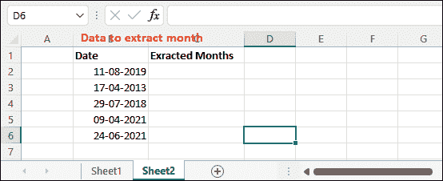

**第二步:**点击将粘贴提取结果的空白单元格，写出如下月提取公式。

=月(B2)

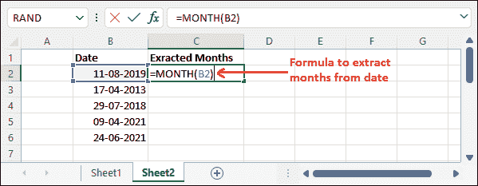

**第三步:**现在，点击**进入**键，获取存储在 B2 单元格中的日期的月转换结果。

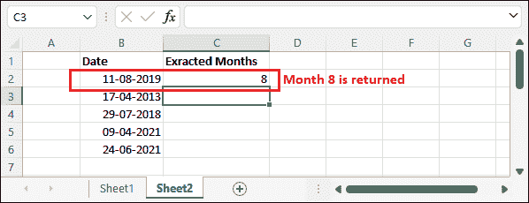

从 B2 细胞日期(11-08-2021)提取后，已于第 8 个月返回。

**第 4 步:**使用相同的公式从该列中的其他日期提取月份，或者拖动结果单元格以自动对其他单元格使用相同的公式。

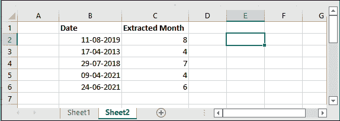

查看 c 列中所有日期的提取月份。这是提取日期到月份的最简单方法之一。

## 使用文本函数从日期中获取月份名称

Excel 还有另一个从日期中提取月份名称的函数(TEXT)。文本函数提取月份，并从日期中返回月份名称。该函数接受两个参数，即日期和要转换的值类型。例如，mmmm 代表月份名称。

您将通过不同的方式获得月份名称，例如- Jan 或 1 月。要获取月份名称作为一月，请使用 mmmm，对于月份名称作为一月，请在 TEXT 函数的第二个参数中使用 mmm。

**使用文本功能作为-**

=TEXT(A2，m)得到不带零的月号，即 3。

=TEXT(A2，mm)获取带零的月号，即 03。

=TEXT(A2，mmm)获得月份名称的缩写，即 Sep。

=TEXT(A2，“mmmm”)获取完整的月份名称，即九月。

这里，假设 A2 包含我们执行这些操作的日期。

**例**

**第一步:**我们取一些样本数据，看看如何使用 **TEXT()** 函数从有效日期获取月份名称。不同日期的数据如下:

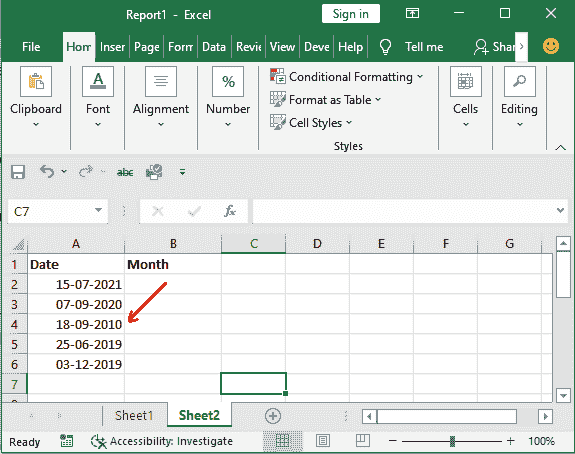

**第二步:**点击将出现提取月份名称的空白单元格，写出以下月份提取公式。

=TEXT(A2，“毫米”)

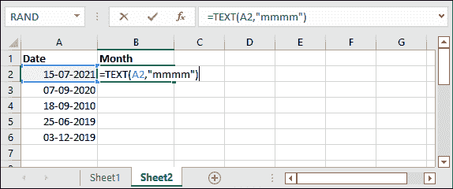

**第三步:**从日期中提取月份名称后，这里会返回月份名称。

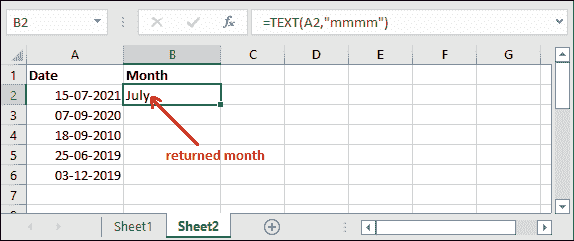

**第 4 步:**使用相同的公式从该列中的其他日期提取月份，或者拖动结果单元格以自动对其他单元格使用相同的公式。

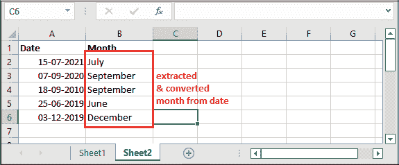

查看 b 列中所有日期的提取月份。这是从日期中获取月份名称的最佳方法。

## 使用格式单元格将日期转换为月份

单元格格式是 Excel 的选择和点击方式。对于不擅长在 Excel 工作簿中使用公式的用户很有用。他们可以用这种方法把日期转换成月份。通过使用此方法，您不需要将日期转换为月份。

我们将使用与上述方法相同的数据集，以便您可以比较两种结果。

**例**

**第一步:**这是我们在这个例子中使用的日期数据。

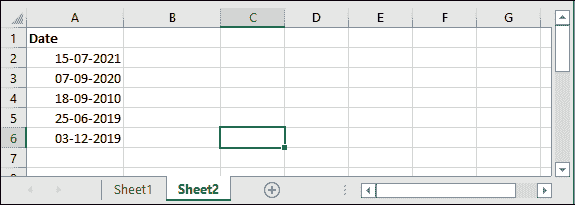

**第二步:**选择其中一个有日期的单元格，按 **Ctrl+1** 快捷键，打开单元格格式窗口面板。

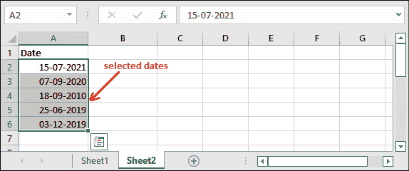

**第三步:**在“数字”选项卡的“类别”选项下选择**自定义**。

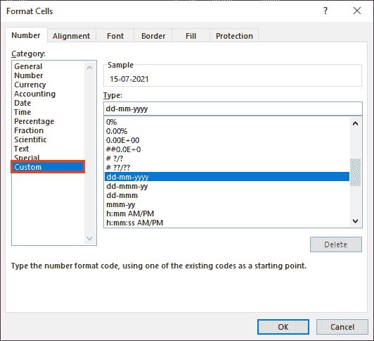

您也可以在**主页**标签的数字部分找到该选项的下拉列表。

**第四步:**现在，在“类型”框中输入 **mmmm** 并选择它以获得所选日期的完整月份名称，然后点击**确定**。

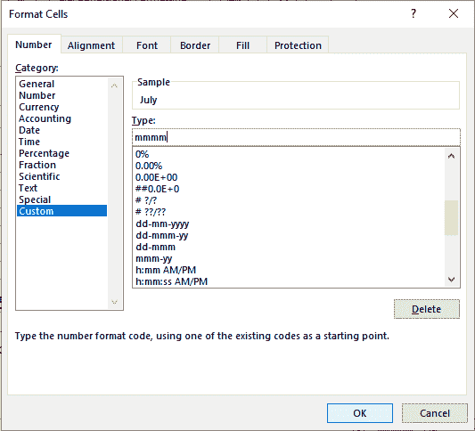

相反，您也可以选择 **mmm** 作为月份名称的缩写。

**第五步:**可以看到，使用格式单元格功能，从所选日期提取后，返回月份名称。

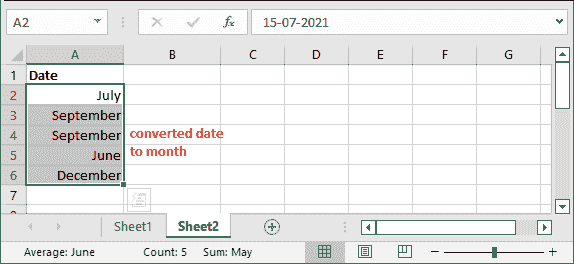

您可以一次转换和提取多个日期的月份。

## 使用开关功能的日期到月份

开关()与 MONTH()函数一起使用，从日期中提取月份。使用此操作时，它会返回月份名称。但是，Excel 用户必须为月号明确指定月份名称，以便能够正确提取月份名称，而不会中断。

**语法**

带有 MONTH 的 SWITCH()的语法如下

SWITCH(MONTH(A2), 1, "Jan", 2, "Feb", 3, "Mar", 4, "Apr", 5, "May", 6, "June", 7, "July", 8, "Aug", 9, "Sep", 10, "Oct", 11, "Nov", 12, "Dec")

该函数将从日期中提取月号后，将其转换为月名。

**例**

**第一步:**我们取了以下以月为数字的数据日期。我们现在将使用 SWITCH 函数提取月份，并将其转换为月份名称。

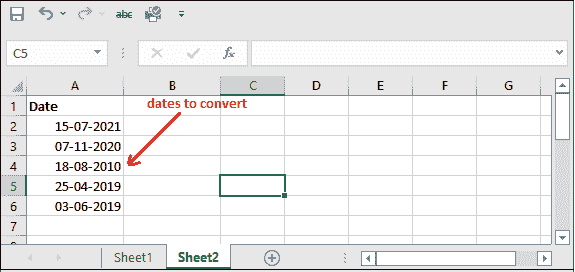

让我们看看下面的步骤，了解它将如何工作。

**第二步:**现在，我们将使用上面解释的公式，即:

=SWITCH(MONTH(A2)，1，“1 月”，2“2 月”，3“3 月”，4“4 月”，5“5 月”，6“6 月”，7“7 月”，8“8 月”，9“9 月”，10“10 月”，11“11 月”，12“12 月”)

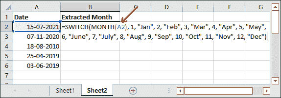

**第三步:**点击**进入**键，获取从存储在 A2 单元格中的日期中提取的结果。

请注意，它返回了公式中使用的相应日期的七月。

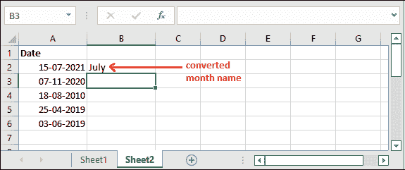

同样，对其他单元格应用相同的公式来提取和转换月份名称。最后查看所有单元格的结果。

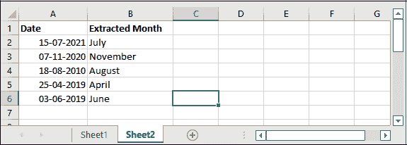

Excel 有各种方法可以做到这一点，你可以选择你认为最适合你的。

## 使用“选择”功能将日期转换为月份

CHOOSE()函数是通过从日期中提取月份来将日期转换为月份的另一种方法。如果你发现上面的方法很难使用或者不符合你的要求，你可以选择这个方法。

函数的作用是:将日期转换成月份和星期几。用户必须相应地使用该功能。

```
For example, to get the name of the month, use the CHOOSE() function as =CHOOSE(MONTH(A2), "Jan", "Feb", "Mar", "Apr", "May", "June", "July", "Aug", "Sep", "Oct", "Nov", "Dec"). 

In the same way, if you want the day of the week, use the function as =CHOOSE(WEEKDAY(A2), "Sun", "Mon", "Tue", "Wed", "Thu", "Fri", "Sat"). 

```

这个方法比 SWITCH()函数更简单，因为您还需要明确指定每个月的月号。

**例**

**第一步:**我们在这个例子中使用的是日期数据，将日期转换为月份。


**第二步:**现在，我们将使用上面解释的公式，即:

=CHOOSE(月(A2)、“1 月”、“2 月”、“3 月”、“4 月”、“5 月”、“6 月”、“7 月”、“8 月”、“9 月”、“10 月”、“11 月”、“12 月”)

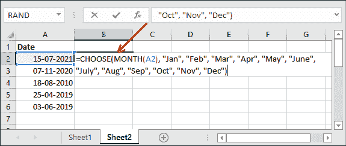

**第三步:**点击**进入**键，获取从存储在 A2 单元格中的日期中提取的结果。

请注意，它返回了公式中使用的相应日期的七月。


**第四步:**同理，如果想知道工作日名称，可以用下面的公式。

=CHOOSE(WEEKDAY(A2)、“Sun”、“Mon”、“Tue”、“Wed”、“Thu”、“Fri”、“Sat”)

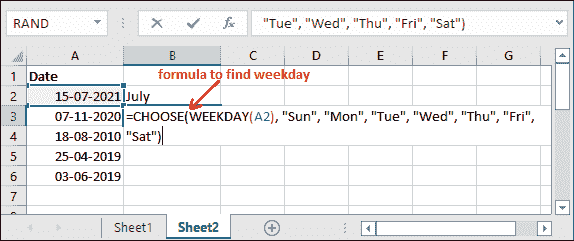

**第五步:**再次点击**进入**键，获取存储在 A3 单元格中的日期的工作日结果。

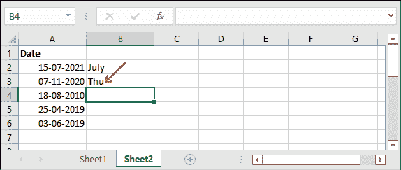

同样，Excel 用户可以从日期中获取月份，除了今年，还可以获取工作日。Excel 提供了各种函数来实现这一点。

* * *