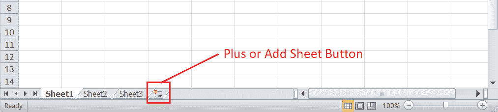

# 在 Excel 中创建工作表

> 原文:[https://www.javatpoint.com/create-a-worksheet-in-excel](https://www.javatpoint.com/create-a-worksheet-in-excel)

微软 Excel 是微软最强大的电子表格软件之一。它具有一系列独特的内置特性和功能，可帮助我们在工作表中记录大量数据。默认情况下，每当我们在 Excel 中创建新工作簿时，都会得到三个工作表，即工作表 1、工作表 2 和工作表 3。但是，有时我们可能需要一个或多个额外的工作表来记录数据。Excel 也为用户提供了这样一个有用的选项或功能。

本文讨论了在 Excel 中创建工作表的各种分步教程。在讨论在 Excel 中创建工作表的过程之前，让我们简单讨论一下 Excel 工作表简介。

## 什么是 Excel 中的工作表？

Excel 工作表是 Excel 文档中使用的单一工作表，它包含按行和列组织的单元格组。每个工作表都允许用户在单元格内记录或写入数据，并对记录的数据执行各种操作。

工作表位于 Excel 窗口的底部区域，称为“工作表”选项卡。默认情况下，新工作簿包含以下工作表:


在上图的“工作表”选项卡中，我们有三个工作表，例如“工作表 1”、“工作表 2”和“工作表 3”。要查看任何所需的工作表，我们需要从“工作表”选项卡中单击特定工作表的名称。

## 如何在 Excel 中创建/插入工作表？

在 Excel 中，我们有多种方法来执行最常见的任务。同样，在创建工作表时，我们可以使用不同的方法，例如:

*   使用“工作表”选项卡创建工作表
*   使用上下文菜单创建工作表
*   使用功能区创建工作表
*   使用键盘快捷键创建工作表
*   使用 VBA 创建工作表

让我们详细讨论每种方法:

### 使用“工作表”选项卡创建工作表

在工作簿中创建工作表的最简单方法是使用“工作表”选项卡。Excel 在工作表标签中显示一个附加的**加号图标**，一般称为“添加/插入工作表按钮”。使用这个加号图标或按钮，我们可以立即在 Excel 工作簿中创建一个工作表。此外，多次单击此图标允许我们相应地创建多个工作表。



只要我们单击“工作表”选项卡中的加号图标，就会在最后一个工作表名称的最右侧创建一个新工作表。默认情况下，工作表名称是按顺序创建的。例如，如果我们在工作簿中有三个工作表，如工作表 1、工作表 2 和工作表 3，并单击加号图标，新创建的工作表将被命名为工作表 4。


### 使用上下文菜单创建工作表

上下文菜单是指在相应功能上访问的右键菜单选项。在工作簿中创建工作表是另一种简单的方法。我们可以遵循下面讨论的步骤:

*   首先，我们需要在“工作表”选项卡上的任意工作表名称上按下**右键**按钮，以打开上下文菜单。
    T3】
*   接下来，我们需要从列表中点击“**插入**选项，如下所示:
    
*   只要我们单击插入选项，Excel 就会启动插入对话框。我们必须选择**工作表**选项，点击**确定**按钮创建新工作表并关闭对话框。
    
    新工作表在活动 Excel 工作簿中即时创建，如下图:
    

当我们使用此方法时，新工作表将在所选工作表的左侧创建，而不是在“工作表”选项卡中的最后一张工作表。因此，我们必须在按下右键时仔细选择工作表。此外，命名方法也是一样的。我们可以像其他方法一样，对每个额外的工作表反复使用这个方法。

### 使用功能区创建工作表

Excel 是一个功能丰富的电子表格软件，大部分功能都放在功能区上。访问功能区工具是 Excel 的基本任务之一。功能区还允许我们使用该工具创建工作表。我们可以执行以下步骤，在 Excel 工作簿中使用功能区创建工作表:

*   首先，我们需要转到功能区上的**主页**选项卡。
    T3】
*   接下来，我们需要在名为 Cells 的类别中点击与**插入**选项相关的下拉图标。
    T3】
*   在下一个窗口中，我们必须选择**插入工作表**选项，如下所示:
    
    我们一点击插入工作表，就会按照顺序命名方式，在 Excel 工作簿中所选工作表的左侧立即创建相同的工作表。
    
    同样，我们可以多次执行以上步骤，分别创建更多工作表。

### 使用键盘快捷键创建工作表

Excel 有许多内置或预定义的键盘快捷键，有助于快速执行大多数任务。我们还可以使用键盘快捷键在 Excel 工作簿中创建新工作表。Excel 有两种不同的键盘快捷键，无需使用鼠标即可快速创建工作表。我们可以使用 **Shift + F11** 或者 **Alt + Shift + F1** 。但是，对于某些键盘，我们可能需要使用 Fn 功能键来激活功能键，例如 F1、F2、…等等。


要使用键盘快捷键创建工作表，我们可以执行以下步骤:

*   首先，我们需要从“工作表”选项卡中选择任何工作表。
*   接下来，我们需要按住键盘上的 **Shift** 键。
*   按住 Shift 键的同时，我们必须按下并释放 **F11** 最后，我们必须释放 Shift 键。新工作表将很快创建。

当我们使用键盘快捷键在工作簿中创建工作表时，工作表被插入到所选工作表或活动工作表的左侧。此外，使用键盘快捷键可以创建多个工作表。


### 使用 VBA 创建工作表

VBA (Visual Basic for Applications)是 Excel 的高级功能之一，它允许我们使用代码执行大多数任务。在创建工作表时，Excel 允许我们通过 VBA 执行一个简单的宏或脚本，在工作表选项卡中的所需位置创建工作表。

我们可以执行以下步骤，在 Excel 中使用 VBA 创建工作表:

*   首先，我们需要使用快捷键 **Alt + F11** 启动 VBA 编辑器。
    T3】
*   接下来，我们需要转到**插入>模块**并将以下代码粘贴到模块编辑器窗口中。

```

Sub Add ()
    Sheets.Add
End Sub

```

上面的代码如下图所示:


*   在模块窗口中复制粘贴代码后，我们必须使用 **F5** 执行/运行代码。一旦我们执行了代码，新工作表就会在工作簿中活动工作表的左侧创建。
    T3】

同样，当我们需要在“工作表”选项卡中的任何特定工作表之后创建工作表时，我们可以使用以下代码:

```

Sub Add ()
    Sheets.Add After:=Sheets("SheetName")
End Sub

```

在上面的代码中，我们必须指定现有的工作表名称，之后我们要创建一个工作表来代替 sheet name。

## 如何在 Excel 中创建多个工作表？

尽管我们可以多次使用上面列出的任何方法在工作簿中创建多个工作表，但这将是一个漫长的过程。此外，Excel 还允许我们一次插入多个工作表。要一次创建许多工作表，我们通常需要选择或突出显示相同数量的现有工作表，以通知 Excel 我们需要多少工作表。

在 Excel 中选择工作表时，我们需要遵循以下规则:

*   当我们需要选择单个工作表时，我们可以从工作表标签中点击其名称上的**。**
***   当选择多个连续(或相邻)工作表时，我们必须首先点击第一张工作表，按住 **Shift** 键，然后从工作表标签中点击最后一张工作表。这样，我们可以选择第一个和最后一个单击的工作表之间的所有工作表。*   当我们需要选择活动/选中工作表右侧的多个连续工作表时，我们可以对每个新工作表使用快捷键 **Ctrl + Shift + PgDn** 。此外，我们可以使用快捷方式 **Ctrl + Shift + PgUp** 选择活动工作表左侧的工作表。*   当选择多个不连续(不相邻)的工作表时，我们需要在按住 **Ctrl** 的同时，从工作表标签中点击每个工作表名称*   我们可以从上下文菜单中选择“**选择所有工作表**”选项来选择 Excel 工作簿中的所有工作表。但是，在 Excel 中隐藏工作表时，这种特殊方法没有帮助。**

 **选择所需数量的工作表后，我们可以使用上下文菜单、功能区或键盘快捷键来创建工作表。

## 示例:在 Excel 中创建 3 个连续工作表

假设我们有一个新创建的工作簿，其中包含默认工作表，如工作表 1、工作表 2 和工作表 3。我们想在工作簿中再创建三个工作表。为此，我们必须经过以下步骤:

*   首先，我们需要**从工作表标签中选择**第一张工作表。
    T3】
*   接下来，我们必须按住键盘上的 **Shift** 键。
*   按住 Shift 键的同时，我们需要从“工作表”标签中点击最后一张工作表，即工作表 3 上的**。这将选择工作簿的所有三个工作表。一旦在工作簿中选择了多个工作表，它会在 Excel 窗口的顶部以“组”的形式显示文本，如下所示:
    **
***   一旦三个默认工作表都被选中，我们就可以进入**主页>插入>插入工作表**T2*   只要我们单击“插入工作表”选项，三个新工作表就会在同一个工作簿中创建，如下所示:
    
    同样，如果我们想再创建六个工作表，我们可以在选择所有现有的六个工作表后再次使用键盘快捷键。**

 **这样，我们只需点击几下鼠标，就可以快速创建多个工作表。

#### 注意:要在“工作表”选项卡中对工作表进行排序或排列工作表的顺序，我们可以使用鼠标拖放所需的工作表。

## 需要记住的要点

*   通常，Excel 工作簿中工作表的最大数量为 255 个。但是，Excel 不限制工作表的数量。主要看电脑的内存(RAM)，一个工作簿可以有多少工作表。
*   不建议在一个工作簿中使用这么多工作表，因为当计算机系统(所有工作表)充满大数据和公式时，它们会变得缓慢或不稳定。我们可以跨多个工作簿拆分数据，以确保更好的性能并丰富整体体验，而不是在单个工作簿中使用多个工作表。
*   要在 Excel 工作簿中保存数据，必须至少创建一个工作表。

* * *****