# 在 Excel 中隐藏工作表

> 原文:[https://www.javatpoint.com/hiding-worksheet-in-excel](https://www.javatpoint.com/hiding-worksheet-in-excel)

MS Excel 或 Microsoft Excel 是功能强大的电子表格软件，允许我们跨多个工作表记录海量数据。Excel 工作表由各种记录数据类型的单元格组成，如文本、数字、公式等。每个 Excel 单元格都有唯一的地址，可以在同一工作表、同一工作簿或不同的工作簿中引用。

通常，当我们创建或打开 Excel 工作簿时，所有相应的工作表都显示在工作表选项卡上，可以从 Excel 窗口的底部区域访问该选项卡。但是，可能会出现我们不希望特定工作表显示在 Excel 窗口的可见区域的情况。在这种情况下，我们可以使用 Excel 中的隐藏功能隐藏相应的工作表。

本文讨论了在 Excel 中隐藏所需工作表的各种常见方法的分步教程。本文还讨论了 Excel 中工作表的各种可见属性。

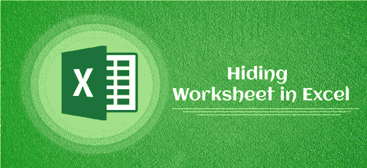

#### 注意:在 Excel 中隐藏工作表时，不会删除对应的工作表。我们只在视图区域隐藏所需的图纸。但是，他们的数据仍然可以在其他工作表或工作簿中正常引用。

## 可见属性

通过更改可见属性的值，可以隐藏或取消隐藏 Excel 工作表。Excel 对于可见属性通常有三个可能的值，如“真”、“假”和“非常隐藏”:

*   **True (xlSheetVisible)** :当工作表的 Visible 属性设置为 True 时，工作表在 Excel 窗口或工作表标签的可见区域中保持可见。此外，如果需要，可以照常选择纸张。
*   **False (xlSheetHidden)** :当工作表的“可见”属性设置为 False 时，工作表将从 Excel 窗口或工作表选项卡的可见区域中隐藏。在这种情况下，工作表对标准用户界面是隐藏的，但照常工作。如果数据和公式在其他表中用作参考，则它们通常可以工作。此外，当我们通过将“可见”属性设置为“假”来隐藏工作表时，很容易取消隐藏工作表。我们通常需要从“取消隐藏”对话框中取消隐藏所需的工作表。
*   **非常隐藏(xlSheetVeryHidden)**:Excel 中第三个可见属性非常隐藏。在这种情况下，标准用户界面和“取消隐藏”对话框将严格隐藏选定的图纸。这是从 VBA 做的，可以结合密码保护，所以未经授权的人很难进入隐藏的表，但对管理员来说很容易。

## 如何在 Excel 中隐藏工作表？

在 Excel 中执行任何任务时，我们通常会得到各种方式来完成。同样，我们也可以利用 Excel 中的隐藏选项来隐藏工作簿中的工作表。以下是在 Excel 中隐藏工作表的最常见方法:

*   使用上下文菜单隐藏工作表
*   使用功能区隐藏工作表
*   使用 VBA 隐藏工作表
*   使用键盘快捷键隐藏工作表

以上所有方法都有助于使我们的 Excel 工作表隐藏起来，非常隐藏，并且可见。这些方法通常会以某种方式更改 Excel 工作表的可见属性。现在让我们详细讨论每种方法:

### 使用上下文菜单隐藏工作表

在 Excel 中，上下文菜单通常称为右键菜单，它包含一些选项，具体取决于通过鼠标使用右键时选择的内容。要使用上下文菜单在 Excel 中隐藏工作表，我们必须执行以下步骤:

*   首先，我们需要**从**工作表标签**中选择**特定的工作表，我们想要隐藏在 Excel 窗口的可见区域。
    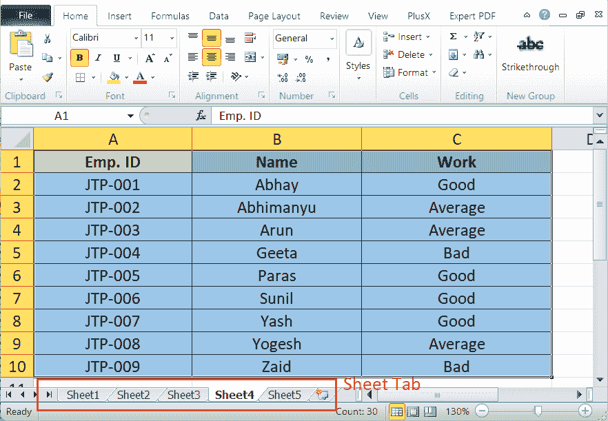
*   接下来，我们需要在所选页面上按下**右键**按钮，查看上下文菜单和可用选项。
    T3】
*   最后，我们必须从显示的右键菜单中选择“**隐藏**”选项来隐藏所选的工作表。
    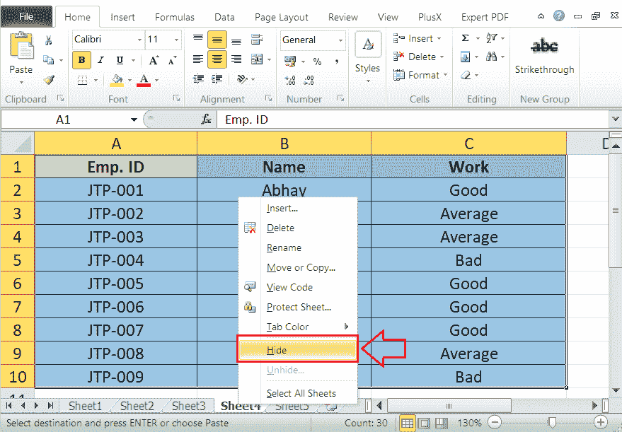
    所选工作表(即 sheet4)隐藏在下图的 Sheet 选项卡中。
    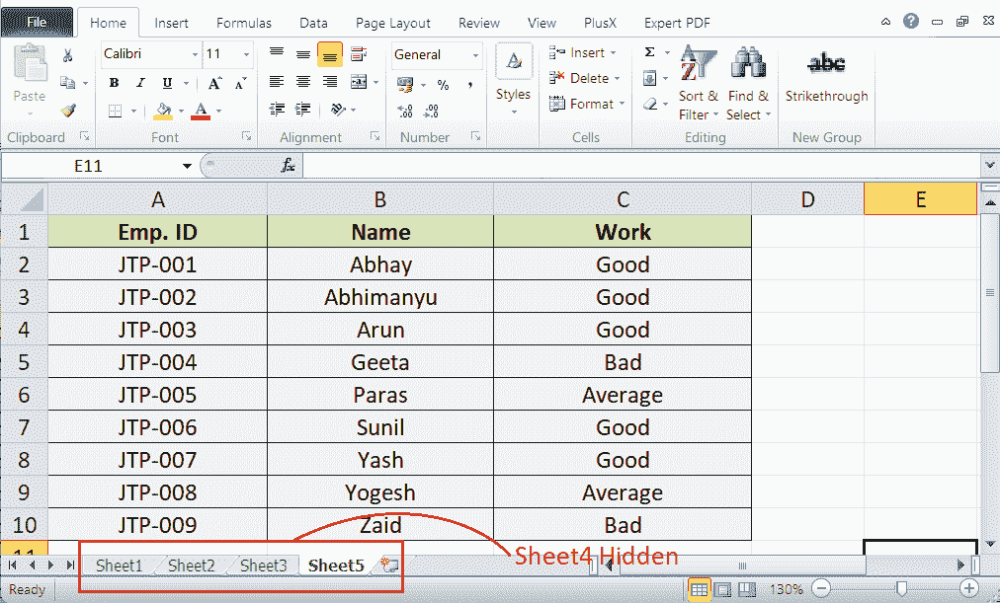

同样，我们可以通过单击上下文菜单中的“取消隐藏”选项来取消隐藏工作表。单击“取消隐藏”按钮显示隐藏工作表列表，我们可以从“取消隐藏”对话框中选择所需的工作表，然后单击“确定”。

### 如何在 Excel 中隐藏多个工作表？

当在 Excel 中隐藏多个工作表时，我们只需要在使用上面讨论的任何方法之前选择所有这些工作表。由于 Excel 无法隐藏所有工作表，我们必须至少保留一个工作表未隐藏(或未选中)。

要在 Excel 中选择多个工作表，我们可以使用下面列出的任何一种方法:

*   当我们需要选择单个工作表时，我们可以从工作表标签中点击其名称上的**。**
***   当选择多个连续(或相邻)工作表时，我们必须首先点击第一张工作表，按住键盘上的 **Shift** 键，然后从工作表标签中点击最后一张工作表。将选择第一个和最后一个单击的工作表之间的所有工作表。*   当选择多个不连续(不相邻)的工作表时，我们需要在按住 **Ctrl** 的同时，从工作表标签中点击每个工作表名称*   我们可以从上下文菜单中选择“**选择所有工作表**”选项来选择 Excel 工作簿中的所有工作表。但是，在 Excel 中隐藏工作表时，这种特殊方法没有帮助。**

 **选择所需的工作表后，我们需要使用方法隐藏它们，例如从上下文菜单、功能区、键盘快捷键或 VBA 中选择“隐藏”选项。

### 使用功能区隐藏工作表

隐藏 Excel 工作表的另一种简单方法是使用功能区工具/快捷方式。在 Excel 中，功能区包含 Excel 窗口顶部位置的所有内置命令及其快捷方式。我们可以从功能区访问“隐藏”选项，并按照以下步骤隐藏所需的工作表:

*   首先，我们必须从**工作表标签**中选择所需的工作表，以将其隐藏在视图区域之外。
*   接下来，我们需要导航功能区上的**主页**选项卡。之后，我们必须从名为**单元格**的组中单击与“**格式**选项相关联的下拉图标。
    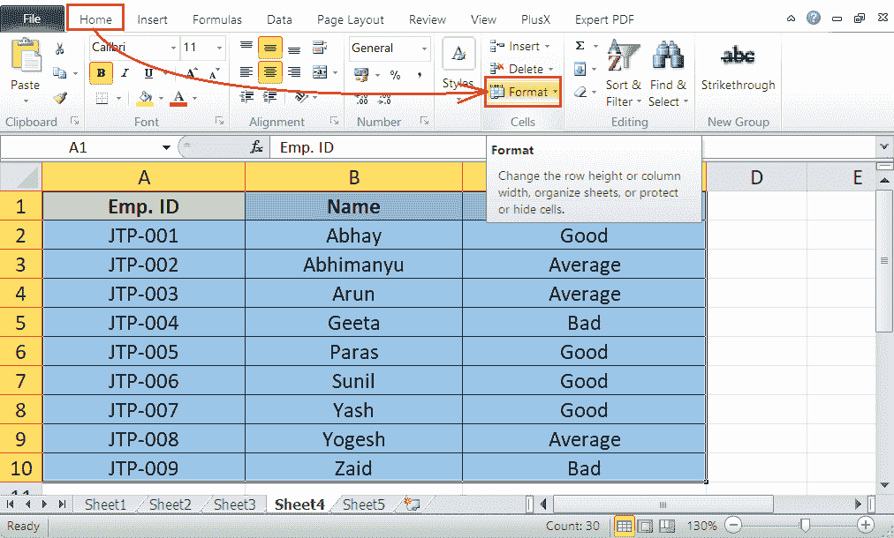
*   在下一个窗口，我们需要选择“**隐藏&取消隐藏**选项，如下图:
    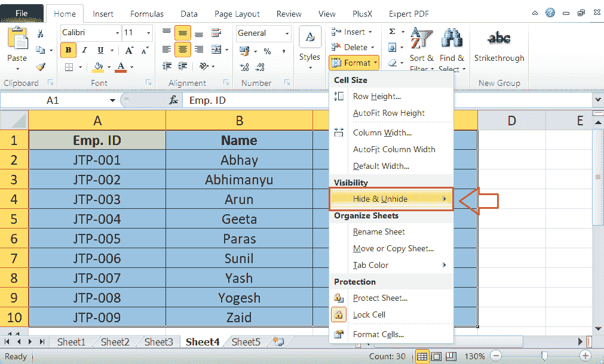
*   最后，我们必须点击**隐藏工作表**选项，我们选择的工作表将立即从工作表标签或可视区域中隐藏。
    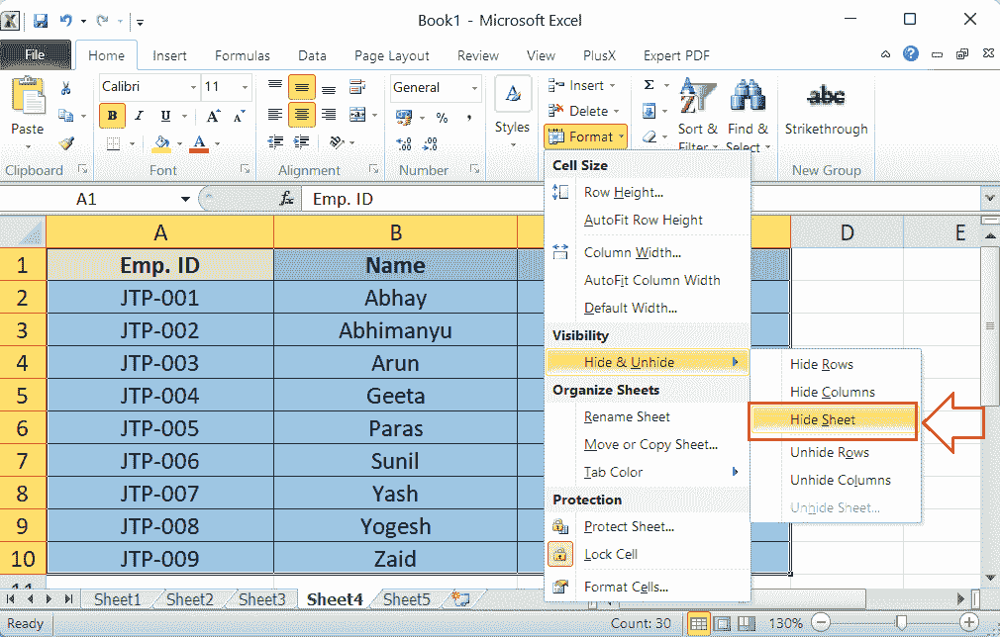
    所选工作表(即 sheet4)隐藏在下图的 Sheet 选项卡中。
    

同样，我们可以通过点击**主页>格式>隐藏&取消隐藏>取消隐藏工作表**来取消隐藏工作表。

### 使用 VBA 隐藏工作表

通常，Excel VBA(Visual Basic for Applications)通过执行特定的代码来帮助执行各种任务。然而，在 Excel 中隐藏工作表时，我们可以通过 Excel VBA 的图形界面，相应地隐藏所需的工作表。为此，我们必须执行以下步骤:

*   首先，我们需要在**工作表标签**中的任意工作表名称上点击鼠标**右键**按钮。
    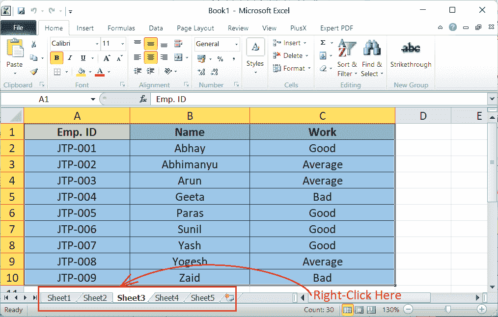
*   接下来，我们需要点击“**查看代码**”选项，进入 VBA 编辑器或 VBA 窗口。
    T3】
*   在 VBA，我们需要点击**工作表**来隐藏左侧窗格(VBA 编辑器项目浏览器)。
    T3】
*   选择工作表后，我们必须从工具栏中选择**属性**快捷方式，如下所示:
    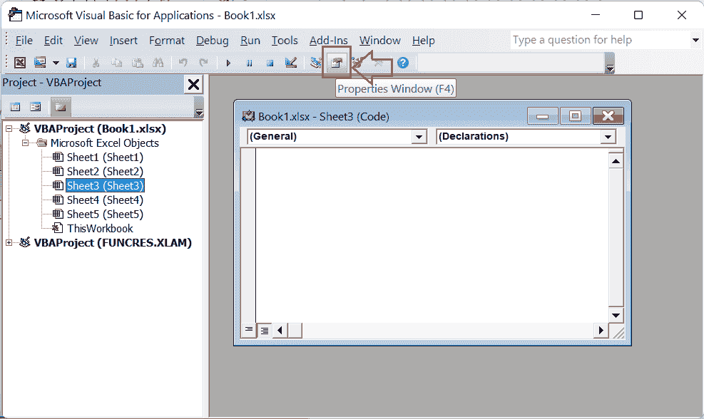
    或者，我们可以使用键盘快捷方式 F4 和 Fn 功能键打开所选工作表的属性
*   在属性窗格中，我们必须向下滚动并找到“**可见的**选项，然后单击其旁边的**下拉列表**。
*   最后，我们必须将可见属性从“xlSheetVisible”更改为“T0”xlsheet hidden，以使我们选择的工作表**隐藏起来**。
    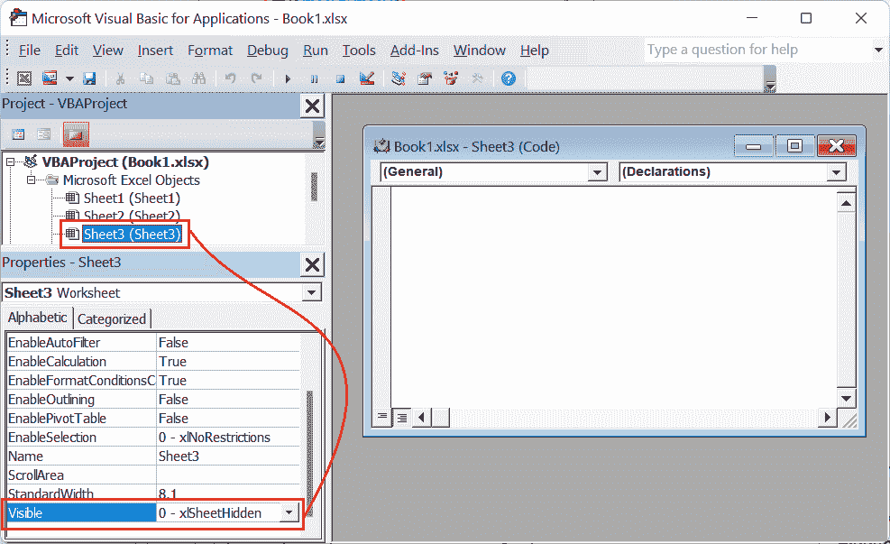
    我们可以关闭 VBA 编辑器，在更改了 Visible 属性后返回 Excel 窗口。我们选择的工作表将立即从视图区域中隐藏，并且可以从“取消隐藏”对话框中恢复。
    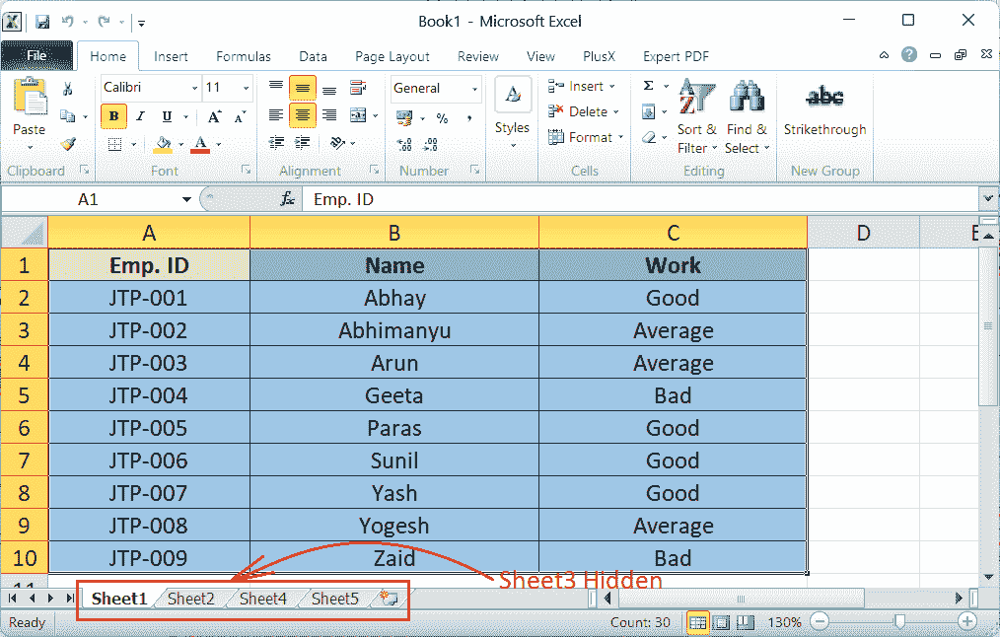

### 使工作表在 Excel 中非常隐蔽

要使所需的工作表**非常隐藏**，我们必须从 VBA 编辑器的图形界面中将可见属性设置为“**xlsheety Hidden**”。

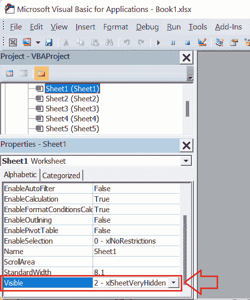

使用此方法隐藏工作表后，我们无法从“取消隐藏”对话框中取消隐藏工作表。在这种情况下，要取消隐藏工作表，我们必须再次使用 VBA 编辑器将可见属性从“xlSheetVery Hidden”更改为“xlSheetVisible”。

**使用快捷键**隐藏工作表

Excel 对大多数内置任务都有特定的快捷键。使用键盘快捷键是访问特定 Excel 功能或命令的最快方法。不幸的是，在 Excel 中隐藏工作表没有明确的捷径。然而，Alt 键方法是有效的。

Alt 键激活 Excel 窗口中功能区上的特定键。我们可以按下显示的键，并相应地访问相应的工具/命令/快捷方式。因此，要在 Excel 中隐藏任何工作表，我们必须依次按下以下键，一次一个: **Alt，H，O，U，s**

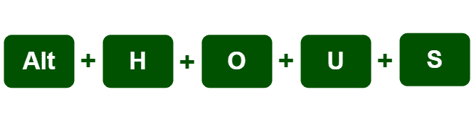

我们不需要记住指定的键或顺序，因为 Excel 在活动的 Excel 窗口中按下 Alt 键后会显示相应的键。工作中的要点如下:

*   按下 **Alt** 键激活 Excel 中的快速快捷键。
*   按下 **H** 键启动功能区上的**主页**标签。
*   按下 **O** 键，从类别单元格中选择**格式**选项。
*   按下 **U** 键，从格式选项下的列表中选择**隐藏&取消隐藏**选项。
*   按下 **S** 键选择**隐藏单**

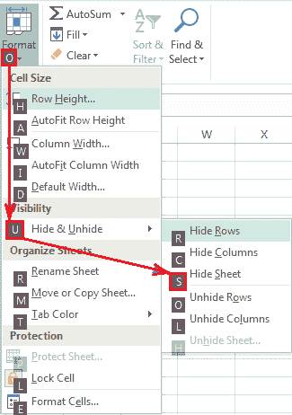

这样，我们可以通过按键盘快捷键来隐藏所选的工作表。

**添加自定义快捷键隐藏 Excel 工作表(VBA 代码隐藏工作表)**

Excel 还有助于为任何特定任务或命令配置任何自定义键盘快捷键。设置自定义键盘快捷键时，我们可以通过一次按键隐藏工作表。特别是，我们需要运行一个简单的宏来隐藏选定的工作表，并指定一个所需的组合键作为执行相应宏的快捷键。

我们必须执行以下步骤来插入适当的宏并分配特定的组合键:

*   首先，我们必须选择任意一张纸，使用快捷键 **Alt + F11** (带 Fn 功能键)或 **Alt + T、M、V** 启动 VBA。
    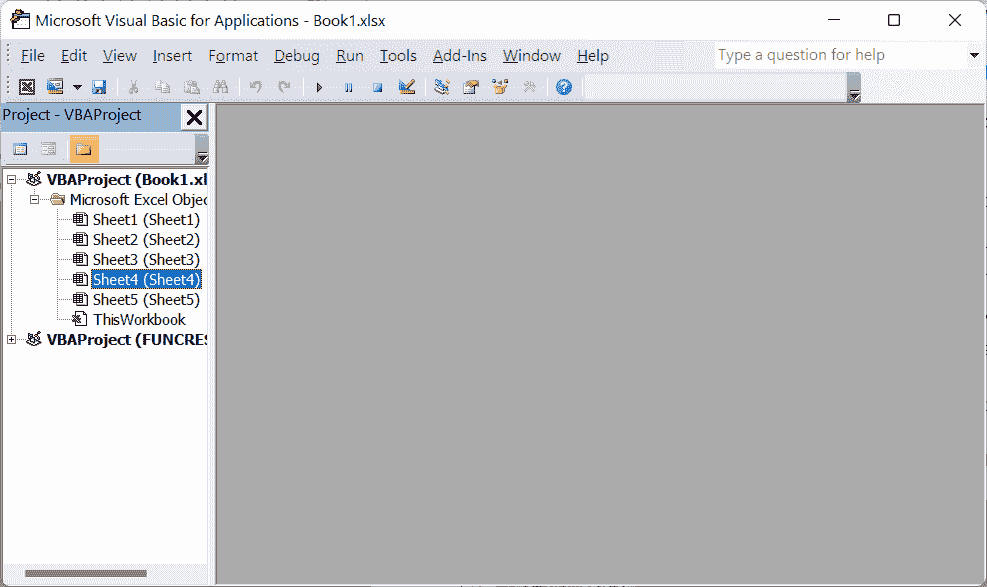
*   一旦 VBA 编辑器打开，我们需要从左侧窗格中右键单击任何对象。接下来，我们需要点击**插入>模块**在活动工作簿中插入一个新模块。
    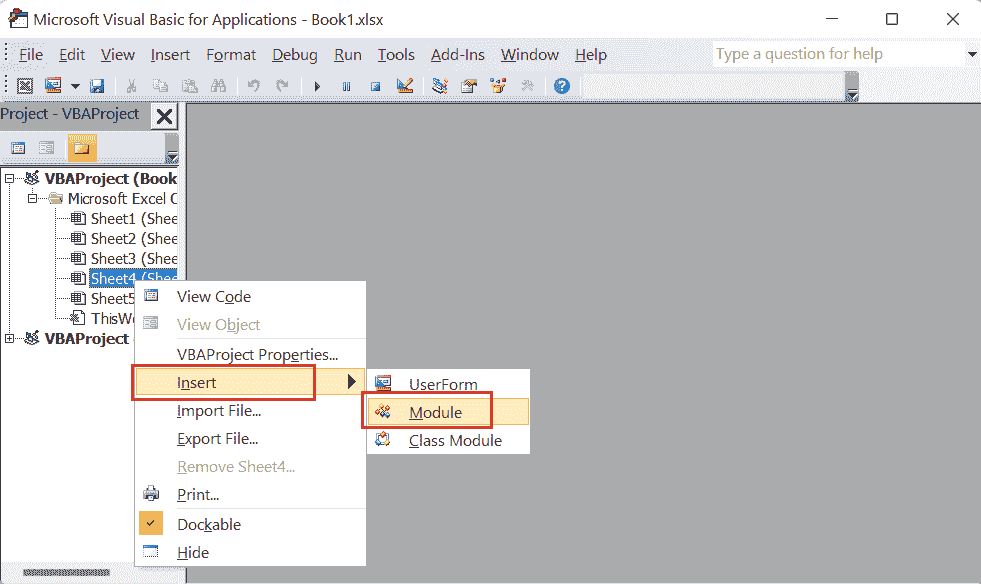
*   插入模块后，我们必须双击并在模块窗口中粘贴以下代码。

```

Sub HideSheet()
    Dim sheet As Worksheet
    Set sheet = ActiveSheet
    ' this hides the sheet but users will be able
    ' to unhide it using the Excel UI
    sheet.Visible = xlSheetHidden
End Sub

```

上述代码在模块窗口中如下所示:

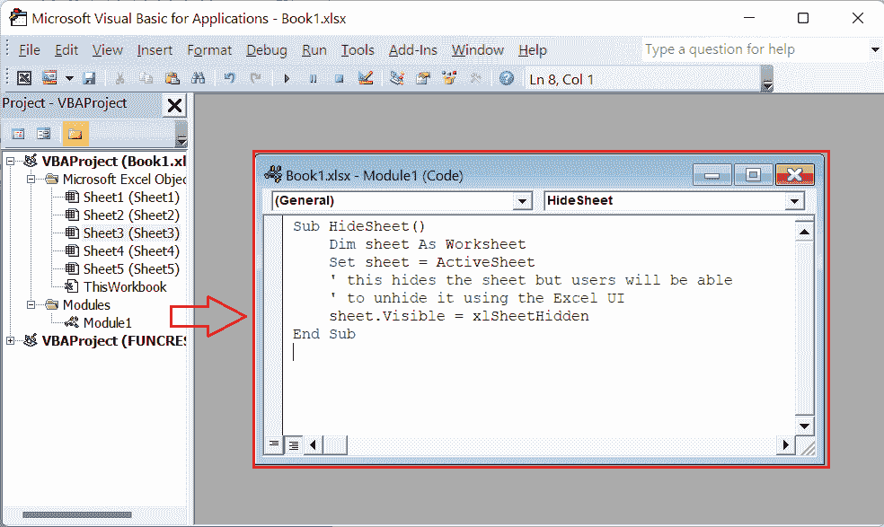

*   一旦我们将上述代码粘贴到 VBA 模块窗口中，我们需要关闭窗口并返回到 Excel 窗口。要启动宏对话框，我们需要按下快捷键 **Alt + F8** (带 Fn 功能键)。
    T3】
*   在“宏”对话框中，我们必须选择宏名称“隐藏工作表”或任何其他我们想要指定快捷键的名称。我们需要点击**选项**并为所选宏指定一个快捷键。
    T3】

这样，我们可以配置自定义快捷键来隐藏 Excel 中的任何活动工作表。每当我们想要隐藏想要的工作表时，我们需要选择特定的工作表并使用分配的快捷键(在我们的例子中是“Ctrl + Shift + H”)。

#### 注意:为任何宏指定快捷键时，我们必须确保自定义快捷键组合是唯一的。Excel 有几个预定义的快捷键。如果我们分配类似于预定义组合键的自定义快捷键，旧的操作将被新分配的操作替换。

上面的代码隐藏了视图区域中的工作表，这些工作表可以从“取消隐藏”对话框中取消隐藏。为了使所选工作表**非常隐蔽**，我们必须按照相同的步骤复制粘贴以下代码。

```

Sub HideSheet()
    Dim sheet As Worksheet
    Set sheet = ActiveSheet
    ' this hides the sheet so that it can only be made visible using VBA
    sheet.Visible = xlSheetVeryHidden
End Sub

```

使用上面的代码，我们将所选工作表的可见属性更改为 xlSheetVeryHidden，使我们的工作表非常隐藏。

上述代码从视图区域隐藏活动(或选定)图纸。当我们想要隐藏除活动工作表之外的所有工作表时，我们可以使用以下代码:

```

Sub HideAllExceptActiveSheet()
Dim ws As Worksheet
For Each ws In ThisWorkbook.Worksheets
'this hides all the worksheets except the active sheet
If ws.Name <> ActiveSheet.Name Then ws.Visible = xlSheetHidden
Next ws
End Sub

```

上面的代码隐藏了视图区域中的工作表，这些工作表可以从“取消隐藏”对话框中取消隐藏。我们必须在模块窗口中使用以下代码，以使除活动工作表外的所有工作表**非常隐藏**。

```

Sub HideAllExceptActiveSheet()
Dim ws As Worksheet
For Each ws In ThisWorkbook.Worksheets
'this hides all the worksheets except the active sheet so that it can only be made visible using VBA.
If ws.Name <> ActiveSheet.Name Then ws.Visible = xlSheetHidden
Next ws
End Sub

```

**使用 VBA 代码取消隐藏工作表**

可以通过 VBA 编辑器执行以下代码来取消隐藏工作簿中的所有隐藏工作表:

```

Sub UnhideAllWoksheets()
Dim ws As Worksheet
For Each ws In ThisWorkbook.Worksheets
'this unhides all sheets in the workbook
ws.Visible = xlSheetVisible
Next ws
End Sub

```

当我们使用上面的代码时，Excel 逐个检查每个工作表，并生成 ws。Visible 属性等于 xlSheetVisible。它通常会取消隐藏所有工作表。

**提示**:为了保护我们的工作表，我们可以使用 VBA 将其隐藏起来，然后通过在 VBAProject Properties 下设置强密码来限制其他人访问 VBA 窗口。

## Excel 中隐藏工作表的局限性

在 Excel 工作表中隐藏工作表时，我们必须确保至少有一张工作表始终可见。不可能隐藏 Excel 工作簿的所有工作表。因此，如果我们的工作簿中只有一个工作表，并且试图访问“隐藏”选项，Excel 会停用“隐藏”选项。在这种情况下，该选项通常是灰色的或保持不活动。这意味着在隐藏所需的工作表时，Excel 工作簿中必须始终至少有一个可见的工作表。

* * ***