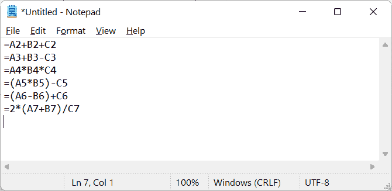

# 在 Excel 中复制公式

> 原文：<https://www.javatpoint.com/copying-formula-in-excel>

Excel 是支持各种功能和公式的最强大的电子表格软件之一。我们可以将现有公式应用于所需的 excel 单元格。但是，有时，可能会有需要在不同单元格或一系列单元格中使用相同公式的情况。在这种情况下，我们可以将 excel 公式复制粘贴到相应的单元格中，而不是对这些单元格多次应用该公式。

本教程讨论了从 Excel 单元格复制公式的不同方法。本文将帮助我们了解如何在单个单元格、多个单元格、不相邻的单元格、向下一列等中复制公式。，包括绝对引用和混合引用。

## 如何在 Excel 中复制粘贴公式？

虽然在 Excel 中复制粘贴很容易，但该方法并不总是适用于复制公式。有时，在其他单元格中复制公式，尤其是当单元格不是相对的时，可能会有点棘手。当我们没有正确复制粘贴 Excel 公式时，通常会出现#REF 这样的公式错误！，#DIV/0！等等。

幸运的是，微软 Excel 提供了几种执行相同任务的方法，适用于复制 Excel 公式。以下是在 Excel 中复制粘贴公式的最常见方法，具体取决于具体情况:

*   将公式从一个 Excel 单元格复制到另一个单元格
*   将公式从一个 Excel 单元格复制到多个单元格
*   将公式复制到整行或整列
*   复制没有格式的公式
*   将公式复制到不相邻的 Excel 单元格
*   复制公式而不更改单元格引用

现在让我们详细了解每种方法:

### 将公式从一个 Excel 单元格复制到另一个单元格

将公式从一个单元格复制到另一个单元格很容易，避免了一次又一次地输入公式，节省了时间。我们可以用各种方法轻松复制这个公式。

假设我们有下面的 Excel 表，其中单元格 A2、B2 和 C2 的值被添加到单元格 D2 中。我们需要将公式从 D2 单元格复制到 D3。

从 D2 单元格复制公式时，我们必须首先选择特定的单元格。我们必须按下**右键**按钮并选择**【复制】**选项来复制整个单元格的内容和公式。或者，我们也可以使用典型的键盘快捷键**‘Ctrl+C’**在 Excel 中复制选定的内容。

复制带有公式的单元格后，我们需要转到必须粘贴公式的单元格(在我们的例子中是 D3)。同样，我们需要按下右键按钮，并从上下文菜单(右键菜单)中选择**“粘贴选项”**下的**“公式”**。

或者，我们可以通过单击上下文菜单中的**“选择性粘贴”**选项来启动选择性粘贴对话框。接下来，我们可以在**【粘贴】**部分选择**【公式】**，点击**确定**按钮。这将只粘贴复制单元格中的公式。

只要我们将复制的公式粘贴到 Excel 单元格中，单元格引用就会自动调整。但是，公式与复制的单元格中的公式保持不变。因此，在我们的示例中，单元格 D3 具有相同的公式，但值取自单元格 A3、B3 和 C3。单元格引用会自动调整，以匹配粘贴单元格的行号或列号。

#### 注意:自调整仅在使用相对参考或混合参考时发生。在处理绝对引用时，会复制精确的公式。因此，我们必须使用绝对单元格引用来复制具有相同/精确单元格引用的公式。

### 将公式从一个 Excel 单元格复制到多个单元格

将公式复制到多个单元格时，我们可以按照前面的方法执行相同的步骤。我们必须使用**“Ctrl+C”**快捷方式复制公式单元格，然后将其粘贴到目标单元格上。但是，在粘贴公式之前，我们必须选择所有目标单元格。要选择多个单元格，我们可以逐个点击所需的单元格，同时按住 **Ctrl** 键。此外，我们可以按住 **Shift** 键，同时选择多个连续的单元格，并单击第一个和最后一个单元格。

如果我们需要在多个单元格中输入公式，Excel 也允许我们一键输入。该方法适用于相邻和非相邻小区。

*   首先，我们需要选择所有的单元格来键入公式。我们可以使用鼠标的**拖动**功能来选择连续的单元格。此外，我们可以在按住 **Ctrl** 键的同时点击每个不相邻的单元格来选择不相邻的单元格。
    
*   我们需要按下 **F2** 键进入编辑模式。
    T3】
*   最后，我们必须在编辑模式下输入公式，并同时按下 Ctrl 和 enter 键(即 **Ctrl + Enter** )。
    
    这将把输入的公式复制到所有选定的单元格中，并调整相对单元格引用。
    

### 将公式复制到整行或整列

在 Excel 中，也可以在整个行或列中将公式从一个单元格复制到其他相应的单元格。无论一行或一列中有多少个单元格，都非常容易执行。

要将公式复制到整行，我们必须在相应行的第一个所需单元格中输入公式。接下来，我们必须选择公式单元格，并将鼠标光标移动到相应单元格右下角的小方块上。一到达广场，我们的光标就会变成黑色的**加号(+)。**一般称为**灌装手柄。**

我们需要点击并按住填充手柄上的****并将其拖动到单元格上方的左侧或右侧，以将相应的公式复制到目标单元格。****

**

在上图中，我们需要将单元格的右侧从 B5 拖动到 D5:

同样，我们可以将填充手柄拖到上方或下方，以便将公式复制到所需的列。另外，我们可以**双击**填充手柄，自动拖动它，直到所有相对相邻的单元格都被填充。只要相邻单元格中有数据，公式就会复制到单元格中。

使用拖动功能复制 Excel 公式时，复制公式的单元格引用会根据行或列的相对位置自动调整。还会根据对目标单元格的调整后的引用来计算结果。

### 复制没有格式的公式

默认情况下，Excel 会自动将带有复制源格式的公式复制到目标单元格。一般在使用 Excel 填充句柄复制 Excel 公式时都会遇到。它会自动应用源单元格的格式，如字体颜色、背景颜色、百分比、货币等。

在上图中，拖动填充手柄后，公式和格式从单元格 D2 复制到 D7。

我们需要再执行一步来复制没有源格式的公式。拖动填充手柄后，我们需要单击最后一个单元格右下角的“下拉”图标。它被称为**“自动填充选项”**按钮。从下拉菜单中获得选项后，我们必须选择**‘无格式填充’**选项。

在上图中，没有字体颜色、背景颜色、货币符号等格式。

**复制只有数字格式的公式**

由于我们在使用公式时通常在 Excel 中使用数值，因此我们可能需要将数字格式与公式一起复制。这将帮助我们复制公式，并保持格式，如货币，百分比，小数点等。

在我们的示例中，当我们复制没有格式的公式时，数字格式(例如货币符号)也会被忽略。然而，有时，在许多情况下，我们可能需要保留数字格式。在这种情况下，我们需要像往常一样首先从源单元格复制公式。之后，我们必须执行以下步骤:

*   选择所有目标单元格。
*   进入【首页】标签，点击**粘贴相关的下拉图标，**选择**公式&数字格式。**
    
    这样，我们可以复制公式，忽略所有格式，但保留数字格式。

### 将公式复制到不相邻的 Excel 单元格

有时，我们可能需要将公式复制到 Excel 所需的不相邻或不连续的单元格/区域。这是一个易于使用的过程，可以在将公式复制到源数据末尾之外时使用。这种方法的工作方式与传统的复制粘贴方法非常相似，如:

*   首先，我们需要通过点击选择带有公式的单元格。
*   我们需要使用快捷键**‘Ctrl+C’复制单元格的内容。**
    
*   接下来，我们必须选择所有不连续的单元格来粘贴公式。我们可以在按住 **Ctrl** 键的同时点击每个不连续的单元格。这样，我们就可以轻松地在 Excel 中选择所需的非连续单元格。
    T3】
*   选择目的单元格(非连续单元格)后，必须使用快捷键**‘Ctrl+V’**粘贴公式。
    T3】
*   最后，我们必须点击键盘上的**进入**键来完成这个过程。

### 复制公式而不更改单元格引用

当我们需要在 Excel 中复制具有相同单元格引用的公式时(无需自动调整引用)，我们可以使用下面讨论的四种方法中的任何一种:

**方法 1:使用绝对或混合单元格引用**

如果我们在公式中使用绝对单元格引用并将它们复制到其他单元格中，则单元格引用不会改变。使用绝对引用时，相应的单元格被锁定，不会被 Excel 自动更改。无论我们在哪里移动或复制公式，单元格绝对单元格引用都保持静态。例如，要使单元格 A1 成为绝对引用，我们需要添加一个美元($)符号，如$A$1。

有时，我们可能需要应用混合单元格引用，而不是绝对引用，这使我们能够通过相应地添加美元($)符号来锁定行或列。例如，使用像$A1 和 A$1 这样的混合单元格引用，我们通常分别锁定列 A 和第一行。

让我们用一个例子来理解这一点。假设我们想在减去租金金额(每个月保持不变)后计算我们每个月的剩余工资/收入。为此，我们使用绝对单元格引用来锁定租金金额的单元格(即单元格$B$15)，并使用相对单元格引用来锁定第一个月(即 1 月)有收入的单元格(B2)。为了计算一月份的剩余余额，我们的示例表中的公式如下所示:

如果我们将公式从 C2 复制到 C 列的其他单元格，我们将获得每个月的剩余余额。在这种情况下，每月自动调整相对单元格引用，而绝对单元格引用($B$15)是固定的。

假设我们想用公式将 C 列的余额复制到 E 列。如果我们试图复制粘贴，我们通常会得到错误的结果。正常粘贴在 E 列时，B 列的相对单元格引用会调整到 d 列，要固定相对单元格引用，我们需要将其改为混合单元格引用。

因此，在复制单元格 E2 中的公式时，我们在列字母前添加了美元($)符号，以锁定 B 列的单元格，即$B2。此外，绝对单元格引用(15 美元)保持不变。现在，我们在 E 列复制公式时的公式如下所示:

如果我们将公式从 E2 复制到 E 列的其他单元格，行号将相应调整。我们会将公式从 C 列复制到 E 列，例如:

如果我们将公式从列 E 复制到任何其他列，我们将获得相同的结果，因为列引用(B)将保持不变。

**方法 2:使用查找和替换**

当使用 Excel 公式复制一系列单元格，但希望有精确的单元格引用时，我们可以使用 Excel 查找和替换功能，如以下步骤所述:

*   首先，我们需要选择带有公式的 Excel 单元格，并将其复制到其他单元格中。
    
*   接下来我们必须到**首页>查找&选择>替换**启动 Excel 查找&替换对话框。我们也可以使用快捷键**‘Ctrl+H’**快速打开。
    
*   我们需要在下一个窗口的**‘Find what’**框旁边输入等号(=)。此外，在**“替换为”**框旁边，我们必须键入一些不属于公式的特定符号或字符串。例如，我们可以使用像#、\或'这样的符号。在我们的示例中，我们使用了(#)符号。
    
    这一步非常重要，因为它将选定的公式转换为文本字符串，防止 Excel 在复制时更改单元格引用。
*   在对话框中输入数值后，我们必须点击**“全部替换”**按钮，**关闭**对话框。所有选中的公式都会变成文本字符串，如下图:
    
*   同样，我们可以选择相同的单元格或一个范围，然后按快捷键**‘Ctrl+C’**复制内容。由于没有等号，内容将被精确复制，而不会改变单元格引用。复制完单元格后，我们必须转到目标区域的第一个单元格，并使用快捷方式**‘Ctrl+V’粘贴复制的内容。**
    
*   现在，我们需要选择目标单元格。我们必须再次打开**查找&替换对话框**，并在**“查找什么”**框旁边键入(#)(或我们之前使用的任何字符或符号)以及在**“替换为”**框旁边键入(=)。最后，我们必须点击**“全部替换”**按钮，**关闭**对话框。
    
    这将把文本字符串转换回公式。我们将公式复制到目标单元格或具有精确单元格引用的区域。同样，我们可以将文本字符串转换回源单元格中的公式。
    

**方法 3:使用复制粘贴方法**

我们可以使用复制粘贴方法以特定的方式将带有绝对引用的 Excel 公式从一个单元格复制或移动到另一个单元格。有时，我们可能需要用精确的引用将公式从一个单元格复制或应用到另一个单元格。我们可以遵循以下步骤:

*   首先，我们需要选择带有要复制的公式的 Excel 单元格。
*   接下来，我们必须点击**公式栏**、**在公式栏中选择/高亮**整个公式，如下图:
    
*   选择公式后，我们必须点击快捷方式**‘Ctrl+C’**来复制公式。当我们需要用精确的单元格引用将公式从一个单元格移动到另一个单元格时，我们也可以使用快捷方式**‘Ctrl+X’**来剪切公式。复制公式后，我们必须按下 **Esc** 键离开公式栏。
*   或者，我们可以用公式选择单元格，**双击**单元格(或按下键盘上的**F2**键)进入单元格编辑模式。之后，我们可以用鼠标从单元格中选择整个公式，然后按快捷键**‘Ctrl+C’**将其复制为文本。此外，我们必须按下 **Esc** 键离开单元格编辑模式。
    
*   一旦复制了源单元格中的公式，我们必须选择目标单元格，然后按快捷键**‘Ctrl+V’**来粘贴精确的公式。复制的公式中不会自动调整单元格引用。
    T3】

**方法 4:使用记事本等文本编辑器**

复制具有精确引用的公式的另一个简单方法是以下列方式使用记事本:

*   首先，我们需要选择带有公式的源单元格，点击公式选项卡下的**‘显示公式’**选项。
    
    交替进行，我们可以快速使用键盘快捷键 **(Ctrl + `)** 进入公式查看模式。
*   一旦所有公式都显示出来，我们必须选择相应的单元格，并使用**‘Ctrl+C’**或**‘Ctrl+X’**来复制或剪切/移动公式。
    
*   复制完公式后，我们需要打开**记事本**并使用快捷方式**‘Ctrl+V’将复制的公式粘贴到记事本中。**
    
*   现在，我们需要再次使用**‘Ctrl+C’从记事本中复制公式。**我们可以一次复制一个公式，也可以复制所有公式。
    T3】
*   从记事本复制公式后，我们需要在 Excel 中选择目标区域的顶部或第一个单元格，并使用**‘Ctrl+V’**粘贴公式。这将根据来源粘贴复制的公式和精确的单元格引用。
    T3】
*   最后，我们可以**关闭**公式视图模式来获取各自的值。要停用公式查看模式，我们可以转到**“公式”>显示公式”**或按快捷键(Ctrl +`)。
    

* * ***