# Excel 中的公式错误

> 原文:[https://www.javatpoint.com/formula-errors-in-excel](https://www.javatpoint.com/formula-errors-in-excel)

MS Excel 或 Microsoft Excel 是目前最强大的电子表格软件，它使我们能够在由行和列组成的单元格中记录大量数据。一旦数据被记录下来，我们就可以应用各种公式或函数来获得期望的结果。但有时，即使是在处理看起来最正常的公式时，我们也会在 Excel 单元格中遇到一些错误代码，而不是所需的值或结果。这清楚地表明出了问题。这些意外结果或代码被定义为 **Excel 公式错误。**

虽然公式错误令人沮丧，但它们也有助于我们理解在应用相应公式时我们做错了什么。此外，用很少的知识和经验来捕捉和修复公式错误更容易。要查找 Excel 工作表中的所有错误，我们需要使用键盘快捷键 **Ctrl + G** 启动**转到特殊**对话框，然后点击**特殊**按钮。我们需要在对话框中选择**公式**下的**错误**复选框，然后点击**确定**按钮。这将一次显示所有错误。

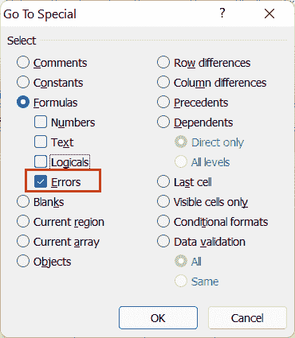

#### 注意:Excel 有许多不同的功能来帮助捕获和处理不同的错误类型。两个常见的函数是 IFERROR 和 ISERROR，它们可以捕捉 Excel 中特定类型的错误。但是，它们无助于跟踪逻辑 Excel 错误。

## Excel 中常见的公式错误有几种类型？

在使用 Excel 公式时，我们通常会面临各种错误。在 Excel 中工作时，公式错误也是最常见错误的一部分。公式错误会阻碍函数的执行，使我们的公式、仪表板或报告完全无用。每种类型的公式错误都有特定的原因。我们应该知道为什么会发生这些错误，这样我们就可以很容易地捕捉到它们，并修复它们以获得正确的结果。

以下是 Excel 中最常见的公式错误:

*   #NULL！错误
*   #DIV/0！错误
*   #VALUE！错误
*   #REF！错误
*   #姓名？错误
*   #NUM！错误
*   #不适用错误
*   ####错误
*   #溢出！错误
*   #CALC！错误

让我们详细讨论每个公式错误:

### #NULL！错误

虽然很少见，但是#NULL！出现错误是因为提供了错误的值来代替参数。通常，这是打字错误或在 Excel 单元格引用之间使用空格字符代替逗号(，)或冒号(:)的结果。

例如，下图显示了#空！D2 小区出错。如果我们检查单元格 D2 中的公式，A2、B2 和 C2 中的值将使用 SUM 公式计算。但是，我们遗漏了冒号，并在单元格引用之间放置了空格字符。#空！此处出现错误，因为空格字符是“range intersect”运算符。该错误表示指定范围(A2 和 C2)不相交。这意味着在 SUM 函数中使用了不正确的范围运算符。

**如何修复#NULL！Excel 中的错误类型？**

要修复#NULL！错误，我们必须使用正确的参数分隔符。在我们的例子中，我们可以删除空值！错误:在第一个参数(A2)之后用冒号替换空格字符。最好避免使用应用公式的错误语法，以消除#NULL 的机会！Excel 中出现错误。

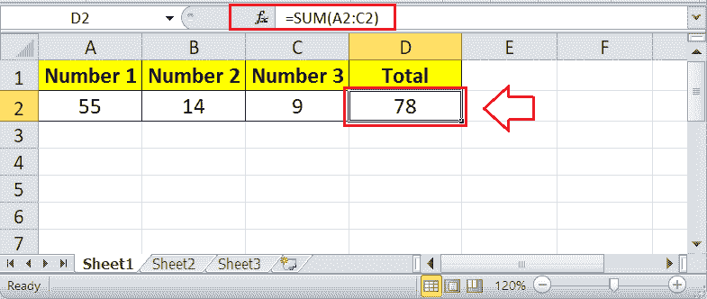

尽管有上面的图片，我们也可以使用逗号(，)添加所有三个参数，如下所示:

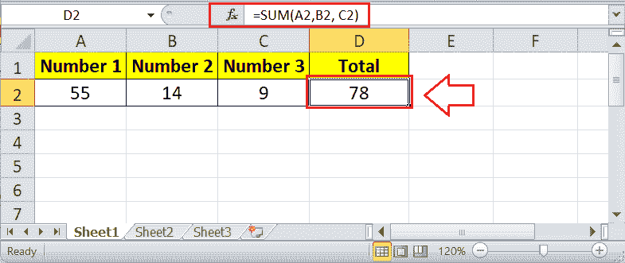

要使用正确的参数分隔符或运算符，我们必须根据下面给出的规则选择 Excel 引用运算符:

*   **范围运算符(冒号):**用于指定对多个单元格范围的引用。
*   **联合运算符(逗号):**用于将两个不同的引用连接/组合成一个引用。
*   **交集运算符(空间):**用于返回对两个范围交集的引用。

### #DIV/0！错误

顾名思义，#DIV/0！当应用的公式具有被零除的值或被具有等于零的值的单元格引用除的值时，通常会发生错误。此外，当数据尚未给出或尚未完成时，也可能出现此错误。这意味着公式试图用一个空单元格来除该值。在 Excel 中，空单元格的计算结果为零。

换句话说，#DIV/0！当我们在 Excel 工作表中删除一些除法公式所依赖的现有值时，会出现错误。特别是，这个误差是错误计算方法的结果。同样，如果我们试图用手或计算器将任何值除以 zer0 (0)，也不会成功。

例如，下图显示了#DIV/0！单元格 D3 中有错误。如果我们检查单元格 D3 中的公式，则单元格 B3 中的值除以单元格 C3 中的值，其中 C3 是一个空单元格或空白单元格。同样，细胞 D6 给出#DIV/0！分子和分母都为空的错误(单元格 B6 除以单元格 C6)。

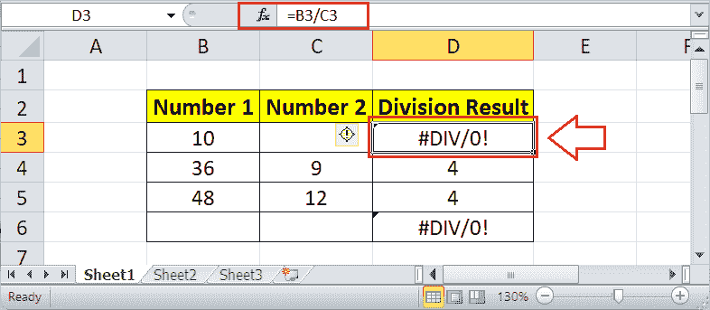

虽然#DIV/0！错误发生在我们被零除的时候，它也可能出现在我们引用了#DIV/0 单元格的其他应用公式中！错误。例如，当我们试图将单元格 B3 中的值与单元格 D3(有错误的单元格)相加时，求和公式也会给出#DIV/0！错误:

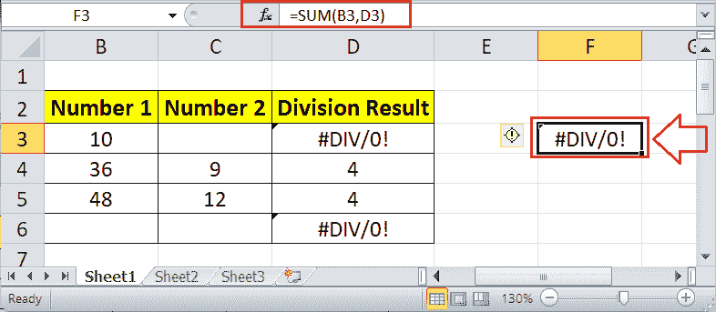

**如何修复#DIV/0！Excel 中的错误类型？**

若要修复#DIV/0！错误，我们必须找到公式并提供任何不等于零或空的值。在我们的示例中，如果我们在单元格 C3 中提供值，则错误是固定的，如下所示:

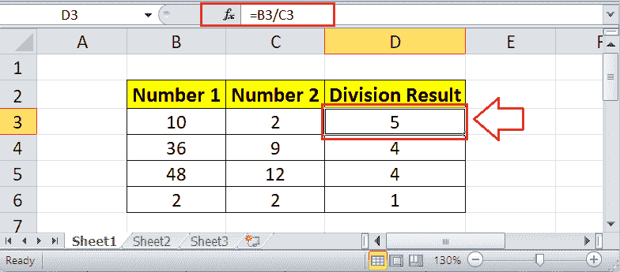

正在修复#DIV/0！当我们没有输入值时，错误是很容易发生的。但是，当我们以后想用空单元格作为分母输入值，却不想显示#DIV/0！错误，我们可以使用逻辑函数 IF 显示自定义消息:

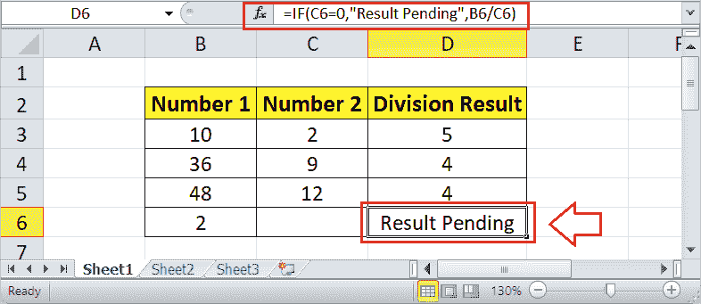

在上图中，当单元格 C6(本例中的分母)为零时，将显示定义的字符串(自定义消息)。如果没有，则显示 B6/C6 的分区。

### #VALUE！错误

#VALUE！当公式没有按照其语法接收到正确的值(或参数)时，通常会发生错误。特别是，当函数需要错误的数据类型或非数值时，这种错误是由提供的错误数据类型或非数值造成的。例如，当公式中使用的单元格为空时，在需要数值的函数中提供文本值，或者将日期计算为文本等。

在下图中，#VALUE！单元格 D3 中出现错误。如果我们检查单元格 D3 中的公式，单元格 B3 中的值将被添加到单元格 C3 中的值，其中两个单元格(B3 和 C3)都有文本值。既然我们需要数值，综上所述，Excel 给出#VALUE！错误，因为使用了不支持/错误的值或参数。

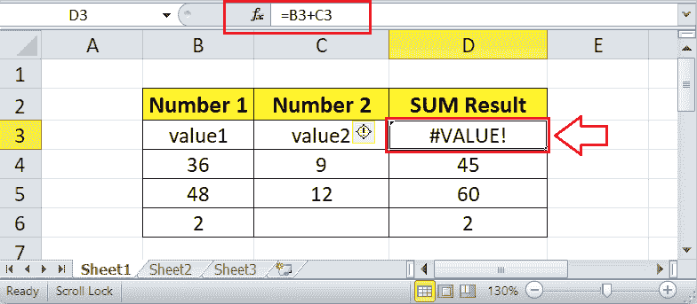

同样，如果我们使用 MONTH 函数从任何文本字符串而不是日期中获取月份值，该函数给出#VALUE！错误。

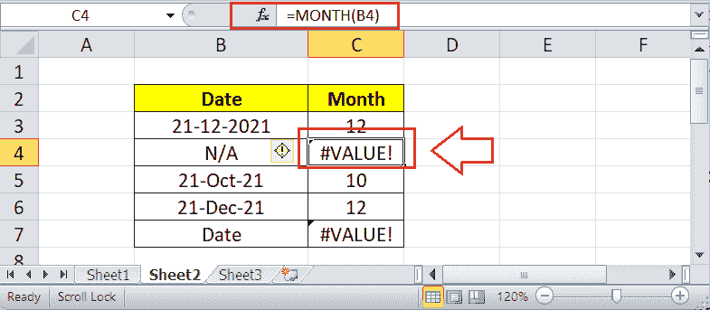

**如何固定#VALUE！Excel 出错？**

修复#VALUE！错误，我们必须找到有问题值的公式，并提供正确的值类型。在我们的示例中，如果我们在“B3”和“C3”单元格中提供数值，则错误是固定的，如下所示:

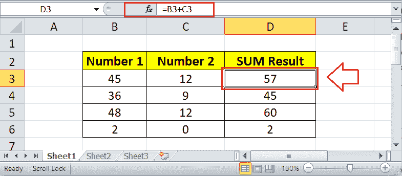

虽然很容易修复#VALUE！错误，有时很难看出问题。例如，月份公式给出#VALUE！即使我们提供了日期，下图中仍有错误:

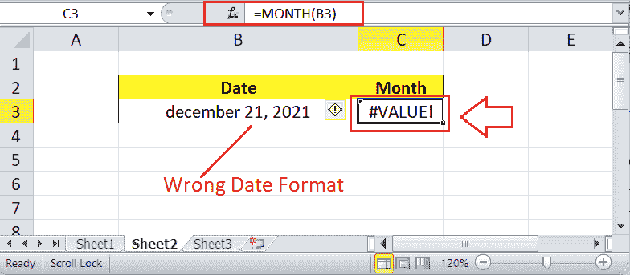

在上图中，给定的日期不是 Excel 支持的正确格式。因此，它被评估为文本。因此，要避免#VALUE！错误，我们必须仔细检查公式和提供的参数。提供的参数必须是受支持的格式，没有不受支持的特殊字符。

### #REF！错误

#REF！错误是我们在处理电子表格中的数据时遇到的常见 excel 公式错误之一。当定义的引用变得无效或无法识别时，通常会出现此错误。通常，当我们在另一个单元格中删除 Excel 公式中用作引用的任何单元格、行、列或工作表时，就会发生这种情况。还有，#REF！当我们复制-粘贴相对引用整个新位置的公式时会显示错误，在新位置定义的引用无效。

比如#REF！单元格 D3 中出现错误。单元格 D3 中使用的公式来自单元格 B8，其中定义的范围 B2:B7 是相对的。相应的范围在新位置(单元格 D3)无效，公式给出#REF！错误。

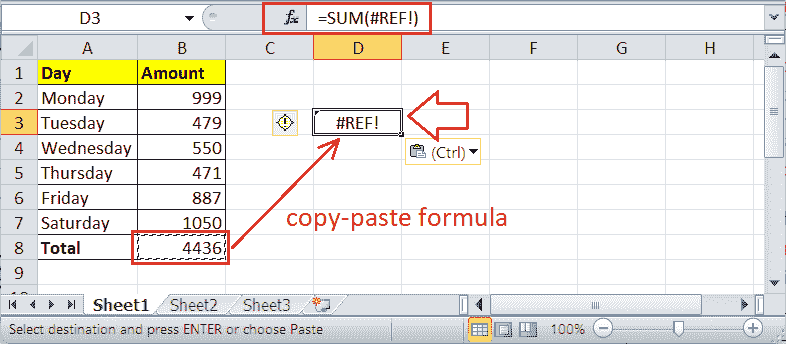

同样，如果我们将单元格 A2 和 B2 中的值添加到单元格 C2，并突然删除整个列 B，则定义的引用将无效，因此#REF！出现错误。

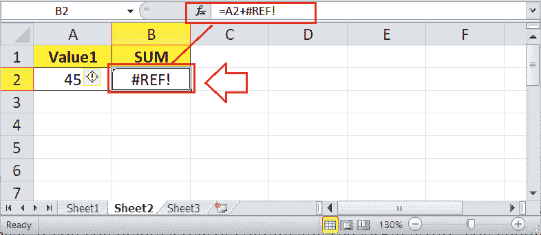

**如何修复#REF！Excel 出错？**

当我们得到#REF！错误在一组单元格上粘贴公式后，我们需要定位单元格并再次检查它们的引用。稍后，我们必须编辑公式并替换#REF！带有有效的引用。

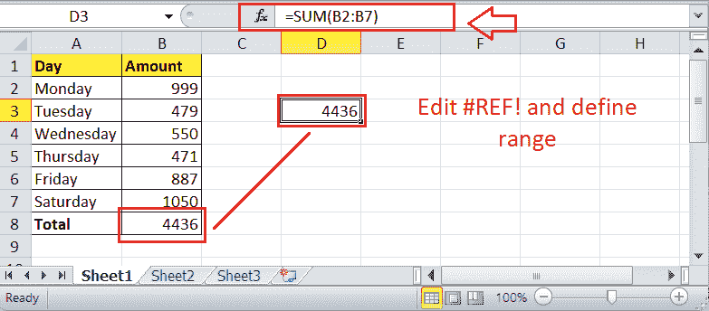

最好防止#REF！由于无效引用而导致错误发生，而不是稍后修复。当我们需要复制公式并在工作表中的其他位置使用相同的公式时，我们可以使用绝对引用(锁定引用)轻松复制粘贴公式，而不会出现任何错误。

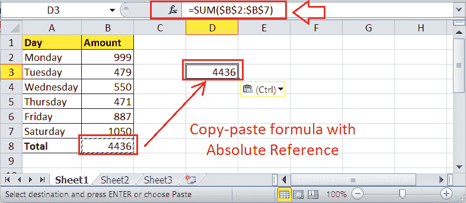

修复#REF！错误有时可能很容易，这取决于我们在获得#REF 之前删除了什么！错误。如果我们删除了一行或一列，看到#REF！错误，我们可以**撤销最后一个动作**，然后将公式结果复制粘贴为仅值。

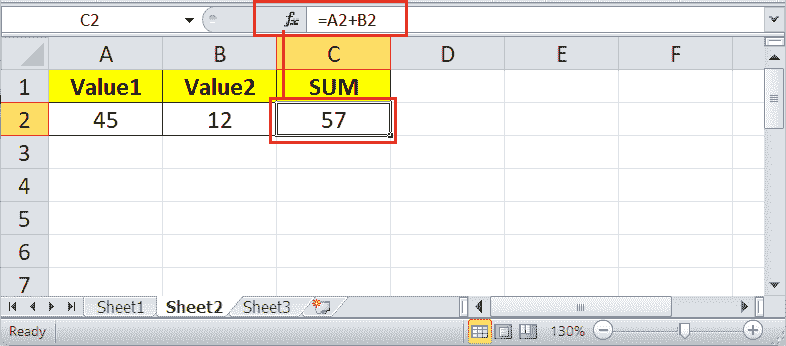

但是，如果我们删除工作表并看到此错误，定义的单元格引用将永远消失，因为工作表无法恢复。在这种情况下，我们必须再次工作。

### #姓名？错误

#NAME！当公式不能识别重要的东西时，通常会出现错误。尽管它的名字是#NAME！错误不会因为错误的人的名字而出现。相反，当 Excel 不理解我们在单元格中应用的公式的名称时，就会出现此错误。大多数情况下，公式拼错了。还有，#NAME！错误可能是由于公式中命名范围错误或单元格引用不正确造成的。

例如，下图显示了#NAME！C2 小区出错。如果我们检查单元格 C2 中的公式，我们可以看到我们提供的用于添加值的函数与 Excel 中定义的函数的标准不匹配。这意味着我们拼错了公式，用“SUMM”代替了“SUM”，如下所示:

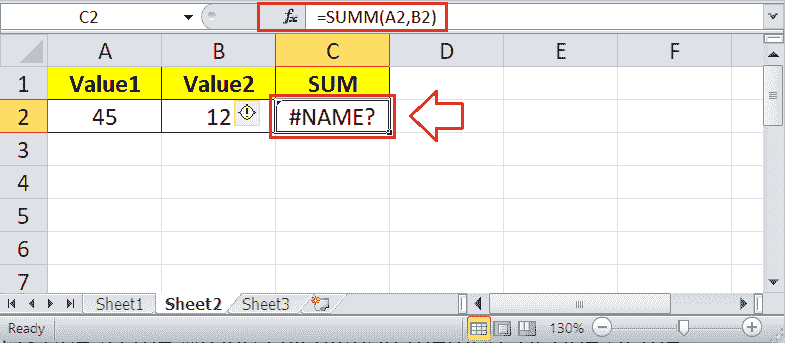

**如何修复#NAME？Excel 出错？**

很容易修复#NAME！Excel 中出现错误。我们必须找到错误单元格，并仔细检查相应单元格中应用的函数的拼写或语法。我们可以选择特定的单元格并查找公式栏，以确保我们是否正确输入了所有内容。如果没有，我们可以从公式栏更改公式拼写或纠正语法。

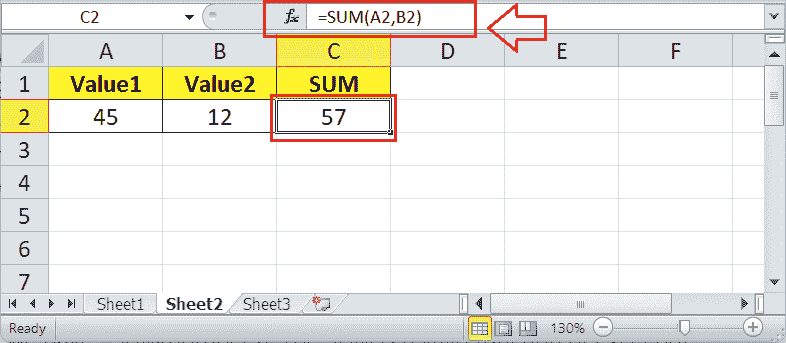

由于“SUMM”不正确，我们用“SUM”代替它，因此没有#NAME！工作表中存在错误。

最好避免手动输入公式和使用 Excel 的自动填充选项。每当我们开始在 Excel 单元格中等号后输入字符时，Excel 都会列出相关公式。我们可以从列表中向下滚动到所需的功能名称，然后按键盘上的 Tab 键来使用该功能。按下 Tab 键后，插入该函数，并显示其语法。这样，我们可以消除函数输入错误的机会，避免#NAME！错误。

### #NUM！错误

#NUM！当 Excel 公式由无效的数值组成时，通常会出现错误。在大多数情况下，数值要么太小，要么太大。此外，当使用不符合公式标准的数值或无法执行计算时，也可能出现错误。

例如，下图显示了#NUM！B2 小区出错。如果我们检查细胞 B2 中的公式，我们可以看到，函数 SQRT 用于计算负数的平方根，这在数学上是不可能的。

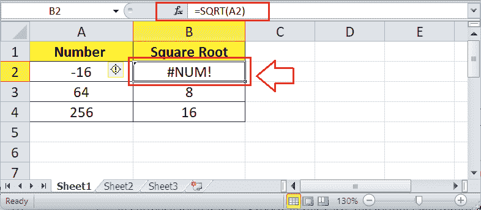

此外，假设我们需要在 Excel 中对公式结果使用货币或其他数字格式。但是，我们不是只使用值(例如 1000)，而是在公式中使用带有货币符号的值作为货币格式(例如$1000)。在这种情况下，公式将返回#NUM！使用它的单元格出错，因为公式中的货币符号无法进行计算。

**如何修复#NUM！Excel 出错？**

很容易修复#NUM！Excel 中出现错误。为了使计算成为可能，我们必须定位误差单元，并根据公式的要求调整给定的输入。在我们的例子中，如果我们去掉负号，计算就完成了，误差就消失了。

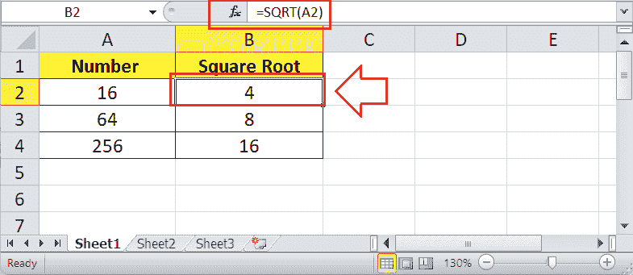

如果我们需要负值，那么我们可以在函数前使用负号，如下所示:

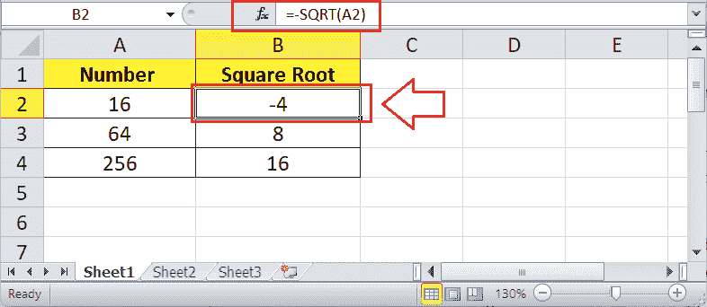

此外，我们必须确保没有在公式中使用任何格式化的货币、日期或特殊符号，这与相应公式所需的参数不同。如果使用，我们需要从应用的公式中删除这样的格式或字符，只保留数值。建议在计算完成后调整格式。

### #不适用错误

#不适用！当 Excel 公式由不可用的值组成时，通常会出现错误。这个错误的意思是“不可用”，表示有东西丢失或拼写错误。此错误的原因可能是意外删除了公式中已使用的行数。此外，这种错误可能是由于额外的空格字符、拼写错误的值或查找函数中不完整的表造成的。

#N/A 主要是用户在使用经典的查找功能时面临的，如 lookup、VLOOKUP、HLOOKUP 等。当 VLOOKUP 中的公式找不到指定的单元格或引用的单元格时，就会出现这种情况。

例如，下图显示了#不适用！单元格 E2 中有错误。如果我们检查单元格 E2 中的公式，我们可以看到 VLOOKUP 函数正在尝试查找“Eggs”，它不在查找表中。

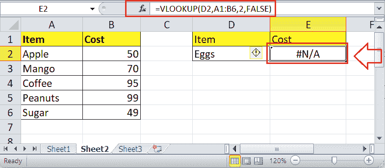

**如何修复 Excel 中的#N/A 错误？**

要修复#N/A 错误，我们必须仔细检查所有公式，并仔细查看引用的单元格。我们必须确保公式中没有工作表、行或单元格被删除或被错误引用。当我们在一个 Excel 工作表中有多个公式链接在一起时，我们必须确保每个公式按照语法都有适当的值。

在我们的示例中，如果我们将单元格 E2 中的值从“鸡蛋”更改为“咖啡”，VLOOKUP 将照常运行。

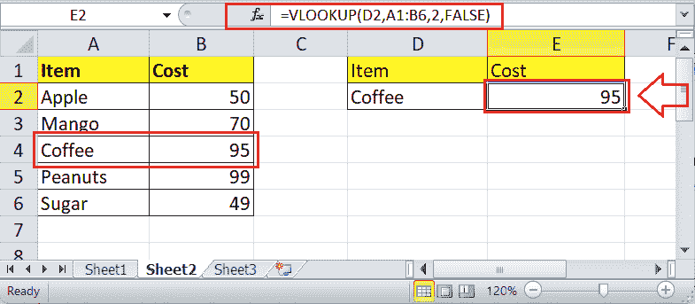

### ####错误

在大多数情况下，通常会因为格式问题而出现####错误。当我们在 Excel 单元格中输入长格式结果的公式，宽度不够宽时，Excel 给出####错误。

在下图中，单元格 A2 显示####错误，因为单元格的宽度不够宽。

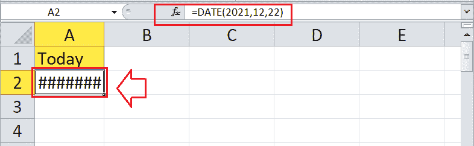

有时，我们认为####错误是由于宽度不够造成的；但情况并非总是如此。当我们试图显示负时间、日期等时，也会导致错误。，因为这些值不能为负。

**如何修复 Excel 中的####错误？**

虽然看起来很难，但修复####错误很容易。我们只需要使列宽变宽。

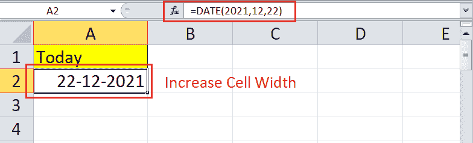

### #溢出！错误

#溢出！当应用的公式试图返回多个结果，但无法将它们记录到各自的网格中时，就会发生错误。换句话说，该公式输出一个溢出范围，该范围通过已经有数据的单元格执行。这意味着溢出数组公式的溢出范围不是空白的。

例如，下图显示了# SPILL！D5 小区出错。UNIQUE 函数试图将所选范围(B5:B10)中的唯一名称提取到从单元格 D5 开始的溢出范围中。因为单元格 D8 已经包含值“x”，所以执行被阻止，并且# SPILL！返回错误。

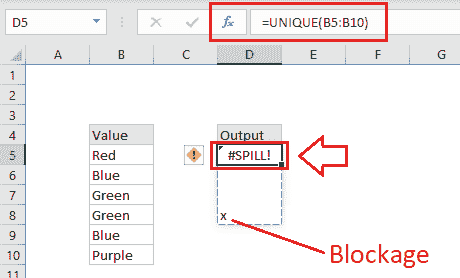

**如何修复# SPILL！Excel 出错？**

来修复# SPILL！错误，我们必须找到所有阻碍公式执行的单元格。接下来，我们需要检查每个阻塞的细胞，并清除细胞的值。一旦障碍值被移除，数组公式将正常溢出。在我们的例子中，如果我们从单元格 D8 中删除“x”，公式就会按照预期溢出。

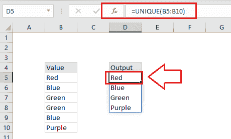

### #CALC！错误

#CALC！当应用的 Excel 公式面临带有数组的计算错误时，会出现错误。技术上，Excel 的计算引擎遇到了不支持的场景。

例如，FILTER 函数过滤 B5:D11 范围内的源数据。但是，公式正在查找表中不存在的类别“x”中的数据。由此可见，#CALC！单元格 F5 中出现错误:

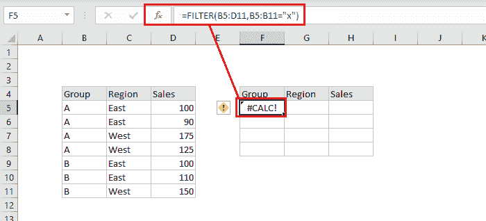

**如何搞定#CALC！Excel 出错？**

去搞定#CALC！错误，我们必须确保公式和提供的值存在于指定的范围内。在我们的示例中，如果我们修改公式并将过滤器应用于组“A”而不是“x”，则公式照常工作。

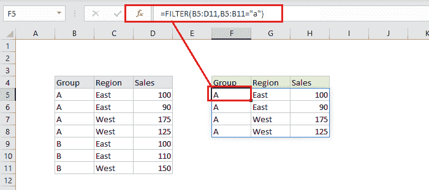

## 需要记住的要点

*   我们可以使用 IFERROR 来遇到任何公式错误。
*   两个错误，溢出和 CALC 错误，与“动态数组”有关，只在 Excel Office 365 中发现。

* * *