# 如何在 Excel 中打开 JSON 文件？

> 原文：<https://www.javatpoint.com/how-to-open-json-file-in-excel>

JSON 文件通常用于在网络应用程序上传输数据。大多数时候，当用户在网络上传输数据时，他们使用 JSON 文件格式，因为它是轻量级的。这意味着 JSON 文件包含要在网络上传输的数据。

除此之外，您可能还有以 JSON 格式创建的文件。您需要一次读取所有数据。为此，您可以使用 MS Excel 打开 JSON 文件。你会发现用 ***保存的 JSON 文件。*JSON**分机。

## 什么是 JSON，为什么要用？

JSON 是一种标准的基于文本的格式，用于在网络应用程序中传输数据(例如，客户端到服务器或服务器到客户端)。JSON 基于 JavaScript 对象语法。JSON 基本上是一个易于阅读的数据结构。

人们使用 JSON 是因为它在处理网络应用程序时非常轻便。所以，它可以很容易地加载。JSON 格式很容易阅读。即使是非技术用户也能理解。它是以键值对的形式编写的。

```

"Name": "Gunjan"

```

这是一个 JSON 文件的例子，它看起来是这样的:

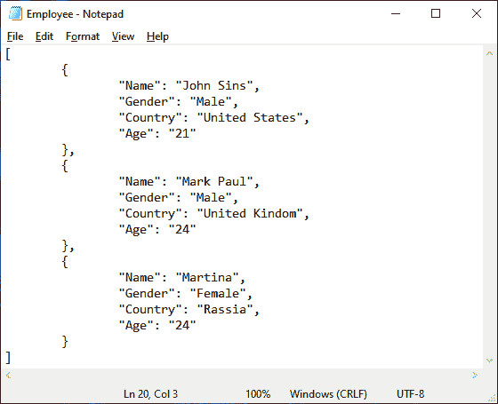

## 为什么要在 Excel 中打开 JSON 文件？

如果 JSON 文件包含太多数据，一次读取这些数据或者进行数据比较都不容易。在这种情况下，JSON 用户可以使用微软 Excel 软件读取和比较数据。在 Excel 中可以轻松分析多行数据。

Excel 是一个可以插入行数据，读取可以一起看到的大数据集的软件。你也可以比较一下。

*   使用 MS Excel，因为它的界面即使是非技术用户也很容易使用和利用。
*   可以使用微软 Excel，因为它允许数据的图形表示。
*   对于数据的财务建模是相当不错的。

**本章讨论的话题**

我们将讲述打开 JSON 文件并将其转换为 Excel/格式的不同方法:

1.  [打开 JSON 到 Excel](#Open)
2.  [JSON 到 Excel 在线转换](#conversion)
    1.  [JSON 转 CSV 转换器](#CSV-converter)
    2.  [JSON 转 Excel 转换器](#Excel-converter)
3.  [从网页打开 Excel 中的 JSON 文件](#web)

## 将 JSON 打开到 Excel 中

如果要打开或导入 JSON 文件到 Excel，不能直接插入。您必须遵循一个过程来将 JSON 文件导入到 Excel 中。在本章中，我们将指导您将 JSON 文件导入 Excel。

Excel 提供了强大的查询功能，可用于将 JSON 文件导入 Excel。电源查询功能现在被重命名为**获取&变换**工具。可在**数据**标签中找到。

直到 Excel 2013 版本，这个功能才被命名为 Power Query。后来在 Excel 2016 及更高版本中改名为**获得&变换**。您不需要编写任何 VBA 代码脚本来从 JSON 文件中获取数据到 Excel。

## 例 1

我们创建了一个包含三个员工基本信息的 JSON 文件。使用这个文件，我们将向您展示在 Excel 中导入 JSON 文件的步骤。按照相同的步骤，可以在 Excel 中导入 JSON 数据。

下面是我们创建的 JSON 文件:


**步骤 1:** 现在，打开 Excel 文件，可以是现有的，也可以是新的。然后，导航至**数据**选项卡。

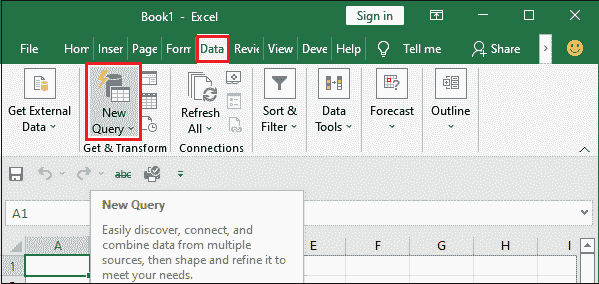

**第二步:**点击**新查询**下拉选项，然后点击【文件中的 T4】和【文本中的 T6】。

**新查询>来自文件>来自文本**

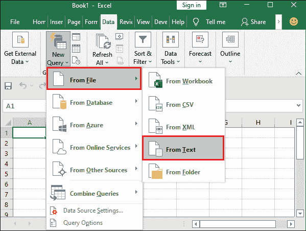

在更新版本的 Excel 中，会明确找到 **From JSON** 选项导入 JSON 文件。目前，我们的微软 Excel 软件有从文本选项来导入 JSON 文件。

**第三步:**现在，导航到您拥有 JSON 文件的位置，并将文件类型从**文本文件**更改为**所有文件。**

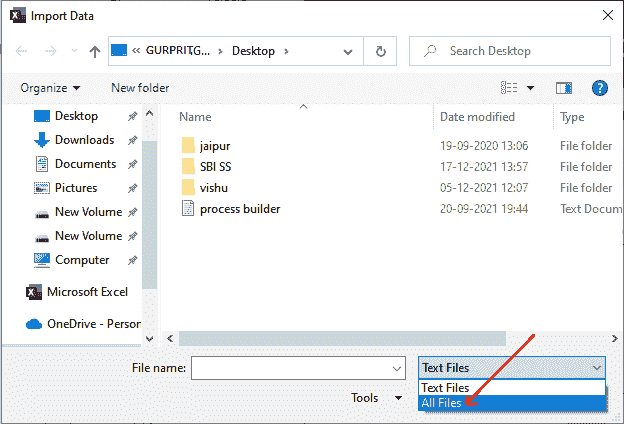

您可以看到在这个位置当前没有显示任何 JSON 文件。

**第四步:**现在，选择 JSON 文件，点击**导入**按钮，将文件数据导入到 Excel 表中。

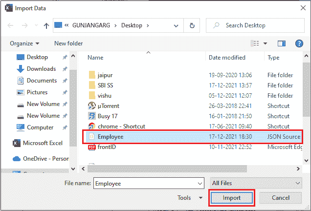

**步骤 5:** 将打开一个电源查询编辑器，点击**至表格**选项。

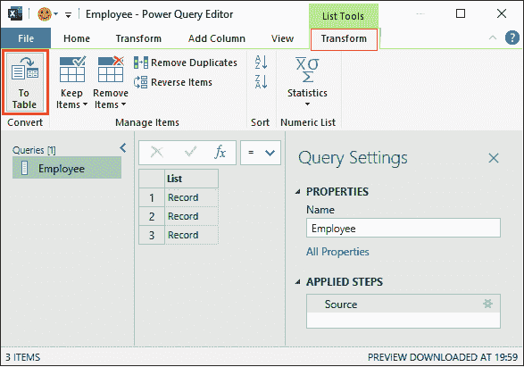

**第六步:**现在，点击该面板上的**确定**。

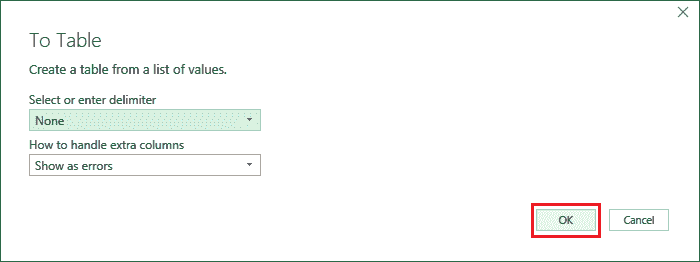

**第 7 步:**再一次，将加载 Power Query 编辑器，在该编辑器上单击该列旁边方框中的图标。

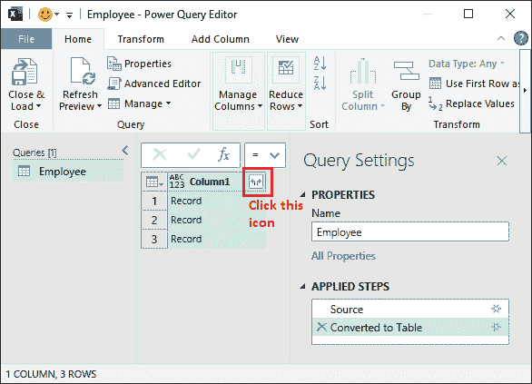

**第八步:**这里也可以取消选择你不想包含在 Excel 表中的列。我们想要包含所有的列，所以我们简单地点击**确定**而不做任何事情。

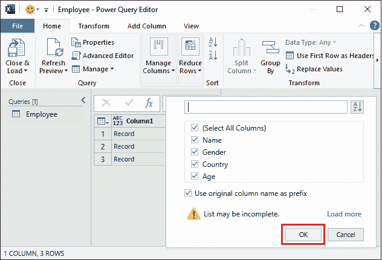

如果您忘记了这一步，数据将无法正确加载。所以，仔细执行所有给定的步骤。

**第 9 步:**可以看到 JSON 文件包含的记录已经展开。现在，首先点击**关闭&加载**选项。

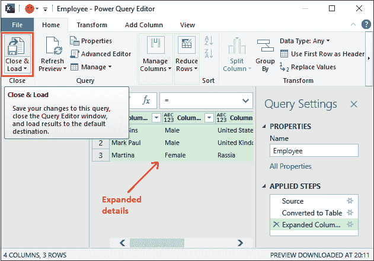

**第十步:**可以看到这三条记录已经加载到 Excel 表中。

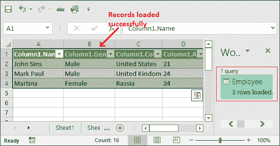

现在，您可以比较哪些数据更易读。

**步骤 11:** 用户也可以从表单中排除数据行。为此，请单击列标题旁边的下拉图标，然后取消标记要隐藏的行。

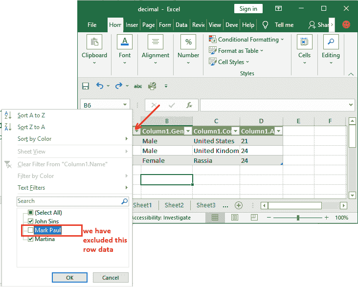

**第 12 步:**看到现在有一条记录被隐藏了。但是，您可以通过增加表格的宽度将其再次包含到表格中。

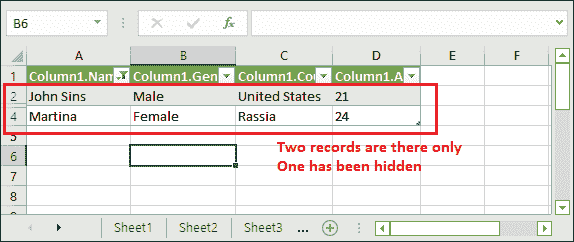

也可以跟着我们一章学习[如何在 Excel](https://www.javatpoint.com/how-to-unhide-rows-in-excel) 中取消隐藏行。

## JSON 到 Excel 在线转换

如果你没有下载微软 Excel 软件，你也可以在网上下载。用户可以使用第三方软件打开/转换 JSON 文件到。xlsx 格式。转换后可以在 MS Excel 软件中打开。

网上有各种 JSON 到 Excel 的转换软件。您可以将它们用于 JSON 文件转换。使用这些软件，你可以在几秒钟内转换你的文件。但有时，这些软件并不可靠，因为它们错误地转换了数据。

### JSON 至 CSV 转换器

JSON 到 CSV 转换器是一个在线工具，用于将 JSON 文件转换为 CSV 和 Excel 格式。与其名称不同，您也可以使用该软件将 JSON 文件转换为。xlsx 格式。这是一个工具，你可以免费使用在线文件转换。

请记住，用户需要互联网或 wifi 连接才能使用该软件，因为它运行在互联网上。

将 JSON 文件转换为的步骤。文件格式

**第一步:**点击以下链接 [JSON 转 CSV](https://data.page/json/csv) 进入网站。

**第二步:**在本网站点击**上传 JSON 文件**从你的系统中选择一个文件。

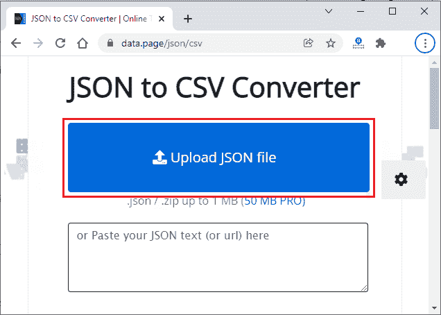

"你可以上传高达 1MB 的 JSON 和 ZIP 文件进行转换."

**第三步:**将打开一个窗口面板，从本地存储器中选择 JSON 文件。转到该位置并选择要上传的 JSON 文件。

我们为前面的例子创建了一个名为*员工*的 JSON 文件，选择它并点击**打开。**

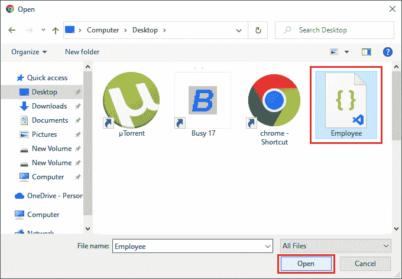

#### 注意:确保必须在文件类型中选择“所有文件”，以使 JSON 文件可见。

**第四步:**看数据已经这样转换了。如果只是想读出数据，可以通过滚动整个数据来读取。

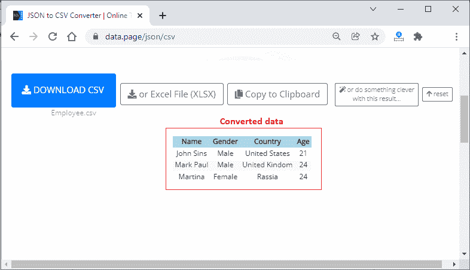

但是如果你想保存下来以备后用，可以下载转换后的 Excel 文件，这样就可以脱机阅读了。这里有三种选择。

1.  **下载 CSV -** 点击此处下载 Excel 文件的 CSV 版本。
2.  **Excel 文件(XLSX)—**选择该选项下载转换后的 JSON 文件的 Excel 版本。
3.  **复制到剪贴板-** 用户也可以选择这个选项，将数据复制到剪贴板。处理完数据后，您可以将其以简单的文本格式粘贴到任何地方。
4.  **用这个结果做点聪明的事-** 除了以上所有选项；您可以用这个转换后的结果做一些不同的事情。
    **比如**你可以把它转移到谷歌电子表格、SQLite 数据库、MySQL 表转储、FTP、Edit，或者生成自定义报表。但是，其中一些选项仅适用于 PRO 用户。

**第五步:**点击**或 Excel 文件(XLSX)** 下载 JSON 文件的 Excel 版本。

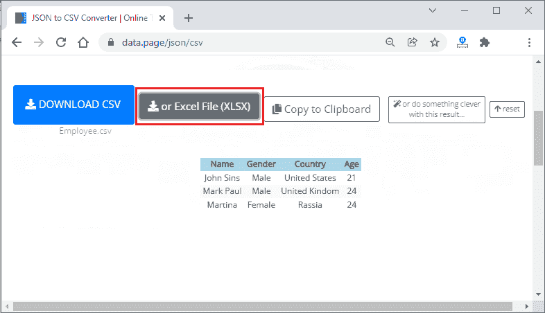

**第六步:**看到已经下载了一个. xlsx 文件，因为我们已经点击了 **Excel 文件(XLSX)** 按钮来下载 Excel 格式的转换文件。

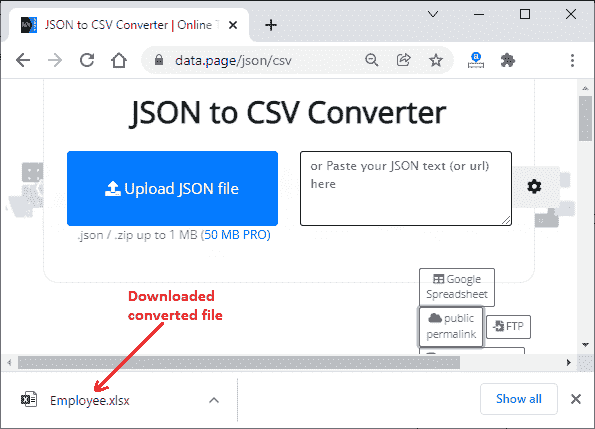

**第 20 步:**现在可以打开并看到其中的转换数据。目前，它处于受保护的视图中。您可以通过单击文件标题中给出的**启用编辑**选项来启用编辑。

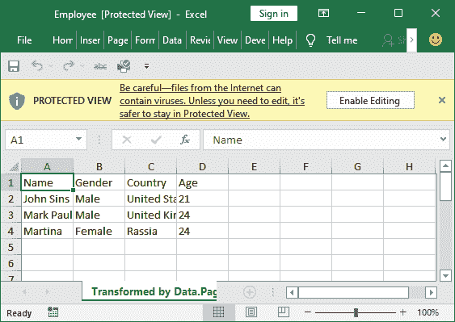

除此之外，互联网上还有其他几个软件可以用来将 JSON 文件转换成 XLSX 格式。

### JSON 到 Excel 转换器

它是另一个用于将 JSON 文件转换为 Excel 的在线工具。它也是一个免费软件。使用该工具，可以将 JSON 文件转换为 Excel 97-2007 和 Excel 2007+版本。

使用该工具代替上述工具的主要优点是-它允许最多 10 MB 的数据用于转换。相比之下，JSON 到 CSV 转换器只允许 1 MB 的数据。

除此之外，这个在线工具每天提供 10 次转换，并且很容易使用网络应用。要了解如何使用此 web 应用程序进行转换，请执行以下步骤:

**第一步:**点击以下链接 [JSON 转 Excel 转换](https://conversiontools.io/convert/json-to-excel)导航到网站。

**第二步:**在本网站，点击**浏览**按钮，从系统中选择一个文件。

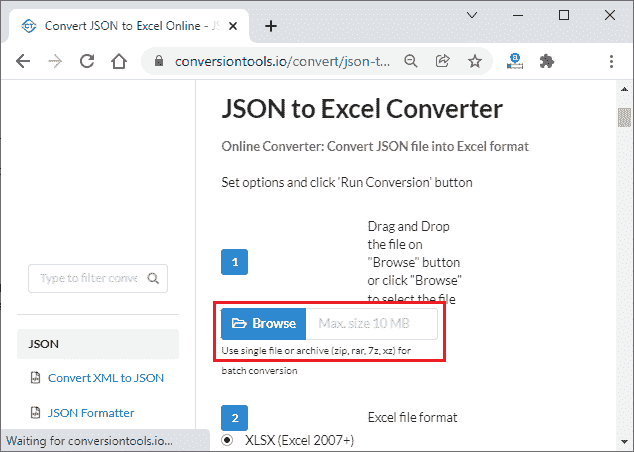

**第三步:**选择一个 JSON 文件，将其转换为 Excel 格式。


**第三步:**我们使用的是 Excel 2016，所以这里选择 XLSX (Excel 2007+)单选按钮。

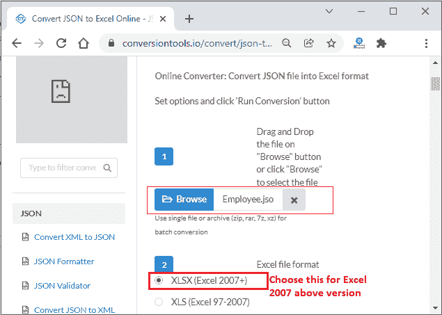

**第四步:**现在，向下滚动点击**运行转换**开始转换文件。

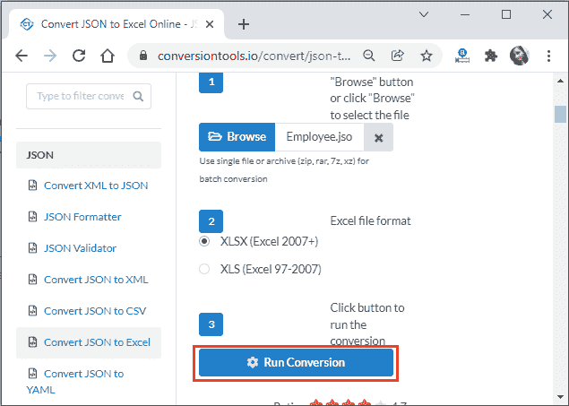

转换文件需要一点时间。

**第五步:**最后点击**下载文件**连同转换后的文件大小下载文件。

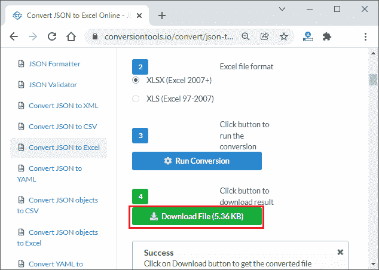

**第 6 步:**查看文件是否已经下载。现在，您可以在 Excel 文件中打开并查看 JSON 数据。

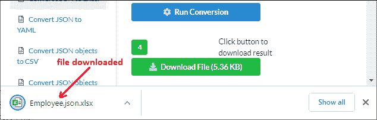

请注意-该工具不允许一次转换多个文件。

## 从网上打开 Excel 中的 JSON 文件

还有一种方法可以直接从互联网打开 JSON 文件，而无需将其下载到您的系统中。Excel 使该方法能够从网站导入/打开 JSON 文件。因此，用户不需要显式地将文件下载到系统中，然后按照流程在 Excel 中打开文件。这节省了用户的时间。

我们描述的上述方法适用于存储在本地存储器中的文件。如果您在互联网上有一个 JSON 文件，或者想要从 API 调用中导入它，您可以按照以下步骤操作:

**第一步:**打开一个新的 Excel 文件，进入**数据**选项卡。

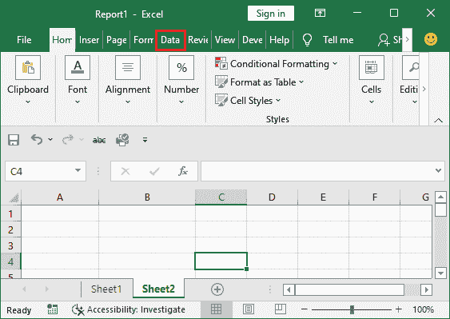

**第二步:**点击**新查询**并选择【其他来源的 T4】然后选择【网络的 T6】选项，该选项将打开一个模式来访问网络文件。

**来自其他来源的新查询>>来自网络的新查询**


**第三步:**在此模式下，选择**基本**单选按钮，在网址字段中输入文件的网址，然后点击**确定。**

我们提供了以下链接:

[https://filesamples.com/samples/code/json/sample2.json](https://filesamples.com/samples/code/json/sample2.json)

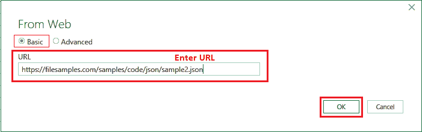

**第四步:**保持默认不变，点击此处**连接**。

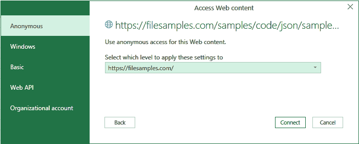

**第 5 步:**现在，一个带有数据的超级查询编辑器将会打开，如下图所示，导航到**主页**选项卡。

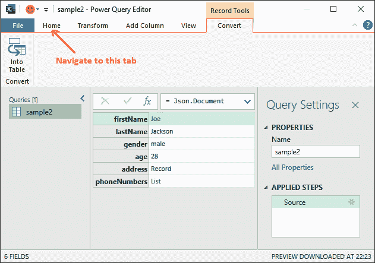

**步骤 5:** 在此*主页*选项卡中，首先单击**关闭&加载**选项。

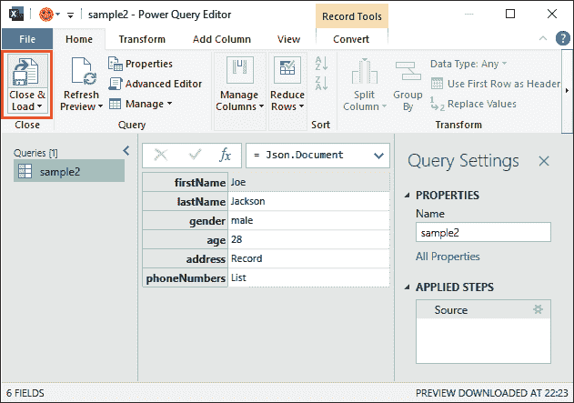

**第六步:**可以看到这六行已经加载到我们直接从 web 导入的 Excel 表中。

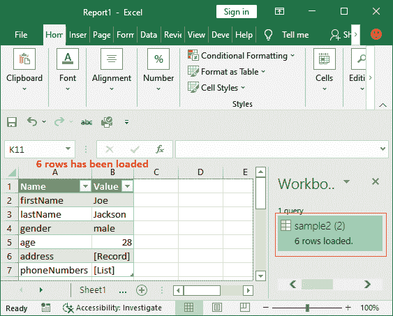

使用这种方法，可以直接将 JSON 文件加载到 Excel 中。

* * *