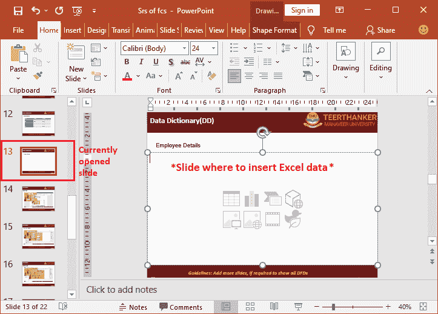
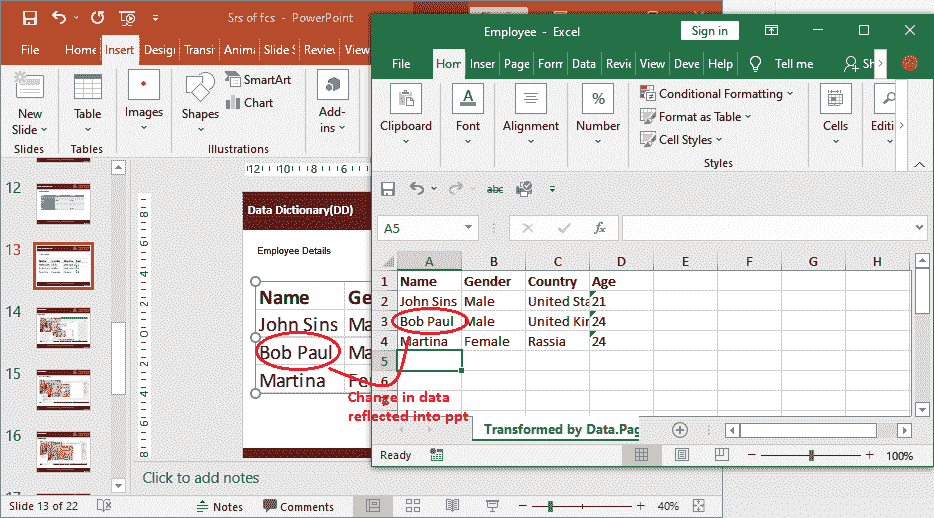
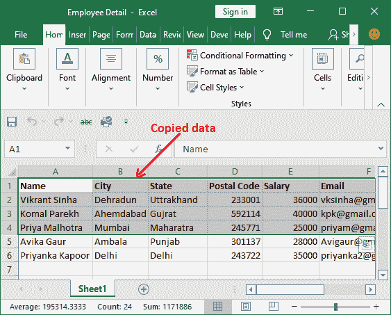
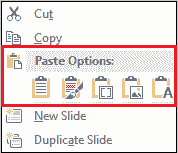

# 如何在 ppt 中插入 Excel 文件？

> 原文:[https://www.javatpoint.com/how-to-insert-excel-file-in-ppt](https://www.javatpoint.com/how-to-insert-excel-file-in-ppt)

在 ppt 中插入 Excel 表格是一个常见但有时非常需要的操作。当 PowerPoint 用户希望显示存储在 Excel 表格中的数据并希望实时更改数据时，这非常有用。Powerpoint 用户可以将 Excel 表格链接到 ppt。

通过将 Excel 文件插入 ppt，允许想要在演示文稿中显示 Excel 表格的用户。他们可以将 Excel 数据与 PowerPoint 演示文稿链接起来。通过将工作表数据链接到 Powerpoint 演示文稿，数据将很容易通过 Excel 数据的实时更改在目标演示文稿中更新。

本章介绍了在 PowerPoint 演示文稿中插入 Excel 工作表的最常用和最简单的方法。

## Excel 数据到 PowerPoint 演示文稿

通常，您有**三种方法将 Excel 电子表格数据包含到 PowerPoint 演示文稿中。**这三种方法的工作方式不同，各有利弊。

第一种是，可以**复制 Excel 电子表格数据**粘贴到 PowerPoint 演示文稿中。当您在 Excel 工作表中更改某些内容时不需要实时更新数据时，这种方法是很好的。它将 Excel 数据转换成 PowerPoint 中的简单表格。用户只能使用 PowerPoint 功能，而不能使用 Excel 对该表格数据进行格式化等。

将 Excel 数据包含到 PowerPoint 演示文稿中的另外两个选项是**嵌入**和**链接。**两者都是非常强大的方法，并且非常相似，只是略有不同。

## 嵌入和链接 Excel 文件的区别

不要混合嵌入 Excel 文件和将 Excel 文件链接到 PowerPoint 演示文稿。虽然两个术语几乎相同，但也不同。让我们看看-

如果您将 Excel 电子表格数据链接到 PowerPoint 演示文稿，则该目标电子表格和演示文稿会建立连接并保持连接。因此，如果您对 Excel 电子表格数据进行任何更改，它将自动反映在链接的演示文稿中。

相比之下，如果您**将**Excel 工作表数据嵌入到 PowerPoint 演示文稿中，它们之间将不会创建连接。或者你可以说工作表和演示文稿之间的联系被打破了。因此，如果您更新了 Excel 工作表中的某些内容，由于连接中断，这些内容将不会反映在 PowerPoint 演示文稿中。

下表列出了嵌入数据和链接数据之间的区别:

| 把...嵌入 | 连接 |
| 如果将 Excel 文件嵌入到 PowerPoint 演示文稿中，Excel 文件中的更改不会反映在 ppt 数据上。 | 当 Excel 文件链接到 PowerPoint 演示文稿时，Excel 文件中的任何更改都会反映在 ppt 数据上。 |
| 如果更改嵌入的 Excel 文件的位置或将其删除，PowerPoint 演示文稿中的数据不会丢失。 | 如果更改链接的 Excel 文件的位置，PowerPoint 演示文稿中的数据将会丢失。 |
| 在 PowerPoint 中嵌入数据会增加 ppt 的大小。 | 即使链接了 Excel 文件，ppt 文件仍然是轻量级的。 |

我们将在本章中讨论的方法:

1.  [将整个 Excel 表格链接到 ppt](#ppt)
2.  [将数据段链接到 ppt](#data)
3.  [在 PowerPoint 中复制粘贴 Excel 数据](#PowerPoint)
4.  [将 Excel 数据嵌入到 PowerPoint 中](#Embed)

除了这些方法，我们还讨论了:

1.  [链接嵌入的优缺点](#AdvantageDisadvantages)
2.  [结论](#Conclusion)

## 将整个 Excel 工作表链接到 ppt

这是将整个 Excel 工作表数据链接到 PowerPoint 演示文稿的方法。如果 PowerPoint 用户想要将 Excel 数据链接到 ppt，他们必须只在 PowerPoint 中执行这些步骤，而不是在 Excel 中。

要在 PowerPoint 演示文稿中链接 Excel 工作表，用户必须打开要插入 Excel 表格的目标 PowerPoint 演示文稿文件。

遵循给定的步骤来实现这一点:

**第一步:**首先，打开 ppt，转到要插入 Excel 数据的那张幻灯片。我们正在使用现有的演示文稿。

**步骤 2:** 现在，导航至**插入**选项卡，并单击文本组中的**对象**选项。

**第三步:**将打开*插入对象*对话框，选择**从文件创建**单选按钮，然后点击**浏览**按钮从本地存储中选择 Excel 文件。

**第 4 步:**从系统中选择一个要插入到 PowerPoint 中的 Excel 工作簿，点击**确定。**

**第五步:**文件路径已插入*插入对象*框。现在，选中**链接**复选框，然后点击**确定。**

**第 6 步:**现在可以看到数据已经插入到 Excel 表中。

#### 提示:如果双击演示文稿中插入的 Excel 表格，其对应的 Excel 文件将从这里直接打开

**第七步:**如果更改了链接 Excel 表中的任何数据，都会自动反映在 PowerPoint 演示文稿中。**例如，**看到我们已经更新了 Excel 表第二行的员工姓名。

#### 注意:不要删除链接的 Excel 文件，否则数据永远不会在演示文稿中更新。它将抛出链接文件不可用的错误，因此您无法进行更改。

**在已删除的链接 Excel 文件中尝试更新时出错**

## 将数据部分链接到 ppt

使用这种方法，我们将只将 Excel 工作表的特定数据部分链接到 PowerPoint 演示文稿，而不是整个 Excel 工作表。如果 PowerPoint 用户想要将 Excel 数据链接到 ppt，他们必须执行 PowerPoint 和 Excel 中的步骤。

要在 PowerPoint 演示文稿中链接 Excel 工作表的特定部分，请执行以下步骤:

**步骤 1:** 打开要与 PowerPoint 演示文稿链接的 Excel 工作表。

**第二步:**选择并使用 **Ctrl+C** 命令复制工作表的数据段。例如，我们已经复制了头四行数据以及标题。

**步骤 3:** 现在，打开 PowerPoint 演示文稿，转到要在其中插入 Excel 数据的幻灯片。

**第四步:**下一步是将 Excel 表中复制的数据粘贴到 ppt 中。为此，在**主页**选项卡中，单击**粘贴**下拉按钮并选择**粘贴特殊。**

#### 注意:暂时不要使用简单的粘贴(Ctrl+V)来粘贴复制的数据。

**第五步:**将打开一个粘贴特殊对话框，点击**粘贴链接**单选按钮，选择 **As 下的**微软 Excel 工作表对象**。**

在此粘贴特殊面板上点击**确定**。

**第 6 步:**查看选中的 Excel 数据已经成功链接到 Excel 工作表。

因为数据是链接的而不是嵌入的。因此，如果您更改了 Excel 工作表数据中的某些内容，这些内容将反映在演示文稿中。按照以上步骤，将数据与演示文稿链接后，您可以自己尝试。

## 在 PowerPoint 中复制和粘贴 Excel 数据

我们已经描述了将 Excel 数据链接到 PowerPoint 演示文稿的方法。如果数据没有链接到演示文稿，您可以简单地将 Excel 数据复制并粘贴到 PowerPoint 演示文稿中。但是，它不提供 ppt 中数据的自动更新。

复制粘贴方法的步骤和将数据从一个地方复制到另一个地方一样简单。尽管如此，我们还是会向您展示操作步骤，这样您就不会感到困惑。以下是它的步骤:

**第一步:**在 MS Excel 中打开工作簿，从中复制数据。使用 **Ctrl+C** 快捷命令选择数据并复制。

**步骤 2:** 接下来是打开目标 Powerpoint 演示文稿，转到要放置 Excel 数据的幻灯片。

**第三步:**简单来说，使用 **Ctrl+V** 命令将数据粘贴到幻灯片上。您的数据将成功放入 PowerPoint 演示文稿。

这是将 Excel 数据插入到 PowerPoint 演示文稿中最简单的方法。但是要记住，把数据粘贴到 ppt 后，就没有了和 Excel 的链接。因此，Excel 数据中的任何更改都不会反映在这里。

## 在 PowerPoint 中嵌入 Excel 数据

这是将 Excel 文件包含到 Powerpoint 演示文稿中的最后一种方法。正如我们已经告诉您的，将 Excel 工作表嵌入到 ppt 中并不能保持文件之间的连接。因此，当您想要将 Excel 文件数据包含到 ppt 中，而不需要为以后进行任何连接时，请使用此方法。

您可以将整页数据或一部分数据嵌入 ppt。由你来决定。以下是将 Excel 数据嵌入到 PowerPoint 的步骤:

**第一步:**从要嵌入的 Excel 表中选择并复制数据。

**步骤 2:** 现在，转到 PowerPoint 演示文稿，右键单击要放置 Excel 数据的幻灯片。

或者，在主页选项卡中，您也可以单击**粘贴**，然后单击**特殊粘贴。**

**第三步:**你会看到粘贴选项的五个图标(具体操作一个)，如下图。只有从 Excel 复制数据时，这些图标才可见。

1.  使用目标主题
2.  保留源格式
3.  把…嵌入
4.  画
5.  仅保留文本

你可以选择其中任何一个。让我们看看每个粘贴选项的位介绍。

**首次使用目的地主题**

如果您希望复制的数据将使用您要粘贴数据的目标文件的格式、样式和主题，请使用此*目标主题*特殊粘贴。

**例如**你会看到我们选择了**使用目的地风格**粘贴特殊选项。因此，嵌入的 Excel 数据使用了 PowerPoint 演示文稿的主题和格式。

**秒-保持源格式**

*保留源格式*当您想要保留复制数据的源格式时，可以使用粘贴选项。这意味着数据的格式、样式和主题应该与 Excel 中的相同，而不是目标格式、样式和主题(PowerPoint 演示文稿)。

**例如**我们选择了*保留源格式*粘贴特殊选项。因此，您将看到嵌入的 Excel 表格使用了相同的 Excel 数据主题，而不是 PowerPoint 演示主题。

因为我的 Excel 电子表格使用普通的白色背景。因此，这里您可以看到 Excel 数据插入到 PowerPoint 演示文稿后的外观。

**第三次嵌入**

第三种选择是*嵌入我们这个方法需要的*。我们将选择此选项来完成此过程的步骤。如果要粘贴 Excel 数据并保留以备以后更改，请使用“特殊粘贴”的“嵌入”选项。

默认情况下，此选项使用 Excel 数据格式而不是 PowerPoint 演示文稿。就像在特殊粘贴的保留源格式选项中一样。

现在，您会注意到粘贴的数据没有使用任何格式，因为我们的 Excel 数据没有格式。它是在简单的白色背景。

**第四张图片**

粘贴特殊的第四个选项是图片。它不同于上述所有其他粘贴选项。如果您不想让 PowerPoint 用户编辑插入的 Excel 数据，这是最好的选择。

我们将选择特殊粘贴的**图片**选项，将 Excel 数据用作 PowerPoint 演示文稿中的图像。

**例如**您看到我们已经使用图片粘贴特殊选项将 Excel 数据作为图像/图片插入。

它只是您选择在 PowerPoint 演示文稿中使用的 Excel 数据的图像。

**第五-仅保留文本**

选择性粘贴的最后一个选项是*只保留文字。*当你想从 Excel 中复制唯一的文本(完全没有格式)时，你可以这样做。它既不保留 Excel 也不保留 PowerPoint 的格式和样式。它只是保持文本没有格式。

**比如**你看我们已经插入了行列格式存储的 Excel 数据。但是当粘贴到 Powerpoint 演示文稿时，它不使用 Excel 或 PowerPoint 中的格式。

## 链接 Excel 数据的优缺点

**优点**

在 Excel 工作表和 PowerPoint 演示文稿之间建立连接，从而实现数据的实时更改。这意味着每当用户对链接数据进行任何更改时，它都会自动反映在 ppt 中。

将 Excel 工作表插入到 PowerPoint 演示文稿中的一个优点是，它有助于保持演示文稿的小尺寸。这是因为数据仍然驻留在 Excel 电子表格中，只是以 ppt 形式显示。

cons

还有一个缺点，优点是 Excel 文件必须保存在同一个地方。**优点的同时，也有缺点，Excel 文件必须放在同一个地方。**否则，它将失去连接，您必须再次将其与新位置的演示文稿链接。

## 嵌入 Excel 数据的优缺点

**优点**

将电子表格嵌入 PowerPoint 的一个优点是用户可以将 Excel 文件移动到任何地方。由于嵌入方法中连接断开，因此用户在更改位置或删除 Excel 文件时不需要再次嵌入。

cons

将数据嵌入到 Powerpoint 演示文稿会增加 ppt 的大小。因为数据实际上是嵌入到演示文稿中的，嵌入后连接会丢失。因此，当您嵌入文件时，数据完全依赖于表示。

## 结论

最后得出的结论是，用户可以根据自己的需要选择显示数据的方式。它可以有连接也可以没有连接。

* * *