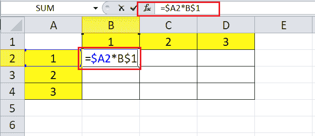

# Excel 中的单元格引用

> 原文：<https://www.javatpoint.com/cell-references-in-excel>

MS Excel 或微软 Excel 是微软开发的功能强大的电子表格软件。Excel 中的每个工作表都由几个由行和列组成的单元格组成。每个单元格都有一个特定的引用(或单元格引用)，这有助于用户轻松访问/寻址功能中所需的单元格。单元格引用在 Excel 中起着重要的作用，尤其是在使用具有大数据集的函数和公式时。

在本教程中，我们将简要介绍 Excel 单元格引用。本文还讨论了 Excel 中可用的不同类型的单元格引用以及使用相应单元格引用的分步过程。

## 什么是单元格引用？

单元格引用是指电子表格中特定单元格或单元格区域的名称或地址。单元格引用通常用作 Excel 公式中的变量。在 Excel 中表示单元格引用时，我们需要指定列名，后跟相应单元格的行号。

下图显示了 Excel 工作表中选定单元格的单元格引用:

单元格引用主要帮助 Excel 程序定位工作表内的单元格，读取或使用其在指定公式中的数据生成结果。创建公式时，我们可以使用单元格引用或其他单元格中的多个单元格区域，即使相应的单元格位于同一工作表、不同工作表或不同工作簿中。

在 Excel 中，单元格引用使用不同单元格/区域中另一个单元格或区域的值或属性。当引用其他工作表中的单元格时，这通常称为外部引用。当单元格被其他电子表格程序引用时，它被称为远程引用。

现在让我们了解在 Excel 中使用单元格引用的简单示例:

### 简单参考

单元格引用的基本用法可以通过简单地用等号提及引用的单元格来显示。例如，如果我们在工作表的另一个单元格中输入不带引号的“=A1”，A1 的值将显示在相应的单元格中。这意味着输入单元格引用的选定单元格的值与单元格 A1 的值完全相等。

### 对单元格区域的引用

我们也可以通过引用多个单元格的单元格范围来同时引用它们。例如，如果我们使用不带引号的符号“=A2:C6”，我们指的是从 A2 到 C6 的整个单元格范围。然而，在 Excel 中，仅仅一个范围并不是有价值的数据。当我们在 Excel 单元格中使用这个单元格引用时，Excel 给出了#VALUE！错误，这意味着缺少公式。因此，对单元格区域(A2:C6)的引用只有在函数或公式中使用时才有意义(如下所述)。

### 函数中的单元格引用

当我们在函数中使用单元格区域时，Excel 可以完成大量的工作。例如，如果我们在 SUM 函数中提供范围 A2:C6，Excel 会将单元格范围从 A2 到 C6 的所有值相加，得出计算值。

同样，如果我们向 AVERAGE 函数提供相同的范围(A2:C6)，Excel 将返回相应单元格区域的平均值，如下所示:

这样，我们可以利用 Excel 中的单元格引用，对单元格内记录的数据进行各种操作或计算。在 Excel 中使用单元格引用有不同的方法，具体取决于用例。

## Excel 中有多少种类型的单元格引用？

了解不同类型的单元格引用主要有助于我们轻松使用 Excel 公式，从而防止意外的公式错误。这在复制粘贴 Excel 公式时最有帮助。基于不同的用例，Excel 中有三种主要类型的单元格引用，例如:

*   相对单元格引用
*   绝对单元格引用
*   混合单元格引用

让我们详细讨论每种类型的单元格引用:

### 相对单元格引用

相对单元格引用是 Excel 中的默认方法。每当我们在 Excel 中输入任何单元格引用或公式中的某个范围时，所使用的引用都是相对的。对应的单元格引用通常与相对引用一起使用，相对引用通常表示列名和行号的组合。单元格引用在相对引用中不包含任何美元($)符号。

当我们将公式从一个相对单元格复制到其他单元格时，Excel 会根据相应的行和列自动调整单元格引用。相对单元格引用通常用于通过更改公式中相应单元格的列和行地址来对多个相对单元格执行相同的操作。

**如何在 Excel 中使用相对单元格引用？**

假设我们有下面的 Excel 表，其中 A 列和 B 列有两个数字，我们希望将 c 列的两个值相加。

我们需要执行以下步骤来使用相对引用，并对 A 列和 b 列的相同行的值进行求和。

*   首先，我们必须选择目标单元格来输入要添加值的公式。在我们的例子中，我们选择单元格 C2，输入公式“ **=A2 + B2** ”，不带引号。之后，我们按下**进入**键，得到 C2 单元格中的计算值。
    
*   接下来，我们必须将单元格 C2 复制粘贴到从 C3 到 C8 的其他相关单元格中。或者，我们可以点击并按住单元格 C2 右下角的**填充手柄**。我们必须将填充手柄拖到要复制相应公式的最后一个单元格。在我们的例子中，我们将**拖动**填充手柄到单元格 C8。
    
*   在将公式复制到从 C3 到 C8 的所有对应单元格之后，使用来自单元格 A3、B3 和 A4、B4 等的值来执行加法操作。
    
*   我们可以选择任何目标单元格，并从公式栏中检查应用的公式。例如，如果我们选择单元格 C5，我们可以看到在单元格 A5 和 B5 之间执行加法。
    
    上图中，很明显单元格 A2 的相对地址变为 A5，B2 变为 B5。类似地，其他单元的相对地址也基于相应行和列的相对位置而相应改变。

需要注意的是，在处理相对引用时，我们可以像平常一样使用单元格引用。

### 绝对单元格引用

在 Excel 中，我们并不总是希望 Excel 自动更改引用，尤其是当复制到其他非相对单元格或区域时。在这种情况下，公式给出错误的结果或公式错误。这就是绝对单元格引用有用的地方。与相对单元格引用不同，绝对单元格引用在复制到其他单元格时不会改变。

绝对引用是锁定相应引用的单元格引用，这意味着行和列保持不变。这种类型的单元格引用在列名和行号前包含一个美元($)符号，使相应的引用固定不变。我们可以按下 F4 功能键来固定引用或锁定所选单元格。$ a1、$ B1 和$ C1 是绝对单元格引用的示例。

**Excel 中如何使用绝对单元格引用？**

假设我们有下面的 Excel 表，其中有一些项目(列 A)和它们的初始价格(列 B)。然而，价格增加了 5%(单元格 E2)，我们需要使用绝对单元格引用来计算每个项目的新价格。

我们需要执行以下步骤来使用绝对参考来计算每个项目的涨价(第三栏):

*   首先，我们必须选择目标单元格并输入公式来计算新的/增加的价格。在我们的例子中，我们选择单元格 C2，输入公式“ **=B2*$E$2+B2** ”，不带引号。之后，我们按下**进入**键，即可获得 C2 手机的提价。
    
    根据上面的公式，我们将物品的初始价格乘以增加的百分比率，并将结果值加到相应物品的旧价格上。这样，我们就可以计算出物品的加价。
*   由于每个项目增加的费率百分比是固定的(5%)，我们在 E2 单元格中添加了美元($)符号，使其成为绝对的，即$E$2。因此，将公式复制到其他单元格后，$E$2 将保持不变。
*   接下来，我们必须将单元格 C2 复制粘贴到从 C3 到 C8 的其他相关单元格中。或者，我们可以点击并按住单元格 C2 右下角的**填充手柄**。我们必须将填充手柄拖到要复制相应公式的最后一个单元格。在我们的例子中，我们将**拖动**填充手柄到单元格 C8。
    
*   将公式复制到其他相关单元格中时，列 B 中的值会自动更改。然而，绝对参考值(2 美元)没有变化。例如，如果我们选择单元格 C5，我们可以看到单元格 B2 已更改为 B5，但$E$2 是常量。
    

需要注意的是，我们必须在行和列字母中使用美元符号来创建绝对单元格引用。

### 混合单元格引用

顾名思义，混合单元格引用结合了相对引用和绝对引用。美元符号用在引用中的列字母或行号之前。通过混合引用，我们可以引用以下两种情况:

*   当复制相应的公式时，列保持固定，而行作为相对引用而改变。
*   行保持不变，而列在复制相应公式时作为相对引用发生变化。

$A1 和 B$1 是混合单元格引用的示例，其中相对引用和绝对引用相结合。

**如何在 Excel 中使用混合单元格引用？**

假设我们有下面的 Excel 表，其中 A 列的单元格 A2、A3、A4 和第一行的单元格 B1、C1、D1 有一些值。我们需要使用混合单元格引用将每个列单元格与该行的每个相应单元格相乘。

我们需要执行以下步骤，通过使用混合单元格引用将每一列与每一行相乘:

*   首先，我们需要选择单元格 B2，并应用公式“=$A2*B$1”，不带引号。第一个参数($A2)表示绝对列和相对行。这意味着列 A 被锁定，而行号可以改变。第二个参数(A$2)表示绝对行和相对列。第一行是固定的，而列可以更改。
    
*   接下来，我们需要将相同的公式复制到范围 B2:D4 的所有单元格中。我们可以选择整个范围并单击“Ctrl + D”和“Ctrl + R”，而不是在每个单元格中输入公式。这将在所有选定的单元格中应用公式，并相应地生成结果。
    
    如果选择单元格 D4，可以看到第一个参数($A4)中的 A 列是常量，第二个参数(D$1)中的第 1 行是常量。
    

需要注意的是，行或列被设为常量以创建绝对单元格引用。

## 需要记住的要点

*   单元格引用是 Excel 函数或公式的关键元素之一。
*   单元格引用可以与函数、公式、图表和 Excel 中的许多其他基本命令一起使用。
*   当 Excel 公式中使用相对单元格引用时，引用会根据相应的行和列自动调整。
*   在非相对单元格中复制公式时，建议使用绝对单元格引用。Excel 不会更改绝对单元格引用。
*   根据要求，混合引用只锁定其中一个引用，行或列。它不会同时锁定两者。

* * *