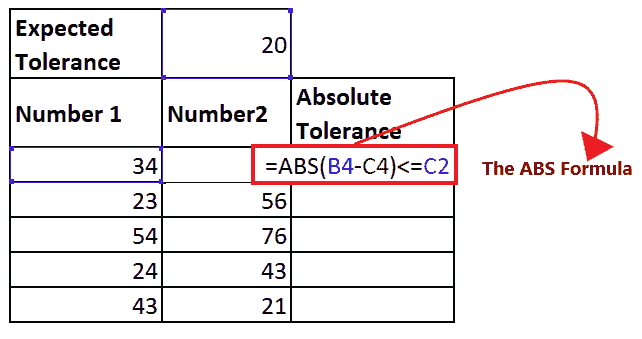

# Excel ABS 函数

> 原文：<https://www.javatpoint.com/excel-abs-function>

微软 Excel 就是要管理数据，尤其是数字。我们知道，数字的首要问题是它们可以是正的，也可以是负的。但各种数据本质上应该是正面的。Excel 提供了一个内置函数来迎合这些需求，即***【ABS 函数】*** 。

本教程将涵盖 Excel ABS 函数的定义、语法、参数、返回类型、在工作表中实现 ABS 函数的步骤等等！

## 什么是腹肌功能？

> Excel 中的 ABS 或 Absolute 函数返回给定数字的绝对值。简单来说，我们可以说 ABS 函数从指定的数字中消除了减号(-)，因此使其成为正数。

任何给定数的**绝对值**被定义为该数在数线上距 0 的距离，无论其方向如何(正或负)。在数学中，数字“a”的绝对值表示为|a|不同于下面给出的例子:

|-4| = 4


虽然微软 Excel 没有直接提供任何绝对值符号，但它引入了一个获取绝对值的特殊函数，称为 ABS 函数。使用防抱死制动系统或绝对功能时，我们将获得以下给定的视觉和输出之一:

*   如果指定的绝对数字是**正数，输出将是**这个数字本身。
*   如果指定的绝对数字是**负数，输出将是**这个没有负号的数字。
*   如果指定的绝对数字是**零，输出**也是 0。

#### 注意。Excel 绝对值不应与 Excel 绝对单元格引用相混淆。两者是不同的概念。绝对函数消除了指定数字中的减号(-)符号，而绝对引用是一种特殊形式，在将同一公式复制到其他单元格时不受影响。

### 句法

```

=ABS (number)

```

### 参数

**数字(必选):**此参数表示要获取绝对值的数字。

### 返回

Excel ABS 函数返回指定数字的绝对值。如果指定的数字不是数字，这个函数返回一个#VALUE！错误。

## 例子

### 示例 1:使用 Excel ABS 函数将负数转换为正数。


在需要快速将负数转换为正数的情况下，Excel ABS 功能是一个方便的选择。按照下面给出的步骤将负数更改为正数:

**第一步:插入两个辅助列**

我们将添加两列，一列在单元格 D3 中以“差异”命名，另一列在单元格 E3 中以“绝对差异”命名。

参考下图:


*   在差异辅助列中，我们将简单地使用减号来计算两个单元格的差异
*   在绝对差值帮助列中，我们将应用 Excel 绝对差值函数并获取绝对值。

**第二步:从数字 2 中减去数字 1**

*   在“差值”列中，键入等号(=)并从数字 1 中减去数字 2。
*   按回车键获取结果。


*   选择您键入公式的单元格。将鼠标光标移向矩形框的末端。你会注意到光标会变成一个小而细的黑色十字。将它拖到要自动填充的单元格上。
*   您将获得以下输出。


**第三步:插入 ABS 功能**

在下一行中，用等号(=)开始您的函数，然后是 abs 函数。公式如下: ***=ABS(***


**第四步:插入数字参数**

请参考要查找绝对数字的数字参数。从这里开始，我们必须找到差异列的绝对值。所以我们将参考 D4 细胞。公式如下: ***=ABS(D4)***


**第五步:将公式复制到所有单元格中**

*   选择您键入公式的单元格。将鼠标光标移向矩形框的末端。你会注意到光标会变成一个小而细的黑色十字。将它拖到要自动填充的单元格上。
*   ***abs 功能将成功获取指定数字的绝对差值*** 。

参考下图:


### 示例 2:使用 Excel ABS 函数查找给定值(数字或百分比)是否在预期公差范围内。

防抱死制动系统功能也常用于确定指定值是否在预期公差范围内。按照下面给出的步骤检查数字是否在预期容差范围内:

**第一步:插入绝对辅助列**

我们将在单元格 D3 中添加名为“绝对公差”的辅助列。

参考下图:


在 ABS 差异帮助器列中，我们将应用 IF 和 ABS 函数的 Excel 组合来检查数字是否在预期公差之间。

**第二步:插入 ABS 功能**

*   用等号(=)开始您的功能，然后是 abs 功能。公式如下:=ABS(
*   从数字 2 中减去数字 1，取差值的绝对值。公式如下:=ABS(B4-C4)
*   接下来，我们将检查提取值是否小于或等于指定的容差。公式如下:***= ABS(B4-C4)<= C2***

它看起来像下图:



**步骤 3:应用中频功能**

*   为了检查绝对输出是否在公差范围内，我们结合使用了中频和防抱死制动系统功能。
*   例如，在我们的例子中，如果差异在公差范围内，我们返回“是”，否则返回“否”:

**=IF(ABS(A2-B2) < =C2，“是”、“否”)**


**步骤 4:公式将返回输出**

如果公差大于 C2，上述函数将返回是，否则将返回失败。在我们的例子中，输出是“是”。


**第五步:将公式复制到所有单元格中**

*   选择您键入公式的单元格。将鼠标光标移向矩形框的末端。你会注意到光标会变成一个小而细的黑色十字。将它拖到要自动填充的单元格上。
*   abs 功能将成功 ***获取指定数字的绝对公差*** 。

参考下图:


**第五步:公式解释**

在 IF 公式中，两个指定的数字都被减去。根据实际值，返回输出可以是正的，也可以是负的。因此，我们实现了 ABS 函数，将所有情况下的输出转换为正数。然后将提取的正数与允许的容差进行比较，作为中频内部的逻辑测试。如果该数字小于或等于指定的公差，则该函数返回“确定”。如果不符合规范，则返回“失败”。

### 示例 3:使用 Abs 函数计算负数的平方根。

我们将使用***【SQRT】***函数来计算负数的平方根。但是 SQRT 函数只对正数有效。如果用户想找到负数的平方怎么办？

按照下面给出的步骤计算负数的平方根:

**第一步:添加辅助列**

我们将在单元格 C3 中添加带有“平方根”的辅助列辅助。在本专栏中，我们将使用 SQRT 和 ABS 函数的组合来查找负数的平方根。

参考下图:


**第二步:实现 SQRT 功能**

*   Excel 提供了一个内置函数 SQRT，帮助计算一个数字的平方根。
*   如果您在这个参数中传递一个正数，它将返回输出，但是如果您在这个函数中传递一个负数，它将返回一个#NUM！错误如下所示:


**第三步:插入 ABS 功能**

*   要像处理正数一样处理负数，可以使用 SQRT 和 ABS 函数的组合。
*   插入 ABS 函数插入 SQRT 函数并添加如下所示的数字参数:


**第四步:Excel 会返回输出**

上述公式将返回负数的平方根。


**第五步:将公式复制到所有单元格中**

*   选择您键入公式的单元格。将鼠标光标移向矩形框的末端。你会注意到光标会变成一个小而细的黑色十字。将它拖到要自动填充的单元格上。

您将获得以下输出。


### 如何在 Excel 中对绝对值求和

在使用 Excel 时，有时我们希望得到所有数字的绝对总和，请使用以下公式之一:

数组公式:

```

SUM(ABS(range))

```

Excel 中的 ABS 函数也可以与 SUMPRODUCT 函数一起使用，计算满足某些特定条件的绝对方差。

常规公式:

```

SUMPRODUCT(ABS(range))

```

例如，假设我们在 B2 的工作表中有一个数据集:C5 单元格，使用 ABS 函数，我们将找到绝对值之和。

使用 SUM 函数获得绝对值的公式:

**=SUM(ABS(A2:B5))**

按下 Ctrl+ Shift+ Enter，您将获得以下输出。

获得最小绝对值的公式:

**=SUMPRODUCT(ABS(A2:B5))**

按下 Ctrl+ Shift+ Enter，您将获得以下输出。

如下图所示，两个求和公式都返回一个绝对值:


## 如何在 Excel 中找到最大/最小绝对值

您也可以使用 ABS 和其他 Excel 公式的组合在 Excel 中获取最小和最大绝对值。

最大绝对值公式如下:

```

MAX(ABS(range))

```

最小绝对值公式如下:

```

MIN(ABS(range))

```

例如，假设我们在 B2 的工作表中有一个数据集:C5 单元格，使用 ABS 函数，我们将找到最小值和最大值的绝对值。

获得最大绝对值的公式:

**=MAX(ABS(A2:B5))**

按下 Ctrl+ Shift+ Enter，您将获得以下输出。

获得最小绝对值的公式:

**=MIN(ABS(A2:B5))**

按下 Ctrl+ Shift+ Enter，您将获得以下输出。


您可以利用 ABS 函数，通过将其嵌套到 INDEX 函数的*数组*参数中来处理一系列数据。我们可以结合最大函数、索引函数和绝对函数来获得最大绝对输出。下面是给定的公式:

**=MAX(INDEX(ABS(B2:C5)，0，0))**

我们可以结合最小函数、索引函数和 AB 函数来获得最小绝对输出。下面是给定的公式:

**=MIN(INDEX(ABS(B2:C5)，0，0))**

**解释**

由于 INDEX 公式，上述公式返回最小值和最大值。当我们将 INDEX 函数的参数( *row_num* 和 *column_num)设置为 0(或省略它们)时，Excel 将返回整个数组，而不是任何单个值。*

* * *