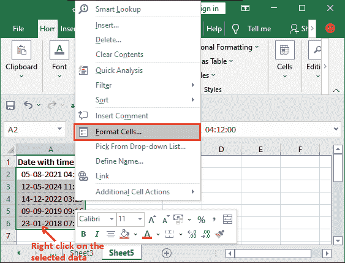

# 如何在 excel 中从日期中删除时间

> 原文:[https://www . javatpoint . com/如何删除 excel 中的日期时间](https://www.javatpoint.com/how-to-remove-time-from-date-in-excel)

当 Excel 用户在 Excel 中使用日期或时间公式时，如果时间戳设置为 dd-mm-yyyy hh:mm，他们有时会得到合并的日期和时间，这是通用的，但有时用户只需要日期，不需要时间。在这种情况下，本章将帮助您从日期/时间戳中删除只需要时间的时间。


时间戳同时返回日期和时间。因此，在本章中，您将学习如何从 Excel 中使用的时间戳中仅获取日期。在本文中，我们处理的是包含日期和时间的时间戳。

## 怎么做才能得到唯一的约会对象？

有时，Excel 用户只需要日期，而不需要带时间的日期。但是，Excel 中有各种函数可以用来获取唯一的日期作为结果值。如果您从其他人那里收到了包含日期和时间的工作簿，该怎么办？

在这种情况下，用户需要明确地从其中删除时间。他们可以使用 Excel 功能或函数从时间戳中提取日期。

如果只需要日期，Excel 用户可以使用格式创建不带时间的时间戳。格式化数据是 Excel 的一个有趣特性。您将看到如何在 Excel 中使用它来格式化数据。这也可以用来从时间戳中提取日期。

### 从日期中删除时间的方法

我们只有以下方法来获取日期:

*   [使用格式](#Set)设置日期格式
*   [从日期](#Remove)中删除时间
*   [使用 Excel 公式](#formula)从日期中删除时间
    *   [INT()](#INT)
    *   [带月、年、日功能的日期()](#DATE)
    *   [TEXT()](#TEXT)
*   [使用查找和替换](#Find-Replace)从日期中删除时间

## 使用格式设置日期格式

例如，如果您使用 Excel 的 NOW()函数从系统中获取当前日期，您将同时获得日期和时间。您可以按照我们下面将要讨论的过程，使用 Excel 格式功能从日期中删除时间。

以下是它的步骤:

**步骤 1:** 选择要格式化的单元格数，该单元格将只包含日期输入。


**第二步:**在号码组中，点击**通用**类别下拉列表。


**第三步:**点击下拉列表末尾的**更多数字格式**，将打开一个对话面板。


**第四步:**从左侧边栏中选择**自定义**，在**中输入 dd-mm-yyyy，键入**字段，该字段是当您只想要日期而不想要时间时只获取日期的格式。然后，点击**确定。**


**第五步:**现在，输入日期或使用 Now()函数获取格式化单元格中的日期。

在上一步中选择日期的 dd-mm-yyyy 格式后，所选单元格将保留日期，但不保留时间。

## 从日期中删除时间

我们来看一个场景——您的 Excel 工作表包含日期和时间(dd-mm-yyyy hh:mm)格式的数据。您想通过删除时间来提取日期。Excel 用户可以为此应用 ***数据格式化*** 功能。

执行以下步骤:

**第 1 步:**选择带有日期和时间数据的单元格，从中删除时间，只保留日期。然后，右击它并选择**格式化单元格。**



**第 2 步:**确保您在“号码”标签内的**自定义**类别中。在这里，选择**日-月-年**日期格式，从选择的日期和时间数据中只得到日期，然后点击**确定。**


如果您没有自定义，请导航到它。

**第 4 步:**现在您将看到日期已从所选数据中提取，时间已被删除。


通过使用 Excel 的数据格式化功能，可以轻松格式化日期和时间数据。用户也可以选择另一种日期格式。

单元格格式会改变原始数据。它不会将原始数据和修改后的数据分开。

## 使用 Excel 公式从日期中删除时间

从存储在 Excel 工作表中的日期中删除时间的另一种方法是使用 Excel 公式。使用 Excel 公式，您可以通过删除时间并将其与原始数据分开来从数据中提取日期。

最终，您将拥有原始数据和结果数据。这些函数有助于将原始数据和结果数据保存在不同的单元格中。我们将展开三个公式，帮助 Excel 用户从日期中删除时间。

1.  [INT()功能](#INT)
2.  [带月、年、日功能的 DATE()功能](#DATE)
3.  [TEXT()功能](#TEXT)

这些功能将帮助您从日期中删除时间，如果有。让我们讨论一下这些函数是如何消除时间的。

## INT()

INT()是 Excel 的一个基本函数，用于将一个数字舍入到最接近的整数。您想知道这个函数在时间戳的情况下有什么帮助。用一个例子来学习。

虽然这是一个漫长的工作过程，但在某种程度上还是有帮助的。此函数将与包含日期和时间的单个参数一起使用。

#### 提示:首先，Excel 工作表的单元格应该是 dd-mm-yyyy hh:mm 格式。否则，时间不会与日期和时间一起存储。

### 例子

**第一步:**我们在 a 列中有带有时间的日期，我们将在另一个单元格中使用下面的公式，在单独的一列中获取提取的数据。

=INT(A2)


**第二步:**现在，点击**进入**键，在你写公式的另一个单元格中获取没有时间的日期。


您会注意到时间已被删除，但它将 0 留在原地，结果为 0:00。这是因为自定义格式。因此，从自定义格式切换到日期格式。

**步骤 3:** 我们对所有其他给定日期使用了相同的公式，只需更改每个数据的单元格引用。看到所有人的结果。


**从自定义格式**更改为日期格式

**第 4 步:**使用 INT()函数选择得到的所有结果单元格。


**第五步:**现在，在*主页*选项卡中，转到*编号*部分，并单击具有**自定义**的栏，以获取当前日期格式。


**第六步:**选择*短日期*或*长日期。*我们选择了最常用的**短日期**。


**第 7 步:**您现在会看到时间已经从结果单元格(B 列)中完全移除，只剩下日期。


你还有原始数据。这是使用 Excel 公式代替数据格式化功能的主要好处。您不会丢失原始数据，也不会得到结果数据。

### 带月、年和日功能的日期()函数

下一个从日期中删除时间的 Excel 公式是 date()函数，该函数可以与 MONTH、YEAR 和 DAY 函数一起使用来实现该目标值数据。

基本上，DATE()函数以 *dd-mmmm-yyyy* 格式返回日期。我们将通过添加 year、month 和 day 函数而不是 YEAR、MONTH 和 DAY 函数对公式进行一点点修改。基本上，我们将在 DATE()函数中嵌套这些函数，以提取日期并忽略时间。

让我们看看它的语法-

```

=DATE(YEAR(A2), MONTH(A2), DAY(A2))

```

这里，A2 单元格包含日期和时间。

### 例子

我们将使用与上面示例中使用的相同的带有时间的日期数据集，然后对其应用 DATE()函数以从日期中移除时间。

**第一步:**我们在 a 列中有带有时间的日期，我们将在列中使用下面的公式在单独的列中获得提取的数据。

=日期(年(A2)、月(A2)、日(A2))


**第二步:**现在，点击**进入**键，在你写公式的另一个单元格中获取没有时间的日期。


您将看到日期已经返回，但没有时间，而是用 0 代替时间。日期显示为 dd-mm-yyyy 0:00 格式。时间已被删除。

**步骤 3:** 我们对所有其他给定日期使用了相同的公式，只需更改每个数据的单元格引用。看到所有人的结果。


**从自定义格式**更改为日期格式

**第 4 步:**使用 INT()函数选择得到的所有结果单元格。


**第五步:**在*主页*选项卡中，转到 ***编号*** 部分，点击带有**自定义**的栏，获取当前日期格式。


**第六步:**选择*短日期*或*长日期。*我们选择了最常用的**短日期**。


**第 7 步:**您现在会看到时间已经从结果单元格(B 列)中完全移除，只剩下日期。


## 文本()

TEXT()函数是 Excel 用户可以从日期中删除时间的最后一个函数。它将值转换为特定数字格式的文本。这也和其他方法一样简单。

您也可以使用此功能通过将时间戳转换为您选择的日期格式来删除日期中的时间。您将看到这个函数将如何在 Excel 中使用。

让我们看看它的语法-

```

=TEXT(A2, "dd-mm-yyyy")

```

这里，A2 单元格包含日期和时间。

TEXT()函数从时间戳中提取日期，并根据函数第二个参数中定义的格式返回它。

### 例子

我们将使用与上面示例中相同的日期数据和时间。您会注意到，在对其应用 TEXT()函数后，最终的结果将是相同的，没有时间。


**步骤 1:** 应用以下文本公式从时间戳中提取日期，并从中删除时间。


**第二步:**点击**进入**键，获取从存储在 A2 单元格的时间戳中提取的结果。


您可以看到 TEXT()函数将结果作为文本值返回，因为它位于单元格的左侧。

**第 3 步:**在继续之前，只需更改每个对应数据的单元格引用，即可对其他数据应用相同的公式。


#### 注意:文本格式返回的所有值都放在单元格的左边。这意味着它以文本格式而不是日期格式返回值。

### 使用 TEXT()函数的优势

使用 TEXT()函数的主要优点是——用户不需要像我们在其他函数(INT，DATE)中那样改变格式。只需使用一个过程，就可以获得没有时间的日期。但是，该函数返回的日期是文本格式，而不是日期格式。

## 使用查找和替换从日期中删除时间

在本章中，我们将处理时间戳，我们将从时间戳中删除日期时间。您已经寻找了各种方法(特性和功能)来从日期中删除时间。

“查找和替换”是 Excel 的另一个功能，它将使用户能够使用时间戳和日期格式。它降低了可以从时间戳中格式化出来的时间的价值。让我们看看这个功能将如何使用。

以下是它的步骤:

**第 1 步:**选择所有带有时间(时间戳)的日期，从中删除时间。


**第二步:**按 **Ctrl+H** 键，打开查找替换对话框。或者，在*首页*标签，点击*查找* & *选择*按钮，然后选择*替换。*


**步骤 3:** 执行以下操作:

*   在“查找内容”字段中键入一个空格，然后键入一个*(星号)。
*   在替换为字段中，不执行任何操作。
*   最后，点击**全部替换。**
    

#### 注意:当日期和时间由单个空格分隔时，该方法工作正常。

所有替换都将通过从日期中删除时间来完成，只要它在日期和时间之间找到一个空格。

**第 4 步:**点击**确定**关闭替换弹出窗口。已经做了五次替换。


另外，点击**关闭**按钮关闭查找和替换对话框。

**第五步:**你会注意到一件事，时间戳的时间变成了 0:00。这意味着时间已经被一个零值，即 0 所取代。


现在，是时候格式化日期了，我们将使用 Excel 的单元格格式化功能来完全删除时间。

**第 6 步:**选择时间值为零的日期，从前面的步骤中获取。

然后，在*主页*选项卡中，选择一种日期格式，短日期或长日期。我们将选择短日期。


**第七步:**现在，你会看到时间已经完全从日期中移除。


除此之外，Excel 还提供了其他几种方法，用户可以使用这些方法从日期中删除时间。他们可以根据自己的适合性来使用它们，或者发现它们更容易。

我们讨论了各种方法，但可能还有更多。我们已经完成了，但是您也可以在 Excel 中使用文本到列功能。这对你也有帮助。不过，以上方法已经足够了。你将不再需要更多；否则你可能会感到困惑。

* * *