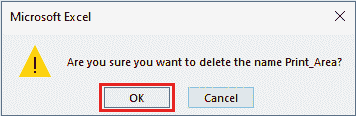
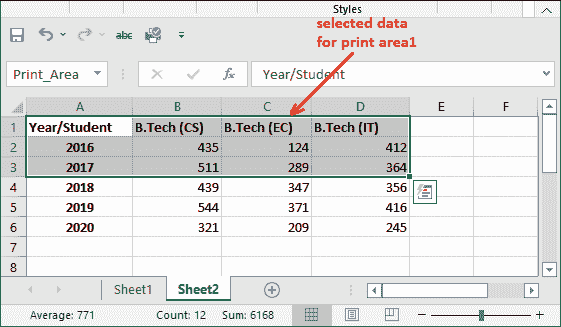

# 如何在 excel 中设置打印区域？

> 原文：<https://www.javatpoint.com/how-to-set-print-area-in-excel>

一般在 Excel 中按下 **Ctrl+P** 键(打印命令)时，默认打印整个页面。一直以来，用户不需要打印带有数据的整张纸。有时，他们可能需要打印特定区域，而不是整张纸。因此，他们可以设置打印区域，只打印纸张的必要部分。

Excel 允许用户设置打印 Excel 工作表特定区域的区域。该 Excel 功能称为**打印区。**在 MS-Excel 中，如果在工作表中设置了打印区域，则只打印该部分打印区域。

本章及其主题将帮助您设置打印区域。在本章中，我们将指导 Excel 用户在工作表中设置打印区域。

## 什么是打印区域？

A **打印区域**是 MS Excel 中打印的一个特殊功能，用户可以打印工作表的特定区域(单元格区域)。当打印命令执行时，只有 Excel 表的选定区域(打印区域)进行打印。这意味着在纸张上应用打印区域功能时，仅打印纸张的选定部分，而不是整个纸张。

使用打印区域的优点之一是，您可以在单个工作表或单个工作簿中定义多个打印区域。每个定义的打印区域将打印在不同的页面上。当用户要求将数据打印在不同的页面上时，这很有帮助。

如果你的想法改变，你不想按区域打印，你可以清除它，一次打印整张纸。

### 使用打印区域的优势

*   打印区域可以更好地控制工作簿的数据打印。
*   通过设置打印区域，您将解决打印整个工作表数据的问题，而不是必要的问题。您不需要打印工作表的数据，因为您不想打印。
*   打印区域允许在新页面上打印每组打印区域。
*   Excel 用户可以在单个工作表/工作簿中设置多个打印区域。
*   用户应该在发送 Excel 数据进行打印之前设置打印区域。
*   Excel 在页面布局选项卡中有一个名为**打印区**的功能。
*   一个工作表可以有多个打印区域。每个区域分别打印在不同的页面上。

### 涵盖的主题

以下是关于设置、编辑和删除打印区域的一些重要主题，我们将在本章中尝试介绍这些主题:

1.  [设置打印区域](#Set)
2.  [编辑或删除打印区域](#Edit)
    1.  [编辑打印区](#print)
    2.  [删除打印区域](#Delete)
3.  [设置多个打印区域](#Setmore)
4.  [修改打印区域](#Modify)
5.  [查看打印区域](#View)
6.  [清除打印区域](#Clear)

## 设置打印区域

打印区域是 Excel 非常有趣的功能。本章的这一节提供了在工作表中设置打印区域的说明。这一章你可以一直读到最后。

取一张 Excel 数据表，您可以在上面执行设置打印区域的步骤。然后，执行下面给出的步骤:

**例**

**第一步:**我们还取了一张 Excel 表，选了一组数据打印出来。您还可以选择一系列单元格。

从这组数据中，我们将创建一组要打印的三年数据。

**第二步:**点击**页面布局**标签内的**打印区**。

**第三步:**点击这里的**设置打印区域**选项。打印区域设置成功。

**第四步:**你会注意到名称框里面出现了**打印 _ 区域**文本，表示打印区域已经设置好了。

保存 Excel 文件并立即关闭文件，然后重新打开。

**第五步:**点击**文件**选项卡，点击**打印**选项，打印前面步骤创建的打印区域。

**文件>更多>打印**

**第 6 步:**打印区域数据见打印预览。您会注意到，唯一的打印区域将显示在打印屏幕内。

#### 注意:要编辑或删除打印区域，可以使用名称管理器。您可以在“定义的名称”组部分下的“公式”选项卡中找到此选项。

## 编辑或删除打印区域

有时需求可能已经改变。您需要编辑或删除之前设置的打印区域。Excel 允许用户编辑或删除打印区域。

不要误导，编辑和删除打印区域的步骤与设置打印区域完全不同。我们将指导您编辑或删除 Excel 工作表中的打印区域。

### 编辑打印区域

首先，我们将向您展示如何编辑打印区域。让我们看看下面的步骤:

**第一步:**打开设置了打印区域的 Excel 表单。

**第二步:**将标签更改为**公式**标签，您将看到*定义名称*组。其中，点击**名称管理器**选项。

**步骤 3:** 将打开一个面板，其中包含用户设置的所有打印区域。它可以是一个或多个。我们目前只有一个。

**第 4 步:**要编辑此处显示的打印区域，选择打印区域，点击**编辑**按钮。

**第五步:**也可以编辑自己设置的打印区域名称。此外，您可以添加和删除要打印为打印区域的单元格。

**第 6 步:**要修改打印区域的单元格范围，点击**参考**图标。

**第 7 步:**我们重新选择了要设置为打印区域的单元格范围。以前的打印区域范围(A1:D5)已更改为(A1:D4)。

**第 8 步:**现在，点击**确定**保存修改后的打印区域范围。

**第 9 步:**再次打开名称管理器面板，点击**关闭**按钮，以新的范围保存更改。

**步骤 10:** 现在，在 Excel 表单上，点击**文件**选项卡，进入 Excel 后屏幕。

**第 11 步:**在 Excel 后屏幕上，点击**更多**，然后**打印。**

**第 12 步:**你会看到——这次只打印两行数据。

### 删除打印区域

如果要删除设置为打印工作表特定部分的打印区域，也可以这样做。其步骤与编辑打印区域几乎相同。

**步骤 1:** 打开包含打印区域的工作表，导航至**公式**选项卡。

**步骤 2:** 在公式选项卡中，单击位于*已定义名称*组部分内的**名称管理器**选项。

**第三步:**要删除此处显示的打印区域，选择打印区域，点击**删除**按钮。

**第四步:**将打开一个确认删除动作的对话框。点击**确定**按钮确认删除。

**第五步:**看到前面步骤中看到的打印区域已经被删除。现在，点击**关闭**按钮。

现在，如果您打印 Excel 数据，整个工作表数据将像往常一样打印。

## 设置多个打印区域

Excel 用户不必在 Excel 工作表中只设置一个打印区域。他们可以在一张工作表中同时设置多个打印区域。您必须重复相同的步骤才能在 Excel 中设置一个或多个打印区域。

你可以这么说——微软 Excel 的一个非常有趣的特性是，用户可以打印工作表的特定部分，而不是整个工作表。

按照以下步骤在 Excel 工作表中设置一个或多个打印区域:

**第一步:**我们取一张有数据的 Excel 表，从中选择一组数据，创建打印区域进行打印。

我们已经选择了从 A1 单元到 D3 单元的第一个范围。

**第二步:**按住 **Ctrl** 键，选择另一个打印区域的其他单元格范围。

我们为打印区域选择了从 A5 单元格到 C6 单元格的另一个范围。

**第三步:**现在，点击*页面布局*选项卡内的**打印区域**，从列表中选择设置打印区域选项。

一次设置多个打印区域。现在，如果您要打印具有打印区域的工作表，每个打印区域将打印在单独的页面上。

**“基本上，你把 Excel 表数据分解到不同的页面，分别打印。”**

**第四步:**在 Excel 后屏幕，点击**打印**命令，打印所有设置的打印区域。

**第五步:**你会看到这两页要打印在这里。

**打印区 1**

**打印区 2**

同样，按住 **ctrl** 键选择不同的单元格范围，可以设置多个打印区域。

## 清除打印区域

用户可以使用**清除打印区域**选项一次清除所有打印区域。您将在“公式”选项卡中找到该选项。使用这种方法，可以一次清除工作表中的所有打印区域。

完成清除打印区域的步骤:

**步骤 1:** 打开设置了打印区域的工作表，然后导航至**页面布局**选项卡。

**步骤 2:** 在页面布局选项卡中，单击**打印区域**下拉选项，然后从列表中单击**清除打印区域**。

所有的印刷区域都将一次清理干净。现在，如果您尝试打印，整个工作表都会打印出来。

## 查看打印区域

当您在单独的页面上打印 Excel 工作表时，可以查看打印区域的数量。但是您必须使用 print 命令来查看打印页数。如果一个打印区域有大量需要打印一页以上的数据，这可能会令人困惑。在这种情况下，您无法区分它是单个打印区域还是单独的。

Excel 支持另一种查看打印区域的方式。还可以使用 Excel 分页符预览方法查看 Excel 工作表中存在的打印区域。这个功能你可以在**视图标签中找到。** Excel 分页符允许用户查看工作表中的所有分页符。然后，您将看到您在这张纸上设置的每个打印区域。

**第一步:**打开有打印区域的工作表。

**第 2 步:**导航至**视图**选项卡，点击中的**分页符预览**

**第三步:**看有多少页。你可以看到蓝线内的两个印刷区域。

**第四步:**要返回正常模式，点击这里的**正常**选项。

## 修改打印区域

如果您想更改打印区域中的某些内容，修改打印区域可以避免删除和重新创建打印区域。Excel 用户可以添加或删除现有打印区域中的单元格。因此，您不需要删除然后用新范围重新创建打印区域。

请参见修改打印区域的步骤:

**第一步:**在已有打印区域选择要添加的新单元格。

**步骤 2:** 现在，在**页面布局**选项卡中，单击**打印区域**并从列表中选择**添加打印区域**。

**页面布局>打印区>添加打印区**

#### 注意:添加打印区域选项仅在工作表有现有打印区域时才可见。否则，这个选项不会显示给你看。

**第 3 步:**您将看到它会修改该工作表的现有打印区域，并包含要打印的新单元格。

转到“视图”选项卡，单击“分页符预览”查看文件中的页面区域数量。

### 修改打印区域时需要注意的事项

在 Excel 工作表中修改打印区域时，您应该了解以下几点:

*   当新单元格添加到现有打印区域时，命名范围“打印 _ 区域”会发生变化。Excel 用户也可以直接编辑命名区域来修改打印区域。
*   如果新打印区域和现有打印区域不相邻，Excel 会创建一个新打印区域。它还在不同的页面上分别打印两个打印区域。然而，当新打印区域和现有打印区域相邻时，打印区域将被合并并打印在同一张纸上。

## 在一页上打印多个区域

一个工作表可以有多个打印区域。您已经知道每个打印区域都打印在单独的页面上。您也可以将它们打印在一页上。

在不同页面上打印多个区域由打印机型号控制，而不是由 MS Excel 控制。即使在 Excel 工作表中设置了打印区域，用户也可以控制它们。通过遵循打印机属性的以下步骤，他们可以控制打印区域并在单页上打印它们:

1.  您可以验证此选项是否可用。
2.  按下 **Ctrl+P** 或者您可以从 Excel 后屏幕中单击**打印**命令，然后单击**打印机属性**链接。
    
3.  现在，在**打印机属性**对话框的可用选项卡中切换，搜索**每页纸**选项。

如果您的打印机没有我们上面描述的选项，那么您必须使用我们拥有的最后一种方式。您可以使用“特殊粘贴”功能将所有打印范围复制到新的工作表中。

**第一步:**打开有打印区域的 Excel 表单，使用 **Ctrl+C** 逐一选择并复制。

**第二步:**打开新的工作表，右键点击任意空白单元格，选择**粘贴特殊>链接图片**选项。

**步骤 3:** 现在，对其他要复制的打印区域使用相同的步骤。

**步骤 4:** 现在可以使用 **Ctrl+P** 命令打印包含所有打印区域数据的新纸张。

所有打印区域都将作为常规打印方法打印在一页上。

* * *