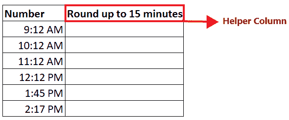

# Excel 天花板函数

> 原文：<https://www.javatpoint.com/excel-ceiling-function>

舍入是一个有用的 Excel 功能，在不需要精确答案的情况下可以帮助您。这是一种以预期精度获取近似数字的技术。简单来说，对一个数字进行舍入会消除最小的有效数字，使值变短，但保持接近实际数字。微软 Excel 提供了各种内置的舍入函数，其中之一就是 ***天花板函数。*T3】**

本教程将涵盖 Excel 天花板函数的定义、语法、参数、返回类型、在工作表中实现天花板函数的步骤、将十进制数舍入为整数、将数字舍入为最近倍数的不同示例，以及更多内容！

## 什么是天花板函数？

> Excel 中的天花板函数将给定的数字四舍五入到最接近的有效倍数。它的语法与 FLOOR 函数相同，但 FLOOR 函数用于向下舍入数字，而天花板函数向上舍入数字。

该函数将一个数向上舍入到指定的倍数(在重要性参数中提供)。如果指定的数字已经是精确的倍数，则不会发生舍入，并且此函数返回原始数字。用于舍入任意数字的倍数作为重要性参数提供。

该函数接受两个参数，即数字和重要性。Number 参数表示要舍入到精确倍数的数值。重要性参数表示指定数字应该向上舍入到的倍数。

天花板函数在数学/触发函数下分类。它的工作方式类似于 FLOOR 或 MROUND 函数，但与 FLLOR 或 MROUND 不同，FLLOR 或 MROUND 向下舍入到最近的倍数或舍入到最近的倍数，天花板总是向上舍入。

#### 注:Excel 天花板功能正式记录为兼容功能，由 Excel 天花板替代。数学和天花板。精确

## 句法

```

= CEILING (number, significance)

```

## 参数

*   **数字(必选)—**此参数表示应取整的数字。
*   **显著性(必需)—**此参数表示舍入时使用的倍数。这个符号和这个数字非常吻合。所以如果数字是负的，重要性也必须是负的。

## 返回

Excel 天花板函数返回一个数字，将其四舍五入到指定的倍数。

## Excel 天花板函数的规则

***天花板是 Excel 中的内置函数，*** 基于一些预定义的舍入规则工作，这些规则通常将数字从 0 向上舍入。在工作表中实现该功能之前，请查看以下规则:

1.  如果 ***两个参数(数和显著性)都为正，则给定的数向上舍入。*** 例如，数字参数是 12，而显著性是 5，所以数字 12 被舍入到 15。参考下图:
    
2.  如果参数 ***数值为正，参数显著性为负，则天花板函数返回#NUM 错误。*** 参考下图。
    
3.  如果 ***数字参数为负，显著性参数为正，则数字向上舍入，*** 趋近于零。参考下图。
    
4.  如果 ***两个参数(数值和显著性)都为负，则给定的数值向下舍入。*** 参考下图。
    

## 例子

## 示例 1:使用天花板函数将值向上舍入到给定的倍数。

| 数字 | 意义 |
| fifty-two | three |
| Fifty-four | five |
| Twenty-one | Ten |
| One hundred and thirty | Twelve |
| One hundred and twenty-three | -3 |
| Twelve | Ten |

按照下面给出的步骤，使用天花板函数对上述数字进行舍入:

**第一步:插入辅助列**

我们将在单元格 E3 中添加名为“向上舍入”的辅助列。在本列中，我们将使用天花板函数将数字向上舍入到指定的重要性值。

参考下图:


**步骤 2:实现天花板功能**

*   Excel 提供了一个内置函数天花板，有助于将给定的数字向上舍入到指定重要性的最近倍数。
*   在“向上舍入”辅助列中，以等号(=)开始公式，并键入天花板函数。所以我们的公式变成:**=天花板(**
    

**步骤 3:插入天花板参数**

*   首先，它会询问数字参数。在此指定要舍入的数字。在我们的案例中，我们将提到细胞 C4。所以我们的公式变成: **=天花板(C4，**
    
*   接下来，提供重要性参数。在我们的案例中，我们将提到细胞 D4。因此，我们的公式变成: **=天花板(D4 C4)**
    

**第四步:Excel 会返回输出**

*   键入公式后，按回车键完成。
*   上面的公式将一个数字四舍五入为 3 后返回。由于给定的数字是 52(3 的倍数)，将返回 54，如下图所示。
    

**第五步:将公式复制到所有单元格中**

*   选择您键入公式的单元格。将鼠标光标移向矩形框的末端。你会注意到光标会变成一个小而细的黑色十字。将其向下拖动到要自动填充天花板公式的单元格中。
*   公式将被复制到绝对单元格引用值发生变化的地方，您将获得每个单元格的输出。

**你会有如下输出。**


## 例 2:将给定的价格四舍五入到. 99

| 定价 |
| Eight thousand nine hundred and fifty-two |
| Two thousand one hundred and fifty-four |
| Two hundred and thirty-one |
| One thousand three hundred and ninety |
| One thousand two hundred and ninety-three |
| One thousand two hundred and twelve |

您也可以使用 Excel 天花板功能来设置货币转换后的定价，或获得折扣等。要将定价四舍五入到. 99，请按照下面给出的步骤操作:

**第一步:插入辅助列**

我们将在单元格 D3 中添加带有“以. 99 结尾”的帮助列帮助器。在本专栏中，我们将使用天花板函数来舍入价格，使其以. 99 结尾。

参考下图:


**步骤 2:实现天花板功能**

*   Excel 提供了一个内置函数天花板，它有助于将一个给定的数字舍入到指定重要性的最近倍数。
*   在“. 99 结尾”辅助列中，以等号(=)开始公式，并键入天花板函数。所以我们的公式变成: **=天花板(**
    

**步骤 3:插入天花板参数**

*   首先，它会询问数字参数。在此指定要舍入的数字。在我们的案例中，我们将提到细胞 C3。所以我们的公式变成: **=天花板 *(C4、***
    
*   接下来，提供重要性参数。在问题本身中，意义被给出为 1。因此，我们的公式变成: **=天花板 *(C4，1)***
    
*   然后减去 1 美分，得到一个类似 341.99、54.99、69.99 等的价格。我们的公式变成: **=天花板 *(C4，1) - 0.01***
    

**第四步:Excel 会返回输出**

*   键入公式后，按回车键完成。
*   上面的公式将返回一个以. 99 结尾的数字，然后舍入到 1。您将获得以下输出:
    

**第五步:将公式复制到所有单元格中**

*   选择您键入公式的单元格。将鼠标光标移向矩形框的末端。你会注意到光标会变成一个小而细的黑色十字。将其向下拖动到要自动填充天花板公式的单元格中。
*   公式将被复制到绝对单元格引用值发生变化的地方，您将获得每个单元格的舍入输出。

您将获得以下输出。


## 示例 3:使用 Excel 天花板函数将“时间”列中的给定时间四舍五入到最接近的 15 分钟

Excel 天花板函数包含时间格式，因此可用于将时间舍入到指定倍数。要将时间四舍五入到最接近的 15 分钟，请按照下面给出的步骤操作:

**第一步:插入辅助列**

我们将在单元格 D3 中添加带有*“舍入到 15 分钟”*的辅助列辅助。在本专栏中，我们将使用天花板函数将时间四舍五入到最接近的 15 分钟。

参考下图:



**步骤 2:实现天花板功能**

*   Excel 提供了一个内置函数天花板，有助于将给定的数字四舍五入到指定重要性的最近倍数。
*   在“最近的 15 分钟”帮助列中，以等号(=)开始公式，并键入天花板函数。所以我们的公式变成: **=天花板(**
    

**步骤 3:插入天花板参数**

*   首先，它会询问数字参数。在此指定要舍入的数字。在我们的案例中，我们将提到细胞 C4。所以我们的公式变成: **=天花板 *(C4，*T3】**
*   接下来，提供重要性参数。在问题本身中，重要性被给出为最近的 15 分钟。时间值也可以输入到重要性文本中，如“1:16”。所以这里我们将通过' 0:15 '。因此，我们的公式变成: **=天花板(C4，“0:15”)**
    

**第四步:Excel 会返回输出**

*   键入公式后，按回车键完成。
*   上面的公式四舍五入到“0:15”后会返回一个数字。您将获得以下输出:
    

**第五步:将公式复制到所有单元格中**

*   选择您键入公式的单元格。将鼠标光标移向矩形框的末端。你会注意到光标会变成一个小而细的黑色十字。将其向下拖动到要自动填充天花板公式的单元格中。
*   公式将被复制到绝对单元格引用值发生变化的地方，您将获得每个单元格的输出。

您将获得以下输出。


## Excel 中的其他舍入函数

1.  当需要对数字进行正常舍入时，可以实现***Excel ROUND 函数*** 。
2.  想要将数字四舍五入到最接近的倍数时，可以实现***Excel MROUND 功能*** 。
3.  想要向下舍入到最近的指定位置时，可以实现***Excel round down 功能*** 。
4.  可以实现 ***的 Excel ROUNDUP 功能*** 到最近的指定地点进行 ROUNDUP。
5.  可以实现***Excel FLOOR 函数*** 将给定的数字向下舍入到最近的指定倍数。
6.  可以实现***Excel INT 函数*** 对给定的数字进行向下舍入，只返回一个整数。
7.  可以实现 ***的 Excel TRUNC 函数*** 来截断小数位。

* * *