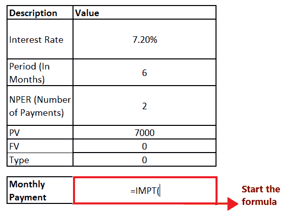

# Excel IPMT 函数

> 原文:[https://www.javatpoint.com/excel-ipmt-function](https://www.javatpoint.com/excel-ipmt-function)

在申请贷款时，无论是抵押贷款、债务、房屋贷款、教育贷款还是家具贷款，你都需要偿还借来的钱以及额外的利息。换句话说，利息是领导某人(通常是银行)的钱的费用。

任何贷款的利率都可以通过利率乘以余额轻松计算出来。但是为了简化这个过程，Excel 为此开发了一个内置函数-***IPMT 函数。*T3】**

本教程将涵盖 IPMT 函数的定义，计算还贷周期数的方法，或达到目标金额所需的投资数量，以及更多！

## 什么是 IPMT 函数？

> 内置 Excel 函数中的 IPMT 函数，有助于计算利息支付。考虑到利率和总付款在所有期间都是恒定的，此函数返回指定期间的贷款付款利息金额。

## 句法

```

IPMT(rate, per, nper, pv, [fv], [type])

```

## 因素

1.  **利率(必选)-** 此参数代表每期利率。如果你想用 10%的年利率来支付贷款，利率可以用 10%或 0.10。
2.  **Per(必选)-** 此参数表示要计算利息的期间。它必须是 1 到 nper 范围内的整数。
3.  **Nper(必选)-** 表示年金的支付周期总数。
4.  **PV(必选)—**此参数表示现在所有付款的现值或总值。
5.  **Fv[可选]:** 此参数表示未来值，即用户在最后一次付款后想要的现金余额。因为它是一个可选参数，所以它的默认值是 0。
6.  **类型[可选]:** 此参数指定付款到期的信息。因为它是一个可选参数，所以它的默认值是 0。

    *   如果用户提供值 0，则表示周期结束
    *   如果用户给出值 1，它代表周期的开始。

### 返回

Excel IPMT 函数返回给定期间贷款支付的利息金额，假设利率和支付总额在所有期间都是恒定的。

### 需要记住的要点

可能会出现无法获得准确输出的情况，或者输出远远超出您的预期。如果您忘记将年期利率和年数转换为付款期总数，可能会发生这种情况。遵循以下几点获得可靠的输出:

*   在提供 ***利率*** 参数的同时， ***保证将年利率除以每年的还款次数，*** 考虑到每年的还款相当于每年的复利周期数。
*   在很多情况下，贷款价值 *(pv)* 是以负值提供的。

### 示例 1:如果利率为 7.2%，计算 7000 美元投资的利息支付，其中 IPMT 是第 6 个月计算的，付款将在每个月底到期。

考虑到上述细节，我们将获得以下数据值:

| 描述 | 价值 |
| 利率 | 7.20% |
| 期间(月) | six |
| 付款次数 | Two |
| 产品鉴定(Production Validation) | Seven thousand |
| 战斗车辆 | Zero |
| 类型 | Zero |

要计算每月 IPMT 值，请遵循以下步骤:

### 步骤 1:插入帮助行

我们将在单元格 C12 中添加名为“每月付款”的帮助行。该行将使用 IPMT 函数，使用给定的利率、期间、净现值、现值、现值和类型值来计算每月付款。

参考下图:


### 第二步:输入 IPMT 公式

*   IPMT 是一个内置函数，可以帮助 ***计算贷款支付的利息金额。*T3】**
*   在“每月付款”帮助列中，以等号(=)开始公式，并键入 IPMT 函数。所以我们的公式变成: **= IPMT (**

它看起来类似于下图:



### 第三步:将参数添加到公式中

*   此时，IPMT 函数将要求您输入第一个参数，即每期的 ***利率。*** 既然我们要计算月利息，那么就用年利率除以每年的还款次数。在上表中，利率在单元格 C5 中提供。因此，我们的公式变成:=IPMT (C5/12，
*   在第二个参数中，该函数将询问 ***PER*** 参数。在这里，我们将指定您要计算利息的期间。《C6 细胞》中提到了 PER。所以我们的公式变成:=IPMT (C5/12，C6
*   ***【NPER】***参数代表支付周期的总数。它在单元格 C5 中提到。因为 PER 参数是每年给出的，所以我们也将它隐藏在年度数据中。所以我们的公式变成:= IPMT (C5/12，C6，C7*12
*   接下来，该函数将要求 **Pv 参数**，该参数表示所有支付的当前值或总值。在《C6 细胞》中提到过。所以我们的公式变成:=IPMT(C5/12，C6，C7*12，C8)

整个公式看起来类似于下图:


### 第四步:IPMT 将返回输出

*   键入公式后，按回车键完成。
*   上述公式计算上述数值后，将返回利息支付。
    

### 示例 2:如果利率为 7.2%，计算 7000 美元投资的利息支付，其中 IPMT 是为“七”个月和每个月底到期的付款计算的。

### 请注意，在上述问题中，期间(以月为单位)被指定为文本格式。

考虑到上述细节，我们将获得以下数据值:

| 描述 | 价值 |
| 利率 | 7.20% |
| 期间(月) | 七 |
| 付款次数 | Two |
| 产品鉴定(Production Validation) | Seven thousand |
| 战斗车辆 | Zero |
| 类型 | Zero |

要计算每月 IPMT 值，请遵循以下步骤:

### 步骤 1:插入帮助行

我们将在单元格 C12 中添加名为“每月付款”的帮助行。该行将使用 IPMT 函数，使用给定的利率、期间、净现值、现值、现值和类型值来计算每月付款。

参考下图:


### 第二步:输入 IPMT 公式

*   IPMT 是一个内置函数，可以帮助 ***计算贷款支付的利息金额。*T3】**
*   在“每月付款”帮助列中，以等号(=)开始公式，并键入 IPMT 函数。所以我们的公式变成: **= IPMT (**

它看起来类似于下图:


### 第三步:将参数添加到公式中

*   此时，IPMT 函数将要求您输入第一个参数，即每期利率。在上表中，利率在单元格 C5 中提供。因此，我们的公式变成:=IPMT (C5，
*   在第二个参数中，这个函数将要求 PER 参数。在这里，我们将指定您要计算利息的期间。《C6 细胞》中提到了 PER。所以我们的公式变成:=IPMT (C5，C6
*   NPER 参数表示支付周期的总数。它在单元格 C5 中提到。所以我们的公式变成:= IPMT (C5，C6，C7
*   接下来，该函数将要求 **Pv 参数**，该参数表示所有支付的当前值或总值。在《C6 细胞》中提到过。所以我们的公式变成:= IPMT (C5，C6，C7，C8)。
*   最后一个参数，即**类型，**是可选的。所以它会自动取默认值 0，因为我们已经省略了。

整个公式看起来类似于下图:


### 第四步:IPMT 将返回输出

*   键入公式后，按回车键完成。
*   你会注意到 Excel 会立即抛出#VALUE！错误，因为所有句点参数都以文本格式指定。

#### 注意:使用 Excel IPMT 函数时，请务必确保所有参数都用数字数据指定。


## IPMT 函数在 Excel 中不起作用

与 PMT 和另一个金融函数不同，IPMT 函数也会抛出错误。虽然也可能有其他原因，但通常是因为以下原因之一:

*   **#NUM！错误**
    如果给定的 per 参数超出范围 1 至 *nper，则会出现此错误。*
*   **#VALUE！错误**
    当您的 IPMT 公式中指定的任何参数不是数字时，Excel 会抛出此错误。若要修复此错误，请始终确保所有参数都是数字格式，并且所有给定的数字都不是文本格式。

* * *